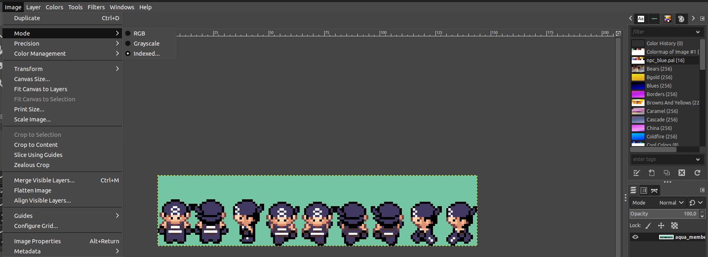

# Pokémon Red: Hard Destiny

This is a ROM Hack based on Pokemon FireRed. It uses [pokefirered](https://github.com/pret/pokefirered) as base and add some elements present in the anime to the game, while trying to keep its original look.

Some of the features that you can find in this game includes:
* About 230 Pokemons can be caught, including all 151 gen 1 pokemons. Look at  to know all moves each POKEMON can learn, as well as, the location where it apears.
* 6 pokemons to start with.
* TM are not spend when given to a Pokemon, but you can use only one TM or HM on each pokemon.
* Half split between physical and special moves. Some types get access to both move kinds when it makes sense.
* Fixing bug and psychic's power level. Some bug moves get stronger, while some Pokemons with a good coverage aggainst psychic were added.
* Some balance in the number of Pokemons of each type. Most of the types have between 12 and 20 Pokemons now.
* Balancing the power level of some moves.
* Battle aggainst an unofitial gym (AJ, kaz, yas)
* 15 gyms, one for each type, to explain why Gary was able to get 10 badges in the anime. The new gyms are hidden in the traditional Kanto map, you should try to find them.
* Improved trainers strategies.
* Starters allways have neutral natures.
* Starters allways have good ivs.
* Badges don't grant 10% status increases.
* Each badge only increase in 5 levels the maximum level to a Pokemon to obey your orders.
* Important battles, including most of the gym leaders, enforce the set mode, making then more interesting.
* You lose POKEMONs defeated by Rocket's team.
* Some trainers will ask for a nuzlock battle. POKEMONs defeated in this battles are also lost.

Coming...
 * A real Pokemon leage after defeating elite 4.
 

At this moment, this hack is already playable.

# Debug tips

You can use mGBA (https://github.com/mgba-emu/mgba) and the modern tookit in the makefile to debug the game using gdb.
To do so, first install devkitARM's C compiler as described here: https://github.com/pret/pokeemerald/blob/master/INSTALL.md. Aditionally, install gdb-multiarch (`sudo apt-get install gdb-multiarch`) to have access to gdb.
Then compile the source with the modern tookit and debug info eneabled:

```
make modern DINFO=1 -j8
```

The mGBA emulator comes with its own gdbserver, allowing us to connect the GNU Debugger (GDB) to our Game Boy Advance programs and inspect the state of the emulated machine.

When combined with a GDB compatible IDE, such as Visual Studio Code, it becomes possible to write code for the Game Boy Advance, drop a breakpoint in that code, run mGBA, and step-by-step execute code, inspecting the state of registers, memory, and variables.

The following `.vscode/launch.json` can be used to configure vscode to debug. A complete tutorial explanation can be found here: https://felixjones.co.uk/mgba_gdb/vscode.html

```
{
    "version": "0.2.0",
    "configurations": [
        {
            "name": "(gdb) Launch",
            "type": "cppdbg",
            "request": "launch",
            "targetArchitecture": "arm",
            "program": "${workspaceFolder}/pokefirered_modern.elf",
            "args": [],
            "stopAtEntry": false,
            "cwd": "${fileDirname}",
            "environment": [],
            "externalConsole": false,
            "MIMode": "gdb",
            "miDebuggerServerAddress": "localhost:2345",
            "windows": {
                "miDebuggerPath": "${env:DEVKITARM}/bin/arm-none-eabi-gdb.exe",
                "setupCommands": [
                    {
                        "text": "shell start /b \"\" \"${env:ProgramFiles}/mGBA/mGBA.exe\" -g \"${workspaceFolder}/my-game.elf\""
                    }
                ]
            },
            "linux": {
                "miDebuggerPath": "gdb-multiarch",
                "setupCommands": [
                    {
                        "text": "shell \"mgba-qt\" -g \"${workspaceFolder}/pokefirered_modern.elf\" &"
                    }
                ]
            },
            "osx": {
                "miDebuggerPath": "${env:DEVKITARM}/bin/arm-none-eabi-gdb",
                "setupCommands": [
                    {
                        "text": "shell open -a mGBA --args -g \"${workspaceFolder}/my-game.elf\""
                    }
                ]
            }
        }
    ],
    "compounds": []
}
```

After starting emulation click in tools -> start gdb server in mGBA, then run the laucher, add some breakpoits and that's it.

Sometimes it is worth to make a variable volatile during debug to force compiler alocate it, avoiding compiler optimizations that prevent gdb to display the variable value.

# Adding a new object event graphic

To add a new object, first you need a 8 bit indexed image. This can be easy done in Gimp 2.10 or superior. To do so, first open the palette with the closest 8 colors in the pallet panel (object event graphic pallets are inside graphics/object_events/palettes), then go to image ->mode and set it to indexed, selecting the right palette. Then export as a pnp image inside graphics/object_events/pics.



At this point you have a pic with the right spec in the right place, now you need to compile it to a .4bpp format. To do so, in `spritesheet_rules.mk` add a rule to your new image, like:

```
$(OBJEVENTGFXDIR)/people/team_aqua/aqua_member_m.4bpp: %.4bpp: %.png
	$(GFX) $< $@ -mwidth 2 -mheight 4
```

Finally, you need to load the new sprite inside the game, by adding it in three places

```
object_event_graphics.h
const u16 gObjectEventPic_AquaMemberM[] = INCBIN_U16("graphics/object_events/pics/people/team_aqua/aqua_member_m.4bpp");
```

```
object_event_pic_tables.h
static const struct SpriteFrameImage sPicTable_TeamAqua[] = {
    overworld_frame(gObjectEventPic_AquaMemberM, 2, 4, 0),
    overworld_frame(gObjectEventPic_AquaMemberM, 2, 4, 1),
    overworld_frame(gObjectEventPic_AquaMemberM, 2, 4, 2),
    overworld_frame(gObjectEventPic_AquaMemberM, 2, 4, 3),
    overworld_frame(gObjectEventPic_AquaMemberM, 2, 4, 4),
    overworld_frame(gObjectEventPic_AquaMemberM, 2, 4, 5),
    overworld_frame(gObjectEventPic_AquaMemberM, 2, 4, 6),
    overworld_frame(gObjectEventPic_AquaMemberM, 2, 4, 7),
    overworld_frame(gObjectEventPic_AquaMemberM, 2, 4, 8),
};
```

and

```
object_event_graphics_info.h
const struct ObjectEventGraphicsInfo gObjectEventGraphicsInfo_TeamMagma = {
    .tileTag = TAG_NONE,
    .paletteTag = OBJ_EVENT_PAL_TAG_NPC_BLUE,
    .reflectionPaletteTag = OBJ_EVENT_PAL_TAG_NONE,
    .size = 256,
    .width = 16,
    .height = 32,
    .paletteSlot = 5, //this controls the real pallete 3 brown 4 green 5 red 6 blue
    .shadowSize = SHADOW_SIZE_M,
    .inanimate = FALSE,
    .disableReflectionPaletteLoad = FALSE,
    .tracks = TRACKS_FOOT,
    .oam = &gObjectEventBaseOam_16x32,
    .subspriteTables = gObjectEventSpriteOamTables_16x32,
    .anims = sAnimTable_Standard,
    .images = sPicTable_TeamMagma,
    .affineAnims = gDummySpriteAffineAnimTable,
};
```
