# POKEMON Stats, Locations & Move sets

### BULBASAUR

**XP**: 64 / PERCENT_FEMALE(12.5)

|         |         |         |         |         |         |         |         |
|---------|---------|---------|---------|---------|---------|---------|---------|
| **type1** | TYPE_GRASS | **type2** | TYPE_POISON | **catchRate** | 80 | **safariZoneFleeRate** | 0 |
| **baseAttack** | 45 | **baseSpAttack** | 65 | **evYield_Attack** | 0 | **evYield_SpAttack** | 1 |
| **baseDefense** | 49 | **baseSpDefense** | 65 | **evYield_Defense** | 0 | **evYield_SpDefense** | 0 |
| **baseHP** | 45 | **baseSpeed** | 45 | **evYield_HP** | 0 | **evYield_SpDefense** | 0 |
| **eggGroup1** | EGG_GROUP_MONSTER | **eggGroup2** | EGG_GROUP_GRASS | **eggCycles** | 20 | **friendship** | 70 |
| **item1** | ITEM_NONE | **item2** | ITEM_NONE | **abilities** | ABILITY_OVERGROW | **growthRate** | GROWTH_MEDIUM_SLOW |

**Found at:** MAP_ROUTE24, MAP_ROUTE21_NORTH

| Level | Move Name |
|---------|---------|
| 1 | Tackle |
| 4 | Growl |
| 7 | Leech seed |
| 10 | Vine whip |
| 15 | Sleep powder |
| 18 | Growth |
| 21 | Razor leaf |
| 24 | Mega drain |
| 27 | Sweet scent |
| 32 | Sludge |
| 39 | Synthesis |
| 46 | Solar beam |

| TM or HM |
|---------|
| Tm06 toxic |
| Tm09 bullet seed |
| Tm10 hidden power |
| Tm11 sunny day |
| Tm17 protect |
| Tm19 giga drain |
| Tm21 frustration |
| Tm22 solar beam |
| Tm27 return |
| Tm32 double team |
| Tm36 sludge bomb |
| Tm42 facade |
| Tm43 secret power |
| Tm44 rest |
| Tm45 attract |
| Hm01 cut |
| Hm04 strength |
| Hm05 flash |
| Hm06 rock smash |

### IVYSAUR

**XP**: 141 / PERCENT_FEMALE(12.5)

|         |         |         |         |         |         |         |         |
|---------|---------|---------|---------|---------|---------|---------|---------|
| **type1** | TYPE_GRASS | **type2** | TYPE_POISON | **catchRate** | 45 | **safariZoneFleeRate** | 0 |
| **baseAttack** | 62 | **baseSpAttack** | 80 | **evYield_Attack** | 0 | **evYield_SpAttack** | 1 |
| **baseDefense** | 63 | **baseSpDefense** | 80 | **evYield_Defense** | 0 | **evYield_SpDefense** | 1 |
| **baseHP** | 60 | **baseSpeed** | 60 | **evYield_HP** | 0 | **evYield_SpDefense** | 1 |
| **eggGroup1** | EGG_GROUP_MONSTER | **eggGroup2** | EGG_GROUP_GRASS | **eggCycles** | 20 | **friendship** | 70 |
| **item1** | ITEM_NONE | **item2** | ITEM_NONE | **abilities** | ABILITY_OVERGROW | **growthRate** | GROWTH_MEDIUM_SLOW |

**Found at:** 

| Level | Move Name |
|---------|---------|
| 1 | Vine whip |
| 7 | Leech seed |
| 15 | Sleep powder |
| 22 | Razor leaf |
| 29 | Sweet scent |
| 34 | Growth |
| 38 | Giga drain |
| 42 | Sludge |
| 47 | Synthesis |
| 56 | Solar beam |

| TM or HM |
|---------|
| Tm06 toxic |
| Tm09 bullet seed |
| Tm10 hidden power |
| Tm11 sunny day |
| Tm17 protect |
| Tm19 giga drain |
| Tm21 frustration |
| Tm22 solar beam |
| Tm27 return |
| Tm32 double team |
| Tm36 sludge bomb |
| Tm42 facade |
| Tm43 secret power |
| Tm44 rest |
| Tm45 attract |
| Hm01 cut |
| Hm04 strength |
| Hm05 flash |
| Hm06 rock smash |

### VENUSAUR

**XP**: 208 / PERCENT_FEMALE(12.5)

|         |         |         |         |         |         |         |         |
|---------|---------|---------|---------|---------|---------|---------|---------|
| **type1** | TYPE_GRASS | **type2** | TYPE_POISON | **catchRate** | 45 | **safariZoneFleeRate** | 0 |
| **baseAttack** | 82 | **baseSpAttack** | 100 | **evYield_Attack** | 0 | **evYield_SpAttack** | 2 |
| **baseDefense** | 83 | **baseSpDefense** | 100 | **evYield_Defense** | 0 | **evYield_SpDefense** | 1 |
| **baseHP** | 80 | **baseSpeed** | 85 | **evYield_HP** | 0 | **evYield_SpDefense** | 1 |
| **eggGroup1** | EGG_GROUP_MONSTER | **eggGroup2** | EGG_GROUP_GRASS | **eggCycles** | 20 | **friendship** | 70 |
| **item1** | ITEM_NONE | **item2** | ITEM_NONE | **abilities** | ABILITY_OVERGROW | **growthRate** | GROWTH_MEDIUM_SLOW |

**Found at:** 

| Level | Move Name |
|---------|---------|
| 1 | Vine whip |
| 7 | Leech seed |
| 10 | Vine whip |
| 15 | Sleep powder |
| 22 | Razor leaf |
| 29 | Sweet scent |
| 34 | Growth |
| 42 | Synthesis |
| 55 | Sleep powder |
| 65 | Solar beam |

| TM or HM |
|---------|
| Tm05 roar |
| Tm06 toxic |
| Tm09 bullet seed |
| Tm10 hidden power |
| Tm11 sunny day |
| Tm15 hyper beam |
| Tm17 protect |
| Tm19 giga drain |
| Tm21 frustration |
| Tm22 solar beam |
| Tm26 earthquake |
| Tm27 return |
| Tm32 double team |
| Tm36 sludge bomb |
| Tm42 facade |
| Tm43 secret power |
| Tm44 rest |
| Tm45 attract |
| Hm01 cut |
| Hm04 strength |
| Hm05 flash |
| Hm06 rock smash |

### CHARMANDER

**XP**: 65 / PERCENT_FEMALE(12.5)

|         |         |         |         |         |         |         |         |
|---------|---------|---------|---------|---------|---------|---------|---------|
| **type1** | TYPE_FIRE | **type2** | TYPE_FIRE | **catchRate** | 80 | **safariZoneFleeRate** | 0 |
| **baseAttack** | 52 | **baseSpAttack** | 60 | **evYield_Attack** | 0 | **evYield_SpAttack** | 0 |
| **baseDefense** | 50 | **baseSpDefense** | 50 | **evYield_Defense** | 0 | **evYield_SpDefense** | 0 |
| **baseHP** | 39 | **baseSpeed** | 65 | **evYield_HP** | 0 | **evYield_SpDefense** | 0 |
| **eggGroup1** | EGG_GROUP_MONSTER | **eggGroup2** | EGG_GROUP_DRAGON | **eggCycles** | 20 | **friendship** | 70 |
| **item1** | ITEM_NONE | **item2** | ITEM_NONE | **abilities** | ABILITY_BLAZE | **growthRate** | GROWTH_MEDIUM_SLOW |

**Found at:** MAP_ROUTE21_NORTH, MAP_ROUTE25

| Level | Move Name |
|---------|---------|
| 1 | Growl |
| 7 | Ember |
| 13 | Metal claw |
| 16 | Smokescreen |
| 19 | Rage |
| 24 | Flame wheel |
| 27 | Scary face |
| 31 | Flamethrower |
| 37 | Slash |
| 43 | Dragon rage |
| 49 | Fire spin |

| TM or HM |
|---------|
| Tm01 focus punch |
| Tm02 dragon claw |
| Tm06 toxic |
| Tm10 hidden power |
| Tm11 sunny day |
| Tm17 protect |
| Tm21 frustration |
| Tm23 iron tail |
| Tm27 return |
| Tm28 dig |
| Tm31 brick break |
| Tm32 double team |
| Tm35 flamethrower |
| Tm38 fire blast |
| Tm40 aerial ace |
| Tm42 facade |
| Tm43 secret power |
| Tm44 rest |
| Tm45 attract |
| Tm50 overheat |
| Hm01 cut |
| Hm04 strength |
| Hm06 rock smash |

### CHARMELEON

**XP**: 142 / PERCENT_FEMALE(12.5)

|         |         |         |         |         |         |         |         |
|---------|---------|---------|---------|---------|---------|---------|---------|
| **type1** | TYPE_FIRE | **type2** | TYPE_FIRE | **catchRate** | 45 | **safariZoneFleeRate** | 0 |
| **baseAttack** | 64 | **baseSpAttack** | 80 | **evYield_Attack** | 0 | **evYield_SpAttack** | 1 |
| **baseDefense** | 58 | **baseSpDefense** | 65 | **evYield_Defense** | 0 | **evYield_SpDefense** | 0 |
| **baseHP** | 58 | **baseSpeed** | 80 | **evYield_HP** | 0 | **evYield_SpDefense** | 0 |
| **eggGroup1** | EGG_GROUP_MONSTER | **eggGroup2** | EGG_GROUP_DRAGON | **eggCycles** | 20 | **friendship** | 70 |
| **item1** | ITEM_NONE | **item2** | ITEM_NONE | **abilities** | ABILITY_BLAZE | **growthRate** | GROWTH_MEDIUM_SLOW |

**Found at:** 

| Level | Move Name |
|---------|---------|
| 1 | Smokescreen |
| 13 | Metal claw |
| 27 | Scary face |
| 34 | Flamethrower |
| 41 | Slash |
| 48 | Dragon rage |
| 55 | Fire spin |

| TM or HM |
|---------|
| Tm01 focus punch |
| Tm02 dragon claw |
| Tm06 toxic |
| Tm10 hidden power |
| Tm11 sunny day |
| Tm17 protect |
| Tm21 frustration |
| Tm23 iron tail |
| Tm27 return |
| Tm28 dig |
| Tm31 brick break |
| Tm32 double team |
| Tm35 flamethrower |
| Tm38 fire blast |
| Tm40 aerial ace |
| Tm42 facade |
| Tm43 secret power |
| Tm44 rest |
| Tm45 attract |
| Tm50 overheat |
| Hm01 cut |
| Hm04 strength |
| Hm06 rock smash |

### CHARIZARD

**XP**: 209 / PERCENT_FEMALE(12.5)

|         |         |         |         |         |         |         |         |
|---------|---------|---------|---------|---------|---------|---------|---------|
| **type1** | TYPE_FIRE | **type2** | TYPE_FLYING | **catchRate** | 45 | **safariZoneFleeRate** | 0 |
| **baseAttack** | 84 | **baseSpAttack** | 105 | **evYield_Attack** | 0 | **evYield_SpAttack** | 3 |
| **baseDefense** | 78 | **baseSpDefense** | 85 | **evYield_Defense** | 0 | **evYield_SpDefense** | 0 |
| **baseHP** | 78 | **baseSpeed** | 100 | **evYield_HP** | 0 | **evYield_SpDefense** | 0 |
| **eggGroup1** | EGG_GROUP_MONSTER | **eggGroup2** | EGG_GROUP_DRAGON | **eggCycles** | 20 | **friendship** | 70 |
| **item1** | ITEM_NONE | **item2** | ITEM_NONE | **abilities** | ABILITY_BLAZE | **growthRate** | GROWTH_MEDIUM_SLOW |

**Found at:** MAP_SIX_ISLAND_RUIN_VALLEY

| Level | Move Name |
|---------|---------|
| 1 | Metal claw |
| 7 | Ember |
| 13 | Metal claw |
| 20 | Smokescreen |
| 27 | Scary face |
| 34 | Flamethrower |
| 36 | Wing attack |
| 44 | Slash |
| 54 | Dragon rage |
| 64 | Fire spin |

| TM or HM |
|---------|
| Tm01 focus punch |
| Tm02 dragon claw |
| Tm05 roar |
| Tm06 toxic |
| Tm10 hidden power |
| Tm11 sunny day |
| Tm15 hyper beam |
| Tm17 protect |
| Tm21 frustration |
| Tm23 iron tail |
| Tm26 earthquake |
| Tm27 return |
| Tm28 dig |
| Tm31 brick break |
| Tm32 double team |
| Tm35 flamethrower |
| Tm38 fire blast |
| Tm40 aerial ace |
| Tm42 facade |
| Tm43 secret power |
| Tm44 rest |
| Tm45 attract |
| Tm47 steel wing |
| Tm50 overheat |
| Hm01 cut |
| Hm02 fly |
| Hm04 strength |
| Hm06 rock smash |

### SQUIRTLE

**XP**: 66 / PERCENT_FEMALE(12.5)

|         |         |         |         |         |         |         |         |
|---------|---------|---------|---------|---------|---------|---------|---------|
| **type1** | TYPE_WATER | **type2** | TYPE_WATER | **catchRate** | 80 | **safariZoneFleeRate** | 0 |
| **baseAttack** | 48 | **baseSpAttack** | 50 | **evYield_Attack** | 0 | **evYield_SpAttack** | 0 |
| **baseDefense** | 65 | **baseSpDefense** | 64 | **evYield_Defense** | 1 | **evYield_SpDefense** | 0 |
| **baseHP** | 44 | **baseSpeed** | 43 | **evYield_HP** | 0 | **evYield_SpDefense** | 0 |
| **eggGroup1** | EGG_GROUP_MONSTER | **eggGroup2** | EGG_GROUP_WATER_1 | **eggCycles** | 20 | **friendship** | 70 |
| **item1** | ITEM_NONE | **item2** | ITEM_NONE | **abilities** | ABILITY_TORRENT | **growthRate** | GROWTH_MEDIUM_SLOW |

**Found at:** MAP_ROUTE21_NORTH, MAP_ROUTE4, MAP_PALLET_TOWN

| Level | Move Name |
|---------|---------|
| 1 | Tackle |
| 4 | Tail whip |
| 7 | Bubble |
| 10 | Withdraw |
| 13 | Water gun |
| 18 | Bite |
| 23 | Rapid spin |
| 28 | Protect |
| 33 | Rain dance |
| 40 | Skull bash |
| 47 | Hydro pump |

| TM or HM |
|---------|
| Tm01 focus punch |
| Tm03 water pulse |
| Tm06 toxic |
| Tm07 hail |
| Tm10 hidden power |
| Tm13 ice beam |
| Tm14 blizzard |
| Tm17 protect |
| Tm18 rain dance |
| Tm21 frustration |
| Tm23 iron tail |
| Tm27 return |
| Tm28 dig |
| Tm31 brick break |
| Tm32 double team |
| Tm42 facade |
| Tm43 secret power |
| Tm44 rest |
| Tm45 attract |
| Hm03 surf |
| Hm04 strength |
| Hm06 rock smash |
| Hm07 waterfall |
| Hm08 dive |

### WARTORTLE

**XP**: 143 / PERCENT_FEMALE(12.5)

|         |         |         |         |         |         |         |         |
|---------|---------|---------|---------|---------|---------|---------|---------|
| **type1** | TYPE_WATER | **type2** | TYPE_WATER | **catchRate** | 45 | **safariZoneFleeRate** | 0 |
| **baseAttack** | 63 | **baseSpAttack** | 65 | **evYield_Attack** | 0 | **evYield_SpAttack** | 0 |
| **baseDefense** | 80 | **baseSpDefense** | 80 | **evYield_Defense** | 1 | **evYield_SpDefense** | 1 |
| **baseHP** | 59 | **baseSpeed** | 58 | **evYield_HP** | 0 | **evYield_SpDefense** | 1 |
| **eggGroup1** | EGG_GROUP_MONSTER | **eggGroup2** | EGG_GROUP_WATER_1 | **eggCycles** | 20 | **friendship** | 70 |
| **item1** | ITEM_NONE | **item2** | ITEM_NONE | **abilities** | ABILITY_TORRENT | **growthRate** | GROWTH_MEDIUM_SLOW |

**Found at:** 

| Level | Move Name |
|---------|---------|
| 1 | Bubble |
| 4 | Tail whip |
| 7 | Bubble |
| 10 | Withdraw |
| 13 | Water gun |
| 19 | Bite |
| 25 | Rapid spin |
| 31 | Protect |
| 37 | Rain dance |
| 45 | Skull bash |
| 53 | Hydro pump |

| TM or HM |
|---------|
| Tm01 focus punch |
| Tm03 water pulse |
| Tm06 toxic |
| Tm07 hail |
| Tm10 hidden power |
| Tm13 ice beam |
| Tm14 blizzard |
| Tm17 protect |
| Tm18 rain dance |
| Tm21 frustration |
| Tm23 iron tail |
| Tm27 return |
| Tm28 dig |
| Tm31 brick break |
| Tm32 double team |
| Tm42 facade |
| Tm43 secret power |
| Tm44 rest |
| Tm45 attract |
| Hm03 surf |
| Hm04 strength |
| Hm06 rock smash |
| Hm07 waterfall |
| Hm08 dive |

### BLASTOISE

**XP**: 210 / PERCENT_FEMALE(12.5)

|         |         |         |         |         |         |         |         |
|---------|---------|---------|---------|---------|---------|---------|---------|
| **type1** | TYPE_WATER | **type2** | TYPE_WATER | **catchRate** | 45 | **safariZoneFleeRate** | 0 |
| **baseAttack** | 83 | **baseSpAttack** | 85 | **evYield_Attack** | 0 | **evYield_SpAttack** | 0 |
| **baseDefense** | 100 | **baseSpDefense** | 105 | **evYield_Defense** | 0 | **evYield_SpDefense** | 3 |
| **baseHP** | 79 | **baseSpeed** | 78 | **evYield_HP** | 0 | **evYield_SpDefense** | 3 |
| **eggGroup1** | EGG_GROUP_MONSTER | **eggGroup2** | EGG_GROUP_WATER_1 | **eggCycles** | 20 | **friendship** | 70 |
| **item1** | ITEM_NONE | **item2** | ITEM_NONE | **abilities** | ABILITY_TORRENT | **growthRate** | GROWTH_MEDIUM_SLOW |

**Found at:** MAP_SIX_ISLAND_RUIN_VALLEY

| Level | Move Name |
|---------|---------|
| 1 | Withdraw |
| 4 | Tail whip |
| 7 | Bubble |
| 10 | Withdraw |
| 13 | Water gun |
| 19 | Bite |
| 25 | Rapid spin |
| 31 | Protect |
| 42 | Rain dance |
| 55 | Skull bash |
| 65 | Hydro pump |

| TM or HM |
|---------|
| Tm01 focus punch |
| Tm03 water pulse |
| Tm05 roar |
| Tm06 toxic |
| Tm07 hail |
| Tm10 hidden power |
| Tm13 ice beam |
| Tm14 blizzard |
| Tm15 hyper beam |
| Tm17 protect |
| Tm18 rain dance |
| Tm21 frustration |
| Tm23 iron tail |
| Tm26 earthquake |
| Tm27 return |
| Tm28 dig |
| Tm31 brick break |
| Tm32 double team |
| Tm42 facade |
| Tm43 secret power |
| Tm44 rest |
| Tm45 attract |
| Hm03 surf |
| Hm04 strength |
| Hm06 rock smash |
| Hm07 waterfall |
| Hm08 dive |

### CATERPIE

**XP**: 53 / PERCENT_FEMALE(50)

|         |         |         |         |         |         |         |         |
|---------|---------|---------|---------|---------|---------|---------|---------|
| **type1** | TYPE_BUG | **type2** | TYPE_BUG | **catchRate** | 255 | **safariZoneFleeRate** | 0 |
| **baseAttack** | 30 | **baseSpAttack** | 20 | **evYield_Attack** | 0 | **evYield_SpAttack** | 0 |
| **baseDefense** | 35 | **baseSpDefense** | 20 | **evYield_Defense** | 0 | **evYield_SpDefense** | 0 |
| **baseHP** | 45 | **baseSpeed** | 45 | **evYield_HP** | 1 | **evYield_SpDefense** | 0 |
| **eggGroup1** | EGG_GROUP_BUG | **eggGroup2** | EGG_GROUP_BUG | **eggCycles** | 15 | **friendship** | 70 |
| **item1** | ITEM_NONE | **item2** | ITEM_NONE | **abilities** | ABILITY_SHIELD_DUST | **growthRate** | GROWTH_MEDIUM_FAST |

**Found at:** MAP_SIX_ISLAND_PATTERN_BUSH, MAP_ROUTE25, MAP_VIRIDIAN_FOREST, MAP_ROUTE24, MAP_ROUTE2

| Level | Move Name |
|---------|---------|
| 1 | String shot |

| TM or HM |
|---------|

### METAPOD

**XP**: 72 / PERCENT_FEMALE(50)

|         |         |         |         |         |         |         |         |
|---------|---------|---------|---------|---------|---------|---------|---------|
| **type1** | TYPE_BUG | **type2** | TYPE_BUG | **catchRate** | 120 | **safariZoneFleeRate** | 0 |
| **baseAttack** | 20 | **baseSpAttack** | 25 | **evYield_Attack** | 0 | **evYield_SpAttack** | 0 |
| **baseDefense** | 55 | **baseSpDefense** | 25 | **evYield_Defense** | 2 | **evYield_SpDefense** | 0 |
| **baseHP** | 50 | **baseSpeed** | 30 | **evYield_HP** | 0 | **evYield_SpDefense** | 0 |
| **eggGroup1** | EGG_GROUP_BUG | **eggGroup2** | EGG_GROUP_BUG | **eggCycles** | 15 | **friendship** | 70 |
| **item1** | ITEM_NONE | **item2** | ITEM_NONE | **abilities** | ABILITY_SHED_SKIN | **growthRate** | GROWTH_MEDIUM_FAST |

**Found at:** MAP_SIX_ISLAND_PATTERN_BUSH, MAP_VIRIDIAN_FOREST

| Level | Move Name |
|---------|---------|
| 1 | Harden |
| 7 | Harden |

| TM or HM |
|---------|

### BUTTERFREE

**XP**: 160 / PERCENT_FEMALE(50)

|         |         |         |         |         |         |         |         |
|---------|---------|---------|---------|---------|---------|---------|---------|
| **type1** | TYPE_BUG | **type2** | TYPE_FLYING | **catchRate** | 45 | **safariZoneFleeRate** | 0 |
| **baseAttack** | 45 | **baseSpAttack** | 90 | **evYield_Attack** | 0 | **evYield_SpAttack** | 2 |
| **baseDefense** | 50 | **baseSpDefense** | 80 | **evYield_Defense** | 0 | **evYield_SpDefense** | 1 |
| **baseHP** | 70 | **baseSpeed** | 70 | **evYield_HP** | 0 | **evYield_SpDefense** | 1 |
| **eggGroup1** | EGG_GROUP_BUG | **eggGroup2** | EGG_GROUP_BUG | **eggCycles** | 15 | **friendship** | 70 |
| **item1** | ITEM_NONE | **item2** | ITEM_SILVER_POWDER | **abilities** | ABILITY_COMPOUND_EYES | **growthRate** | GROWTH_MEDIUM_FAST |

**Found at:** 

| Level | Move Name |
|---------|---------|
| 1 | Confusion |
| 10 | Confusion |
| 13 | Poison powder |
| 14 | Stun spore |
| 15 | Sleep powder |
| 18 | Supersonic |
| 23 | Whirlwind |
| 28 | Gust |
| 34 | Psybeam |
| 40 | Safeguard |
| 47 | Silver wind |

| TM or HM |
|---------|
| Tm06 toxic |
| Tm10 hidden power |
| Tm11 sunny day |
| Tm15 hyper beam |
| Tm17 protect |
| Tm18 rain dance |
| Tm19 giga drain |
| Tm20 safeguard |
| Tm21 frustration |
| Tm22 solar beam |
| Tm27 return |
| Tm29 psychic |
| Tm30 shadow ball |
| Tm32 double team |
| Tm40 aerial ace |
| Tm42 facade |
| Tm43 secret power |
| Tm44 rest |
| Tm45 attract |
| Tm46 thief |
| Tm48 skill swap |
| Hm05 flash |

### WEEDLE

**XP**: 52 / PERCENT_FEMALE(50)

|         |         |         |         |         |         |         |         |
|---------|---------|---------|---------|---------|---------|---------|---------|
| **type1** | TYPE_BUG | **type2** | TYPE_POISON | **catchRate** | 255 | **safariZoneFleeRate** | 0 |
| **baseAttack** | 35 | **baseSpAttack** | 20 | **evYield_Attack** | 0 | **evYield_SpAttack** | 0 |
| **baseDefense** | 30 | **baseSpDefense** | 20 | **evYield_Defense** | 0 | **evYield_SpDefense** | 0 |
| **baseHP** | 40 | **baseSpeed** | 50 | **evYield_HP** | 0 | **evYield_SpDefense** | 0 |
| **eggGroup1** | EGG_GROUP_BUG | **eggGroup2** | EGG_GROUP_BUG | **eggCycles** | 15 | **friendship** | 70 |
| **item1** | ITEM_NONE | **item2** | ITEM_NONE | **abilities** | ABILITY_SHIELD_DUST | **growthRate** | GROWTH_MEDIUM_FAST |

**Found at:** MAP_SIX_ISLAND_PATTERN_BUSH, MAP_ROUTE25, MAP_VIRIDIAN_FOREST, MAP_ROUTE24, MAP_ROUTE2

| Level | Move Name |
|---------|---------|
| 1 | String shot |

| TM or HM |
|---------|

### KAKUNA

**XP**: 71 / PERCENT_FEMALE(50)

|         |         |         |         |         |         |         |         |
|---------|---------|---------|---------|---------|---------|---------|---------|
| **type1** | TYPE_BUG | **type2** | TYPE_POISON | **catchRate** | 120 | **safariZoneFleeRate** | 0 |
| **baseAttack** | 25 | **baseSpAttack** | 25 | **evYield_Attack** | 0 | **evYield_SpAttack** | 0 |
| **baseDefense** | 50 | **baseSpDefense** | 25 | **evYield_Defense** | 2 | **evYield_SpDefense** | 0 |
| **baseHP** | 45 | **baseSpeed** | 35 | **evYield_HP** | 0 | **evYield_SpDefense** | 0 |
| **eggGroup1** | EGG_GROUP_BUG | **eggGroup2** | EGG_GROUP_BUG | **eggCycles** | 15 | **friendship** | 70 |
| **item1** | ITEM_NONE | **item2** | ITEM_NONE | **abilities** | ABILITY_SHED_SKIN | **growthRate** | GROWTH_MEDIUM_FAST |

**Found at:** MAP_SIX_ISLAND_PATTERN_BUSH, MAP_VIRIDIAN_FOREST

| Level | Move Name |
|---------|---------|
| 1 | Harden |
| 7 | Harden |

| TM or HM |
|---------|

### BEEDRILL

**XP**: 159 / PERCENT_FEMALE(50)

|         |         |         |         |         |         |         |         |
|---------|---------|---------|---------|---------|---------|---------|---------|
| **type1** | TYPE_BUG | **type2** | TYPE_POISON | **catchRate** | 45 | **safariZoneFleeRate** | 0 |
| **baseAttack** | 90 | **baseSpAttack** | 45 | **evYield_Attack** | 2 | **evYield_SpAttack** | 0 |
| **baseDefense** | 40 | **baseSpDefense** | 80 | **evYield_Defense** | 0 | **evYield_SpDefense** | 1 |
| **baseHP** | 70 | **baseSpeed** | 85 | **evYield_HP** | 0 | **evYield_SpDefense** | 1 |
| **eggGroup1** | EGG_GROUP_BUG | **eggGroup2** | EGG_GROUP_BUG | **eggCycles** | 15 | **friendship** | 70 |
| **item1** | ITEM_NONE | **item2** | ITEM_POISON_BARB | **abilities** | ABILITY_SWARM | **growthRate** | GROWTH_MEDIUM_FAST |

**Found at:** 

| Level | Move Name |
|---------|---------|
| 1 | Fury attack |
| 10 | Fury attack |
| 13 | Focus energy |
| 16 | Twineedle |
| 19 | Rage |
| 22 | Pursuit |
| 28 | Pin missile |
| 31 | Agility |
| 37 | Sludge |
| 45 | Endeavor |

| TM or HM |
|---------|
| Tm06 toxic |
| Tm10 hidden power |
| Tm11 sunny day |
| Tm15 hyper beam |
| Tm17 protect |
| Tm19 giga drain |
| Tm21 frustration |
| Tm22 solar beam |
| Tm27 return |
| Tm31 brick break |
| Tm32 double team |
| Tm36 sludge bomb |
| Tm40 aerial ace |
| Tm42 facade |
| Tm43 secret power |
| Tm44 rest |
| Tm45 attract |
| Tm46 thief |
| Hm01 cut |
| Hm06 rock smash |

### PIDGEY

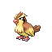

**XP**: 55 / PERCENT_FEMALE(50)

|         |         |         |         |         |         |         |         |
|---------|---------|---------|---------|---------|---------|---------|---------|
| **type1** | TYPE_NORMAL | **type2** | TYPE_FLYING | **catchRate** | 255 | **safariZoneFleeRate** | 0 |
| **baseAttack** | 45 | **baseSpAttack** | 35 | **evYield_Attack** | 0 | **evYield_SpAttack** | 0 |
| **baseDefense** | 40 | **baseSpDefense** | 35 | **evYield_Defense** | 0 | **evYield_SpDefense** | 0 |
| **baseHP** | 40 | **baseSpeed** | 56 | **evYield_HP** | 0 | **evYield_SpDefense** | 0 |
| **eggGroup1** | EGG_GROUP_FLYING | **eggGroup2** | EGG_GROUP_FLYING | **eggCycles** | 15 | **friendship** | 70 |
| **item1** | ITEM_NONE | **item2** | ITEM_NONE | **abilities** | ABILITY_KEEN_EYE | **growthRate** | GROWTH_MEDIUM_SLOW |

**Found at:** MAP_ROUTE6, MAP_ROUTE7, MAP_ROUTE15, MAP_ROUTE14, MAP_ROUTE8, MAP_ROUTE25, MAP_THREE_ISLAND_BOND_BRIDGE, MAP_FIVE_ISLAND_MEADOW, MAP_ROUTE24, MAP_ROUTE5, MAP_ROUTE12, MAP_ROUTE1, MAP_ROUTE13, MAP_ROUTE2, MAP_THREE_ISLAND_BERRY_FOREST, MAP_ROUTE9

| Level | Move Name |
|---------|---------|
| 1 | Tackle |
| 5 | Sand attack |
| 9 | Gust |
| 13 | Quick attack |
| 17 | Whirlwind |
| 21 | Twister |
| 25 | Wing attack |
| 31 | Feather dance |
| 39 | Agility |
| 47 | Mirror move |

| TM or HM |
|---------|
| Tm06 toxic |
| Tm10 hidden power |
| Tm11 sunny day |
| Tm17 protect |
| Tm18 rain dance |
| Tm21 frustration |
| Tm27 return |
| Tm32 double team |
| Tm40 aerial ace |
| Tm42 facade |
| Tm43 secret power |
| Tm44 rest |
| Tm45 attract |
| Tm46 thief |
| Tm47 steel wing |
| Hm02 fly |

### PIDGEOTTO

**XP**: 113 / PERCENT_FEMALE(50)

|         |         |         |         |         |         |         |         |
|---------|---------|---------|---------|---------|---------|---------|---------|
| **type1** | TYPE_NORMAL | **type2** | TYPE_FLYING | **catchRate** | 120 | **safariZoneFleeRate** | 0 |
| **baseAttack** | 60 | **baseSpAttack** | 50 | **evYield_Attack** | 0 | **evYield_SpAttack** | 0 |
| **baseDefense** | 55 | **baseSpDefense** | 50 | **evYield_Defense** | 0 | **evYield_SpDefense** | 0 |
| **baseHP** | 63 | **baseSpeed** | 71 | **evYield_HP** | 0 | **evYield_SpDefense** | 0 |
| **eggGroup1** | EGG_GROUP_FLYING | **eggGroup2** | EGG_GROUP_FLYING | **eggCycles** | 15 | **friendship** | 70 |
| **item1** | ITEM_NONE | **item2** | ITEM_NONE | **abilities** | ABILITY_KEEN_EYE | **growthRate** | GROWTH_MEDIUM_SLOW |

**Found at:** MAP_ROUTE15, MAP_ROUTE14, MAP_THREE_ISLAND_BOND_BRIDGE, MAP_FIVE_ISLAND_MEADOW, MAP_ROUTE13, MAP_THREE_ISLAND_BERRY_FOREST

| Level | Move Name |
|---------|---------|
| 1 | Gust |
| 5 | Sand attack |
| 9 | Gust |
| 13 | Quick attack |
| 20 | Whirlwind |
| 24 | Twister |
| 27 | Wing attack |
| 34 | Feather dance |
| 43 | Agility |
| 52 | Mirror move |

| TM or HM |
|---------|
| Tm06 toxic |
| Tm10 hidden power |
| Tm11 sunny day |
| Tm17 protect |
| Tm18 rain dance |
| Tm21 frustration |
| Tm27 return |
| Tm32 double team |
| Tm40 aerial ace |
| Tm42 facade |
| Tm43 secret power |
| Tm44 rest |
| Tm45 attract |
| Tm46 thief |
| Tm47 steel wing |
| Hm02 fly |

### PIDGEOT

**XP**: 172 / PERCENT_FEMALE(50)

|         |         |         |         |         |         |         |         |
|---------|---------|---------|---------|---------|---------|---------|---------|
| **type1** | TYPE_NORMAL | **type2** | TYPE_FLYING | **catchRate** | 45 | **safariZoneFleeRate** | 0 |
| **baseAttack** | 80 | **baseSpAttack** | 70 | **evYield_Attack** | 0 | **evYield_SpAttack** | 0 |
| **baseDefense** | 75 | **baseSpDefense** | 70 | **evYield_Defense** | 0 | **evYield_SpDefense** | 0 |
| **baseHP** | 83 | **baseSpeed** | 91 | **evYield_HP** | 0 | **evYield_SpDefense** | 0 |
| **eggGroup1** | EGG_GROUP_FLYING | **eggGroup2** | EGG_GROUP_FLYING | **eggCycles** | 15 | **friendship** | 70 |
| **item1** | ITEM_NONE | **item2** | ITEM_NONE | **abilities** | ABILITY_KEEN_EYE | **growthRate** | GROWTH_MEDIUM_SLOW |

**Found at:** 

| Level | Move Name |
|---------|---------|
| 1 | Quick attack |
| 5 | Sand attack |
| 9 | Gust |
| 13 | Quick attack |
| 20 | Whirlwind |
| 24 | Twister |
| 27 | Wing attack |
| 34 | Feather dance |
| 48 | Agility |
| 62 | Mirror move |

| TM or HM |
|---------|
| Tm06 toxic |
| Tm10 hidden power |
| Tm11 sunny day |
| Tm15 hyper beam |
| Tm17 protect |
| Tm18 rain dance |
| Tm21 frustration |
| Tm27 return |
| Tm32 double team |
| Tm40 aerial ace |
| Tm42 facade |
| Tm43 secret power |
| Tm44 rest |
| Tm45 attract |
| Tm46 thief |
| Tm47 steel wing |
| Hm02 fly |

### RATTATA

**XP**: 57 / PERCENT_FEMALE(50)

|         |         |         |         |         |         |         |         |
|---------|---------|---------|---------|---------|---------|---------|---------|
| **type1** | TYPE_NORMAL | **type2** | TYPE_NORMAL | **catchRate** | 255 | **safariZoneFleeRate** | 0 |
| **baseAttack** | 56 | **baseSpAttack** | 25 | **evYield_Attack** | 0 | **evYield_SpAttack** | 0 |
| **baseDefense** | 35 | **baseSpDefense** | 35 | **evYield_Defense** | 0 | **evYield_SpDefense** | 0 |
| **baseHP** | 30 | **baseSpeed** | 72 | **evYield_HP** | 0 | **evYield_SpDefense** | 0 |
| **eggGroup1** | EGG_GROUP_FIELD | **eggGroup2** | EGG_GROUP_FIELD | **eggCycles** | 15 | **friendship** | 70 |
| **item1** | ITEM_NONE | **item2** | ITEM_NONE | **abilities** | ABILITY_RUN_AWAY | **growthRate** | GROWTH_MEDIUM_FAST |

**Found at:** MAP_POKEMON_MANSION_3F, MAP_POKEMON_MANSION_1F, MAP_ROUTE4, MAP_ROUTE16, MAP_ROUTE17, MAP_ROUTE18, MAP_ROUTE22, MAP_POKEMON_MANSION_B1F, MAP_ROUTE1, MAP_ROUTE2, MAP_POKEMON_MANSION_2F, MAP_ROUTE9

| Level | Move Name |
|---------|---------|
| 1 | Tail whip |
| 4 | Quick attack |
| 7 | Focus energy |
| 10 | Bite |
| 13 | Hyper fang |
| 27 | Pursuit |
| 34 | Super fang |
| 41 | Endeavor |

| TM or HM |
|---------|
| Tm06 toxic |
| Tm10 hidden power |
| Tm11 sunny day |
| Tm12 taunt |
| Tm13 ice beam |
| Tm14 blizzard |
| Tm17 protect |
| Tm18 rain dance |
| Tm21 frustration |
| Tm23 iron tail |
| Tm24 thunderbolt |
| Tm25 thunder |
| Tm27 return |
| Tm28 dig |
| Tm30 shadow ball |
| Tm32 double team |
| Tm34 shock wave |
| Tm42 facade |
| Tm43 secret power |
| Tm44 rest |
| Tm45 attract |
| Tm46 thief |
| Hm01 cut |
| Hm06 rock smash |

### RATICATE

**XP**: 116 / PERCENT_FEMALE(50)

|         |         |         |         |         |         |         |         |
|---------|---------|---------|---------|---------|---------|---------|---------|
| **type1** | TYPE_NORMAL | **type2** | TYPE_NORMAL | **catchRate** | 127 | **safariZoneFleeRate** | 0 |
| **baseAttack** | 81 | **baseSpAttack** | 50 | **evYield_Attack** | 0 | **evYield_SpAttack** | 0 |
| **baseDefense** | 60 | **baseSpDefense** | 70 | **evYield_Defense** | 0 | **evYield_SpDefense** | 0 |
| **baseHP** | 55 | **baseSpeed** | 97 | **evYield_HP** | 0 | **evYield_SpDefense** | 0 |
| **eggGroup1** | EGG_GROUP_FIELD | **eggGroup2** | EGG_GROUP_FIELD | **eggCycles** | 15 | **friendship** | 70 |
| **item1** | ITEM_ORAN_BERRY | **item2** | ITEM_SITRUS_BERRY | **abilities** | ABILITY_RUN_AWAY | **growthRate** | GROWTH_MEDIUM_FAST |

**Found at:** MAP_POKEMON_MANSION_3F, MAP_POKEMON_MANSION_1F, MAP_ROUTE16, MAP_ROUTE17, MAP_ROUTE18, MAP_POKEMON_MANSION_B1F, MAP_POKEMON_MANSION_2F

| Level | Move Name |
|---------|---------|
| 1 | Bite |
| 7 | Quick attack |
| 13 | Hyper fang |
| 20 | Scary face |
| 25 | Crunch |
| 30 | Pursuit |
| 40 | Super fang |
| 50 | Endeavor |

| TM or HM |
|---------|
| Tm05 roar |
| Tm06 toxic |
| Tm10 hidden power |
| Tm11 sunny day |
| Tm12 taunt |
| Tm13 ice beam |
| Tm14 blizzard |
| Tm15 hyper beam |
| Tm17 protect |
| Tm18 rain dance |
| Tm21 frustration |
| Tm23 iron tail |
| Tm24 thunderbolt |
| Tm25 thunder |
| Tm27 return |
| Tm28 dig |
| Tm30 shadow ball |
| Tm32 double team |
| Tm34 shock wave |
| Tm42 facade |
| Tm43 secret power |
| Tm44 rest |
| Tm45 attract |
| Tm46 thief |
| Hm01 cut |
| Hm04 strength |
| Hm06 rock smash |

### SPEAROW

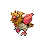

**XP**: 58 / PERCENT_FEMALE(50)

|         |         |         |         |         |         |         |         |
|---------|---------|---------|---------|---------|---------|---------|---------|
| **type1** | TYPE_FLYING | **type2** | TYPE_FLYING | **catchRate** | 255 | **safariZoneFleeRate** | 0 |
| **baseAttack** | 60 | **baseSpAttack** | 31 | **evYield_Attack** | 0 | **evYield_SpAttack** | 0 |
| **baseDefense** | 30 | **baseSpDefense** | 31 | **evYield_Defense** | 0 | **evYield_SpDefense** | 0 |
| **baseHP** | 40 | **baseSpeed** | 70 | **evYield_HP** | 0 | **evYield_SpDefense** | 0 |
| **eggGroup1** | EGG_GROUP_FLYING | **eggGroup2** | EGG_GROUP_FLYING | **eggCycles** | 15 | **friendship** | 70 |
| **item1** | ITEM_NONE | **item2** | ITEM_NONE | **abilities** | ABILITY_KEEN_EYE | **growthRate** | GROWTH_MEDIUM_FAST |

**Found at:** MAP_ONE_ISLAND_TREASURE_BEACH, MAP_SIX_ISLAND_WATER_PATH, MAP_ONE_ISLAND_KINDLE_ROAD, MAP_ROUTE10, MAP_ROUTE4, MAP_ROUTE16, MAP_ROUTE3, MAP_TWO_ISLAND_CAPE_BRINK, MAP_SIX_ISLAND_RUIN_VALLEY, MAP_ROUTE11, MAP_ROUTE17, MAP_MT_EMBER_EXTERIOR, MAP_ROUTE18, MAP_ROUTE9, MAP_ROUTE22, MAP_ROUTE23, MAP_ROUTE2, MAP_SEVEN_ISLAND_SEVAULT_CANYON_ENTRANCE

| Level | Move Name |
|---------|---------|
| 1 | Growl |
| 7 | Leer |
| 13 | Fury attack |
| 19 | Pursuit |
| 25 | Aerial ace |
| 31 | Mirror move |
| 37 | Drill peck |
| 43 | Agility |

| TM or HM |
|---------|
| Tm06 toxic |
| Tm10 hidden power |
| Tm11 sunny day |
| Tm17 protect |
| Tm18 rain dance |
| Tm21 frustration |
| Tm27 return |
| Tm32 double team |
| Tm40 aerial ace |
| Tm42 facade |
| Tm43 secret power |
| Tm44 rest |
| Tm45 attract |
| Tm46 thief |
| Tm47 steel wing |
| Hm02 fly |

### FEAROW

**XP**: 162 / PERCENT_FEMALE(50)

|         |         |         |         |         |         |         |         |
|---------|---------|---------|---------|---------|---------|---------|---------|
| **type1** | TYPE_FLYING | **type2** | TYPE_FLYING | **catchRate** | 90 | **safariZoneFleeRate** | 0 |
| **baseAttack** | 90 | **baseSpAttack** | 61 | **evYield_Attack** | 0 | **evYield_SpAttack** | 0 |
| **baseDefense** | 65 | **baseSpDefense** | 61 | **evYield_Defense** | 0 | **evYield_SpDefense** | 0 |
| **baseHP** | 65 | **baseSpeed** | 100 | **evYield_HP** | 0 | **evYield_SpDefense** | 0 |
| **eggGroup1** | EGG_GROUP_FLYING | **eggGroup2** | EGG_GROUP_FLYING | **eggCycles** | 15 | **friendship** | 70 |
| **item1** | ITEM_NONE | **item2** | ITEM_SHARP_BEAK | **abilities** | ABILITY_KEEN_EYE | **growthRate** | GROWTH_MEDIUM_FAST |

**Found at:** MAP_ONE_ISLAND_TREASURE_BEACH, MAP_SIX_ISLAND_WATER_PATH, MAP_ONE_ISLAND_KINDLE_ROAD, MAP_ROUTE23, MAP_TWO_ISLAND_CAPE_BRINK, MAP_SIX_ISLAND_RUIN_VALLEY, MAP_ROUTE17, MAP_MT_EMBER_EXTERIOR, MAP_ROUTE18, MAP_SEVEN_ISLAND_SEVAULT_CANYON, MAP_SEVEN_ISLAND_SEVAULT_CANYON_ENTRANCE

| Level | Move Name |
|---------|---------|
| 1 | Fury attack |
| 7 | Leer |
| 13 | Fury attack |
| 26 | Pursuit |
| 32 | Mirror move |
| 40 | Drill peck |
| 47 | Agility |

| TM or HM |
|---------|
| Tm06 toxic |
| Tm10 hidden power |
| Tm11 sunny day |
| Tm15 hyper beam |
| Tm17 protect |
| Tm18 rain dance |
| Tm21 frustration |
| Tm27 return |
| Tm32 double team |
| Tm40 aerial ace |
| Tm42 facade |
| Tm43 secret power |
| Tm44 rest |
| Tm45 attract |
| Tm46 thief |
| Tm47 steel wing |
| Hm02 fly |

### EKANS

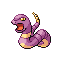

**XP**: 62 / PERCENT_FEMALE(50)

|         |         |         |         |         |         |         |         |
|---------|---------|---------|---------|---------|---------|---------|---------|
| **type1** | TYPE_POISON | **type2** | TYPE_POISON | **catchRate** | 255 | **safariZoneFleeRate** | 0 |
| **baseAttack** | 60 | **baseSpAttack** | 40 | **evYield_Attack** | 1 | **evYield_SpAttack** | 0 |
| **baseDefense** | 44 | **baseSpDefense** | 54 | **evYield_Defense** | 0 | **evYield_SpDefense** | 0 |
| **baseHP** | 35 | **baseSpeed** | 55 | **evYield_HP** | 0 | **evYield_SpDefense** | 0 |
| **eggGroup1** | EGG_GROUP_FIELD | **eggGroup2** | EGG_GROUP_DRAGON | **eggCycles** | 20 | **friendship** | 70 |
| **item1** | ITEM_NONE | **item2** | ITEM_NONE | **abilities** | ABILITY_INTIMIDATE | **growthRate** | GROWTH_MEDIUM_FAST |

**Found at:** MAP_ROUTE10, MAP_ROUTE8, MAP_ROUTE4, MAP_ROUTE11, MAP_ROUTE23, MAP_ROUTE9

| Level | Move Name |
|---------|---------|
| 1 | Leer |
| 4 | Poison sting |
| 9 | Bite |
| 13 | Poison fang |
| 17 | Screech |
| 20 | Glare |
| 25 | Acid |
| 32 | Mud shot |
| 37 | Spit up |
| 44 | Haze |

| TM or HM |
|---------|
| Tm06 toxic |
| Tm10 hidden power |
| Tm11 sunny day |
| Tm17 protect |
| Tm18 rain dance |
| Tm19 giga drain |
| Tm21 frustration |
| Tm23 iron tail |
| Tm26 earthquake |
| Tm27 return |
| Tm28 dig |
| Tm32 double team |
| Tm36 sludge bomb |
| Tm41 torment |
| Tm42 facade |
| Tm43 secret power |
| Tm44 rest |
| Tm45 attract |
| Tm46 thief |
| Tm49 snatch |
| Hm04 strength |

### ARBOK

**XP**: 147 / PERCENT_FEMALE(50)

|         |         |         |         |         |         |         |         |
|---------|---------|---------|---------|---------|---------|---------|---------|
| **type1** | TYPE_POISON | **type2** | TYPE_POISON | **catchRate** | 90 | **safariZoneFleeRate** | 0 |
| **baseAttack** | 85 | **baseSpAttack** | 65 | **evYield_Attack** | 2 | **evYield_SpAttack** | 0 |
| **baseDefense** | 69 | **baseSpDefense** | 79 | **evYield_Defense** | 0 | **evYield_SpDefense** | 0 |
| **baseHP** | 60 | **baseSpeed** | 80 | **evYield_HP** | 0 | **evYield_SpDefense** | 0 |
| **eggGroup1** | EGG_GROUP_FIELD | **eggGroup2** | EGG_GROUP_DRAGON | **eggCycles** | 20 | **friendship** | 70 |
| **item1** | ITEM_NONE | **item2** | ITEM_POISON_BARB | **abilities** | ABILITY_INTIMIDATE | **growthRate** | GROWTH_MEDIUM_FAST |

**Found at:** MAP_ROUTE23, MAP_VICTORY_ROAD_3F, MAP_VICTORY_ROAD_2F, MAP_VICTORY_ROAD_1F

| Level | Move Name |
|---------|---------|
| 1 | Bite |
| 13 | Poison fang |
| 17 | Screech |
| 20 | Glare |
| 32 | Acid |
| 38 | Mud shot |
| 46 | Spit up |
| 56 | Haze |

| TM or HM |
|---------|
| Tm06 toxic |
| Tm10 hidden power |
| Tm11 sunny day |
| Tm15 hyper beam |
| Tm17 protect |
| Tm18 rain dance |
| Tm19 giga drain |
| Tm21 frustration |
| Tm23 iron tail |
| Tm26 earthquake |
| Tm27 return |
| Tm28 dig |
| Tm32 double team |
| Tm36 sludge bomb |
| Tm41 torment |
| Tm42 facade |
| Tm43 secret power |
| Tm44 rest |
| Tm45 attract |
| Tm46 thief |
| Tm49 snatch |
| Hm04 strength |

### PIKACHU

**XP**: 82 / PERCENT_FEMALE(50)

|         |         |         |         |         |         |         |         |
|---------|---------|---------|---------|---------|---------|---------|---------|
| **type1** | TYPE_ELECTRIC | **type2** | TYPE_ELECTRIC | **catchRate** | 190 | **safariZoneFleeRate** | 0 |
| **baseAttack** | 55 | **baseSpAttack** | 50 | **evYield_Attack** | 0 | **evYield_SpAttack** | 0 |
| **baseDefense** | 30 | **baseSpDefense** | 40 | **evYield_Defense** | 0 | **evYield_SpDefense** | 0 |
| **baseHP** | 35 | **baseSpeed** | 90 | **evYield_HP** | 0 | **evYield_SpDefense** | 0 |
| **eggGroup1** | EGG_GROUP_FIELD | **eggGroup2** | EGG_GROUP_FAIRY | **eggCycles** | 10 | **friendship** | 70 |
| **item1** | ITEM_NONE | **item2** | ITEM_NONE | **abilities** | ABILITY_STATIC | **growthRate** | GROWTH_MEDIUM_FAST |

**Found at:** MAP_POWER_PLANT, MAP_VIRIDIAN_FOREST

| Level | Move Name |
|---------|---------|
| 1 | Growl |
| 6 | Tail whip |
| 8 | Thunder wave |
| 11 | Quick attack |
| 15 | Double team |
| 20 | Slam |
| 26 | Thunderbolt |
| 33 | Agility |
| 41 | Thunder |
| 50 | Light screen |

| TM or HM |
|---------|
| Tm01 focus punch |
| Tm06 toxic |
| Tm10 hidden power |
| Tm16 light screen |
| Tm17 protect |
| Tm18 rain dance |
| Tm21 frustration |
| Tm23 iron tail |
| Tm24 thunderbolt |
| Tm25 thunder |
| Tm27 return |
| Tm28 dig |
| Tm31 brick break |
| Tm32 double team |
| Tm34 shock wave |
| Tm42 facade |
| Tm43 secret power |
| Tm44 rest |
| Tm45 attract |
| Hm04 strength |
| Hm05 flash |
| Hm06 rock smash |

### RAICHU

**XP**: 122 / PERCENT_FEMALE(50)

|         |         |         |         |         |         |         |         |
|---------|---------|---------|---------|---------|---------|---------|---------|
| **type1** | TYPE_ELECTRIC | **type2** | TYPE_ELECTRIC | **catchRate** | 75 | **safariZoneFleeRate** | 0 |
| **baseAttack** | 90 | **baseSpAttack** | 90 | **evYield_Attack** | 0 | **evYield_SpAttack** | 0 |
| **baseDefense** | 55 | **baseSpDefense** | 80 | **evYield_Defense** | 0 | **evYield_SpDefense** | 0 |
| **baseHP** | 60 | **baseSpeed** | 100 | **evYield_HP** | 0 | **evYield_SpDefense** | 0 |
| **eggGroup1** | EGG_GROUP_FIELD | **eggGroup2** | EGG_GROUP_FAIRY | **eggCycles** | 10 | **friendship** | 70 |
| **item1** | ITEM_NONE | **item2** | ITEM_NONE | **abilities** | ABILITY_STATIC | **growthRate** | GROWTH_MEDIUM_FAST |

**Found at:** 

| Level | Move Name |
|---------|---------|
| 1 | Thunderbolt |

| TM or HM |
|---------|
| Tm01 focus punch |
| Tm06 toxic |
| Tm10 hidden power |
| Tm15 hyper beam |
| Tm16 light screen |
| Tm17 protect |
| Tm18 rain dance |
| Tm21 frustration |
| Tm23 iron tail |
| Tm24 thunderbolt |
| Tm25 thunder |
| Tm27 return |
| Tm28 dig |
| Tm31 brick break |
| Tm32 double team |
| Tm34 shock wave |
| Tm42 facade |
| Tm43 secret power |
| Tm44 rest |
| Tm45 attract |
| Tm46 thief |
| Hm04 strength |
| Hm05 flash |
| Hm06 rock smash |

### SANDSHREW

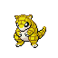

**XP**: 93 / PERCENT_FEMALE(50)

|         |         |         |         |         |         |         |         |
|---------|---------|---------|---------|---------|---------|---------|---------|
| **type1** | TYPE_GROUND | **type2** | TYPE_GROUND | **catchRate** | 255 | **safariZoneFleeRate** | 0 |
| **baseAttack** | 75 | **baseSpAttack** | 20 | **evYield_Attack** | 0 | **evYield_SpAttack** | 0 |
| **baseDefense** | 85 | **baseSpDefense** | 30 | **evYield_Defense** | 1 | **evYield_SpDefense** | 0 |
| **baseHP** | 50 | **baseSpeed** | 40 | **evYield_HP** | 0 | **evYield_SpDefense** | 0 |
| **eggGroup1** | EGG_GROUP_FIELD | **eggGroup2** | EGG_GROUP_FIELD | **eggCycles** | 20 | **friendship** | 70 |
| **item1** | ITEM_NONE | **item2** | ITEM_NONE | **abilities** | ABILITY_SAND_VEIL | **growthRate** | GROWTH_MEDIUM_FAST |

**Found at:** MAP_ROUTE8, MAP_ROUTE4, MAP_ROUTE11, MAP_ROUTE9

| Level | Move Name |
|---------|---------|
| 1 | Defense curl |
| 6 | Sand attack |
| 11 | Rollout |
| 17 | Poison sting |
| 23 | Slash |
| 30 | Swift |
| 37 | Fury swipes |
| 45 | Sand tomb |
| 53 | Sandstorm |
| 65 | Earthquake |

| TM or HM |
|---------|
| Tm01 focus punch |
| Tm06 toxic |
| Tm10 hidden power |
| Tm11 sunny day |
| Tm17 protect |
| Tm21 frustration |
| Tm23 iron tail |
| Tm26 earthquake |
| Tm27 return |
| Tm28 dig |
| Tm31 brick break |
| Tm32 double team |
| Tm37 sandstorm |
| Tm39 rock tomb |
| Tm40 aerial ace |
| Tm42 facade |
| Tm43 secret power |
| Tm44 rest |
| Tm45 attract |
| Tm46 thief |
| Hm01 cut |
| Hm04 strength |
| Hm06 rock smash |

### SANDSLASH

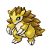

**XP**: 163 / PERCENT_FEMALE(50)

|         |         |         |         |         |         |         |         |
|---------|---------|---------|---------|---------|---------|---------|---------|
| **type1** | TYPE_GROUND | **type2** | TYPE_GROUND | **catchRate** | 90 | **safariZoneFleeRate** | 0 |
| **baseAttack** | 100 | **baseSpAttack** | 45 | **evYield_Attack** | 0 | **evYield_SpAttack** | 0 |
| **baseDefense** | 110 | **baseSpDefense** | 55 | **evYield_Defense** | 2 | **evYield_SpDefense** | 0 |
| **baseHP** | 75 | **baseSpeed** | 65 | **evYield_HP** | 0 | **evYield_SpDefense** | 0 |
| **eggGroup1** | EGG_GROUP_FIELD | **eggGroup2** | EGG_GROUP_FIELD | **eggCycles** | 20 | **friendship** | 70 |
| **item1** | ITEM_NONE | **item2** | ITEM_SOFT_SAND | **abilities** | ABILITY_SAND_VEIL | **growthRate** | GROWTH_MEDIUM_FAST |

**Found at:** MAP_ROUTE23

| Level | Move Name |
|---------|---------|
| 1 | Sand attack |
| 6 | Rollout |
| 11 | Sand attack |
| 17 | Poison sting |
| 24 | Slash |
| 33 | Swift |
| 42 | Fury swipes |
| 52 | Sand tomb |
| 62 | Sandstorm |
| 68 | Earthquake |

| TM or HM |
|---------|
| Tm01 focus punch |
| Tm06 toxic |
| Tm10 hidden power |
| Tm11 sunny day |
| Tm15 hyper beam |
| Tm17 protect |
| Tm21 frustration |
| Tm23 iron tail |
| Tm26 earthquake |
| Tm27 return |
| Tm28 dig |
| Tm31 brick break |
| Tm32 double team |
| Tm37 sandstorm |
| Tm39 rock tomb |
| Tm40 aerial ace |
| Tm42 facade |
| Tm43 secret power |
| Tm44 rest |
| Tm45 attract |
| Tm46 thief |
| Hm01 cut |
| Hm04 strength |
| Hm06 rock smash |

### NIDORAN_F

**XP**: 59 / MON_FEMALE

|         |         |         |         |         |         |         |         |
|---------|---------|---------|---------|---------|---------|---------|---------|
| **type1** | TYPE_POISON | **type2** | TYPE_POISON | **catchRate** | 235 | **safariZoneFleeRate** | 50 |
| **baseAttack** | 47 | **baseSpAttack** | 40 | **evYield_Attack** | 0 | **evYield_SpAttack** | 0 |
| **baseDefense** | 52 | **baseSpDefense** | 40 | **evYield_Defense** | 0 | **evYield_SpDefense** | 0 |
| **baseHP** | 55 | **baseSpeed** | 41 | **evYield_HP** | 1 | **evYield_SpDefense** | 0 |
| **eggGroup1** | EGG_GROUP_MONSTER | **eggGroup2** | EGG_GROUP_FIELD | **eggCycles** | 20 | **friendship** | 70 |
| **item1** | ITEM_NONE | **item2** | ITEM_NONE | **abilities** | ABILITY_POISON_POINT | **growthRate** | GROWTH_MEDIUM_SLOW |

**Found at:** MAP_ROUTE22, MAP_ROUTE3, MAP_SAFARI_ZONE_WEST, MAP_SAFARI_ZONE_EAST

| TM or HM |
|---------|
| Tm03 water pulse |
| Tm06 toxic |
| Tm10 hidden power |
| Tm11 sunny day |
| Tm13 ice beam |
| Tm14 blizzard |
| Tm17 protect |
| Tm18 rain dance |
| Tm21 frustration |
| Tm23 iron tail |
| Tm24 thunderbolt |
| Tm25 thunder |
| Tm27 return |
| Tm28 dig |
| Tm32 double team |
| Tm34 shock wave |
| Tm36 sludge bomb |
| Tm40 aerial ace |
| Tm42 facade |
| Tm43 secret power |
| Tm44 rest |
| Tm45 attract |
| Tm46 thief |
| Hm01 cut |
| Hm04 strength |
| Hm06 rock smash |

### NIDORINA

**XP**: 117 / MON_FEMALE

|         |         |         |         |         |         |         |         |
|---------|---------|---------|---------|---------|---------|---------|---------|
| **type1** | TYPE_POISON | **type2** | TYPE_POISON | **catchRate** | 120 | **safariZoneFleeRate** | 75 |
| **baseAttack** | 62 | **baseSpAttack** | 55 | **evYield_Attack** | 0 | **evYield_SpAttack** | 0 |
| **baseDefense** | 67 | **baseSpDefense** | 55 | **evYield_Defense** | 0 | **evYield_SpDefense** | 0 |
| **baseHP** | 70 | **baseSpeed** | 56 | **evYield_HP** | 2 | **evYield_SpDefense** | 0 |
| **eggGroup1** | EGG_GROUP_UNDISCOVERED | **eggGroup2** | EGG_GROUP_UNDISCOVERED | **eggCycles** | 20 | **friendship** | 70 |
| **item1** | ITEM_NONE | **item2** | ITEM_NONE | **abilities** | ABILITY_POISON_POINT | **growthRate** | GROWTH_MEDIUM_SLOW |

**Found at:** MAP_SAFARI_ZONE_NORTH, MAP_SAFARI_ZONE_CENTER

| Level | Move Name |
|---------|---------|
| 1 | Scratch |
| 8 | Tail whip |
| 12 | Double kick |
| 18 | Poison sting |
| 22 | Bite |
| 26 | Helping hand |
| 30 | Toxic |
| 34 | Fury swipes |
| 43 | Flatter |
| 53 | Crunch |

| TM or HM |
|---------|
| Tm03 water pulse |
| Tm06 toxic |
| Tm10 hidden power |
| Tm11 sunny day |
| Tm13 ice beam |
| Tm14 blizzard |
| Tm17 protect |
| Tm18 rain dance |
| Tm21 frustration |
| Tm23 iron tail |
| Tm24 thunderbolt |
| Tm25 thunder |
| Tm27 return |
| Tm28 dig |
| Tm32 double team |
| Tm34 shock wave |
| Tm36 sludge bomb |
| Tm40 aerial ace |
| Tm42 facade |
| Tm43 secret power |
| Tm44 rest |
| Tm45 attract |
| Tm46 thief |
| Hm01 cut |
| Hm04 strength |
| Hm06 rock smash |

### NIDOQUEEN

**XP**: 194 / MON_FEMALE

|         |         |         |         |         |         |         |         |
|---------|---------|---------|---------|---------|---------|---------|---------|
| **type1** | TYPE_POISON | **type2** | TYPE_ICE | **catchRate** | 45 | **safariZoneFleeRate** | 0 |
| **baseAttack** | 82 | **baseSpAttack** | 75 | **evYield_Attack** | 0 | **evYield_SpAttack** | 0 |
| **baseDefense** | 87 | **baseSpDefense** | 85 | **evYield_Defense** | 0 | **evYield_SpDefense** | 0 |
| **baseHP** | 90 | **baseSpeed** | 76 | **evYield_HP** | 3 | **evYield_SpDefense** | 0 |
| **eggGroup1** | EGG_GROUP_UNDISCOVERED | **eggGroup2** | EGG_GROUP_UNDISCOVERED | **eggCycles** | 20 | **friendship** | 70 |
| **item1** | ITEM_NONE | **item2** | ITEM_NONE | **abilities** | ABILITY_POISON_POINT | **growthRate** | GROWTH_MEDIUM_SLOW |

**Found at:** 

| Level | Move Name |
|---------|---------|
| 1 | Growl |
| 12 | Double kick |
| 22 | Bite |
| 27 | Body slam |
| 43 | Ice ball |
| 47 | Toxic |
| 65 | Ice beam |

| TM or HM |
|---------|
| Tm01 focus punch |
| Tm03 water pulse |
| Tm05 roar |
| Tm06 toxic |
| Tm10 hidden power |
| Tm11 sunny day |
| Tm12 taunt |
| Tm13 ice beam |
| Tm14 blizzard |
| Tm15 hyper beam |
| Tm17 protect |
| Tm18 rain dance |
| Tm21 frustration |
| Tm23 iron tail |
| Tm24 thunderbolt |
| Tm25 thunder |
| Tm26 earthquake |
| Tm27 return |
| Tm28 dig |
| Tm30 shadow ball |
| Tm31 brick break |
| Tm32 double team |
| Tm34 shock wave |
| Tm35 flamethrower |
| Tm36 sludge bomb |
| Tm37 sandstorm |
| Tm38 fire blast |
| Tm39 rock tomb |
| Tm40 aerial ace |
| Tm41 torment |
| Tm42 facade |
| Tm43 secret power |
| Tm44 rest |
| Tm45 attract |
| Tm46 thief |
| Hm01 cut |
| Hm03 surf |
| Hm04 strength |
| Hm06 rock smash |

### NIDORAN_M

**XP**: 60 / MON_MALE

|         |         |         |         |         |         |         |         |
|---------|---------|---------|---------|---------|---------|---------|---------|
| **type1** | TYPE_POISON | **type2** | TYPE_POISON | **catchRate** | 235 | **safariZoneFleeRate** | 50 |
| **baseAttack** | 57 | **baseSpAttack** | 40 | **evYield_Attack** | 1 | **evYield_SpAttack** | 0 |
| **baseDefense** | 40 | **baseSpDefense** | 40 | **evYield_Defense** | 0 | **evYield_SpDefense** | 0 |
| **baseHP** | 46 | **baseSpeed** | 50 | **evYield_HP** | 0 | **evYield_SpDefense** | 0 |
| **eggGroup1** | EGG_GROUP_MONSTER | **eggGroup2** | EGG_GROUP_FIELD | **eggCycles** | 20 | **friendship** | 70 |
| **item1** | ITEM_NONE | **item2** | ITEM_NONE | **abilities** | ABILITY_POISON_POINT | **growthRate** | GROWTH_MEDIUM_SLOW |

**Found at:** MAP_ROUTE3, MAP_SAFARI_ZONE_WEST, MAP_SAFARI_ZONE_CENTER, MAP_SAFARI_ZONE_NORTH, MAP_SAFARI_ZONE_EAST, MAP_ROUTE22

| TM or HM |
|---------|
| Tm03 water pulse |
| Tm06 toxic |
| Tm10 hidden power |
| Tm11 sunny day |
| Tm13 ice beam |
| Tm14 blizzard |
| Tm17 protect |
| Tm18 rain dance |
| Tm21 frustration |
| Tm23 iron tail |
| Tm24 thunderbolt |
| Tm25 thunder |
| Tm27 return |
| Tm28 dig |
| Tm32 double team |
| Tm34 shock wave |
| Tm36 sludge bomb |
| Tm42 facade |
| Tm43 secret power |
| Tm44 rest |
| Tm45 attract |
| Tm46 thief |
| Hm01 cut |
| Hm04 strength |
| Hm06 rock smash |

### NIDORINO

**XP**: 118 / MON_MALE

|         |         |         |         |         |         |         |         |
|---------|---------|---------|---------|---------|---------|---------|---------|
| **type1** | TYPE_POISON | **type2** | TYPE_POISON | **catchRate** | 120 | **safariZoneFleeRate** | 75 |
| **baseAttack** | 72 | **baseSpAttack** | 55 | **evYield_Attack** | 2 | **evYield_SpAttack** | 0 |
| **baseDefense** | 57 | **baseSpDefense** | 55 | **evYield_Defense** | 0 | **evYield_SpDefense** | 0 |
| **baseHP** | 61 | **baseSpeed** | 65 | **evYield_HP** | 0 | **evYield_SpDefense** | 0 |
| **eggGroup1** | EGG_GROUP_MONSTER | **eggGroup2** | EGG_GROUP_FIELD | **eggCycles** | 20 | **friendship** | 70 |
| **item1** | ITEM_NONE | **item2** | ITEM_NONE | **abilities** | ABILITY_POISON_POINT | **growthRate** | GROWTH_MEDIUM_SLOW |

**Found at:** MAP_SAFARI_ZONE_WEST, MAP_SAFARI_ZONE_NORTH, MAP_SAFARI_ZONE_EAST, MAP_SAFARI_ZONE_CENTER

| Level | Move Name |
|---------|---------|
| 1 | Peck |
| 8 | Focus energy |
| 12 | Double kick |
| 18 | Poison sting |
| 22 | Horn attack |
| 26 | Helping hand |
| 30 | Toxic |
| 34 | Fury attack |
| 43 | Flatter |
| 53 | Horn drill |

| TM or HM |
|---------|
| Tm03 water pulse |
| Tm06 toxic |
| Tm10 hidden power |
| Tm11 sunny day |
| Tm13 ice beam |
| Tm14 blizzard |
| Tm17 protect |
| Tm18 rain dance |
| Tm21 frustration |
| Tm23 iron tail |
| Tm24 thunderbolt |
| Tm25 thunder |
| Tm27 return |
| Tm28 dig |
| Tm32 double team |
| Tm34 shock wave |
| Tm36 sludge bomb |
| Tm42 facade |
| Tm43 secret power |
| Tm44 rest |
| Tm45 attract |
| Tm46 thief |
| Hm01 cut |
| Hm04 strength |
| Hm06 rock smash |

### NIDOKING

**XP**: 195 / MON_MALE

|         |         |         |         |         |         |         |         |
|---------|---------|---------|---------|---------|---------|---------|---------|
| **type1** | TYPE_POISON | **type2** | TYPE_GROUND | **catchRate** | 45 | **safariZoneFleeRate** | 0 |
| **baseAttack** | 92 | **baseSpAttack** | 85 | **evYield_Attack** | 3 | **evYield_SpAttack** | 0 |
| **baseDefense** | 77 | **baseSpDefense** | 75 | **evYield_Defense** | 0 | **evYield_SpDefense** | 0 |
| **baseHP** | 81 | **baseSpeed** | 85 | **evYield_HP** | 0 | **evYield_SpDefense** | 0 |
| **eggGroup1** | EGG_GROUP_MONSTER | **eggGroup2** | EGG_GROUP_FIELD | **eggCycles** | 20 | **friendship** | 70 |
| **item1** | ITEM_NONE | **item2** | ITEM_NONE | **abilities** | ABILITY_POISON_POINT | **growthRate** | GROWTH_MEDIUM_SLOW |

**Found at:** 

| Level | Move Name |
|---------|---------|
| 1 | Focus energy |
| 23 | Thrash |
| 43 | Toxic |
| 48 | Sand tomb |
| 58 | Megahorn |

| TM or HM |
|---------|
| Tm01 focus punch |
| Tm03 water pulse |
| Tm05 roar |
| Tm06 toxic |
| Tm10 hidden power |
| Tm11 sunny day |
| Tm12 taunt |
| Tm13 ice beam |
| Tm14 blizzard |
| Tm15 hyper beam |
| Tm17 protect |
| Tm18 rain dance |
| Tm21 frustration |
| Tm23 iron tail |
| Tm24 thunderbolt |
| Tm25 thunder |
| Tm26 earthquake |
| Tm27 return |
| Tm28 dig |
| Tm30 shadow ball |
| Tm31 brick break |
| Tm32 double team |
| Tm34 shock wave |
| Tm35 flamethrower |
| Tm36 sludge bomb |
| Tm37 sandstorm |
| Tm38 fire blast |
| Tm39 rock tomb |
| Tm41 torment |
| Tm42 facade |
| Tm43 secret power |
| Tm44 rest |
| Tm45 attract |
| Tm46 thief |
| Hm01 cut |
| Hm03 surf |
| Hm04 strength |
| Hm06 rock smash |

### CLEFAIRY

**XP**: 68 / PERCENT_FEMALE(75)

|         |         |         |         |         |         |         |         |
|---------|---------|---------|---------|---------|---------|---------|---------|
| **type1** | TYPE_NORMAL | **type2** | TYPE_NORMAL | **catchRate** | 150 | **safariZoneFleeRate** | 0 |
| **baseAttack** | 45 | **baseSpAttack** | 60 | **evYield_Attack** | 0 | **evYield_SpAttack** | 0 |
| **baseDefense** | 48 | **baseSpDefense** | 65 | **evYield_Defense** | 0 | **evYield_SpDefense** | 0 |
| **baseHP** | 70 | **baseSpeed** | 35 | **evYield_HP** | 2 | **evYield_SpDefense** | 0 |
| **eggGroup1** | EGG_GROUP_FAIRY | **eggGroup2** | EGG_GROUP_FAIRY | **eggCycles** | 10 | **friendship** | 140 |
| **item1** | ITEM_NONE | **item2** | ITEM_MOON_STONE | **abilities** | ABILITY_CUTE_CHARM | **growthRate** | GROWTH_FAST |

**Found at:** MAP_MT_MOON_B2F

| Level | Move Name |
|---------|---------|
| 1 | Growl |
| 5 | Encore |
| 9 | Sing |
| 13 | Double slap |
| 17 | Follow me |
| 21 | Minimize |
| 25 | Defense curl |
| 29 | Metronome |
| 33 | Cosmic power |
| 37 | Moonlight |
| 41 | Light screen |
| 45 | Meteor mash |

| TM or HM |
|---------|
| Tm01 focus punch |
| Tm03 water pulse |
| Tm04 calm mind |
| Tm06 toxic |
| Tm10 hidden power |
| Tm11 sunny day |
| Tm13 ice beam |
| Tm14 blizzard |
| Tm16 light screen |
| Tm17 protect |
| Tm18 rain dance |
| Tm20 safeguard |
| Tm21 frustration |
| Tm22 solar beam |
| Tm23 iron tail |
| Tm24 thunderbolt |
| Tm25 thunder |
| Tm27 return |
| Tm28 dig |
| Tm29 psychic |
| Tm30 shadow ball |
| Tm31 brick break |
| Tm32 double team |
| Tm33 reflect |
| Tm34 shock wave |
| Tm35 flamethrower |
| Tm38 fire blast |
| Tm42 facade |
| Tm43 secret power |
| Tm44 rest |
| Tm45 attract |
| Tm49 snatch |
| Hm04 strength |
| Hm05 flash |

### CLEFABLE

**XP**: 129 / PERCENT_FEMALE(75)

|         |         |         |         |         |         |         |         |
|---------|---------|---------|---------|---------|---------|---------|---------|
| **type1** | TYPE_NORMAL | **type2** | TYPE_NORMAL | **catchRate** | 25 | **safariZoneFleeRate** | 0 |
| **baseAttack** | 70 | **baseSpAttack** | 85 | **evYield_Attack** | 0 | **evYield_SpAttack** | 0 |
| **baseDefense** | 73 | **baseSpDefense** | 90 | **evYield_Defense** | 0 | **evYield_SpDefense** | 0 |
| **baseHP** | 95 | **baseSpeed** | 60 | **evYield_HP** | 3 | **evYield_SpDefense** | 0 |
| **eggGroup1** | EGG_GROUP_FAIRY | **eggGroup2** | EGG_GROUP_FAIRY | **eggCycles** | 10 | **friendship** | 140 |
| **item1** | ITEM_NONE | **item2** | ITEM_MOON_STONE | **abilities** | ABILITY_CUTE_CHARM | **growthRate** | GROWTH_FAST |

**Found at:** 

| Level | Move Name |
|---------|---------|
| 1 | Cosmic power |
| 41 | Moonlight |
| 45 | Light screen |
| 49 | Meteor mash |

| TM or HM |
|---------|
| Tm01 focus punch |
| Tm03 water pulse |
| Tm04 calm mind |
| Tm06 toxic |
| Tm10 hidden power |
| Tm11 sunny day |
| Tm13 ice beam |
| Tm14 blizzard |
| Tm15 hyper beam |
| Tm16 light screen |
| Tm17 protect |
| Tm18 rain dance |
| Tm20 safeguard |
| Tm21 frustration |
| Tm22 solar beam |
| Tm23 iron tail |
| Tm24 thunderbolt |
| Tm25 thunder |
| Tm27 return |
| Tm28 dig |
| Tm29 psychic |
| Tm30 shadow ball |
| Tm31 brick break |
| Tm32 double team |
| Tm33 reflect |
| Tm34 shock wave |
| Tm35 flamethrower |
| Tm38 fire blast |
| Tm42 facade |
| Tm43 secret power |
| Tm44 rest |
| Tm45 attract |
| Tm49 snatch |
| Hm04 strength |
| Hm05 flash |

### VULPIX

**XP**: 63 / PERCENT_FEMALE(75)

|         |         |         |         |         |         |         |         |
|---------|---------|---------|---------|---------|---------|---------|---------|
| **type1** | TYPE_FIRE | **type2** | TYPE_FIRE | **catchRate** | 190 | **safariZoneFleeRate** | 0 |
| **baseAttack** | 41 | **baseSpAttack** | 50 | **evYield_Attack** | 0 | **evYield_SpAttack** | 0 |
| **baseDefense** | 40 | **baseSpDefense** | 65 | **evYield_Defense** | 0 | **evYield_SpDefense** | 0 |
| **baseHP** | 38 | **baseSpeed** | 65 | **evYield_HP** | 0 | **evYield_SpDefense** | 0 |
| **eggGroup1** | EGG_GROUP_FIELD | **eggGroup2** | EGG_GROUP_FIELD | **eggCycles** | 20 | **friendship** | 70 |
| **item1** | ITEM_RAWST_BERRY | **item2** | ITEM_NONE | **abilities** | ABILITY_FLASH_FIRE | **growthRate** | GROWTH_MEDIUM_FAST |

**Found at:** MAP_ROUTE7, MAP_POKEMON_MANSION_3F, MAP_POKEMON_MANSION_1F, MAP_ROUTE8, MAP_POKEMON_MANSION_B1F, MAP_POKEMON_MANSION_2F

| Level | Move Name |
|---------|---------|
| 1 | Ember |
| 5 | Tail whip |
| 9 | Roar |
| 13 | Quick attack |
| 16 | Will o wisp |
| 20 | Flame wheel |
| 24 | Confuse ray |
| 25 | Imprison |
| 29 | Flamethrower |
| 33 | Safeguard |
| 37 | Grudge |
| 41 | Fire spin |

| TM or HM |
|---------|
| Tm05 roar |
| Tm06 toxic |
| Tm10 hidden power |
| Tm11 sunny day |
| Tm17 protect |
| Tm20 safeguard |
| Tm21 frustration |
| Tm23 iron tail |
| Tm27 return |
| Tm28 dig |
| Tm32 double team |
| Tm35 flamethrower |
| Tm38 fire blast |
| Tm42 facade |
| Tm43 secret power |
| Tm44 rest |
| Tm45 attract |
| Tm50 overheat |

### NINETALES

**XP**: 178 / PERCENT_FEMALE(75)

|         |         |         |         |         |         |         |         |
|---------|---------|---------|---------|---------|---------|---------|---------|
| **type1** | TYPE_FIRE | **type2** | TYPE_FIRE | **catchRate** | 75 | **safariZoneFleeRate** | 0 |
| **baseAttack** | 76 | **baseSpAttack** | 81 | **evYield_Attack** | 0 | **evYield_SpAttack** | 0 |
| **baseDefense** | 75 | **baseSpDefense** | 100 | **evYield_Defense** | 0 | **evYield_SpDefense** | 1 |
| **baseHP** | 73 | **baseSpeed** | 100 | **evYield_HP** | 0 | **evYield_SpDefense** | 1 |
| **eggGroup1** | EGG_GROUP_FIELD | **eggGroup2** | EGG_GROUP_FIELD | **eggCycles** | 20 | **friendship** | 70 |
| **item1** | ITEM_RAWST_BERRY | **item2** | ITEM_NONE | **abilities** | ABILITY_FLASH_FIRE | **growthRate** | GROWTH_MEDIUM_FAST |

**Found at:** 

| Level | Move Name |
|---------|---------|
| 1 | Imprison |
| 36 | Flamethrower |
| 40 | Safeguard |
| 44 | Grudge |
| 49 | Fire spin |

| TM or HM |
|---------|
| Tm05 roar |
| Tm06 toxic |
| Tm10 hidden power |
| Tm11 sunny day |
| Tm15 hyper beam |
| Tm17 protect |
| Tm20 safeguard |
| Tm21 frustration |
| Tm23 iron tail |
| Tm27 return |
| Tm28 dig |
| Tm32 double team |
| Tm35 flamethrower |
| Tm38 fire blast |
| Tm42 facade |
| Tm43 secret power |
| Tm44 rest |
| Tm45 attract |
| Tm50 overheat |

### JIGGLYPUFF

**XP**: 76 / PERCENT_FEMALE(75)

|         |         |         |         |         |         |         |         |
|---------|---------|---------|---------|---------|---------|---------|---------|
| **type1** | TYPE_NORMAL | **type2** | TYPE_NORMAL | **catchRate** | 170 | **safariZoneFleeRate** | 0 |
| **baseAttack** | 45 | **baseSpAttack** | 50 | **evYield_Attack** | 0 | **evYield_SpAttack** | 0 |
| **baseDefense** | 20 | **baseSpDefense** | 25 | **evYield_Defense** | 0 | **evYield_SpDefense** | 0 |
| **baseHP** | 115 | **baseSpeed** | 30 | **evYield_HP** | 2 | **evYield_SpDefense** | 0 |
| **eggGroup1** | EGG_GROUP_FAIRY | **eggGroup2** | EGG_GROUP_FAIRY | **eggCycles** | 10 | **friendship** | 70 |
| **item1** | ITEM_ORAN_BERRY | **item2** | ITEM_NONE | **abilities** | ABILITY_CUTE_CHARM | **growthRate** | GROWTH_FAST |

**Found at:** MAP_ROUTE3

| Level | Move Name |
|---------|---------|
| 1 | Sing |
| 4 | Pound |
| 9 | Defense curl |
| 14 | Disable |
| 19 | Rollout |
| 24 | Double slap |
| 29 | Rest |
| 34 | Body slam |
| 39 | Mimic |
| 44 | Hyper voice |
| 49 | Double edge |

| TM or HM |
|---------|
| Tm01 focus punch |
| Tm03 water pulse |
| Tm06 toxic |
| Tm10 hidden power |
| Tm11 sunny day |
| Tm13 ice beam |
| Tm14 blizzard |
| Tm16 light screen |
| Tm17 protect |
| Tm18 rain dance |
| Tm20 safeguard |
| Tm21 frustration |
| Tm22 solar beam |
| Tm24 thunderbolt |
| Tm25 thunder |
| Tm27 return |
| Tm28 dig |
| Tm29 psychic |
| Tm30 shadow ball |
| Tm31 brick break |
| Tm32 double team |
| Tm33 reflect |
| Tm34 shock wave |
| Tm35 flamethrower |
| Tm38 fire blast |
| Tm42 facade |
| Tm43 secret power |
| Tm44 rest |
| Tm45 attract |
| Tm49 snatch |
| Hm04 strength |
| Hm05 flash |

### WIGGLYTUFF

**XP**: 109 / PERCENT_FEMALE(75)

|         |         |         |         |         |         |         |         |
|---------|---------|---------|---------|---------|---------|---------|---------|
| **type1** | TYPE_NORMAL | **type2** | TYPE_NORMAL | **catchRate** | 50 | **safariZoneFleeRate** | 0 |
| **baseAttack** | 70 | **baseSpAttack** | 75 | **evYield_Attack** | 0 | **evYield_SpAttack** | 0 |
| **baseDefense** | 45 | **baseSpDefense** | 50 | **evYield_Defense** | 0 | **evYield_SpDefense** | 0 |
| **baseHP** | 140 | **baseSpeed** | 45 | **evYield_HP** | 3 | **evYield_SpDefense** | 0 |
| **eggGroup1** | EGG_GROUP_FAIRY | **eggGroup2** | EGG_GROUP_FAIRY | **eggCycles** | 10 | **friendship** | 70 |
| **item1** | ITEM_ORAN_BERRY | **item2** | ITEM_NONE | **abilities** | ABILITY_CUTE_CHARM | **growthRate** | GROWTH_FAST |

**Found at:** 

| Level | Move Name |
|---------|---------|
| 1 | Rest |
| 34 | Body slam |
| 39 | Mimic |
| 44 | Hyper voice |
| 49 | Double edge |

| TM or HM |
|---------|
| Tm01 focus punch |
| Tm03 water pulse |
| Tm06 toxic |
| Tm10 hidden power |
| Tm11 sunny day |
| Tm13 ice beam |
| Tm14 blizzard |
| Tm15 hyper beam |
| Tm16 light screen |
| Tm17 protect |
| Tm18 rain dance |
| Tm20 safeguard |
| Tm21 frustration |
| Tm22 solar beam |
| Tm24 thunderbolt |
| Tm25 thunder |
| Tm27 return |
| Tm28 dig |
| Tm29 psychic |
| Tm30 shadow ball |
| Tm31 brick break |
| Tm32 double team |
| Tm33 reflect |
| Tm34 shock wave |
| Tm35 flamethrower |
| Tm38 fire blast |
| Tm42 facade |
| Tm43 secret power |
| Tm44 rest |
| Tm45 attract |
| Tm49 snatch |
| Hm04 strength |
| Hm05 flash |

### ZUBAT

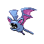

**XP**: 54 / PERCENT_FEMALE(50)

|         |         |         |         |         |         |         |         |
|---------|---------|---------|---------|---------|---------|---------|---------|
| **type1** | TYPE_POISON | **type2** | TYPE_FLYING | **catchRate** | 255 | **safariZoneFleeRate** | 0 |
| **baseAttack** | 45 | **baseSpAttack** | 30 | **evYield_Attack** | 0 | **evYield_SpAttack** | 0 |
| **baseDefense** | 35 | **baseSpDefense** | 40 | **evYield_Defense** | 0 | **evYield_SpDefense** | 0 |
| **baseHP** | 40 | **baseSpeed** | 55 | **evYield_HP** | 0 | **evYield_SpDefense** | 0 |
| **eggGroup1** | EGG_GROUP_FLYING | **eggGroup2** | EGG_GROUP_FLYING | **eggCycles** | 15 | **friendship** | 70 |
| **item1** | ITEM_NONE | **item2** | ITEM_NONE | **abilities** | ABILITY_INNER_FOCUS | **growthRate** | GROWTH_MEDIUM_FAST |

**Found at:** MAP_FIVE_ISLAND_LOST_CAVE_ROOM3, MAP_FIVE_ISLAND_LOST_CAVE_ROOM14, MAP_FOUR_ISLAND_ICEFALL_CAVE_B1F, MAP_SEAFOAM_ISLANDS_1F, MAP_VICTORY_ROAD_2F, MAP_VICTORY_ROAD_1F, MAP_SEAFOAM_ISLANDS_B1F, MAP_FIVE_ISLAND_LOST_CAVE_ROOM13, MAP_ROCK_TUNNEL_1F, MAP_FIVE_ISLAND_LOST_CAVE_ROOM5, MAP_FIVE_ISLAND_LOST_CAVE_ROOM7, MAP_SEAFOAM_ISLANDS_B3F, MAP_FIVE_ISLAND_LOST_CAVE_ROOM6, MAP_ROCK_TUNNEL_B1F, MAP_FOUR_ISLAND_ICEFALL_CAVE_BACK, MAP_MT_MOON_1F, MAP_FOUR_ISLAND_ICEFALL_CAVE_ENTRANCE, MAP_FIVE_ISLAND_LOST_CAVE_ROOM1, MAP_VICTORY_ROAD_3F, MAP_FIVE_ISLAND_LOST_CAVE_ROOM9, MAP_FIVE_ISLAND_LOST_CAVE_ROOM12, MAP_MT_MOON_B2F, MAP_FIVE_ISLAND_LOST_CAVE_ROOM2, MAP_FIVE_ISLAND_LOST_CAVE_ROOM4, MAP_SEAFOAM_ISLANDS_B2F, MAP_FOUR_ISLAND_ICEFALL_CAVE_1F, MAP_FIVE_ISLAND_LOST_CAVE_ROOM10, MAP_FIVE_ISLAND_LOST_CAVE_ROOM8, MAP_FIVE_ISLAND_LOST_CAVE_ROOM11

| Level | Move Name |
|---------|---------|
| 1 | Leech life |
| 5 | Astonish |
| 9 | Supersonic |
| 13 | Bite |
| 16 | Gust |
| 21 | Wing attack |
| 26 | Confuse ray |
| 31 | Air cutter |
| 36 | Mean look |
| 41 | Poison fang |
| 46 | Haze |

| TM or HM |
|---------|
| Tm06 toxic |
| Tm10 hidden power |
| Tm11 sunny day |
| Tm12 taunt |
| Tm17 protect |
| Tm18 rain dance |
| Tm19 giga drain |
| Tm21 frustration |
| Tm27 return |
| Tm30 shadow ball |
| Tm32 double team |
| Tm36 sludge bomb |
| Tm40 aerial ace |
| Tm41 torment |
| Tm42 facade |
| Tm43 secret power |
| Tm44 rest |
| Tm45 attract |
| Tm46 thief |
| Tm47 steel wing |
| Tm49 snatch |

### GOLBAT

**XP**: 171 / PERCENT_FEMALE(50)

|         |         |         |         |         |         |         |         |
|---------|---------|---------|---------|---------|---------|---------|---------|
| **type1** | TYPE_POISON | **type2** | TYPE_FLYING | **catchRate** | 90 | **safariZoneFleeRate** | 0 |
| **baseAttack** | 80 | **baseSpAttack** | 65 | **evYield_Attack** | 0 | **evYield_SpAttack** | 0 |
| **baseDefense** | 70 | **baseSpDefense** | 75 | **evYield_Defense** | 0 | **evYield_SpDefense** | 0 |
| **baseHP** | 75 | **baseSpeed** | 90 | **evYield_HP** | 0 | **evYield_SpDefense** | 0 |
| **eggGroup1** | EGG_GROUP_FLYING | **eggGroup2** | EGG_GROUP_FLYING | **eggCycles** | 15 | **friendship** | 70 |
| **item1** | ITEM_NONE | **item2** | ITEM_NONE | **abilities** | ABILITY_INNER_FOCUS | **growthRate** | GROWTH_MEDIUM_FAST |

**Found at:** MAP_FIVE_ISLAND_LOST_CAVE_ROOM3, MAP_CERULEAN_CAVE_1F, MAP_FIVE_ISLAND_LOST_CAVE_ROOM14, MAP_FOUR_ISLAND_ICEFALL_CAVE_B1F, MAP_SEAFOAM_ISLANDS_1F, MAP_VICTORY_ROAD_2F, MAP_VICTORY_ROAD_1F, MAP_CERULEAN_CAVE_B1F, MAP_SEAFOAM_ISLANDS_B1F, MAP_FIVE_ISLAND_LOST_CAVE_ROOM13, MAP_FIVE_ISLAND_LOST_CAVE_ROOM5, MAP_FIVE_ISLAND_LOST_CAVE_ROOM7, MAP_SEAFOAM_ISLANDS_B3F, MAP_FIVE_ISLAND_LOST_CAVE_ROOM6, MAP_FOUR_ISLAND_ICEFALL_CAVE_BACK, MAP_FOUR_ISLAND_ICEFALL_CAVE_ENTRANCE, MAP_FIVE_ISLAND_LOST_CAVE_ROOM1, MAP_VICTORY_ROAD_3F, MAP_FIVE_ISLAND_LOST_CAVE_ROOM9, MAP_FIVE_ISLAND_LOST_CAVE_ROOM12, MAP_SEAFOAM_ISLANDS_B4F, MAP_FIVE_ISLAND_LOST_CAVE_ROOM2, MAP_FIVE_ISLAND_LOST_CAVE_ROOM4, MAP_SEAFOAM_ISLANDS_B2F, MAP_FOUR_ISLAND_ICEFALL_CAVE_1F, MAP_FIVE_ISLAND_LOST_CAVE_ROOM10, MAP_FIVE_ISLAND_LOST_CAVE_ROOM8, MAP_FIVE_ISLAND_LOST_CAVE_ROOM11, MAP_CERULEAN_CAVE_2F

| Level | Move Name |
|---------|---------|
| 1 | Supersonic |
| 6 | Astonish |
| 13 | Bite |
| 16 | Gust |
| 21 | Wing attack |
| 28 | Confuse ray |
| 35 | Air cutter |
| 42 | Mean look |
| 49 | Poison fang |
| 56 | Haze |

| TM or HM |
|---------|
| Tm06 toxic |
| Tm10 hidden power |
| Tm11 sunny day |
| Tm12 taunt |
| Tm15 hyper beam |
| Tm17 protect |
| Tm18 rain dance |
| Tm19 giga drain |
| Tm21 frustration |
| Tm27 return |
| Tm30 shadow ball |
| Tm32 double team |
| Tm36 sludge bomb |
| Tm40 aerial ace |
| Tm41 torment |
| Tm42 facade |
| Tm43 secret power |
| Tm44 rest |
| Tm45 attract |
| Tm46 thief |
| Tm47 steel wing |
| Tm49 snatch |

### ODDISH

**XP**: 78 / PERCENT_FEMALE(50)

|         |         |         |         |         |         |         |         |
|---------|---------|---------|---------|---------|---------|---------|---------|
| **type1** | TYPE_GRASS | **type2** | TYPE_POISON | **catchRate** | 255 | **safariZoneFleeRate** | 0 |
| **baseAttack** | 50 | **baseSpAttack** | 75 | **evYield_Attack** | 0 | **evYield_SpAttack** | 1 |
| **baseDefense** | 55 | **baseSpDefense** | 65 | **evYield_Defense** | 0 | **evYield_SpDefense** | 0 |
| **baseHP** | 45 | **baseSpeed** | 30 | **evYield_HP** | 0 | **evYield_SpDefense** | 0 |
| **eggGroup1** | EGG_GROUP_GRASS | **eggGroup2** | EGG_GROUP_GRASS | **eggCycles** | 20 | **friendship** | 70 |
| **item1** | ITEM_NONE | **item2** | ITEM_NONE | **abilities** | ABILITY_CHLOROPHYLL | **growthRate** | GROWTH_MEDIUM_SLOW |

**Found at:** MAP_ROUTE6, MAP_ROUTE7, MAP_ROUTE15, MAP_SIX_ISLAND_WATER_PATH, MAP_ROUTE14, MAP_ROUTE25, MAP_TWO_ISLAND_CAPE_BRINK, MAP_THREE_ISLAND_BOND_BRIDGE, MAP_ROUTE24, MAP_ROUTE5, MAP_ROUTE12, MAP_ROUTE13, MAP_THREE_ISLAND_BERRY_FOREST

| Level | Move Name |
|---------|---------|
| 1 | Absorb |
| 5 | Sweet scent |
| 9 | Acid |
| 13 | Poison powder |
| 15 | Stun spore |
| 17 | Sleep powder |
| 21 | Mega drain |
| 33 | Moonlight |
| 37 | Giga drain |
| 41 | Petal dance |

| TM or HM |
|---------|
| Tm06 toxic |
| Tm09 bullet seed |
| Tm10 hidden power |
| Tm11 sunny day |
| Tm17 protect |
| Tm19 giga drain |
| Tm21 frustration |
| Tm22 solar beam |
| Tm27 return |
| Tm32 double team |
| Tm36 sludge bomb |
| Tm42 facade |
| Tm43 secret power |
| Tm44 rest |
| Tm45 attract |
| Hm01 cut |
| Hm05 flash |

### GLOOM

**XP**: 132 / PERCENT_FEMALE(50)

|         |         |         |         |         |         |         |         |
|---------|---------|---------|---------|---------|---------|---------|---------|
| **type1** | TYPE_GRASS | **type2** | TYPE_POISON | **catchRate** | 120 | **safariZoneFleeRate** | 0 |
| **baseAttack** | 65 | **baseSpAttack** | 85 | **evYield_Attack** | 0 | **evYield_SpAttack** | 2 |
| **baseDefense** | 70 | **baseSpDefense** | 75 | **evYield_Defense** | 0 | **evYield_SpDefense** | 0 |
| **baseHP** | 60 | **baseSpeed** | 40 | **evYield_HP** | 0 | **evYield_SpDefense** | 0 |
| **eggGroup1** | EGG_GROUP_GRASS | **eggGroup2** | EGG_GROUP_GRASS | **eggCycles** | 20 | **friendship** | 70 |
| **item1** | ITEM_NONE | **item2** | ITEM_NONE | **abilities** | ABILITY_CHLOROPHYLL | **growthRate** | GROWTH_MEDIUM_SLOW |

**Found at:** MAP_ROUTE6, MAP_ROUTE15, MAP_SIX_ISLAND_WATER_PATH, MAP_ROUTE14, MAP_TWO_ISLAND_CAPE_BRINK, MAP_THREE_ISLAND_BOND_BRIDGE, MAP_ROUTE12, MAP_ROUTE13, MAP_THREE_ISLAND_BERRY_FOREST

| Level | Move Name |
|---------|---------|
| 1 | Acid |
| 13 | Poison powder |
| 15 | Stun spore |
| 17 | Sleep powder |
| 23 | Mega drain |
| 29 | Aromatherapy |
| 41 | Moonlight |
| 47 | Giga drain |
| 53 | Petal dance |

| TM or HM |
|---------|
| Tm06 toxic |
| Tm09 bullet seed |
| Tm10 hidden power |
| Tm11 sunny day |
| Tm17 protect |
| Tm19 giga drain |
| Tm21 frustration |
| Tm22 solar beam |
| Tm27 return |
| Tm32 double team |
| Tm36 sludge bomb |
| Tm42 facade |
| Tm43 secret power |
| Tm44 rest |
| Tm45 attract |
| Hm01 cut |
| Hm05 flash |

### VILEPLUME

**XP**: 184 / PERCENT_FEMALE(50)

|         |         |         |         |         |         |         |         |
|---------|---------|---------|---------|---------|---------|---------|---------|
| **type1** | TYPE_GRASS | **type2** | TYPE_POISON | **catchRate** | 45 | **safariZoneFleeRate** | 0 |
| **baseAttack** | 80 | **baseSpAttack** | 100 | **evYield_Attack** | 0 | **evYield_SpAttack** | 3 |
| **baseDefense** | 85 | **baseSpDefense** | 90 | **evYield_Defense** | 0 | **evYield_SpDefense** | 0 |
| **baseHP** | 75 | **baseSpeed** | 50 | **evYield_HP** | 0 | **evYield_SpDefense** | 0 |
| **eggGroup1** | EGG_GROUP_GRASS | **eggGroup2** | EGG_GROUP_GRASS | **eggCycles** | 20 | **friendship** | 70 |
| **item1** | ITEM_NONE | **item2** | ITEM_NONE | **abilities** | ABILITY_CHLOROPHYLL | **growthRate** | GROWTH_MEDIUM_SLOW |

**Found at:** MAP_FIVE_ISLAND_MEMORIAL_PILLAR

| Level | Move Name |
|---------|---------|
| 1 | Poison powder |
| 53 | Petal dance |
| 65 | Solar beam |

| TM or HM |
|---------|
| Tm06 toxic |
| Tm09 bullet seed |
| Tm10 hidden power |
| Tm11 sunny day |
| Tm15 hyper beam |
| Tm17 protect |
| Tm19 giga drain |
| Tm21 frustration |
| Tm22 solar beam |
| Tm27 return |
| Tm32 double team |
| Tm36 sludge bomb |
| Tm42 facade |
| Tm43 secret power |
| Tm44 rest |
| Tm45 attract |
| Hm01 cut |
| Hm05 flash |

### PARAS

**XP**: 70 / PERCENT_FEMALE(50)

|         |         |         |         |         |         |         |         |
|---------|---------|---------|---------|---------|---------|---------|---------|
| **type1** | TYPE_BUG | **type2** | TYPE_GRASS | **catchRate** | 190 | **safariZoneFleeRate** | 50 |
| **baseAttack** | 70 | **baseSpAttack** | 45 | **evYield_Attack** | 1 | **evYield_SpAttack** | 0 |
| **baseDefense** | 55 | **baseSpDefense** | 55 | **evYield_Defense** | 0 | **evYield_SpDefense** | 0 |
| **baseHP** | 35 | **baseSpeed** | 25 | **evYield_HP** | 0 | **evYield_SpDefense** | 0 |
| **eggGroup1** | EGG_GROUP_BUG | **eggGroup2** | EGG_GROUP_GRASS | **eggCycles** | 20 | **friendship** | 70 |
| **item1** | ITEM_TINY_MUSHROOM | **item2** | ITEM_BIG_MUSHROOM | **abilities** | ABILITY_EFFECT_SPORE | **growthRate** | GROWTH_MEDIUM_FAST |

**Found at:** MAP_MT_MOON_B2F, MAP_MT_MOON_1F, MAP_MT_MOON_B1F, MAP_SAFARI_ZONE_NORTH, MAP_SAFARI_ZONE_EAST

| Level | Move Name |
|---------|---------|
| 1 | Poison powder |
| 11 | Leech life |
| 17 | Spore |
| 22 | Slash |
| 27 | Growth |
| 33 | Giga drain |
| 38 | Aromatherapy |

| TM or HM |
|---------|
| Tm06 toxic |
| Tm09 bullet seed |
| Tm10 hidden power |
| Tm11 sunny day |
| Tm17 protect |
| Tm19 giga drain |
| Tm21 frustration |
| Tm22 solar beam |
| Tm27 return |
| Tm28 dig |
| Tm32 double team |
| Tm36 sludge bomb |
| Tm40 aerial ace |
| Tm42 facade |
| Tm43 secret power |
| Tm44 rest |
| Tm45 attract |
| Tm46 thief |
| Hm01 cut |
| Hm05 flash |
| Hm06 rock smash |

### PARASECT

**XP**: 128 / PERCENT_FEMALE(50)

|         |         |         |         |         |         |         |         |
|---------|---------|---------|---------|---------|---------|---------|---------|
| **type1** | TYPE_BUG | **type2** | TYPE_GRASS | **catchRate** | 75 | **safariZoneFleeRate** | 75 |
| **baseAttack** | 95 | **baseSpAttack** | 60 | **evYield_Attack** | 2 | **evYield_SpAttack** | 0 |
| **baseDefense** | 80 | **baseSpDefense** | 80 | **evYield_Defense** | 1 | **evYield_SpDefense** | 0 |
| **baseHP** | 70 | **baseSpeed** | 40 | **evYield_HP** | 0 | **evYield_SpDefense** | 0 |
| **eggGroup1** | EGG_GROUP_BUG | **eggGroup2** | EGG_GROUP_GRASS | **eggCycles** | 20 | **friendship** | 70 |
| **item1** | ITEM_TINY_MUSHROOM | **item2** | ITEM_BIG_MUSHROOM | **abilities** | ABILITY_EFFECT_SPORE | **growthRate** | GROWTH_MEDIUM_FAST |

**Found at:** MAP_CERULEAN_CAVE_1F, MAP_SAFARI_ZONE_CENTER, MAP_SAFARI_ZONE_EAST, MAP_CERULEAN_CAVE_B1F, MAP_CERULEAN_CAVE_2F

| Level | Move Name |
|---------|---------|
| 1 | Leech life |
| 17 | Spore |
| 22 | Slash |
| 30 | Growth |
| 39 | Giga drain |
| 47 | Aromatherapy |

| TM or HM |
|---------|
| Tm06 toxic |
| Tm09 bullet seed |
| Tm10 hidden power |
| Tm11 sunny day |
| Tm15 hyper beam |
| Tm17 protect |
| Tm19 giga drain |
| Tm21 frustration |
| Tm22 solar beam |
| Tm27 return |
| Tm28 dig |
| Tm32 double team |
| Tm36 sludge bomb |
| Tm40 aerial ace |
| Tm42 facade |
| Tm43 secret power |
| Tm44 rest |
| Tm45 attract |
| Tm46 thief |
| Hm01 cut |
| Hm05 flash |
| Hm06 rock smash |

### VENONAT

**XP**: 75 / PERCENT_FEMALE(50)

|         |         |         |         |         |         |         |         |
|---------|---------|---------|---------|---------|---------|---------|---------|
| **type1** | TYPE_BUG | **type2** | TYPE_POISON | **catchRate** | 190 | **safariZoneFleeRate** | 50 |
| **baseAttack** | 55 | **baseSpAttack** | 40 | **evYield_Attack** | 0 | **evYield_SpAttack** | 0 |
| **baseDefense** | 50 | **baseSpDefense** | 55 | **evYield_Defense** | 0 | **evYield_SpDefense** | 1 |
| **baseHP** | 60 | **baseSpeed** | 45 | **evYield_HP** | 0 | **evYield_SpDefense** | 1 |
| **eggGroup1** | EGG_GROUP_BUG | **eggGroup2** | EGG_GROUP_BUG | **eggCycles** | 20 | **friendship** | 70 |
| **item1** | ITEM_NONE | **item2** | ITEM_NONE | **abilities** | ABILITY_COMPOUND_EYES | **growthRate** | GROWTH_MEDIUM_FAST |

**Found at:** MAP_ROUTE15, MAP_ROUTE14, MAP_SAFARI_ZONE_WEST, MAP_THREE_ISLAND_BOND_BRIDGE, MAP_SAFARI_ZONE_CENTER, MAP_ROUTE12, MAP_ROUTE13, MAP_THREE_ISLAND_BERRY_FOREST

| Level | Move Name |
|---------|---------|
| 1 | Foresight |
| 5 | Supersonic |
| 11 | Confusion |
| 13 | Poison powder |
| 17 | Leech life |
| 23 | Stun spore |
| 25 | Psybeam |
| 29 | Sleep powder |
| 35 | Signal beam |
| 41 | Poison fang |
| 47 | Psychic |

| TM or HM |
|---------|
| Tm06 toxic |
| Tm10 hidden power |
| Tm11 sunny day |
| Tm17 protect |
| Tm19 giga drain |
| Tm21 frustration |
| Tm22 solar beam |
| Tm27 return |
| Tm29 psychic |
| Tm32 double team |
| Tm36 sludge bomb |
| Tm42 facade |
| Tm43 secret power |
| Tm44 rest |
| Tm45 attract |
| Tm46 thief |
| Tm48 skill swap |
| Hm05 flash |

### VENOMOTH

**XP**: 138 / PERCENT_FEMALE(50)

|         |         |         |         |         |         |         |         |
|---------|---------|---------|---------|---------|---------|---------|---------|
| **type1** | TYPE_BUG | **type2** | TYPE_POISON | **catchRate** | 75 | **safariZoneFleeRate** | 75 |
| **baseAttack** | 65 | **baseSpAttack** | 90 | **evYield_Attack** | 0 | **evYield_SpAttack** | 1 |
| **baseDefense** | 60 | **baseSpDefense** | 75 | **evYield_Defense** | 0 | **evYield_SpDefense** | 0 |
| **baseHP** | 70 | **baseSpeed** | 90 | **evYield_HP** | 0 | **evYield_SpDefense** | 0 |
| **eggGroup1** | EGG_GROUP_BUG | **eggGroup2** | EGG_GROUP_BUG | **eggCycles** | 20 | **friendship** | 70 |
| **item1** | ITEM_NONE | **item2** | ITEM_SILVER_POWDER | **abilities** | ABILITY_SHIELD_DUST | **growthRate** | GROWTH_MEDIUM_FAST |

**Found at:** MAP_SAFARI_ZONE_NORTH, MAP_SAFARI_ZONE_WEST, MAP_THREE_ISLAND_BERRY_FOREST

| Level | Move Name |
|---------|---------|
| 1 | Supersonic |
| 9 | Supersonic |
| 17 | Confusion |
| 20 | Poison powder |
| 25 | Leech life |
| 28 | Stun spore |
| 31 | Silver wind |
| 36 | Psybeam |
| 42 | Sleep powder |
| 52 | Psychic |

| TM or HM |
|---------|
| Tm06 toxic |
| Tm10 hidden power |
| Tm11 sunny day |
| Tm15 hyper beam |
| Tm17 protect |
| Tm19 giga drain |
| Tm21 frustration |
| Tm22 solar beam |
| Tm27 return |
| Tm29 psychic |
| Tm32 double team |
| Tm36 sludge bomb |
| Tm40 aerial ace |
| Tm42 facade |
| Tm43 secret power |
| Tm44 rest |
| Tm45 attract |
| Tm46 thief |
| Tm48 skill swap |
| Hm05 flash |

### DIGLETT

**XP**: 81 / PERCENT_FEMALE(50)

|         |         |         |         |         |         |         |         |
|---------|---------|---------|---------|---------|---------|---------|---------|
| **type1** | TYPE_GROUND | **type2** | TYPE_GROUND | **catchRate** | 255 | **safariZoneFleeRate** | 0 |
| **baseAttack** | 55 | **baseSpAttack** | 35 | **evYield_Attack** | 0 | **evYield_SpAttack** | 0 |
| **baseDefense** | 25 | **baseSpDefense** | 45 | **evYield_Defense** | 0 | **evYield_SpDefense** | 0 |
| **baseHP** | 10 | **baseSpeed** | 95 | **evYield_HP** | 0 | **evYield_SpDefense** | 0 |
| **eggGroup1** | EGG_GROUP_FIELD | **eggGroup2** | EGG_GROUP_FIELD | **eggCycles** | 20 | **friendship** | 70 |
| **item1** | ITEM_NONE | **item2** | ITEM_NONE | **abilities** | ABILITY_SAND_VEIL | **growthRate** | GROWTH_MEDIUM_FAST |

**Found at:** MAP_DIGLETTS_CAVE_B1F

| Level | Move Name |
|---------|---------|
| 1 | Scratch |
| 5 | Growl |
| 9 | Magnitude |
| 17 | Dig |
| 21 | Fury swipes |
| 25 | Mud slap |
| 33 | Slash |
| 41 | Earthquake |
| 49 | Fissure |

| TM or HM |
|---------|
| Tm06 toxic |
| Tm10 hidden power |
| Tm11 sunny day |
| Tm17 protect |
| Tm21 frustration |
| Tm26 earthquake |
| Tm27 return |
| Tm28 dig |
| Tm32 double team |
| Tm36 sludge bomb |
| Tm39 rock tomb |
| Tm40 aerial ace |
| Tm42 facade |
| Tm43 secret power |
| Tm44 rest |
| Tm45 attract |
| Tm46 thief |
| Hm01 cut |
| Hm06 rock smash |

### DUGTRIO

**XP**: 153 / PERCENT_FEMALE(50)

|         |         |         |         |         |         |         |         |
|---------|---------|---------|---------|---------|---------|---------|---------|
| **type1** | TYPE_GROUND | **type2** | TYPE_GROUND | **catchRate** | 50 | **safariZoneFleeRate** | 0 |
| **baseAttack** | 80 | **baseSpAttack** | 50 | **evYield_Attack** | 0 | **evYield_SpAttack** | 0 |
| **baseDefense** | 50 | **baseSpDefense** | 70 | **evYield_Defense** | 0 | **evYield_SpDefense** | 0 |
| **baseHP** | 35 | **baseSpeed** | 120 | **evYield_HP** | 0 | **evYield_SpDefense** | 0 |
| **eggGroup1** | EGG_GROUP_FIELD | **eggGroup2** | EGG_GROUP_FIELD | **eggCycles** | 20 | **friendship** | 70 |
| **item1** | ITEM_NONE | **item2** | ITEM_NONE | **abilities** | ABILITY_SAND_VEIL | **growthRate** | GROWTH_MEDIUM_FAST |

**Found at:** MAP_DIGLETTS_CAVE_B1F

| Level | Move Name |
|---------|---------|
| 1 | Growl |
| 9 | Magnitude |
| 17 | Dig |
| 21 | Fury swipes |
| 25 | Mud slap |
| 26 | Sand tomb |
| 38 | Slash |
| 51 | Earthquake |
| 64 | Fissure |

| TM or HM |
|---------|
| Tm06 toxic |
| Tm10 hidden power |
| Tm11 sunny day |
| Tm15 hyper beam |
| Tm17 protect |
| Tm21 frustration |
| Tm26 earthquake |
| Tm27 return |
| Tm28 dig |
| Tm32 double team |
| Tm36 sludge bomb |
| Tm39 rock tomb |
| Tm40 aerial ace |
| Tm42 facade |
| Tm43 secret power |
| Tm44 rest |
| Tm45 attract |
| Tm46 thief |
| Hm01 cut |
| Hm06 rock smash |

### MEOWTH

**XP**: 69 / PERCENT_FEMALE(50)

|         |         |         |         |         |         |         |         |
|---------|---------|---------|---------|---------|---------|---------|---------|
| **type1** | TYPE_NORMAL | **type2** | TYPE_NORMAL | **catchRate** | 255 | **safariZoneFleeRate** | 0 |
| **baseAttack** | 45 | **baseSpAttack** | 40 | **evYield_Attack** | 0 | **evYield_SpAttack** | 0 |
| **baseDefense** | 35 | **baseSpDefense** | 40 | **evYield_Defense** | 0 | **evYield_SpDefense** | 0 |
| **baseHP** | 40 | **baseSpeed** | 90 | **evYield_HP** | 0 | **evYield_SpDefense** | 0 |
| **eggGroup1** | EGG_GROUP_FIELD | **eggGroup2** | EGG_GROUP_FIELD | **eggCycles** | 20 | **friendship** | 70 |
| **item1** | ITEM_NONE | **item2** | ITEM_NUGGET | **abilities** | ABILITY_PICKUP | **growthRate** | GROWTH_MEDIUM_FAST |

**Found at:** MAP_ROUTE6, MAP_ROUTE7, MAP_ONE_ISLAND_TREASURE_BEACH, MAP_SIX_ISLAND_WATER_PATH, MAP_ONE_ISLAND_KINDLE_ROAD, MAP_ROUTE8, MAP_TWO_ISLAND_CAPE_BRINK, MAP_THREE_ISLAND_BOND_BRIDGE, MAP_FIVE_ISLAND_MEADOW, MAP_SIX_ISLAND_RUIN_VALLEY, MAP_ROUTE5, MAP_SEVEN_ISLAND_SEVAULT_CANYON, MAP_SEVEN_ISLAND_SEVAULT_CANYON_ENTRANCE

| Level | Move Name |
|---------|---------|
| 1 | Growl |
| 6 | Bite |
| 9 | Fake out |
| 14 | Fury swipes |
| 22 | Pay day |
| 25 | Taunt |
| 30 | Screech |
| 33 | Slash |
| 61 | Swagger |

| TM or HM |
|---------|
| Tm03 water pulse |
| Tm06 toxic |
| Tm10 hidden power |
| Tm11 sunny day |
| Tm12 taunt |
| Tm17 protect |
| Tm18 rain dance |
| Tm21 frustration |
| Tm23 iron tail |
| Tm24 thunderbolt |
| Tm25 thunder |
| Tm27 return |
| Tm28 dig |
| Tm30 shadow ball |
| Tm32 double team |
| Tm34 shock wave |
| Tm40 aerial ace |
| Tm41 torment |
| Tm42 facade |
| Tm43 secret power |
| Tm44 rest |
| Tm45 attract |
| Tm46 thief |
| Tm49 snatch |
| Hm01 cut |
| Hm05 flash |

### PERSIAN

**XP**: 148 / PERCENT_FEMALE(50)

|         |         |         |         |         |         |         |         |
|---------|---------|---------|---------|---------|---------|---------|---------|
| **type1** | TYPE_NORMAL | **type2** | TYPE_NORMAL | **catchRate** | 90 | **safariZoneFleeRate** | 0 |
| **baseAttack** | 70 | **baseSpAttack** | 65 | **evYield_Attack** | 0 | **evYield_SpAttack** | 0 |
| **baseDefense** | 60 | **baseSpDefense** | 65 | **evYield_Defense** | 0 | **evYield_SpDefense** | 0 |
| **baseHP** | 65 | **baseSpeed** | 115 | **evYield_HP** | 0 | **evYield_SpDefense** | 0 |
| **eggGroup1** | EGG_GROUP_FIELD | **eggGroup2** | EGG_GROUP_FIELD | **eggCycles** | 20 | **friendship** | 70 |
| **item1** | ITEM_NONE | **item2** | ITEM_NONE | **abilities** | ABILITY_LIMBER | **growthRate** | GROWTH_MEDIUM_FAST |

**Found at:** MAP_ONE_ISLAND_TREASURE_BEACH, MAP_SIX_ISLAND_WATER_PATH, MAP_ONE_ISLAND_KINDLE_ROAD, MAP_TWO_ISLAND_CAPE_BRINK, MAP_THREE_ISLAND_BOND_BRIDGE, MAP_FIVE_ISLAND_MEADOW, MAP_SIX_ISLAND_RUIN_VALLEY, MAP_SEVEN_ISLAND_SEVAULT_CANYON, MAP_SEVEN_ISLAND_SEVAULT_CANYON_ENTRANCE

| Level | Move Name |
|---------|---------|
| 1 | Growl |
| 6 | Bite |
| 9 | Fake out |
| 14 | Fury swipes |
| 22 | Pay day |
| 29 | Faint attack |
| 38 | Taunt |
| 46 | Screech |
| 53 | Slash |
| 59 | Swagger |

| TM or HM |
|---------|
| Tm03 water pulse |
| Tm05 roar |
| Tm06 toxic |
| Tm10 hidden power |
| Tm11 sunny day |
| Tm12 taunt |
| Tm15 hyper beam |
| Tm17 protect |
| Tm18 rain dance |
| Tm21 frustration |
| Tm23 iron tail |
| Tm24 thunderbolt |
| Tm25 thunder |
| Tm27 return |
| Tm28 dig |
| Tm30 shadow ball |
| Tm32 double team |
| Tm34 shock wave |
| Tm40 aerial ace |
| Tm41 torment |
| Tm42 facade |
| Tm43 secret power |
| Tm44 rest |
| Tm45 attract |
| Tm46 thief |
| Tm49 snatch |
| Hm01 cut |
| Hm05 flash |

### PSYDUCK

**XP**: 80 / PERCENT_FEMALE(50)

|         |         |         |         |         |         |         |         |
|---------|---------|---------|---------|---------|---------|---------|---------|
| **type1** | TYPE_WATER | **type2** | TYPE_PSYCHIC | **catchRate** | 190 | **safariZoneFleeRate** | 50 |
| **baseAttack** | 52 | **baseSpAttack** | 65 | **evYield_Attack** | 0 | **evYield_SpAttack** | 1 |
| **baseDefense** | 48 | **baseSpDefense** | 50 | **evYield_Defense** | 0 | **evYield_SpDefense** | 0 |
| **baseHP** | 50 | **baseSpeed** | 55 | **evYield_HP** | 0 | **evYield_SpDefense** | 0 |
| **eggGroup1** | EGG_GROUP_WATER_1 | **eggGroup2** | EGG_GROUP_FIELD | **eggCycles** | 20 | **friendship** | 70 |
| **item1** | ITEM_NONE | **item2** | ITEM_NONE | **abilities** | ABILITY_DAMP | **growthRate** | GROWTH_MEDIUM_FAST |

**Found at:** MAP_ROUTE20, MAP_CERULEAN_CAVE_1F, MAP_ONE_ISLAND_KINDLE_ROAD, MAP_FIVE_ISLAND, MAP_SSANNE_EXTERIOR, MAP_FIVE_ISLAND_MEADOW, MAP_ROUTE21_NORTH, MAP_SEAFOAM_ISLANDS_1F, MAP_CERULEAN_CAVE_B1F, MAP_SEAFOAM_ISLANDS_B1F, MAP_CINNABAR_ISLAND, MAP_THREE_ISLAND_BERRY_FOREST, MAP_SEVEN_ISLAND_SEVAULT_CANYON_ENTRANCE, MAP_SEVEN_ISLAND_TRAINER_TOWER, MAP_ONE_ISLAND_TREASURE_BEACH, MAP_FUCHSIA_CITY, MAP_FOUR_ISLAND, MAP_SAFARI_ZONE_WEST, MAP_TWO_ISLAND_CAPE_BRINK, MAP_SIX_ISLAND_RUIN_VALLEY, MAP_FIVE_ISLAND_WATER_LABYRINTH, MAP_FIVE_ISLAND_RESORT_GORGEOUS, MAP_VIRIDIAN_CITY, MAP_CERULEAN_CITY, MAP_VERMILION_CITY, MAP_PALLET_TOWN, MAP_SEAFOAM_ISLANDS_B3F, MAP_FOUR_ISLAND_ICEFALL_CAVE_BACK, MAP_FOUR_ISLAND_ICEFALL_CAVE_ENTRANCE, MAP_ROUTE4, MAP_ROUTE23, MAP_ROUTE25, MAP_THREE_ISLAND_BOND_BRIDGE, MAP_CELADON_CITY, MAP_SIX_ISLAND_OUTCAST_ISLAND, MAP_SAFARI_ZONE_EAST, MAP_ROUTE22, MAP_SEVEN_ISLAND_TANOBY_RUINS, MAP_ROUTE6, MAP_ONE_ISLAND, MAP_SIX_ISLAND_WATER_PATH, MAP_SIX_ISLAND_GREEN_PATH, MAP_ROUTE10, MAP_ROUTE21_SOUTH, MAP_SEAFOAM_ISLANDS_B4F, MAP_FIVE_ISLAND_MEMORIAL_PILLAR, MAP_ROUTE11, MAP_SAFARI_ZONE_CENTER, MAP_ROUTE24, MAP_SEAFOAM_ISLANDS_B2F, MAP_ROUTE12, MAP_SAFARI_ZONE_NORTH, MAP_ROUTE19, MAP_ROUTE13

| Level | Move Name |
|---------|---------|
| 1 | Scratch |
| 5 | Tail whip |
| 9 | Water gun |
| 14 | Disable |
| 16 | Confusion |
| 23 | Screech |
| 31 | Psych up |
| 40 | Fury swipes |
| 50 | Hydro pump |

| TM or HM |
|---------|
| Tm01 focus punch |
| Tm03 water pulse |
| Tm04 calm mind |
| Tm06 toxic |
| Tm07 hail |
| Tm10 hidden power |
| Tm13 ice beam |
| Tm14 blizzard |
| Tm17 protect |
| Tm18 rain dance |
| Tm21 frustration |
| Tm23 iron tail |
| Tm27 return |
| Tm28 dig |
| Tm31 brick break |
| Tm32 double team |
| Tm40 aerial ace |
| Tm42 facade |
| Tm43 secret power |
| Tm44 rest |
| Tm45 attract |
| Hm03 surf |
| Hm04 strength |
| Hm05 flash |
| Hm06 rock smash |
| Hm07 waterfall |
| Hm08 dive |

### GOLDUCK

**XP**: 174 / PERCENT_FEMALE(50)

|         |         |         |         |         |         |         |         |
|---------|---------|---------|---------|---------|---------|---------|---------|
| **type1** | TYPE_WATER | **type2** | TYPE_WATER | **catchRate** | 75 | **safariZoneFleeRate** | 0 |
| **baseAttack** | 82 | **baseSpAttack** | 95 | **evYield_Attack** | 0 | **evYield_SpAttack** | 2 |
| **baseDefense** | 78 | **baseSpDefense** | 80 | **evYield_Defense** | 0 | **evYield_SpDefense** | 0 |
| **baseHP** | 80 | **baseSpeed** | 85 | **evYield_HP** | 0 | **evYield_SpDefense** | 0 |
| **eggGroup1** | EGG_GROUP_WATER_1 | **eggGroup2** | EGG_GROUP_FIELD | **eggCycles** | 20 | **friendship** | 70 |
| **item1** | ITEM_NONE | **item2** | ITEM_NONE | **abilities** | ABILITY_DAMP | **growthRate** | GROWTH_MEDIUM_FAST |

**Found at:** MAP_SEAFOAM_ISLANDS_B3F, MAP_CERULEAN_CAVE_1F, MAP_SEAFOAM_ISLANDS_B4F, MAP_TWO_ISLAND_CAPE_BRINK, MAP_SEAFOAM_ISLANDS_B2F, MAP_CERULEAN_CAVE_B1F, MAP_SEAFOAM_ISLANDS_B1F, MAP_THREE_ISLAND_BERRY_FOREST

| Level | Move Name |
|---------|---------|
| 1 | Scratch |
| 5 | Tail whip |
| 9 | Water gun |
| 14 | Disable |
| 16 | Confusion |
| 23 | Screech |
| 31 | Psych up |
| 38 | Water pulse |
| 44 | Fury swipes |
| 58 | Hydro pump |

| TM or HM |
|---------|
| Tm01 focus punch |
| Tm03 water pulse |
| Tm04 calm mind |
| Tm06 toxic |
| Tm07 hail |
| Tm10 hidden power |
| Tm13 ice beam |
| Tm14 blizzard |
| Tm15 hyper beam |
| Tm17 protect |
| Tm18 rain dance |
| Tm21 frustration |
| Tm23 iron tail |
| Tm27 return |
| Tm28 dig |
| Tm31 brick break |
| Tm32 double team |
| Tm40 aerial ace |
| Tm42 facade |
| Tm43 secret power |
| Tm44 rest |
| Tm45 attract |
| Hm03 surf |
| Hm04 strength |
| Hm05 flash |
| Hm06 rock smash |
| Hm07 waterfall |
| Hm08 dive |

### MANKEY

**XP**: 74 / PERCENT_FEMALE(50)

|         |         |         |         |         |         |         |         |
|---------|---------|---------|---------|---------|---------|---------|---------|
| **type1** | TYPE_FIGHTING | **type2** | TYPE_FIGHTING | **catchRate** | 190 | **safariZoneFleeRate** | 0 |
| **baseAttack** | 80 | **baseSpAttack** | 35 | **evYield_Attack** | 1 | **evYield_SpAttack** | 0 |
| **baseDefense** | 35 | **baseSpDefense** | 45 | **evYield_Defense** | 0 | **evYield_SpDefense** | 0 |
| **baseHP** | 40 | **baseSpeed** | 70 | **evYield_HP** | 0 | **evYield_SpDefense** | 0 |
| **eggGroup1** | EGG_GROUP_FIELD | **eggGroup2** | EGG_GROUP_FIELD | **eggCycles** | 20 | **friendship** | 70 |
| **item1** | ITEM_NONE | **item2** | ITEM_NONE | **abilities** | ABILITY_VITAL_SPIRIT | **growthRate** | GROWTH_MEDIUM_FAST |

**Found at:** MAP_ROCK_TUNNEL_B1F, MAP_ROUTE4, MAP_ROUTE3, MAP_ROUTE23, MAP_ROCK_TUNNEL_1F, MAP_ROUTE22

| Level | Move Name |
|---------|---------|
| 1 | Leer |
| 6 | Low kick |
| 11 | Karate chop |
| 16 | Fury swipes |
| 21 | Focus energy |
| 26 | Seismic toss |
| 31 | Cross chop |
| 36 | Swagger |
| 41 | Screech |
| 46 | Thrash |

| TM or HM |
|---------|
| Tm01 focus punch |
| Tm06 toxic |
| Tm08 bulk up |
| Tm10 hidden power |
| Tm11 sunny day |
| Tm12 taunt |
| Tm17 protect |
| Tm18 rain dance |
| Tm21 frustration |
| Tm23 iron tail |
| Tm24 thunderbolt |
| Tm25 thunder |
| Tm26 earthquake |
| Tm27 return |
| Tm28 dig |
| Tm31 brick break |
| Tm32 double team |
| Tm39 rock tomb |
| Tm40 aerial ace |
| Tm42 facade |
| Tm43 secret power |
| Tm44 rest |
| Tm45 attract |
| Tm46 thief |
| Tm50 overheat |
| Hm04 strength |
| Hm06 rock smash |

### PRIMEAPE

**XP**: 149 / PERCENT_FEMALE(50)

|         |         |         |         |         |         |         |         |
|---------|---------|---------|---------|---------|---------|---------|---------|
| **type1** | TYPE_FIGHTING | **type2** | TYPE_FIGHTING | **catchRate** | 75 | **safariZoneFleeRate** | 0 |
| **baseAttack** | 105 | **baseSpAttack** | 60 | **evYield_Attack** | 2 | **evYield_SpAttack** | 0 |
| **baseDefense** | 60 | **baseSpDefense** | 70 | **evYield_Defense** | 0 | **evYield_SpDefense** | 0 |
| **baseHP** | 65 | **baseSpeed** | 95 | **evYield_HP** | 0 | **evYield_SpDefense** | 0 |
| **eggGroup1** | EGG_GROUP_FIELD | **eggGroup2** | EGG_GROUP_FIELD | **eggCycles** | 20 | **friendship** | 70 |
| **item1** | ITEM_NONE | **item2** | ITEM_NONE | **abilities** | ABILITY_VITAL_SPIRIT | **growthRate** | GROWTH_MEDIUM_FAST |

**Found at:** MAP_CERULEAN_CAVE_1F, MAP_VICTORY_ROAD_2F, MAP_ROUTE23

| Level | Move Name |
|---------|---------|
| 1 | Rage |
| 6 | Low kick |
| 11 | Karate chop |
| 16 | Fury swipes |
| 21 | Focus energy |
| 26 | Seismic toss |
| 28 | Rage |
| 35 | Cross chop |
| 44 | Swagger |
| 53 | Screech |
| 62 | Thrash |

| TM or HM |
|---------|
| Tm01 focus punch |
| Tm06 toxic |
| Tm08 bulk up |
| Tm10 hidden power |
| Tm11 sunny day |
| Tm12 taunt |
| Tm15 hyper beam |
| Tm17 protect |
| Tm18 rain dance |
| Tm21 frustration |
| Tm23 iron tail |
| Tm24 thunderbolt |
| Tm25 thunder |
| Tm26 earthquake |
| Tm27 return |
| Tm28 dig |
| Tm31 brick break |
| Tm32 double team |
| Tm39 rock tomb |
| Tm40 aerial ace |
| Tm42 facade |
| Tm43 secret power |
| Tm44 rest |
| Tm45 attract |
| Tm46 thief |
| Tm50 overheat |
| Hm04 strength |
| Hm06 rock smash |

### GROWLITHE

**XP**: 91 / PERCENT_FEMALE(25)

|         |         |         |         |         |         |         |         |
|---------|---------|---------|---------|---------|---------|---------|---------|
| **type1** | TYPE_FIRE | **type2** | TYPE_FIRE | **catchRate** | 190 | **safariZoneFleeRate** | 0 |
| **baseAttack** | 70 | **baseSpAttack** | 70 | **evYield_Attack** | 1 | **evYield_SpAttack** | 0 |
| **baseDefense** | 45 | **baseSpDefense** | 50 | **evYield_Defense** | 0 | **evYield_SpDefense** | 0 |
| **baseHP** | 55 | **baseSpeed** | 60 | **evYield_HP** | 0 | **evYield_SpDefense** | 0 |
| **eggGroup1** | EGG_GROUP_FIELD | **eggGroup2** | EGG_GROUP_FIELD | **eggCycles** | 20 | **friendship** | 70 |
| **item1** | ITEM_RAWST_BERRY | **item2** | ITEM_NONE | **abilities** | ABILITY_INTIMIDATE | **growthRate** | GROWTH_SLOW |

**Found at:** MAP_ROUTE7, MAP_POKEMON_MANSION_3F, MAP_POKEMON_MANSION_1F, MAP_ROUTE8, MAP_POKEMON_MANSION_B1F, MAP_POKEMON_MANSION_2F

| Level | Move Name |
|---------|---------|
| 1 | Roar |
| 7 | Ember |
| 13 | Leer |
| 19 | Odor sleuth |
| 25 | Take down |
| 31 | Flame wheel |
| 37 | Helping hand |
| 43 | Agility |
| 49 | Flamethrower |

| TM or HM |
|---------|
| Tm05 roar |
| Tm06 toxic |
| Tm10 hidden power |
| Tm11 sunny day |
| Tm17 protect |
| Tm21 frustration |
| Tm23 iron tail |
| Tm27 return |
| Tm28 dig |
| Tm32 double team |
| Tm35 flamethrower |
| Tm38 fire blast |
| Tm40 aerial ace |
| Tm42 facade |
| Tm43 secret power |
| Tm44 rest |
| Tm45 attract |
| Tm46 thief |
| Tm50 overheat |
| Hm04 strength |
| Hm06 rock smash |

### ARCANINE

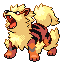

**XP**: 213 / PERCENT_FEMALE(25)

|         |         |         |         |         |         |         |         |
|---------|---------|---------|---------|---------|---------|---------|---------|
| **type1** | TYPE_FIRE | **type2** | TYPE_FIRE | **catchRate** | 75 | **safariZoneFleeRate** | 0 |
| **baseAttack** | 110 | **baseSpAttack** | 100 | **evYield_Attack** | 2 | **evYield_SpAttack** | 0 |
| **baseDefense** | 80 | **baseSpDefense** | 80 | **evYield_Defense** | 0 | **evYield_SpDefense** | 0 |
| **baseHP** | 80 | **baseSpeed** | 95 | **evYield_HP** | 0 | **evYield_SpDefense** | 0 |
| **eggGroup1** | EGG_GROUP_FIELD | **eggGroup2** | EGG_GROUP_FIELD | **eggCycles** | 20 | **friendship** | 70 |
| **item1** | ITEM_RAWST_BERRY | **item2** | ITEM_NONE | **abilities** | ABILITY_INTIMIDATE | **growthRate** | GROWTH_SLOW |

**Found at:** 

| Level | Move Name |
|---------|---------|
| 1 | Roar |
| 7 | Ember |
| 13 | Leer |
| 19 | Odor sleuth |
| 25 | Take down |
| 37 | Flame wheel |
| 43 | Helping hand |
| 47 | Agility |
| 52 | Flamethrower |
| 56 | Extreme speed |

| TM or HM |
|---------|
| Tm05 roar |
| Tm06 toxic |
| Tm10 hidden power |
| Tm11 sunny day |
| Tm15 hyper beam |
| Tm17 protect |
| Tm21 frustration |
| Tm23 iron tail |
| Tm27 return |
| Tm28 dig |
| Tm32 double team |
| Tm35 flamethrower |
| Tm38 fire blast |
| Tm40 aerial ace |
| Tm42 facade |
| Tm43 secret power |
| Tm44 rest |
| Tm45 attract |
| Tm46 thief |
| Tm50 overheat |
| Hm04 strength |
| Hm06 rock smash |

### POLIWAG

**XP**: 77 / PERCENT_FEMALE(50)

|         |         |         |         |         |         |         |         |
|---------|---------|---------|---------|---------|---------|---------|---------|
| **type1** | TYPE_WATER | **type2** | TYPE_WATER | **catchRate** | 255 | **safariZoneFleeRate** | 50 |
| **baseAttack** | 50 | **baseSpAttack** | 40 | **evYield_Attack** | 0 | **evYield_SpAttack** | 0 |
| **baseDefense** | 40 | **baseSpDefense** | 40 | **evYield_Defense** | 0 | **evYield_SpDefense** | 0 |
| **baseHP** | 40 | **baseSpeed** | 90 | **evYield_HP** | 0 | **evYield_SpDefense** | 0 |
| **eggGroup1** | EGG_GROUP_WATER_1 | **eggGroup2** | EGG_GROUP_WATER_1 | **eggCycles** | 20 | **friendship** | 70 |
| **item1** | ITEM_NONE | **item2** | ITEM_NONE | **abilities** | ABILITY_WATER_ABSORB | **growthRate** | GROWTH_MEDIUM_SLOW |

**Found at:** MAP_ROUTE6, MAP_FUCHSIA_CITY, MAP_CERULEAN_CAVE_1F, MAP_VIRIDIAN_CITY, MAP_FOUR_ISLAND_ICEFALL_CAVE_ENTRANCE, MAP_ROUTE25, MAP_ROUTE23, MAP_SAFARI_ZONE_WEST, MAP_SAFARI_ZONE_CENTER, MAP_TWO_ISLAND_CAPE_BRINK, MAP_SIX_ISLAND_RUIN_VALLEY, MAP_FOUR_ISLAND, MAP_SAFARI_ZONE_NORTH, MAP_SAFARI_ZONE_EAST, MAP_CERULEAN_CAVE_B1F, MAP_ROUTE22, MAP_THREE_ISLAND_BERRY_FOREST

| Level | Move Name |
|---------|---------|
| 1 | Bubble |
| 7 | Hypnosis |
| 13 | Water gun |
| 19 | Double slap |
| 25 | Rain dance |
| 31 | Body slam |
| 37 | Belly drum |
| 43 | Hydro pump |

| TM or HM |
|---------|
| Tm03 water pulse |
| Tm06 toxic |
| Tm07 hail |
| Tm10 hidden power |
| Tm13 ice beam |
| Tm14 blizzard |
| Tm17 protect |
| Tm18 rain dance |
| Tm21 frustration |
| Tm27 return |
| Tm28 dig |
| Tm29 psychic |
| Tm32 double team |
| Tm42 facade |
| Tm43 secret power |
| Tm44 rest |
| Tm45 attract |
| Tm46 thief |
| Hm03 surf |
| Hm07 waterfall |
| Hm08 dive |

### POLIWHIRL

**XP**: 131 / PERCENT_FEMALE(50)

|         |         |         |         |         |         |         |         |
|---------|---------|---------|---------|---------|---------|---------|---------|
| **type1** | TYPE_WATER | **type2** | TYPE_WATER | **catchRate** | 120 | **safariZoneFleeRate** | 0 |
| **baseAttack** | 65 | **baseSpAttack** | 50 | **evYield_Attack** | 0 | **evYield_SpAttack** | 0 |
| **baseDefense** | 65 | **baseSpDefense** | 50 | **evYield_Defense** | 0 | **evYield_SpDefense** | 0 |
| **baseHP** | 65 | **baseSpeed** | 90 | **evYield_HP** | 0 | **evYield_SpDefense** | 0 |
| **eggGroup1** | EGG_GROUP_WATER_1 | **eggGroup2** | EGG_GROUP_WATER_1 | **eggCycles** | 20 | **friendship** | 70 |
| **item1** | ITEM_NONE | **item2** | ITEM_NONE | **abilities** | ABILITY_WATER_ABSORB | **growthRate** | GROWTH_MEDIUM_SLOW |

**Found at:** MAP_ROUTE6, MAP_CERULEAN_CAVE_1F, MAP_VIRIDIAN_CITY, MAP_FOUR_ISLAND_ICEFALL_CAVE_ENTRANCE, MAP_ROUTE25, MAP_ROUTE23, MAP_SIX_ISLAND_RUIN_VALLEY, MAP_TWO_ISLAND_CAPE_BRINK, MAP_FOUR_ISLAND, MAP_CERULEAN_CAVE_B1F, MAP_ROUTE22

| Level | Move Name |
|---------|---------|
| 1 | Water gun |
| 7 | Hypnosis |
| 13 | Water gun |
| 19 | Double slap |
| 27 | Rain dance |
| 35 | Body slam |
| 43 | Belly drum |
| 51 | Hydro pump |

| TM or HM |
|---------|
| Tm01 focus punch |
| Tm03 water pulse |
| Tm06 toxic |
| Tm07 hail |
| Tm10 hidden power |
| Tm13 ice beam |
| Tm14 blizzard |
| Tm17 protect |
| Tm18 rain dance |
| Tm21 frustration |
| Tm26 earthquake |
| Tm27 return |
| Tm28 dig |
| Tm29 psychic |
| Tm31 brick break |
| Tm32 double team |
| Tm42 facade |
| Tm43 secret power |
| Tm44 rest |
| Tm45 attract |
| Tm46 thief |
| Hm03 surf |
| Hm04 strength |
| Hm06 rock smash |
| Hm07 waterfall |
| Hm08 dive |

### POLIWRATH

**XP**: 185 / PERCENT_FEMALE(50)

|         |         |         |         |         |         |         |         |
|---------|---------|---------|---------|---------|---------|---------|---------|
| **type1** | TYPE_WATER | **type2** | TYPE_FIGHTING | **catchRate** | 45 | **safariZoneFleeRate** | 0 |
| **baseAttack** | 85 | **baseSpAttack** | 70 | **evYield_Attack** | 0 | **evYield_SpAttack** | 0 |
| **baseDefense** | 95 | **baseSpDefense** | 90 | **evYield_Defense** | 3 | **evYield_SpDefense** | 0 |
| **baseHP** | 90 | **baseSpeed** | 70 | **evYield_HP** | 0 | **evYield_SpDefense** | 0 |
| **eggGroup1** | EGG_GROUP_WATER_1 | **eggGroup2** | EGG_GROUP_WATER_1 | **eggCycles** | 20 | **friendship** | 70 |
| **item1** | ITEM_NONE | **item2** | ITEM_NONE | **abilities** | ABILITY_WATER_ABSORB | **growthRate** | GROWTH_MEDIUM_SLOW |

**Found at:** 

| Level | Move Name |
|---------|---------|
| 1 | Water gun |
| 7 | Hypnosis |
| 13 | Water gun |
| 35 | Submission |
| 51 | Mind reader |

| TM or HM |
|---------|
| Tm01 focus punch |
| Tm03 water pulse |
| Tm06 toxic |
| Tm07 hail |
| Tm08 bulk up |
| Tm10 hidden power |
| Tm13 ice beam |
| Tm14 blizzard |
| Tm15 hyper beam |
| Tm17 protect |
| Tm18 rain dance |
| Tm21 frustration |
| Tm26 earthquake |
| Tm27 return |
| Tm28 dig |
| Tm29 psychic |
| Tm31 brick break |
| Tm32 double team |
| Tm39 rock tomb |
| Tm42 facade |
| Tm43 secret power |
| Tm44 rest |
| Tm45 attract |
| Tm46 thief |
| Hm03 surf |
| Hm04 strength |
| Hm06 rock smash |
| Hm07 waterfall |
| Hm08 dive |

### ABRA

**XP**: 73 / PERCENT_FEMALE(25)

|         |         |         |         |         |         |         |         |
|---------|---------|---------|---------|---------|---------|---------|---------|
| **type1** | TYPE_PSYCHIC | **type2** | TYPE_PSYCHIC | **catchRate** | 200 | **safariZoneFleeRate** | 0 |
| **baseAttack** | 20 | **baseSpAttack** | 105 | **evYield_Attack** | 0 | **evYield_SpAttack** | 1 |
| **baseDefense** | 15 | **baseSpDefense** | 55 | **evYield_Defense** | 0 | **evYield_SpDefense** | 0 |
| **baseHP** | 25 | **baseSpeed** | 90 | **evYield_HP** | 0 | **evYield_SpDefense** | 0 |
| **eggGroup1** | EGG_GROUP_HUMAN_LIKE | **eggGroup2** | EGG_GROUP_HUMAN_LIKE | **eggCycles** | 20 | **friendship** | 70 |
| **item1** | ITEM_NONE | **item2** | ITEM_TWISTED_SPOON | **abilities** | ABILITY_SYNCHRONIZE | **growthRate** | GROWTH_MEDIUM_SLOW |

**Found at:** MAP_ROUTE24, MAP_ROUTE25

| Level | Move Name |
|---------|---------|
| 1 | Teleport |

| TM or HM |
|---------|
| Tm01 focus punch |
| Tm04 calm mind |
| Tm06 toxic |
| Tm10 hidden power |
| Tm11 sunny day |
| Tm12 taunt |
| Tm16 light screen |
| Tm17 protect |
| Tm18 rain dance |
| Tm20 safeguard |
| Tm21 frustration |
| Tm23 iron tail |
| Tm27 return |
| Tm29 psychic |
| Tm30 shadow ball |
| Tm32 double team |
| Tm33 reflect |
| Tm34 shock wave |
| Tm41 torment |
| Tm42 facade |
| Tm43 secret power |
| Tm44 rest |
| Tm45 attract |
| Tm46 thief |
| Tm48 skill swap |
| Tm49 snatch |
| Hm05 flash |

### KADABRA

**XP**: 145 / PERCENT_FEMALE(25)

|         |         |         |         |         |         |         |         |
|---------|---------|---------|---------|---------|---------|---------|---------|
| **type1** | TYPE_PSYCHIC | **type2** | TYPE_PSYCHIC | **catchRate** | 100 | **safariZoneFleeRate** | 0 |
| **baseAttack** | 35 | **baseSpAttack** | 120 | **evYield_Attack** | 0 | **evYield_SpAttack** | 2 |
| **baseDefense** | 30 | **baseSpDefense** | 70 | **evYield_Defense** | 0 | **evYield_SpDefense** | 0 |
| **baseHP** | 40 | **baseSpeed** | 105 | **evYield_HP** | 0 | **evYield_SpDefense** | 0 |
| **eggGroup1** | EGG_GROUP_HUMAN_LIKE | **eggGroup2** | EGG_GROUP_HUMAN_LIKE | **eggCycles** | 20 | **friendship** | 70 |
| **item1** | ITEM_NONE | **item2** | ITEM_TWISTED_SPOON | **abilities** | ABILITY_SYNCHRONIZE | **growthRate** | GROWTH_MEDIUM_SLOW |

**Found at:** MAP_CERULEAN_CAVE_B1F, MAP_CERULEAN_CAVE_2F

| Level | Move Name |
|---------|---------|
| 1 | Confusion |
| 16 | Confusion |
| 18 | Disable |
| 21 | Psybeam |
| 23 | Reflect |
| 25 | Recover |
| 30 | Future sight |
| 33 | Role play |
| 36 | Psychic |
| 43 | Trick |

| TM or HM |
|---------|
| Tm01 focus punch |
| Tm04 calm mind |
| Tm06 toxic |
| Tm10 hidden power |
| Tm11 sunny day |
| Tm12 taunt |
| Tm16 light screen |
| Tm17 protect |
| Tm18 rain dance |
| Tm20 safeguard |
| Tm21 frustration |
| Tm23 iron tail |
| Tm27 return |
| Tm29 psychic |
| Tm30 shadow ball |
| Tm32 double team |
| Tm33 reflect |
| Tm34 shock wave |
| Tm41 torment |
| Tm42 facade |
| Tm43 secret power |
| Tm44 rest |
| Tm45 attract |
| Tm46 thief |
| Tm48 skill swap |
| Tm49 snatch |
| Hm05 flash |

### ALAKAZAM

**XP**: 186 / PERCENT_FEMALE(25)

|         |         |         |         |         |         |         |         |
|---------|---------|---------|---------|---------|---------|---------|---------|
| **type1** | TYPE_PSYCHIC | **type2** | TYPE_PSYCHIC | **catchRate** | 50 | **safariZoneFleeRate** | 0 |
| **baseAttack** | 50 | **baseSpAttack** | 135 | **evYield_Attack** | 0 | **evYield_SpAttack** | 3 |
| **baseDefense** | 45 | **baseSpDefense** | 85 | **evYield_Defense** | 0 | **evYield_SpDefense** | 0 |
| **baseHP** | 55 | **baseSpeed** | 120 | **evYield_HP** | 0 | **evYield_SpDefense** | 0 |
| **eggGroup1** | EGG_GROUP_HUMAN_LIKE | **eggGroup2** | EGG_GROUP_HUMAN_LIKE | **eggCycles** | 20 | **friendship** | 70 |
| **item1** | ITEM_NONE | **item2** | ITEM_TWISTED_SPOON | **abilities** | ABILITY_SYNCHRONIZE | **growthRate** | GROWTH_MEDIUM_SLOW |

**Found at:** 

| Level | Move Name |
|---------|---------|
| 1 | Confusion |
| 16 | Confusion |
| 18 | Disable |
| 21 | Psybeam |
| 23 | Reflect |
| 25 | Recover |
| 30 | Future sight |
| 33 | Calm mind |
| 36 | Psychic |
| 43 | Trick |

| TM or HM |
|---------|
| Tm01 focus punch |
| Tm04 calm mind |
| Tm06 toxic |
| Tm10 hidden power |
| Tm11 sunny day |
| Tm12 taunt |
| Tm15 hyper beam |
| Tm16 light screen |
| Tm17 protect |
| Tm18 rain dance |
| Tm20 safeguard |
| Tm21 frustration |
| Tm23 iron tail |
| Tm27 return |
| Tm29 psychic |
| Tm30 shadow ball |
| Tm32 double team |
| Tm33 reflect |
| Tm34 shock wave |
| Tm41 torment |
| Tm42 facade |
| Tm43 secret power |
| Tm44 rest |
| Tm45 attract |
| Tm46 thief |
| Tm48 skill swap |
| Tm49 snatch |
| Hm05 flash |

### MACHOP

**XP**: 88 / PERCENT_FEMALE(25)

|         |         |         |         |         |         |         |         |
|---------|---------|---------|---------|---------|---------|---------|---------|
| **type1** | TYPE_FIGHTING | **type2** | TYPE_FIGHTING | **catchRate** | 180 | **safariZoneFleeRate** | 0 |
| **baseAttack** | 80 | **baseSpAttack** | 35 | **evYield_Attack** | 1 | **evYield_SpAttack** | 0 |
| **baseDefense** | 50 | **baseSpDefense** | 35 | **evYield_Defense** | 0 | **evYield_SpDefense** | 0 |
| **baseHP** | 70 | **baseSpeed** | 35 | **evYield_HP** | 0 | **evYield_SpDefense** | 0 |
| **eggGroup1** | EGG_GROUP_HUMAN_LIKE | **eggGroup2** | EGG_GROUP_HUMAN_LIKE | **eggCycles** | 20 | **friendship** | 70 |
| **item1** | ITEM_NONE | **item2** | ITEM_NONE | **abilities** | ABILITY_GUTS | **growthRate** | GROWTH_MEDIUM_SLOW |

**Found at:** MAP_MT_EMBER_SUMMIT_PATH_3F, MAP_ROCK_TUNNEL_B1F, MAP_MT_EMBER_RUBY_PATH_1F, MAP_VICTORY_ROAD_3F, MAP_MT_EMBER_EXTERIOR, MAP_VICTORY_ROAD_2F, MAP_VICTORY_ROAD_1F, MAP_ROCK_TUNNEL_1F, MAP_MT_EMBER_SUMMIT_PATH_1F, MAP_MT_EMBER_SUMMIT_PATH_2F

| Level | Move Name |
|---------|---------|
| 1 | Leer |
| 7 | Focus energy |
| 13 | Karate chop |
| 19 | Seismic toss |
| 22 | Foresight |
| 25 | Revenge |
| 31 | Vital throw |
| 37 | Submission |
| 40 | Cross chop |
| 43 | Scary face |
| 49 | Dynamic punch |

| TM or HM |
|---------|
| Tm01 focus punch |
| Tm06 toxic |
| Tm08 bulk up |
| Tm10 hidden power |
| Tm11 sunny day |
| Tm17 protect |
| Tm18 rain dance |
| Tm21 frustration |
| Tm26 earthquake |
| Tm27 return |
| Tm28 dig |
| Tm31 brick break |
| Tm32 double team |
| Tm35 flamethrower |
| Tm38 fire blast |
| Tm39 rock tomb |
| Tm42 facade |
| Tm43 secret power |
| Tm44 rest |
| Tm45 attract |
| Tm46 thief |
| Hm04 strength |
| Hm06 rock smash |

### MACHOKE

**XP**: 146 / PERCENT_FEMALE(25)

|         |         |         |         |         |         |         |         |
|---------|---------|---------|---------|---------|---------|---------|---------|
| **type1** | TYPE_FIGHTING | **type2** | TYPE_FIGHTING | **catchRate** | 90 | **safariZoneFleeRate** | 0 |
| **baseAttack** | 100 | **baseSpAttack** | 50 | **evYield_Attack** | 2 | **evYield_SpAttack** | 0 |
| **baseDefense** | 70 | **baseSpDefense** | 60 | **evYield_Defense** | 0 | **evYield_SpDefense** | 0 |
| **baseHP** | 80 | **baseSpeed** | 45 | **evYield_HP** | 0 | **evYield_SpDefense** | 0 |
| **eggGroup1** | EGG_GROUP_HUMAN_LIKE | **eggGroup2** | EGG_GROUP_HUMAN_LIKE | **eggCycles** | 20 | **friendship** | 70 |
| **item1** | ITEM_NONE | **item2** | ITEM_FOCUS_BAND | **abilities** | ABILITY_GUTS | **growthRate** | GROWTH_MEDIUM_SLOW |

**Found at:** MAP_CERULEAN_CAVE_1F, MAP_MT_EMBER_RUBY_PATH_1F, MAP_VICTORY_ROAD_3F, MAP_VICTORY_ROAD_2F, MAP_VICTORY_ROAD_1F, MAP_CERULEAN_CAVE_B1F, MAP_CERULEAN_CAVE_2F, MAP_MT_EMBER_SUMMIT_PATH_2F

| Level | Move Name |
|---------|---------|
| 1 | Focus energy |
| 7 | Focus energy |
| 13 | Karate chop |
| 19 | Seismic toss |
| 22 | Foresight |
| 25 | Revenge |
| 33 | Vital throw |
| 41 | Submission |
| 46 | Cross chop |
| 51 | Scary face |
| 59 | Dynamic punch |

| TM or HM |
|---------|
| Tm01 focus punch |
| Tm06 toxic |
| Tm08 bulk up |
| Tm10 hidden power |
| Tm11 sunny day |
| Tm17 protect |
| Tm18 rain dance |
| Tm21 frustration |
| Tm26 earthquake |
| Tm27 return |
| Tm28 dig |
| Tm31 brick break |
| Tm32 double team |
| Tm35 flamethrower |
| Tm38 fire blast |
| Tm39 rock tomb |
| Tm42 facade |
| Tm43 secret power |
| Tm44 rest |
| Tm45 attract |
| Tm46 thief |
| Hm04 strength |
| Hm06 rock smash |

### MACHAMP

**XP**: 193 / PERCENT_FEMALE(25)

|         |         |         |         |         |         |         |         |
|---------|---------|---------|---------|---------|---------|---------|---------|
| **type1** | TYPE_FIGHTING | **type2** | TYPE_FIGHTING | **catchRate** | 45 | **safariZoneFleeRate** | 0 |
| **baseAttack** | 130 | **baseSpAttack** | 65 | **evYield_Attack** | 3 | **evYield_SpAttack** | 0 |
| **baseDefense** | 80 | **baseSpDefense** | 85 | **evYield_Defense** | 0 | **evYield_SpDefense** | 0 |
| **baseHP** | 90 | **baseSpeed** | 55 | **evYield_HP** | 0 | **evYield_SpDefense** | 0 |
| **eggGroup1** | EGG_GROUP_HUMAN_LIKE | **eggGroup2** | EGG_GROUP_HUMAN_LIKE | **eggCycles** | 20 | **friendship** | 70 |
| **item1** | ITEM_NONE | **item2** | ITEM_FOCUS_BAND | **abilities** | ABILITY_GUTS | **growthRate** | GROWTH_MEDIUM_SLOW |

**Found at:** 

| Level | Move Name |
|---------|---------|
| 1 | Focus energy |
| 7 | Focus energy |
| 13 | Karate chop |
| 19 | Seismic toss |
| 22 | Foresight |
| 25 | Revenge |
| 33 | Vital throw |
| 41 | Submission |
| 46 | Cross chop |
| 51 | Scary face |
| 59 | Dynamic punch |

| TM or HM |
|---------|
| Tm01 focus punch |
| Tm06 toxic |
| Tm08 bulk up |
| Tm10 hidden power |
| Tm11 sunny day |
| Tm15 hyper beam |
| Tm17 protect |
| Tm18 rain dance |
| Tm21 frustration |
| Tm26 earthquake |
| Tm27 return |
| Tm28 dig |
| Tm31 brick break |
| Tm32 double team |
| Tm35 flamethrower |
| Tm38 fire blast |
| Tm39 rock tomb |
| Tm42 facade |
| Tm43 secret power |
| Tm44 rest |
| Tm45 attract |
| Tm46 thief |
| Hm04 strength |
| Hm06 rock smash |

### BELLSPROUT

**XP**: 84 / PERCENT_FEMALE(50)

|         |         |         |         |         |         |         |         |
|---------|---------|---------|---------|---------|---------|---------|---------|
| **type1** | TYPE_GRASS | **type2** | TYPE_POISON | **catchRate** | 255 | **safariZoneFleeRate** | 0 |
| **baseAttack** | 75 | **baseSpAttack** | 70 | **evYield_Attack** | 1 | **evYield_SpAttack** | 0 |
| **baseDefense** | 35 | **baseSpDefense** | 30 | **evYield_Defense** | 0 | **evYield_SpDefense** | 0 |
| **baseHP** | 50 | **baseSpeed** | 40 | **evYield_HP** | 0 | **evYield_SpDefense** | 0 |
| **eggGroup1** | EGG_GROUP_GRASS | **eggGroup2** | EGG_GROUP_GRASS | **eggCycles** | 20 | **friendship** | 70 |
| **item1** | ITEM_NONE | **item2** | ITEM_NONE | **abilities** | ABILITY_CHLOROPHYLL | **growthRate** | GROWTH_MEDIUM_SLOW |

**Found at:** MAP_ROUTE6, MAP_ROUTE25, MAP_ROUTE5, MAP_ROUTE12, MAP_ROUTE13

| Level | Move Name |
|---------|---------|
| 1 | Vine whip |
| 6 | Growth |
| 11 | Wrap |
| 15 | Sleep powder |
| 17 | Poison powder |
| 19 | Stun spore |
| 23 | Acid |
| 30 | Sweet scent |
| 37 | Razor leaf |
| 45 | Slam |

| TM or HM |
|---------|
| Tm06 toxic |
| Tm09 bullet seed |
| Tm10 hidden power |
| Tm11 sunny day |
| Tm17 protect |
| Tm19 giga drain |
| Tm21 frustration |
| Tm22 solar beam |
| Tm27 return |
| Tm32 double team |
| Tm36 sludge bomb |
| Tm42 facade |
| Tm43 secret power |
| Tm44 rest |
| Tm45 attract |
| Tm46 thief |
| Hm01 cut |
| Hm05 flash |

### WEEPINBELL

**XP**: 151 / PERCENT_FEMALE(50)

|         |         |         |         |         |         |         |         |
|---------|---------|---------|---------|---------|---------|---------|---------|
| **type1** | TYPE_GRASS | **type2** | TYPE_POISON | **catchRate** | 120 | **safariZoneFleeRate** | 0 |
| **baseAttack** | 90 | **baseSpAttack** | 85 | **evYield_Attack** | 2 | **evYield_SpAttack** | 0 |
| **baseDefense** | 50 | **baseSpDefense** | 45 | **evYield_Defense** | 0 | **evYield_SpDefense** | 0 |
| **baseHP** | 65 | **baseSpeed** | 55 | **evYield_HP** | 0 | **evYield_SpDefense** | 0 |
| **eggGroup1** | EGG_GROUP_GRASS | **eggGroup2** | EGG_GROUP_GRASS | **eggCycles** | 20 | **friendship** | 70 |
| **item1** | ITEM_NONE | **item2** | ITEM_NONE | **abilities** | ABILITY_CHLOROPHYLL | **growthRate** | GROWTH_MEDIUM_SLOW |

**Found at:** MAP_ROUTE6, MAP_ROUTE12, MAP_ROUTE13

| Level | Move Name |
|---------|---------|
| 1 | Wrap |
| 6 | Growth |
| 11 | Wrap |
| 15 | Sleep powder |
| 17 | Poison powder |
| 19 | Stun spore |
| 24 | Acid |
| 33 | Sweet scent |
| 42 | Razor leaf |
| 54 | Slam |

| TM or HM |
|---------|
| Tm06 toxic |
| Tm09 bullet seed |
| Tm10 hidden power |
| Tm11 sunny day |
| Tm17 protect |
| Tm19 giga drain |
| Tm21 frustration |
| Tm22 solar beam |
| Tm27 return |
| Tm32 double team |
| Tm36 sludge bomb |
| Tm42 facade |
| Tm43 secret power |
| Tm44 rest |
| Tm45 attract |
| Tm46 thief |
| Hm01 cut |
| Hm05 flash |

### VICTREEBEL

**XP**: 191 / PERCENT_FEMALE(50)

|         |         |         |         |         |         |         |         |
|---------|---------|---------|---------|---------|---------|---------|---------|
| **type1** | TYPE_GRASS | **type2** | TYPE_POISON | **catchRate** | 45 | **safariZoneFleeRate** | 0 |
| **baseAttack** | 105 | **baseSpAttack** | 100 | **evYield_Attack** | 3 | **evYield_SpAttack** | 0 |
| **baseDefense** | 65 | **baseSpDefense** | 60 | **evYield_Defense** | 0 | **evYield_SpDefense** | 0 |
| **baseHP** | 80 | **baseSpeed** | 70 | **evYield_HP** | 0 | **evYield_SpDefense** | 0 |
| **eggGroup1** | EGG_GROUP_GRASS | **eggGroup2** | EGG_GROUP_GRASS | **eggCycles** | 20 | **friendship** | 70 |
| **item1** | ITEM_NONE | **item2** | ITEM_NONE | **abilities** | ABILITY_CHLOROPHYLL | **growthRate** | GROWTH_MEDIUM_SLOW |

**Found at:** 

| Level | Move Name |
|---------|---------|
| 1 | Wrap |
| 6 | Growth |
| 11 | Wrap |
| 15 | Sleep powder |
| 17 | Poison powder |
| 19 | Stun spore |
| 42 | Razor leaf |
| 46 | Stockpile |
| 50 | Swallow |

| TM or HM |
|---------|
| Tm06 toxic |
| Tm09 bullet seed |
| Tm10 hidden power |
| Tm11 sunny day |
| Tm15 hyper beam |
| Tm17 protect |
| Tm19 giga drain |
| Tm21 frustration |
| Tm22 solar beam |
| Tm27 return |
| Tm32 double team |
| Tm36 sludge bomb |
| Tm42 facade |
| Tm43 secret power |
| Tm44 rest |
| Tm45 attract |
| Tm46 thief |
| Hm01 cut |
| Hm05 flash |

### TENTACOOL

**XP**: 105 / PERCENT_FEMALE(50)

|         |         |         |         |         |         |         |         |
|---------|---------|---------|---------|---------|---------|---------|---------|
| **type1** | TYPE_WATER | **type2** | TYPE_POISON | **catchRate** | 190 | **safariZoneFleeRate** | 0 |
| **baseAttack** | 40 | **baseSpAttack** | 50 | **evYield_Attack** | 0 | **evYield_SpAttack** | 0 |
| **baseDefense** | 35 | **baseSpDefense** | 100 | **evYield_Defense** | 0 | **evYield_SpDefense** | 1 |
| **baseHP** | 40 | **baseSpeed** | 70 | **evYield_HP** | 0 | **evYield_SpDefense** | 1 |
| **eggGroup1** | EGG_GROUP_WATER_3 | **eggGroup2** | EGG_GROUP_WATER_3 | **eggCycles** | 20 | **friendship** | 70 |
| **item1** | ITEM_NONE | **item2** | ITEM_NONE | **abilities** | ABILITY_CLEAR_BODY | **growthRate** | GROWTH_SLOW |

**Found at:** MAP_ROUTE20, MAP_ONE_ISLAND_KINDLE_ROAD, MAP_FIVE_ISLAND, MAP_SSANNE_EXTERIOR, MAP_FIVE_ISLAND_MEADOW, MAP_ROUTE21_NORTH, MAP_ROUTE18, MAP_CINNABAR_ISLAND, MAP_SEVEN_ISLAND_TRAINER_TOWER, MAP_ONE_ISLAND_TREASURE_BEACH, MAP_FIVE_ISLAND_WATER_LABYRINTH, MAP_FIVE_ISLAND_RESORT_GORGEOUS, MAP_CERULEAN_CITY, MAP_VERMILION_CITY, MAP_PALLET_TOWN, MAP_FOUR_ISLAND_ICEFALL_CAVE_BACK, MAP_ROUTE4, MAP_THREE_ISLAND_BOND_BRIDGE, MAP_SIX_ISLAND_OUTCAST_ISLAND, MAP_ONE_ISLAND, MAP_SIX_ISLAND_WATER_PATH, MAP_SIX_ISLAND_GREEN_PATH, MAP_ROUTE10, MAP_ROUTE21_SOUTH, MAP_FIVE_ISLAND_MEMORIAL_PILLAR, MAP_ROUTE11, MAP_ROUTE24, MAP_ROUTE12, MAP_ROUTE19, MAP_ROUTE13

| Level | Move Name |
|---------|---------|
| 1 | Poison sting |
| 6 | Supersonic |
| 12 | Constrict |
| 19 | Acid |
| 25 | Bubble beam |
| 30 | Wrap |
| 36 | Barrier |
| 43 | Screech |
| 49 | Hydro pump |

| TM or HM |
|---------|
| Tm03 water pulse |
| Tm06 toxic |
| Tm07 hail |
| Tm10 hidden power |
| Tm13 ice beam |
| Tm14 blizzard |
| Tm17 protect |
| Tm18 rain dance |
| Tm19 giga drain |
| Tm21 frustration |
| Tm27 return |
| Tm32 double team |
| Tm36 sludge bomb |
| Tm42 facade |
| Tm43 secret power |
| Tm44 rest |
| Tm45 attract |
| Tm46 thief |
| Hm01 cut |
| Hm03 surf |
| Hm07 waterfall |
| Hm08 dive |

### TENTACRUEL

**XP**: 205 / PERCENT_FEMALE(50)

|         |         |         |         |         |         |         |         |
|---------|---------|---------|---------|---------|---------|---------|---------|
| **type1** | TYPE_WATER | **type2** | TYPE_POISON | **catchRate** | 60 | **safariZoneFleeRate** | 0 |
| **baseAttack** | 70 | **baseSpAttack** | 80 | **evYield_Attack** | 0 | **evYield_SpAttack** | 0 |
| **baseDefense** | 65 | **baseSpDefense** | 120 | **evYield_Defense** | 0 | **evYield_SpDefense** | 2 |
| **baseHP** | 80 | **baseSpeed** | 100 | **evYield_HP** | 0 | **evYield_SpDefense** | 2 |
| **eggGroup1** | EGG_GROUP_WATER_3 | **eggGroup2** | EGG_GROUP_WATER_3 | **eggCycles** | 20 | **friendship** | 70 |
| **item1** | ITEM_NONE | **item2** | ITEM_NONE | **abilities** | ABILITY_CLEAR_BODY | **growthRate** | GROWTH_SLOW |

**Found at:** MAP_SEVEN_ISLAND_TRAINER_TOWER, MAP_ONE_ISLAND_TREASURE_BEACH, MAP_FOUR_ISLAND_ICEFALL_CAVE_BACK, MAP_ONE_ISLAND, MAP_SIX_ISLAND_WATER_PATH, MAP_ONE_ISLAND_KINDLE_ROAD, MAP_SIX_ISLAND_GREEN_PATH, MAP_ROUTE10, MAP_FIVE_ISLAND_MEMORIAL_PILLAR, MAP_THREE_ISLAND_BOND_BRIDGE, MAP_FIVE_ISLAND_MEADOW, MAP_FIVE_ISLAND_WATER_LABYRINTH, MAP_FIVE_ISLAND_RESORT_GORGEOUS, MAP_SIX_ISLAND_OUTCAST_ISLAND, MAP_FIVE_ISLAND, MAP_SEVEN_ISLAND_TANOBY_RUINS

| Level | Move Name |
|---------|---------|
| 1 | Constrict |
| 6 | Supersonic |
| 12 | Constrict |
| 19 | Acid |
| 25 | Bubble beam |
| 30 | Wrap |
| 38 | Barrier |
| 47 | Screech |
| 55 | Hydro pump |

| TM or HM |
|---------|
| Tm03 water pulse |
| Tm06 toxic |
| Tm07 hail |
| Tm10 hidden power |
| Tm13 ice beam |
| Tm14 blizzard |
| Tm15 hyper beam |
| Tm17 protect |
| Tm18 rain dance |
| Tm19 giga drain |
| Tm21 frustration |
| Tm27 return |
| Tm32 double team |
| Tm36 sludge bomb |
| Tm42 facade |
| Tm43 secret power |
| Tm44 rest |
| Tm45 attract |
| Tm46 thief |
| Hm01 cut |
| Hm03 surf |
| Hm07 waterfall |
| Hm08 dive |

### GEODUDE

**XP**: 86 / PERCENT_FEMALE(50)

|         |         |         |         |         |         |         |         |
|---------|---------|---------|---------|---------|---------|---------|---------|
| **type1** | TYPE_ROCK | **type2** | TYPE_GROUND | **catchRate** | 255 | **safariZoneFleeRate** | 0 |
| **baseAttack** | 80 | **baseSpAttack** | 30 | **evYield_Attack** | 0 | **evYield_SpAttack** | 0 |
| **baseDefense** | 100 | **baseSpDefense** | 30 | **evYield_Defense** | 1 | **evYield_SpDefense** | 0 |
| **baseHP** | 40 | **baseSpeed** | 20 | **evYield_HP** | 0 | **evYield_SpDefense** | 0 |
| **eggGroup1** | EGG_GROUP_MINERAL | **eggGroup2** | EGG_GROUP_MINERAL | **eggCycles** | 15 | **friendship** | 70 |
| **item1** | ITEM_NONE | **item2** | ITEM_NONE | **abilities** | ABILITY_ROCK_HEAD | **growthRate** | GROWTH_MEDIUM_SLOW |

**Found at:** MAP_MT_EMBER_RUBY_PATH_B2F_STAIRS, MAP_CERULEAN_CAVE_1F, MAP_ONE_ISLAND_KINDLE_ROAD, MAP_VICTORY_ROAD_2F, MAP_VICTORY_ROAD_1F, MAP_CERULEAN_CAVE_B1F, MAP_MT_EMBER_RUBY_PATH_B1F, MAP_SEVEN_ISLAND_SEVAULT_CANYON, MAP_MT_EMBER_RUBY_PATH_B1F_STAIRS, MAP_ROCK_TUNNEL_1F, MAP_MT_EMBER_SUMMIT_PATH_3F, MAP_ROCK_TUNNEL_B1F, MAP_MT_EMBER_RUBY_PATH_B2F, MAP_MT_EMBER_RUBY_PATH_1F, MAP_MT_MOON_1F, MAP_VICTORY_ROAD_3F, MAP_MT_EMBER_SUMMIT_PATH_2F, MAP_MT_MOON_B2F, MAP_MT_EMBER_EXTERIOR, MAP_MT_EMBER_SUMMIT_PATH_1F, MAP_CERULEAN_CAVE_2F

| Level | Move Name |
|---------|---------|
| 1 | Defense curl |
| 6 | Mud sport |
| 11 | Rock throw |
| 16 | Magnitude |
| 21 | Self destruct |
| 26 | Rollout |
| 31 | Rock blast |
| 36 | Earthquake |
| 41 | Explosion |
| 46 | Double edge |

| TM or HM |
|---------|
| Tm01 focus punch |
| Tm06 toxic |
| Tm10 hidden power |
| Tm11 sunny day |
| Tm17 protect |
| Tm21 frustration |
| Tm26 earthquake |
| Tm27 return |
| Tm28 dig |
| Tm31 brick break |
| Tm32 double team |
| Tm35 flamethrower |
| Tm37 sandstorm |
| Tm38 fire blast |
| Tm39 rock tomb |
| Tm42 facade |
| Tm43 secret power |
| Tm44 rest |
| Tm45 attract |
| Hm04 strength |
| Hm06 rock smash |

### GRAVELER

**XP**: 134 / PERCENT_FEMALE(50)

|         |         |         |         |         |         |         |         |
|---------|---------|---------|---------|---------|---------|---------|---------|
| **type1** | TYPE_ROCK | **type2** | TYPE_GROUND | **catchRate** | 120 | **safariZoneFleeRate** | 0 |
| **baseAttack** | 95 | **baseSpAttack** | 45 | **evYield_Attack** | 0 | **evYield_SpAttack** | 0 |
| **baseDefense** | 115 | **baseSpDefense** | 45 | **evYield_Defense** | 2 | **evYield_SpDefense** | 0 |
| **baseHP** | 55 | **baseSpeed** | 35 | **evYield_HP** | 0 | **evYield_SpDefense** | 0 |
| **eggGroup1** | EGG_GROUP_MINERAL | **eggGroup2** | EGG_GROUP_MINERAL | **eggCycles** | 15 | **friendship** | 70 |
| **item1** | ITEM_NONE | **item2** | ITEM_HARD_STONE | **abilities** | ABILITY_ROCK_HEAD | **growthRate** | GROWTH_MEDIUM_SLOW |

**Found at:** MAP_MT_EMBER_RUBY_PATH_B2F_STAIRS, MAP_MT_EMBER_RUBY_PATH_B2F, MAP_ROCK_TUNNEL_B1F, MAP_MT_EMBER_RUBY_PATH_B1F_STAIRS, MAP_CERULEAN_CAVE_1F, MAP_MT_EMBER_RUBY_PATH_1F, MAP_ONE_ISLAND_KINDLE_ROAD, MAP_MT_EMBER_EXTERIOR, MAP_CERULEAN_CAVE_B1F, MAP_CERULEAN_CAVE_2F, MAP_MT_EMBER_RUBY_PATH_B1F, MAP_SEVEN_ISLAND_SEVAULT_CANYON, MAP_MT_EMBER_SUMMIT_PATH_2F

| Level | Move Name |
|---------|---------|
| 1 | Rock throw |
| 6 | Mud sport |
| 11 | Rock throw |
| 16 | Magnitude |
| 21 | Self destruct |
| 29 | Rollout |
| 37 | Rock blast |
| 45 | Earthquake |
| 53 | Explosion |
| 62 | Double edge |

| TM or HM |
|---------|
| Tm01 focus punch |
| Tm06 toxic |
| Tm10 hidden power |
| Tm11 sunny day |
| Tm17 protect |
| Tm21 frustration |
| Tm26 earthquake |
| Tm27 return |
| Tm28 dig |
| Tm31 brick break |
| Tm32 double team |
| Tm35 flamethrower |
| Tm37 sandstorm |
| Tm38 fire blast |
| Tm39 rock tomb |
| Tm42 facade |
| Tm43 secret power |
| Tm44 rest |
| Tm45 attract |
| Hm04 strength |
| Hm06 rock smash |

### GOLEM

**XP**: 177 / PERCENT_FEMALE(50)

|         |         |         |         |         |         |         |         |
|---------|---------|---------|---------|---------|---------|---------|---------|
| **type1** | TYPE_ROCK | **type2** | TYPE_GROUND | **catchRate** | 45 | **safariZoneFleeRate** | 0 |
| **baseAttack** | 110 | **baseSpAttack** | 55 | **evYield_Attack** | 0 | **evYield_SpAttack** | 0 |
| **baseDefense** | 130 | **baseSpDefense** | 65 | **evYield_Defense** | 3 | **evYield_SpDefense** | 0 |
| **baseHP** | 80 | **baseSpeed** | 45 | **evYield_HP** | 0 | **evYield_SpDefense** | 0 |
| **eggGroup1** | EGG_GROUP_MINERAL | **eggGroup2** | EGG_GROUP_MINERAL | **eggCycles** | 15 | **friendship** | 70 |
| **item1** | ITEM_NONE | **item2** | ITEM_HARD_STONE | **abilities** | ABILITY_ROCK_HEAD | **growthRate** | GROWTH_MEDIUM_SLOW |

**Found at:** 

| Level | Move Name |
|---------|---------|
| 1 | Rock throw |
| 6 | Mud sport |
| 11 | Rock throw |
| 16 | Magnitude |
| 21 | Self destruct |
| 29 | Rollout |
| 37 | Rock blast |
| 45 | Earthquake |
| 53 | Explosion |
| 62 | Double edge |

| TM or HM |
|---------|
| Tm01 focus punch |
| Tm05 roar |
| Tm06 toxic |
| Tm10 hidden power |
| Tm11 sunny day |
| Tm15 hyper beam |
| Tm17 protect |
| Tm21 frustration |
| Tm26 earthquake |
| Tm27 return |
| Tm28 dig |
| Tm31 brick break |
| Tm32 double team |
| Tm35 flamethrower |
| Tm37 sandstorm |
| Tm38 fire blast |
| Tm39 rock tomb |
| Tm42 facade |
| Tm43 secret power |
| Tm44 rest |
| Tm45 attract |
| Hm04 strength |
| Hm06 rock smash |

### PONYTA

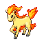

**XP**: 152 / PERCENT_FEMALE(50)

|         |         |         |         |         |         |         |         |
|---------|---------|---------|---------|---------|---------|---------|---------|
| **type1** | TYPE_FIRE | **type2** | TYPE_FIRE | **catchRate** | 190 | **safariZoneFleeRate** | 0 |
| **baseAttack** | 85 | **baseSpAttack** | 65 | **evYield_Attack** | 0 | **evYield_SpAttack** | 0 |
| **baseDefense** | 55 | **baseSpDefense** | 65 | **evYield_Defense** | 0 | **evYield_SpDefense** | 0 |
| **baseHP** | 50 | **baseSpeed** | 90 | **evYield_HP** | 0 | **evYield_SpDefense** | 0 |
| **eggGroup1** | EGG_GROUP_FIELD | **eggGroup2** | EGG_GROUP_FIELD | **eggCycles** | 20 | **friendship** | 70 |
| **item1** | ITEM_NONE | **item2** | ITEM_NONE | **abilities** | ABILITY_RUN_AWAY | **growthRate** | GROWTH_MEDIUM_FAST |

**Found at:** MAP_ONE_ISLAND_KINDLE_ROAD, MAP_MT_EMBER_EXTERIOR

| Level | Move Name |
|---------|---------|
| 1 | Tackle |
| 5 | Growl |
| 9 | Tail whip |
| 14 | Ember |
| 19 | Stomp |
| 25 | Fire spin |
| 28 | Take down |
| 34 | Agility |
| 38 | Fire blast |
| 44 | Bounce |

| TM or HM |
|---------|
| Tm06 toxic |
| Tm10 hidden power |
| Tm11 sunny day |
| Tm17 protect |
| Tm21 frustration |
| Tm22 solar beam |
| Tm23 iron tail |
| Tm27 return |
| Tm32 double team |
| Tm35 flamethrower |
| Tm38 fire blast |
| Tm42 facade |
| Tm43 secret power |
| Tm44 rest |
| Tm45 attract |
| Tm50 overheat |
| Hm04 strength |

### RAPIDASH

**XP**: 192 / PERCENT_FEMALE(50)

|         |         |         |         |         |         |         |         |
|---------|---------|---------|---------|---------|---------|---------|---------|
| **type1** | TYPE_FIRE | **type2** | TYPE_FIRE | **catchRate** | 60 | **safariZoneFleeRate** | 0 |
| **baseAttack** | 100 | **baseSpAttack** | 80 | **evYield_Attack** | 0 | **evYield_SpAttack** | 0 |
| **baseDefense** | 70 | **baseSpDefense** | 80 | **evYield_Defense** | 0 | **evYield_SpDefense** | 0 |
| **baseHP** | 65 | **baseSpeed** | 105 | **evYield_HP** | 0 | **evYield_SpDefense** | 0 |
| **eggGroup1** | EGG_GROUP_FIELD | **eggGroup2** | EGG_GROUP_FIELD | **eggCycles** | 20 | **friendship** | 70 |
| **item1** | ITEM_NONE | **item2** | ITEM_NONE | **abilities** | ABILITY_RUN_AWAY | **growthRate** | GROWTH_MEDIUM_FAST |

**Found at:** MAP_ONE_ISLAND_KINDLE_ROAD, MAP_MT_EMBER_EXTERIOR, MAP_FIVE_ISLAND_MEMORIAL_PILLAR

| Level | Move Name |
|---------|---------|
| 1 | Tackle |
| 5 | Growl |
| 9 | Tail whip |
| 14 | Ember |
| 19 | Stomp |
| 25 | Fire spin |
| 28 | Take down |
| 34 | Agility |
| 38 | Fire blast |
| 44 | Bounce |
| 53 | Extreme speed |

| TM or HM |
|---------|
| Tm06 toxic |
| Tm10 hidden power |
| Tm11 sunny day |
| Tm15 hyper beam |
| Tm17 protect |
| Tm21 frustration |
| Tm22 solar beam |
| Tm23 iron tail |
| Tm27 return |
| Tm32 double team |
| Tm35 flamethrower |
| Tm38 fire blast |
| Tm42 facade |
| Tm43 secret power |
| Tm44 rest |
| Tm45 attract |
| Tm50 overheat |
| Hm04 strength |

### SLOWPOKE

**XP**: 99 / PERCENT_FEMALE(50)

|         |         |         |         |         |         |         |         |
|---------|---------|---------|---------|---------|---------|---------|---------|
| **type1** | TYPE_WATER | **type2** | TYPE_PSYCHIC | **catchRate** | 190 | **safariZoneFleeRate** | 50 |
| **baseAttack** | 65 | **baseSpAttack** | 40 | **evYield_Attack** | 0 | **evYield_SpAttack** | 0 |
| **baseDefense** | 65 | **baseSpDefense** | 40 | **evYield_Defense** | 0 | **evYield_SpDefense** | 0 |
| **baseHP** | 90 | **baseSpeed** | 15 | **evYield_HP** | 1 | **evYield_SpDefense** | 0 |
| **eggGroup1** | EGG_GROUP_MONSTER | **eggGroup2** | EGG_GROUP_WATER_1 | **eggCycles** | 20 | **friendship** | 70 |
| **item1** | ITEM_NONE | **item2** | ITEM_NONE | **abilities** | ABILITY_OBLIVIOUS | **growthRate** | GROWTH_MEDIUM_FAST |

**Found at:** MAP_ROUTE6, MAP_FUCHSIA_CITY, MAP_ROUTE25, MAP_SEAFOAM_ISLANDS_1F, MAP_VIRIDIAN_CITY, MAP_ROUTE22

| Level | Move Name |
|---------|---------|
| 1 | Tackle |
| 6 | Growl |
| 13 | Water gun |
| 17 | Confusion |
| 24 | Disable |
| 29 | Headbutt |
| 36 | Amnesia |
| 40 | Psychic |
| 47 | Psych up |

| TM or HM |
|---------|
| Tm03 water pulse |
| Tm04 calm mind |
| Tm06 toxic |
| Tm07 hail |
| Tm10 hidden power |
| Tm11 sunny day |
| Tm13 ice beam |
| Tm14 blizzard |
| Tm17 protect |
| Tm18 rain dance |
| Tm20 safeguard |
| Tm21 frustration |
| Tm23 iron tail |
| Tm26 earthquake |
| Tm27 return |
| Tm28 dig |
| Tm29 psychic |
| Tm30 shadow ball |
| Tm32 double team |
| Tm35 flamethrower |
| Tm38 fire blast |
| Tm42 facade |
| Tm43 secret power |
| Tm44 rest |
| Tm45 attract |
| Tm48 skill swap |
| Hm03 surf |
| Hm04 strength |
| Hm05 flash |
| Hm08 dive |

### SLOWBRO

**XP**: 164 / PERCENT_FEMALE(50)

|         |         |         |         |         |         |         |         |
|---------|---------|---------|---------|---------|---------|---------|---------|
| **type1** | TYPE_WATER | **type2** | TYPE_PSYCHIC | **catchRate** | 75 | **safariZoneFleeRate** | 0 |
| **baseAttack** | 75 | **baseSpAttack** | 100 | **evYield_Attack** | 0 | **evYield_SpAttack** | 0 |
| **baseDefense** | 110 | **baseSpDefense** | 80 | **evYield_Defense** | 2 | **evYield_SpDefense** | 0 |
| **baseHP** | 95 | **baseSpeed** | 30 | **evYield_HP** | 0 | **evYield_SpDefense** | 0 |
| **eggGroup1** | EGG_GROUP_MONSTER | **eggGroup2** | EGG_GROUP_WATER_1 | **eggCycles** | 20 | **friendship** | 70 |
| **item1** | ITEM_NONE | **item2** | ITEM_NONE | **abilities** | ABILITY_OBLIVIOUS | **growthRate** | GROWTH_MEDIUM_FAST |

**Found at:** MAP_SEAFOAM_ISLANDS_B3F, MAP_SEAFOAM_ISLANDS_B4F, MAP_FIVE_ISLAND_MEMORIAL_PILLAR, MAP_SEAFOAM_ISLANDS_B2F, MAP_SEAFOAM_ISLANDS_B1F

| Level | Move Name |
|---------|---------|
| 1 | Growl |
| 6 | Growl |
| 13 | Water gun |
| 17 | Confusion |
| 24 | Disable |
| 29 | Headbutt |
| 36 | Amnesia |
| 37 | Withdraw |
| 44 | Psychic |
| 55 | Psych up |

| TM or HM |
|---------|
| Tm01 focus punch |
| Tm03 water pulse |
| Tm04 calm mind |
| Tm06 toxic |
| Tm07 hail |
| Tm10 hidden power |
| Tm11 sunny day |
| Tm13 ice beam |
| Tm14 blizzard |
| Tm15 hyper beam |
| Tm17 protect |
| Tm18 rain dance |
| Tm20 safeguard |
| Tm21 frustration |
| Tm23 iron tail |
| Tm26 earthquake |
| Tm27 return |
| Tm28 dig |
| Tm29 psychic |
| Tm30 shadow ball |
| Tm31 brick break |
| Tm32 double team |
| Tm35 flamethrower |
| Tm38 fire blast |
| Tm42 facade |
| Tm43 secret power |
| Tm44 rest |
| Tm45 attract |
| Tm48 skill swap |
| Hm03 surf |
| Hm04 strength |
| Hm05 flash |
| Hm06 rock smash |
| Hm08 dive |

### MAGNEMITE

**XP**: 89 / MON_GENDERLESS

|         |         |         |         |         |         |         |         |
|---------|---------|---------|---------|---------|---------|---------|---------|
| **type1** | TYPE_ELECTRIC | **type2** | TYPE_ELECTRIC | **catchRate** | 190 | **safariZoneFleeRate** | 0 |
| **baseAttack** | 35 | **baseSpAttack** | 95 | **evYield_Attack** | 0 | **evYield_SpAttack** | 1 |
| **baseDefense** | 70 | **baseSpDefense** | 55 | **evYield_Defense** | 0 | **evYield_SpDefense** | 0 |
| **baseHP** | 25 | **baseSpeed** | 45 | **evYield_HP** | 0 | **evYield_SpDefense** | 0 |
| **eggGroup1** | EGG_GROUP_MINERAL | **eggGroup2** | EGG_GROUP_MINERAL | **eggCycles** | 20 | **friendship** | 70 |
| **item1** | ITEM_NONE | **item2** | ITEM_NONE | **abilities** | ABILITY_MAGNET_PULL | **growthRate** | GROWTH_MEDIUM_FAST |

**Found at:** MAP_POWER_PLANT

| Level | Move Name |
|---------|---------|
| 1 | Tackle |
| 6 | Thunder shock |
| 11 | Supersonic |
| 16 | Sonic boom |
| 21 | Thunder wave |
| 26 | Spark |
| 32 | Lock on |
| 38 | Swift |
| 44 | Screech |
| 50 | Zap cannon |

| TM or HM |
|---------|
| Tm06 toxic |
| Tm10 hidden power |
| Tm11 sunny day |
| Tm17 protect |
| Tm18 rain dance |
| Tm21 frustration |
| Tm24 thunderbolt |
| Tm25 thunder |
| Tm27 return |
| Tm32 double team |
| Tm33 reflect |
| Tm34 shock wave |
| Tm42 facade |
| Tm43 secret power |
| Tm44 rest |
| Hm05 flash |

### MAGNETON

**XP**: 161 / MON_GENDERLESS

|         |         |         |         |         |         |         |         |
|---------|---------|---------|---------|---------|---------|---------|---------|
| **type1** | TYPE_ELECTRIC | **type2** | TYPE_ELECTRIC | **catchRate** | 60 | **safariZoneFleeRate** | 0 |
| **baseAttack** | 60 | **baseSpAttack** | 120 | **evYield_Attack** | 0 | **evYield_SpAttack** | 2 |
| **baseDefense** | 95 | **baseSpDefense** | 70 | **evYield_Defense** | 0 | **evYield_SpDefense** | 0 |
| **baseHP** | 50 | **baseSpeed** | 70 | **evYield_HP** | 0 | **evYield_SpDefense** | 0 |
| **eggGroup1** | EGG_GROUP_MINERAL | **eggGroup2** | EGG_GROUP_MINERAL | **eggCycles** | 20 | **friendship** | 70 |
| **item1** | ITEM_NONE | **item2** | ITEM_MAGNET | **abilities** | ABILITY_MAGNET_PULL | **growthRate** | GROWTH_MEDIUM_FAST |

**Found at:** MAP_CERULEAN_CAVE_1F, MAP_CERULEAN_CAVE_B1F, MAP_CERULEAN_CAVE_2F, MAP_POWER_PLANT

| Level | Move Name |
|---------|---------|
| 1 | Supersonic |
| 6 | Thunder shock |
| 11 | Supersonic |
| 16 | Sonic boom |
| 21 | Thunder wave |
| 26 | Spark |
| 35 | Lock on |
| 44 | Tri attack |
| 53 | Screech |
| 62 | Zap cannon |

| TM or HM |
|---------|
| Tm06 toxic |
| Tm10 hidden power |
| Tm11 sunny day |
| Tm15 hyper beam |
| Tm17 protect |
| Tm18 rain dance |
| Tm21 frustration |
| Tm24 thunderbolt |
| Tm25 thunder |
| Tm27 return |
| Tm32 double team |
| Tm33 reflect |
| Tm34 shock wave |
| Tm42 facade |
| Tm43 secret power |
| Tm44 rest |
| Hm05 flash |

### FARFETCHD

**XP**: 94 / PERCENT_FEMALE(50)

|         |         |         |         |         |         |         |         |
|---------|---------|---------|---------|---------|---------|---------|---------|
| **type1** | TYPE_FLYING | **type2** | TYPE_FIGHTING | **catchRate** | 45 | **safariZoneFleeRate** | 0 |
| **baseAttack** | 65 | **baseSpAttack** | 58 | **evYield_Attack** | 1 | **evYield_SpAttack** | 0 |
| **baseDefense** | 55 | **baseSpDefense** | 62 | **evYield_Defense** | 0 | **evYield_SpDefense** | 0 |
| **baseHP** | 52 | **baseSpeed** | 60 | **evYield_HP** | 0 | **evYield_SpDefense** | 0 |
| **eggGroup1** | EGG_GROUP_FLYING | **eggGroup2** | EGG_GROUP_FIELD | **eggCycles** | 20 | **friendship** | 70 |
| **item1** | ITEM_NONE | **item2** | ITEM_STICK | **abilities** | ABILITY_KEEN_EYE | **growthRate** | GROWTH_MEDIUM_FAST |

**Found at:** MAP_ROUTE16

| Level | Move Name |
|---------|---------|
| 1 | Sand attack |
| 5 | Leer |
| 10 | Fury cutter |
| 15 | Detect |
| 21 | Knock off |
| 26 | Air cutter |
| 32 | Slash |
| 36 | Agility |
| 40 | Brick break |
| 45 | Swords dance |
| 50 | False swipe |

| TM or HM |
|---------|
| Tm06 toxic |
| Tm10 hidden power |
| Tm11 sunny day |
| Tm17 protect |
| Tm21 frustration |
| Tm23 iron tail |
| Tm27 return |
| Tm32 double team |
| Tm40 aerial ace |
| Tm42 facade |
| Tm43 secret power |
| Tm44 rest |
| Tm45 attract |
| Tm46 thief |
| Tm47 steel wing |
| Hm01 cut |
| Hm02 fly |

### DODUO

**XP**: 96 / PERCENT_FEMALE(50)

|         |         |         |         |         |         |         |         |
|---------|---------|---------|---------|---------|---------|---------|---------|
| **type1** | TYPE_NORMAL | **type2** | TYPE_FLYING | **catchRate** | 190 | **safariZoneFleeRate** | 50 |
| **baseAttack** | 85 | **baseSpAttack** | 35 | **evYield_Attack** | 1 | **evYield_SpAttack** | 0 |
| **baseDefense** | 45 | **baseSpDefense** | 35 | **evYield_Defense** | 0 | **evYield_SpDefense** | 0 |
| **baseHP** | 35 | **baseSpeed** | 75 | **evYield_HP** | 0 | **evYield_SpDefense** | 0 |
| **eggGroup1** | EGG_GROUP_FLYING | **eggGroup2** | EGG_GROUP_FLYING | **eggCycles** | 20 | **friendship** | 70 |
| **item1** | ITEM_NONE | **item2** | ITEM_NONE | **abilities** | ABILITY_RUN_AWAY | **growthRate** | GROWTH_MEDIUM_FAST |

**Found at:** MAP_ROUTE16, MAP_ROUTE17, MAP_SAFARI_ZONE_WEST, MAP_ROUTE18, MAP_SAFARI_ZONE_EAST

| Level | Move Name |
|---------|---------|
| 1 | Growl |
| 9 | Pursuit |
| 13 | Fury attack |
| 21 | Tri attack |
| 25 | Rage |
| 33 | Uproar |
| 37 | Drill peck |
| 45 | Agility |

| TM or HM |
|---------|
| Tm06 toxic |
| Tm10 hidden power |
| Tm11 sunny day |
| Tm17 protect |
| Tm21 frustration |
| Tm27 return |
| Tm32 double team |
| Tm40 aerial ace |
| Tm42 facade |
| Tm43 secret power |
| Tm44 rest |
| Tm45 attract |
| Tm46 thief |
| Tm47 steel wing |
| Hm02 fly |

### DODRIO

**XP**: 158 / PERCENT_FEMALE(50)

|         |         |         |         |         |         |         |         |
|---------|---------|---------|---------|---------|---------|---------|---------|
| **type1** | TYPE_NORMAL | **type2** | TYPE_FLYING | **catchRate** | 45 | **safariZoneFleeRate** | 0 |
| **baseAttack** | 110 | **baseSpAttack** | 60 | **evYield_Attack** | 2 | **evYield_SpAttack** | 0 |
| **baseDefense** | 70 | **baseSpDefense** | 60 | **evYield_Defense** | 0 | **evYield_SpDefense** | 0 |
| **baseHP** | 60 | **baseSpeed** | 100 | **evYield_HP** | 0 | **evYield_SpDefense** | 0 |
| **eggGroup1** | EGG_GROUP_FLYING | **eggGroup2** | EGG_GROUP_FLYING | **eggCycles** | 20 | **friendship** | 70 |
| **item1** | ITEM_NONE | **item2** | ITEM_SHARP_BEAK | **abilities** | ABILITY_RUN_AWAY | **growthRate** | GROWTH_MEDIUM_FAST |

**Found at:** 

| Level | Move Name |
|---------|---------|
| 1 | Fury attack |
| 9 | Pursuit |
| 13 | Fury attack |
| 21 | Tri attack |
| 25 | Rage |
| 38 | Uproar |
| 47 | Drill peck |
| 60 | Agility |

| TM or HM |
|---------|
| Tm06 toxic |
| Tm10 hidden power |
| Tm11 sunny day |
| Tm12 taunt |
| Tm15 hyper beam |
| Tm17 protect |
| Tm21 frustration |
| Tm27 return |
| Tm32 double team |
| Tm40 aerial ace |
| Tm41 torment |
| Tm42 facade |
| Tm43 secret power |
| Tm44 rest |
| Tm45 attract |
| Tm46 thief |
| Tm47 steel wing |
| Hm02 fly |

### SEEL

**XP**: 100 / PERCENT_FEMALE(50)

|         |         |         |         |         |         |         |         |
|---------|---------|---------|---------|---------|---------|---------|---------|
| **type1** | TYPE_WATER | **type2** | TYPE_WATER | **catchRate** | 190 | **safariZoneFleeRate** | 0 |
| **baseAttack** | 45 | **baseSpAttack** | 45 | **evYield_Attack** | 0 | **evYield_SpAttack** | 0 |
| **baseDefense** | 55 | **baseSpDefense** | 70 | **evYield_Defense** | 0 | **evYield_SpDefense** | 1 |
| **baseHP** | 65 | **baseSpeed** | 45 | **evYield_HP** | 0 | **evYield_SpDefense** | 1 |
| **eggGroup1** | EGG_GROUP_WATER_1 | **eggGroup2** | EGG_GROUP_FIELD | **eggCycles** | 20 | **friendship** | 70 |
| **item1** | ITEM_ASPEAR_BERRY | **item2** | ITEM_NONE | **abilities** | ABILITY_THICK_FAT | **growthRate** | GROWTH_MEDIUM_FAST |

**Found at:** MAP_SEAFOAM_ISLANDS_B3F, MAP_FOUR_ISLAND_ICEFALL_CAVE_BACK, MAP_SEAFOAM_ISLANDS_B4F, MAP_FOUR_ISLAND_ICEFALL_CAVE_ENTRANCE, MAP_FOUR_ISLAND_ICEFALL_CAVE_B1F, MAP_SEAFOAM_ISLANDS_B2F, MAP_FOUR_ISLAND_ICEFALL_CAVE_1F, MAP_SEAFOAM_ISLANDS_B1F

| Level | Move Name |
|---------|---------|
| 1 | Headbutt |
| 9 | Growl |
| 17 | Icy wind |
| 21 | Aurora beam |
| 29 | Rest |
| 37 | Take down |
| 41 | Ice beam |
| 49 | Safeguard |

| TM or HM |
|---------|
| Tm03 water pulse |
| Tm06 toxic |
| Tm07 hail |
| Tm10 hidden power |
| Tm13 ice beam |
| Tm14 blizzard |
| Tm17 protect |
| Tm18 rain dance |
| Tm20 safeguard |
| Tm21 frustration |
| Tm27 return |
| Tm32 double team |
| Tm42 facade |
| Tm43 secret power |
| Tm44 rest |
| Tm45 attract |
| Tm46 thief |
| Hm03 surf |
| Hm07 waterfall |
| Hm08 dive |

### DEWGONG

**XP**: 176 / PERCENT_FEMALE(50)

|         |         |         |         |         |         |         |         |
|---------|---------|---------|---------|---------|---------|---------|---------|
| **type1** | TYPE_ICE | **type2** | TYPE_ICE | **catchRate** | 75 | **safariZoneFleeRate** | 0 |
| **baseAttack** | 70 | **baseSpAttack** | 70 | **evYield_Attack** | 0 | **evYield_SpAttack** | 0 |
| **baseDefense** | 80 | **baseSpDefense** | 95 | **evYield_Defense** | 0 | **evYield_SpDefense** | 2 |
| **baseHP** | 90 | **baseSpeed** | 70 | **evYield_HP** | 0 | **evYield_SpDefense** | 2 |
| **eggGroup1** | EGG_GROUP_WATER_1 | **eggGroup2** | EGG_GROUP_FIELD | **eggCycles** | 20 | **friendship** | 70 |
| **item1** | ITEM_ASPEAR_BERRY | **item2** | ITEM_NEVER_MELT_ICE | **abilities** | ABILITY_THICK_FAT | **growthRate** | GROWTH_MEDIUM_FAST |

**Found at:** MAP_SEAFOAM_ISLANDS_B3F, MAP_SEAFOAM_ISLANDS_B4F, MAP_FOUR_ISLAND_ICEFALL_CAVE_BACK, MAP_FOUR_ISLAND_ICEFALL_CAVE_ENTRANCE

| Level | Move Name |
|---------|---------|
| 1 | Aurora beam |
| 9 | Growl |
| 17 | Icy wind |
| 21 | Aurora beam |
| 29 | Rest |
| 34 | Sheer cold |
| 42 | Take down |
| 51 | Ice beam |
| 64 | Safeguard |

| TM or HM |
|---------|
| Tm03 water pulse |
| Tm06 toxic |
| Tm07 hail |
| Tm10 hidden power |
| Tm13 ice beam |
| Tm14 blizzard |
| Tm15 hyper beam |
| Tm17 protect |
| Tm18 rain dance |
| Tm20 safeguard |
| Tm21 frustration |
| Tm27 return |
| Tm32 double team |
| Tm42 facade |
| Tm43 secret power |
| Tm44 rest |
| Tm45 attract |
| Tm46 thief |
| Hm03 surf |
| Hm07 waterfall |
| Hm08 dive |

### GRIMER

**XP**: 90 / PERCENT_FEMALE(50)

|         |         |         |         |         |         |         |         |
|---------|---------|---------|---------|---------|---------|---------|---------|
| **type1** | TYPE_POISON | **type2** | TYPE_POISON | **catchRate** | 190 | **safariZoneFleeRate** | 0 |
| **baseAttack** | 80 | **baseSpAttack** | 40 | **evYield_Attack** | 0 | **evYield_SpAttack** | 0 |
| **baseDefense** | 50 | **baseSpDefense** | 50 | **evYield_Defense** | 0 | **evYield_SpDefense** | 0 |
| **baseHP** | 80 | **baseSpeed** | 25 | **evYield_HP** | 1 | **evYield_SpDefense** | 0 |
| **eggGroup1** | EGG_GROUP_AMORPHOUS | **eggGroup2** | EGG_GROUP_AMORPHOUS | **eggCycles** | 20 | **friendship** | 70 |
| **item1** | ITEM_NONE | **item2** | ITEM_NONE | **abilities** | ABILITY_STENCH | **growthRate** | GROWTH_MEDIUM_FAST |

**Found at:** MAP_POKEMON_MANSION_3F, MAP_POKEMON_MANSION_1F, MAP_CELADON_CITY, MAP_POKEMON_MANSION_B1F, MAP_POKEMON_MANSION_2F

| Level | Move Name |
|---------|---------|
| 1 | Pound |
| 4 | Harden |
| 8 | Disable |
| 13 | Sludge |
| 19 | Minimize |
| 26 | Screech |
| 34 | Acid armor |
| 43 | Sludge bomb |
| 53 | Memento |

| TM or HM |
|---------|
| Tm06 toxic |
| Tm10 hidden power |
| Tm11 sunny day |
| Tm12 taunt |
| Tm17 protect |
| Tm18 rain dance |
| Tm19 giga drain |
| Tm21 frustration |
| Tm24 thunderbolt |
| Tm25 thunder |
| Tm27 return |
| Tm28 dig |
| Tm32 double team |
| Tm34 shock wave |
| Tm35 flamethrower |
| Tm36 sludge bomb |
| Tm38 fire blast |
| Tm39 rock tomb |
| Tm41 torment |
| Tm42 facade |
| Tm43 secret power |
| Tm44 rest |
| Tm45 attract |
| Tm46 thief |

### MUK

**XP**: 157 / PERCENT_FEMALE(50)

|         |         |         |         |         |         |         |         |
|---------|---------|---------|---------|---------|---------|---------|---------|
| **type1** | TYPE_POISON | **type2** | TYPE_POISON | **catchRate** | 75 | **safariZoneFleeRate** | 0 |
| **baseAttack** | 105 | **baseSpAttack** | 65 | **evYield_Attack** | 1 | **evYield_SpAttack** | 0 |
| **baseDefense** | 75 | **baseSpDefense** | 100 | **evYield_Defense** | 0 | **evYield_SpDefense** | 0 |
| **baseHP** | 105 | **baseSpeed** | 50 | **evYield_HP** | 1 | **evYield_SpDefense** | 0 |
| **eggGroup1** | EGG_GROUP_AMORPHOUS | **eggGroup2** | EGG_GROUP_AMORPHOUS | **eggCycles** | 20 | **friendship** | 70 |
| **item1** | ITEM_NONE | **item2** | ITEM_NONE | **abilities** | ABILITY_STENCH | **growthRate** | GROWTH_MEDIUM_FAST |

**Found at:** 

| Level | Move Name |
|---------|---------|
| 1 | Harden |
| 4 | Harden |
| 8 | Disable |
| 13 | Sludge |
| 19 | Minimize |
| 26 | Screech |
| 34 | Acid armor |
| 47 | Sludge bomb |
| 61 | Memento |

| TM or HM |
|---------|
| Tm01 focus punch |
| Tm06 toxic |
| Tm10 hidden power |
| Tm11 sunny day |
| Tm12 taunt |
| Tm15 hyper beam |
| Tm17 protect |
| Tm18 rain dance |
| Tm19 giga drain |
| Tm21 frustration |
| Tm24 thunderbolt |
| Tm25 thunder |
| Tm27 return |
| Tm28 dig |
| Tm31 brick break |
| Tm32 double team |
| Tm34 shock wave |
| Tm35 flamethrower |
| Tm36 sludge bomb |
| Tm38 fire blast |
| Tm39 rock tomb |
| Tm41 torment |
| Tm42 facade |
| Tm43 secret power |
| Tm44 rest |
| Tm45 attract |
| Tm46 thief |
| Hm04 strength |
| Hm06 rock smash |

### SHELLDER

**XP**: 97 / PERCENT_FEMALE(50)

|         |         |         |         |         |         |         |         |
|---------|---------|---------|---------|---------|---------|---------|---------|
| **type1** | TYPE_WATER | **type2** | TYPE_WATER | **catchRate** | 190 | **safariZoneFleeRate** | 0 |
| **baseAttack** | 65 | **baseSpAttack** | 45 | **evYield_Attack** | 0 | **evYield_SpAttack** | 0 |
| **baseDefense** | 100 | **baseSpDefense** | 25 | **evYield_Defense** | 1 | **evYield_SpDefense** | 0 |
| **baseHP** | 30 | **baseSpeed** | 40 | **evYield_HP** | 0 | **evYield_SpDefense** | 0 |
| **eggGroup1** | EGG_GROUP_WATER_3 | **eggGroup2** | EGG_GROUP_WATER_3 | **eggCycles** | 20 | **friendship** | 70 |
| **item1** | ITEM_PEARL | **item2** | ITEM_BIG_PEARL | **abilities** | ABILITY_SHELL_ARMOR | **growthRate** | GROWTH_SLOW |

**Found at:** MAP_VERMILION_CITY, MAP_FOUR_ISLAND_ICEFALL_CAVE_BACK, MAP_ONE_ISLAND, MAP_SSANNE_EXTERIOR, MAP_FIVE_ISLAND, MAP_CINNABAR_ISLAND, MAP_PALLET_TOWN

| Level | Move Name |
|---------|---------|
| 1 | Withdraw |
| 8 | Icicle spear |
| 15 | Supersonic |
| 22 | Aurora beam |
| 29 | Protect |
| 36 | Leer |
| 43 | Clamp |
| 50 | Ice beam |

| TM or HM |
|---------|
| Tm03 water pulse |
| Tm06 toxic |
| Tm07 hail |
| Tm10 hidden power |
| Tm13 ice beam |
| Tm14 blizzard |
| Tm17 protect |
| Tm18 rain dance |
| Tm21 frustration |
| Tm27 return |
| Tm32 double team |
| Tm42 facade |
| Tm43 secret power |
| Tm44 rest |
| Tm45 attract |
| Hm03 surf |
| Hm08 dive |

### CLOYSTER

**XP**: 203 / PERCENT_FEMALE(50)

|         |         |         |         |         |         |         |         |
|---------|---------|---------|---------|---------|---------|---------|---------|
| **type1** | TYPE_WATER | **type2** | TYPE_ICE | **catchRate** | 60 | **safariZoneFleeRate** | 0 |
| **baseAttack** | 95 | **baseSpAttack** | 85 | **evYield_Attack** | 0 | **evYield_SpAttack** | 0 |
| **baseDefense** | 180 | **baseSpDefense** | 45 | **evYield_Defense** | 2 | **evYield_SpDefense** | 0 |
| **baseHP** | 50 | **baseSpeed** | 70 | **evYield_HP** | 0 | **evYield_SpDefense** | 0 |
| **eggGroup1** | EGG_GROUP_WATER_3 | **eggGroup2** | EGG_GROUP_WATER_3 | **eggCycles** | 20 | **friendship** | 70 |
| **item1** | ITEM_PEARL | **item2** | ITEM_BIG_PEARL | **abilities** | ABILITY_SHELL_ARMOR | **growthRate** | GROWTH_SLOW |

**Found at:** 

| Level | Move Name |
|---------|---------|
| 1 | Protect |
| 36 | Spikes |
| 43 | Clamp |
| 50 | Spike cannon |
| 65 | Ice beam |

| TM or HM |
|---------|
| Tm03 water pulse |
| Tm06 toxic |
| Tm07 hail |
| Tm10 hidden power |
| Tm13 ice beam |
| Tm14 blizzard |
| Tm15 hyper beam |
| Tm17 protect |
| Tm18 rain dance |
| Tm21 frustration |
| Tm27 return |
| Tm32 double team |
| Tm41 torment |
| Tm42 facade |
| Tm43 secret power |
| Tm44 rest |
| Tm45 attract |
| Hm03 surf |
| Hm08 dive |

### GASTLY

**XP**: 95 / PERCENT_FEMALE(50)

|         |         |         |         |         |         |         |         |
|---------|---------|---------|---------|---------|---------|---------|---------|
| **type1** | TYPE_GHOST | **type2** | TYPE_POISON | **catchRate** | 190 | **safariZoneFleeRate** | 0 |
| **baseAttack** | 35 | **baseSpAttack** | 100 | **evYield_Attack** | 0 | **evYield_SpAttack** | 1 |
| **baseDefense** | 30 | **baseSpDefense** | 35 | **evYield_Defense** | 0 | **evYield_SpDefense** | 0 |
| **baseHP** | 30 | **baseSpeed** | 80 | **evYield_HP** | 0 | **evYield_SpDefense** | 0 |
| **eggGroup1** | EGG_GROUP_AMORPHOUS | **eggGroup2** | EGG_GROUP_AMORPHOUS | **eggCycles** | 20 | **friendship** | 70 |
| **item1** | ITEM_NONE | **item2** | ITEM_NONE | **abilities** | ABILITY_LEVITATE | **growthRate** | GROWTH_MEDIUM_SLOW |

**Found at:** MAP_POKEMON_TOWER_4F, MAP_FIVE_ISLAND_LOST_CAVE_ROOM3, MAP_FIVE_ISLAND_LOST_CAVE_ROOM7, MAP_FIVE_ISLAND_LOST_CAVE_ROOM6, MAP_FIVE_ISLAND_LOST_CAVE_ROOM13, MAP_POKEMON_TOWER_5F, MAP_FIVE_ISLAND_LOST_CAVE_ROOM1, MAP_POKEMON_TOWER_6F, MAP_FIVE_ISLAND_LOST_CAVE_ROOM9, MAP_FIVE_ISLAND_LOST_CAVE_ROOM2, MAP_POKEMON_TOWER_7F, MAP_FIVE_ISLAND_LOST_CAVE_ROOM4, MAP_FIVE_ISLAND_LOST_CAVE_ROOM10, MAP_FIVE_ISLAND_LOST_CAVE_ROOM12, MAP_FIVE_ISLAND_LOST_CAVE_ROOM14, MAP_FIVE_ISLAND_LOST_CAVE_ROOM8, MAP_FIVE_ISLAND_LOST_CAVE_ROOM11, MAP_POKEMON_TOWER_3F, MAP_FIVE_ISLAND_LOST_CAVE_ROOM5

| Level | Move Name |
|---------|---------|
| 1 | Lick |
| 8 | Spite |
| 13 | Curse |
| 16 | Night shade |
| 21 | Confuse ray |
| 28 | Dream eater |
| 33 | Destiny bond |
| 36 | Shadow ball |
| 41 | Nightmare |
| 48 | Mean look |

| TM or HM |
|---------|
| Tm06 toxic |
| Tm10 hidden power |
| Tm11 sunny day |
| Tm12 taunt |
| Tm17 protect |
| Tm18 rain dance |
| Tm19 giga drain |
| Tm21 frustration |
| Tm24 thunderbolt |
| Tm27 return |
| Tm29 psychic |
| Tm30 shadow ball |
| Tm32 double team |
| Tm36 sludge bomb |
| Tm41 torment |
| Tm42 facade |
| Tm43 secret power |
| Tm44 rest |
| Tm45 attract |
| Tm46 thief |
| Tm48 skill swap |
| Tm49 snatch |

### HAUNTER

**XP**: 126 / PERCENT_FEMALE(50)

|         |         |         |         |         |         |         |         |
|---------|---------|---------|---------|---------|---------|---------|---------|
| **type1** | TYPE_GHOST | **type2** | TYPE_POISON | **catchRate** | 90 | **safariZoneFleeRate** | 0 |
| **baseAttack** | 50 | **baseSpAttack** | 115 | **evYield_Attack** | 0 | **evYield_SpAttack** | 2 |
| **baseDefense** | 45 | **baseSpDefense** | 55 | **evYield_Defense** | 0 | **evYield_SpDefense** | 0 |
| **baseHP** | 45 | **baseSpeed** | 95 | **evYield_HP** | 0 | **evYield_SpDefense** | 0 |
| **eggGroup1** | EGG_GROUP_AMORPHOUS | **eggGroup2** | EGG_GROUP_AMORPHOUS | **eggCycles** | 20 | **friendship** | 70 |
| **item1** | ITEM_NONE | **item2** | ITEM_SPELL_TAG | **abilities** | ABILITY_LEVITATE | **growthRate** | GROWTH_MEDIUM_SLOW |

**Found at:** MAP_POKEMON_TOWER_4F, MAP_FIVE_ISLAND_LOST_CAVE_ROOM3, MAP_FIVE_ISLAND_LOST_CAVE_ROOM7, MAP_FIVE_ISLAND_LOST_CAVE_ROOM6, MAP_FIVE_ISLAND_LOST_CAVE_ROOM13, MAP_POKEMON_TOWER_5F, MAP_FIVE_ISLAND_LOST_CAVE_ROOM1, MAP_POKEMON_TOWER_6F, MAP_FIVE_ISLAND_LOST_CAVE_ROOM9, MAP_FIVE_ISLAND_LOST_CAVE_ROOM2, MAP_POKEMON_TOWER_7F, MAP_FIVE_ISLAND_LOST_CAVE_ROOM4, MAP_FIVE_ISLAND_LOST_CAVE_ROOM10, MAP_FIVE_ISLAND_LOST_CAVE_ROOM12, MAP_FIVE_ISLAND_LOST_CAVE_ROOM14, MAP_FIVE_ISLAND_LOST_CAVE_ROOM8, MAP_FIVE_ISLAND_LOST_CAVE_ROOM11, MAP_POKEMON_TOWER_3F, MAP_FIVE_ISLAND_LOST_CAVE_ROOM5

| Level | Move Name |
|---------|---------|
| 1 | Spite |
| 8 | Spite |
| 13 | Curse |
| 16 | Night shade |
| 21 | Confuse ray |
| 25 | Shadow punch |
| 31 | Dream eater |
| 39 | Destiny bond |
| 45 | Shadow ball |
| 53 | Nightmare |
| 64 | Mean look |

| TM or HM |
|---------|
| Tm06 toxic |
| Tm10 hidden power |
| Tm11 sunny day |
| Tm12 taunt |
| Tm17 protect |
| Tm18 rain dance |
| Tm19 giga drain |
| Tm21 frustration |
| Tm24 thunderbolt |
| Tm27 return |
| Tm29 psychic |
| Tm30 shadow ball |
| Tm32 double team |
| Tm36 sludge bomb |
| Tm41 torment |
| Tm42 facade |
| Tm43 secret power |
| Tm44 rest |
| Tm45 attract |
| Tm46 thief |
| Tm48 skill swap |
| Tm49 snatch |

### GENGAR

**XP**: 190 / PERCENT_FEMALE(50)

|         |         |         |         |         |         |         |         |
|---------|---------|---------|---------|---------|---------|---------|---------|
| **type1** | TYPE_GHOST | **type2** | TYPE_POISON | **catchRate** | 45 | **safariZoneFleeRate** | 0 |
| **baseAttack** | 65 | **baseSpAttack** | 130 | **evYield_Attack** | 0 | **evYield_SpAttack** | 3 |
| **baseDefense** | 60 | **baseSpDefense** | 75 | **evYield_Defense** | 0 | **evYield_SpDefense** | 0 |
| **baseHP** | 60 | **baseSpeed** | 110 | **evYield_HP** | 0 | **evYield_SpDefense** | 0 |
| **eggGroup1** | EGG_GROUP_AMORPHOUS | **eggGroup2** | EGG_GROUP_AMORPHOUS | **eggCycles** | 20 | **friendship** | 70 |
| **item1** | ITEM_NONE | **item2** | ITEM_SPELL_TAG | **abilities** | ABILITY_LEVITATE | **growthRate** | GROWTH_MEDIUM_SLOW |

**Found at:** 

| Level | Move Name |
|---------|---------|
| 1 | Spite |
| 8 | Spite |
| 13 | Curse |
| 16 | Night shade |
| 21 | Confuse ray |
| 25 | Shadow punch |
| 31 | Dream eater |
| 39 | Destiny bond |
| 45 | Shadow ball |
| 53 | Nightmare |
| 64 | Mean look |

| TM or HM |
|---------|
| Tm01 focus punch |
| Tm06 toxic |
| Tm10 hidden power |
| Tm11 sunny day |
| Tm12 taunt |
| Tm15 hyper beam |
| Tm17 protect |
| Tm18 rain dance |
| Tm19 giga drain |
| Tm21 frustration |
| Tm24 thunderbolt |
| Tm25 thunder |
| Tm27 return |
| Tm29 psychic |
| Tm30 shadow ball |
| Tm31 brick break |
| Tm32 double team |
| Tm36 sludge bomb |
| Tm41 torment |
| Tm42 facade |
| Tm43 secret power |
| Tm44 rest |
| Tm45 attract |
| Tm46 thief |
| Tm48 skill swap |
| Tm49 snatch |
| Hm04 strength |
| Hm06 rock smash |

### ONIX

**XP**: 108 / PERCENT_FEMALE(50)

|         |         |         |         |         |         |         |         |
|---------|---------|---------|---------|---------|---------|---------|---------|
| **type1** | TYPE_ROCK | **type2** | TYPE_ROCK | **catchRate** | 45 | **safariZoneFleeRate** | 0 |
| **baseAttack** | 50 | **baseSpAttack** | 30 | **evYield_Attack** | 0 | **evYield_SpAttack** | 0 |
| **baseDefense** | 160 | **baseSpDefense** | 45 | **evYield_Defense** | 1 | **evYield_SpDefense** | 0 |
| **baseHP** | 35 | **baseSpeed** | 70 | **evYield_HP** | 0 | **evYield_SpDefense** | 0 |
| **eggGroup1** | EGG_GROUP_MINERAL | **eggGroup2** | EGG_GROUP_MINERAL | **eggCycles** | 25 | **friendship** | 70 |
| **item1** | ITEM_NONE | **item2** | ITEM_HARD_STONE | **abilities** | ABILITY_ROCK_HEAD | **growthRate** | GROWTH_MEDIUM_FAST |

**Found at:** MAP_ROCK_TUNNEL_B1F, MAP_VICTORY_ROAD_3F, MAP_VICTORY_ROAD_2F, MAP_VICTORY_ROAD_1F, MAP_ROCK_TUNNEL_1F, MAP_SEVEN_ISLAND_SEVAULT_CANYON

| Level | Move Name |
|---------|---------|
| 1 | Screech |
| 8 | Bind |
| 12 | Rock throw |
| 19 | Harden |
| 23 | Rage |
| 30 | Dragon breath |
| 34 | Sandstorm |
| 41 | Slam |
| 45 | Iron tail |
| 52 | Sand tomb |
| 56 | Double edge |

| TM or HM |
|---------|
| Tm05 roar |
| Tm06 toxic |
| Tm10 hidden power |
| Tm11 sunny day |
| Tm12 taunt |
| Tm17 protect |
| Tm21 frustration |
| Tm23 iron tail |
| Tm26 earthquake |
| Tm27 return |
| Tm28 dig |
| Tm32 double team |
| Tm37 sandstorm |
| Tm39 rock tomb |
| Tm41 torment |
| Tm42 facade |
| Tm43 secret power |
| Tm44 rest |
| Tm45 attract |
| Hm04 strength |
| Hm06 rock smash |

### DROWZEE

**XP**: 102 / PERCENT_FEMALE(50)

|         |         |         |         |         |         |         |         |
|---------|---------|---------|---------|---------|---------|---------|---------|
| **type1** | TYPE_PSYCHIC | **type2** | TYPE_PSYCHIC | **catchRate** | 190 | **safariZoneFleeRate** | 0 |
| **baseAttack** | 48 | **baseSpAttack** | 43 | **evYield_Attack** | 0 | **evYield_SpAttack** | 0 |
| **baseDefense** | 45 | **baseSpDefense** | 90 | **evYield_Defense** | 0 | **evYield_SpDefense** | 1 |
| **baseHP** | 60 | **baseSpeed** | 42 | **evYield_HP** | 0 | **evYield_SpDefense** | 1 |
| **eggGroup1** | EGG_GROUP_HUMAN_LIKE | **eggGroup2** | EGG_GROUP_HUMAN_LIKE | **eggCycles** | 20 | **friendship** | 70 |
| **item1** | ITEM_NONE | **item2** | ITEM_NONE | **abilities** | ABILITY_INSOMNIA | **growthRate** | GROWTH_MEDIUM_FAST |

**Found at:** MAP_ROUTE11, MAP_THREE_ISLAND_BERRY_FOREST

| Level | Move Name |
|---------|---------|
| 1 | Hypnosis |
| 7 | Disable |
| 11 | Confusion |
| 17 | Headbutt |
| 21 | Poison gas |
| 27 | Meditate |
| 31 | Psychic |
| 37 | Psych up |
| 41 | Swagger |
| 47 | Future sight |

| TM or HM |
|---------|
| Tm01 focus punch |
| Tm04 calm mind |
| Tm06 toxic |
| Tm10 hidden power |
| Tm11 sunny day |
| Tm12 taunt |
| Tm16 light screen |
| Tm17 protect |
| Tm18 rain dance |
| Tm20 safeguard |
| Tm21 frustration |
| Tm27 return |
| Tm29 psychic |
| Tm30 shadow ball |
| Tm31 brick break |
| Tm32 double team |
| Tm33 reflect |
| Tm41 torment |
| Tm42 facade |
| Tm43 secret power |
| Tm44 rest |
| Tm45 attract |
| Tm46 thief |
| Tm48 skill swap |
| Tm49 snatch |
| Hm05 flash |

### HYPNO

**XP**: 165 / PERCENT_FEMALE(50)

|         |         |         |         |         |         |         |         |
|---------|---------|---------|---------|---------|---------|---------|---------|
| **type1** | TYPE_PSYCHIC | **type2** | TYPE_PSYCHIC | **catchRate** | 75 | **safariZoneFleeRate** | 0 |
| **baseAttack** | 73 | **baseSpAttack** | 73 | **evYield_Attack** | 0 | **evYield_SpAttack** | 0 |
| **baseDefense** | 70 | **baseSpDefense** | 115 | **evYield_Defense** | 0 | **evYield_SpDefense** | 2 |
| **baseHP** | 85 | **baseSpeed** | 67 | **evYield_HP** | 0 | **evYield_SpDefense** | 2 |
| **eggGroup1** | EGG_GROUP_HUMAN_LIKE | **eggGroup2** | EGG_GROUP_HUMAN_LIKE | **eggCycles** | 20 | **friendship** | 70 |
| **item1** | ITEM_NONE | **item2** | ITEM_NONE | **abilities** | ABILITY_INSOMNIA | **growthRate** | GROWTH_MEDIUM_FAST |

**Found at:** MAP_THREE_ISLAND_BERRY_FOREST

| Level | Move Name |
|---------|---------|
| 1 | Confusion |
| 7 | Disable |
| 11 | Confusion |
| 17 | Headbutt |
| 21 | Poison gas |
| 29 | Meditate |
| 35 | Psychic |
| 43 | Psych up |
| 49 | Swagger |
| 57 | Future sight |

| TM or HM |
|---------|
| Tm01 focus punch |
| Tm04 calm mind |
| Tm06 toxic |
| Tm10 hidden power |
| Tm11 sunny day |
| Tm12 taunt |
| Tm15 hyper beam |
| Tm16 light screen |
| Tm17 protect |
| Tm18 rain dance |
| Tm20 safeguard |
| Tm21 frustration |
| Tm27 return |
| Tm29 psychic |
| Tm30 shadow ball |
| Tm31 brick break |
| Tm32 double team |
| Tm33 reflect |
| Tm41 torment |
| Tm42 facade |
| Tm43 secret power |
| Tm44 rest |
| Tm45 attract |
| Tm46 thief |
| Tm48 skill swap |
| Tm49 snatch |
| Hm05 flash |

### KRABBY

**XP**: 115 / PERCENT_FEMALE(50)

|         |         |         |         |         |         |         |         |
|---------|---------|---------|---------|---------|---------|---------|---------|
| **type1** | TYPE_WATER | **type2** | TYPE_WATER | **catchRate** | 225 | **safariZoneFleeRate** | 0 |
| **baseAttack** | 105 | **baseSpAttack** | 25 | **evYield_Attack** | 1 | **evYield_SpAttack** | 0 |
| **baseDefense** | 90 | **baseSpDefense** | 25 | **evYield_Defense** | 0 | **evYield_SpDefense** | 0 |
| **baseHP** | 30 | **baseSpeed** | 50 | **evYield_HP** | 0 | **evYield_SpDefense** | 0 |
| **eggGroup1** | EGG_GROUP_WATER_3 | **eggGroup2** | EGG_GROUP_WATER_3 | **eggCycles** | 20 | **friendship** | 70 |
| **item1** | ITEM_NONE | **item2** | ITEM_NONE | **abilities** | ABILITY_HYPER_CUTTER | **growthRate** | GROWTH_MEDIUM_FAST |

**Found at:** MAP_SEAFOAM_ISLANDS_B3F, MAP_ROUTE20, MAP_ROUTE21_SOUTH, MAP_ROUTE10, MAP_CINNABAR_ISLAND, MAP_SEAFOAM_ISLANDS_B4F, MAP_ROUTE4, MAP_ROUTE11, MAP_SSANNE_EXTERIOR, MAP_ROUTE24, MAP_ROUTE21_NORTH, MAP_ROUTE18, MAP_ROUTE12, MAP_ROUTE19, MAP_ROUTE13, MAP_CERULEAN_CITY, MAP_VERMILION_CITY, MAP_PALLET_TOWN

| Level | Move Name |
|---------|---------|
| 1 | Bubble |
| 5 | Leer |
| 12 | Vice grip |
| 16 | Harden |
| 23 | Mud shot |
| 27 | Stomp |
| 34 | Guillotine |
| 38 | Protect |
| 45 | Crabhammer |
| 49 | Flail |

| TM or HM |
|---------|
| Tm03 water pulse |
| Tm06 toxic |
| Tm07 hail |
| Tm10 hidden power |
| Tm13 ice beam |
| Tm14 blizzard |
| Tm17 protect |
| Tm18 rain dance |
| Tm21 frustration |
| Tm27 return |
| Tm28 dig |
| Tm32 double team |
| Tm39 rock tomb |
| Tm42 facade |
| Tm43 secret power |
| Tm44 rest |
| Tm45 attract |
| Tm46 thief |
| Hm01 cut |
| Hm03 surf |
| Hm04 strength |
| Hm06 rock smash |
| Hm08 dive |

### KINGLER

**XP**: 206 / PERCENT_FEMALE(50)

|         |         |         |         |         |         |         |         |
|---------|---------|---------|---------|---------|---------|---------|---------|
| **type1** | TYPE_WATER | **type2** | TYPE_WATER | **catchRate** | 60 | **safariZoneFleeRate** | 0 |
| **baseAttack** | 130 | **baseSpAttack** | 50 | **evYield_Attack** | 2 | **evYield_SpAttack** | 0 |
| **baseDefense** | 115 | **baseSpDefense** | 50 | **evYield_Defense** | 0 | **evYield_SpDefense** | 0 |
| **baseHP** | 55 | **baseSpeed** | 75 | **evYield_HP** | 0 | **evYield_SpDefense** | 0 |
| **eggGroup1** | EGG_GROUP_WATER_3 | **eggGroup2** | EGG_GROUP_WATER_3 | **eggCycles** | 20 | **friendship** | 70 |
| **item1** | ITEM_NONE | **item2** | ITEM_NONE | **abilities** | ABILITY_HYPER_CUTTER | **growthRate** | GROWTH_MEDIUM_FAST |

**Found at:** MAP_ROUTE18

| Level | Move Name |
|---------|---------|
| 1 | Harden |
| 5 | Leer |
| 12 | Vice grip |
| 16 | Harden |
| 23 | Mud shot |
| 27 | Stomp |
| 38 | Guillotine |
| 42 | Protect |
| 57 | Crabhammer |
| 65 | Flail |

| TM or HM |
|---------|
| Tm03 water pulse |
| Tm06 toxic |
| Tm07 hail |
| Tm10 hidden power |
| Tm13 ice beam |
| Tm14 blizzard |
| Tm15 hyper beam |
| Tm17 protect |
| Tm18 rain dance |
| Tm21 frustration |
| Tm27 return |
| Tm28 dig |
| Tm32 double team |
| Tm39 rock tomb |
| Tm42 facade |
| Tm43 secret power |
| Tm44 rest |
| Tm45 attract |
| Tm46 thief |
| Hm01 cut |
| Hm03 surf |
| Hm04 strength |
| Hm06 rock smash |
| Hm08 dive |

### VOLTORB

**XP**: 103 / MON_GENDERLESS

|         |         |         |         |         |         |         |         |
|---------|---------|---------|---------|---------|---------|---------|---------|
| **type1** | TYPE_ELECTRIC | **type2** | TYPE_ELECTRIC | **catchRate** | 190 | **safariZoneFleeRate** | 0 |
| **baseAttack** | 30 | **baseSpAttack** | 55 | **evYield_Attack** | 0 | **evYield_SpAttack** | 0 |
| **baseDefense** | 50 | **baseSpDefense** | 55 | **evYield_Defense** | 0 | **evYield_SpDefense** | 0 |
| **baseHP** | 40 | **baseSpeed** | 100 | **evYield_HP** | 0 | **evYield_SpDefense** | 0 |
| **eggGroup1** | EGG_GROUP_MINERAL | **eggGroup2** | EGG_GROUP_MINERAL | **eggCycles** | 20 | **friendship** | 70 |
| **item1** | ITEM_NONE | **item2** | ITEM_NONE | **abilities** | ABILITY_SOUNDPROOF | **growthRate** | GROWTH_MEDIUM_FAST |

**Found at:** MAP_POWER_PLANT, MAP_ROUTE10

| Level | Move Name |
|---------|---------|
| 1 | Tackle |
| 8 | Screech |
| 15 | Sonic boom |
| 21 | Spark |
| 27 | Self destruct |
| 32 | Rollout |
| 37 | Light screen |
| 42 | Swift |
| 46 | Explosion |
| 49 | Mirror coat |

| TM or HM |
|---------|
| Tm06 toxic |
| Tm10 hidden power |
| Tm12 taunt |
| Tm16 light screen |
| Tm17 protect |
| Tm18 rain dance |
| Tm21 frustration |
| Tm24 thunderbolt |
| Tm25 thunder |
| Tm27 return |
| Tm32 double team |
| Tm34 shock wave |
| Tm41 torment |
| Tm42 facade |
| Tm43 secret power |
| Tm44 rest |
| Tm46 thief |
| Hm05 flash |

### ELECTRODE

**XP**: 150 / MON_GENDERLESS

|         |         |         |         |         |         |         |         |
|---------|---------|---------|---------|---------|---------|---------|---------|
| **type1** | TYPE_ELECTRIC | **type2** | TYPE_ELECTRIC | **catchRate** | 60 | **safariZoneFleeRate** | 0 |
| **baseAttack** | 50 | **baseSpAttack** | 80 | **evYield_Attack** | 0 | **evYield_SpAttack** | 0 |
| **baseDefense** | 70 | **baseSpDefense** | 80 | **evYield_Defense** | 0 | **evYield_SpDefense** | 0 |
| **baseHP** | 60 | **baseSpeed** | 140 | **evYield_HP** | 0 | **evYield_SpDefense** | 0 |
| **eggGroup1** | EGG_GROUP_MINERAL | **eggGroup2** | EGG_GROUP_MINERAL | **eggCycles** | 20 | **friendship** | 70 |
| **item1** | ITEM_NONE | **item2** | ITEM_NONE | **abilities** | ABILITY_SOUNDPROOF | **growthRate** | GROWTH_MEDIUM_FAST |

**Found at:** MAP_CERULEAN_CAVE_1F, MAP_CERULEAN_CAVE_B1F, MAP_CERULEAN_CAVE_2F

| Level | Move Name |
|---------|---------|
| 1 | Sonic boom |
| 8 | Screech |
| 15 | Sonic boom |
| 21 | Spark |
| 27 | Self destruct |
| 34 | Rollout |
| 41 | Light screen |
| 48 | Swift |
| 54 | Explosion |
| 59 | Mirror coat |

| TM or HM |
|---------|
| Tm06 toxic |
| Tm10 hidden power |
| Tm12 taunt |
| Tm15 hyper beam |
| Tm16 light screen |
| Tm17 protect |
| Tm18 rain dance |
| Tm21 frustration |
| Tm24 thunderbolt |
| Tm25 thunder |
| Tm27 return |
| Tm32 double team |
| Tm34 shock wave |
| Tm41 torment |
| Tm42 facade |
| Tm43 secret power |
| Tm44 rest |
| Tm46 thief |
| Hm05 flash |

### EXEGGCUTE

**XP**: 98 / PERCENT_FEMALE(50)

|         |         |         |         |         |         |         |         |
|---------|---------|---------|---------|---------|---------|---------|---------|
| **type1** | TYPE_GRASS | **type2** | TYPE_PSYCHIC | **catchRate** | 90 | **safariZoneFleeRate** | 75 |
| **baseAttack** | 40 | **baseSpAttack** | 60 | **evYield_Attack** | 0 | **evYield_SpAttack** | 0 |
| **baseDefense** | 80 | **baseSpDefense** | 45 | **evYield_Defense** | 1 | **evYield_SpDefense** | 0 |
| **baseHP** | 60 | **baseSpeed** | 40 | **evYield_HP** | 0 | **evYield_SpDefense** | 0 |
| **eggGroup1** | EGG_GROUP_GRASS | **eggGroup2** | EGG_GROUP_GRASS | **eggCycles** | 20 | **friendship** | 70 |
| **item1** | ITEM_NONE | **item2** | ITEM_NONE | **abilities** | ABILITY_CHLOROPHYLL | **growthRate** | GROWTH_SLOW |

**Found at:** MAP_SAFARI_ZONE_WEST, MAP_SAFARI_ZONE_CENTER, MAP_SAFARI_ZONE_NORTH, MAP_SAFARI_ZONE_EAST, MAP_THREE_ISLAND_BERRY_FOREST

| Level | Move Name |
|---------|---------|
| 1 | Hypnosis |
| 7 | Reflect |
| 13 | Leech seed |
| 19 | Confusion |
| 25 | Stun spore |
| 31 | Poison powder |
| 37 | Sleep powder |
| 43 | Solar beam |

| TM or HM |
|---------|
| Tm06 toxic |
| Tm09 bullet seed |
| Tm10 hidden power |
| Tm11 sunny day |
| Tm16 light screen |
| Tm17 protect |
| Tm19 giga drain |
| Tm21 frustration |
| Tm22 solar beam |
| Tm27 return |
| Tm29 psychic |
| Tm32 double team |
| Tm33 reflect |
| Tm36 sludge bomb |
| Tm42 facade |
| Tm43 secret power |
| Tm44 rest |
| Tm45 attract |
| Tm46 thief |
| Tm48 skill swap |
| Hm04 strength |
| Hm05 flash |

### EXEGGUTOR

**XP**: 212 / PERCENT_FEMALE(50)

|         |         |         |         |         |         |         |         |
|---------|---------|---------|---------|---------|---------|---------|---------|
| **type1** | TYPE_GRASS | **type2** | TYPE_PSYCHIC | **catchRate** | 45 | **safariZoneFleeRate** | 0 |
| **baseAttack** | 95 | **baseSpAttack** | 125 | **evYield_Attack** | 0 | **evYield_SpAttack** | 2 |
| **baseDefense** | 85 | **baseSpDefense** | 65 | **evYield_Defense** | 0 | **evYield_SpDefense** | 0 |
| **baseHP** | 95 | **baseSpeed** | 55 | **evYield_HP** | 0 | **evYield_SpDefense** | 0 |
| **eggGroup1** | EGG_GROUP_GRASS | **eggGroup2** | EGG_GROUP_GRASS | **eggCycles** | 20 | **friendship** | 70 |
| **item1** | ITEM_NONE | **item2** | ITEM_NONE | **abilities** | ABILITY_CHLOROPHYLL | **growthRate** | GROWTH_SLOW |

**Found at:** 

| Level | Move Name |
|---------|---------|
| 1 | Confusion |
| 19 | Stomp |
| 31 | Egg bomb |

| TM or HM |
|---------|
| Tm06 toxic |
| Tm09 bullet seed |
| Tm10 hidden power |
| Tm11 sunny day |
| Tm15 hyper beam |
| Tm16 light screen |
| Tm17 protect |
| Tm19 giga drain |
| Tm21 frustration |
| Tm22 solar beam |
| Tm27 return |
| Tm29 psychic |
| Tm32 double team |
| Tm33 reflect |
| Tm36 sludge bomb |
| Tm42 facade |
| Tm43 secret power |
| Tm44 rest |
| Tm45 attract |
| Tm46 thief |
| Tm48 skill swap |
| Hm04 strength |
| Hm05 flash |

### CUBONE

**XP**: 87 / PERCENT_FEMALE(50)

|         |         |         |         |         |         |         |         |
|---------|---------|---------|---------|---------|---------|---------|---------|
| **type1** | TYPE_GROUND | **type2** | TYPE_GROUND | **catchRate** | 190 | **safariZoneFleeRate** | 0 |
| **baseAttack** | 50 | **baseSpAttack** | 40 | **evYield_Attack** | 0 | **evYield_SpAttack** | 0 |
| **baseDefense** | 95 | **baseSpDefense** | 50 | **evYield_Defense** | 1 | **evYield_SpDefense** | 0 |
| **baseHP** | 50 | **baseSpeed** | 35 | **evYield_HP** | 0 | **evYield_SpDefense** | 0 |
| **eggGroup1** | EGG_GROUP_MONSTER | **eggGroup2** | EGG_GROUP_MONSTER | **eggCycles** | 20 | **friendship** | 70 |
| **item1** | ITEM_NONE | **item2** | ITEM_THICK_CLUB | **abilities** | ABILITY_ROCK_HEAD | **growthRate** | GROWTH_MEDIUM_FAST |

**Found at:** MAP_POKEMON_TOWER_4F, MAP_POKEMON_TOWER_5F, MAP_POKEMON_TOWER_6F, MAP_POKEMON_TOWER_7F, MAP_POKEMON_TOWER_3F, MAP_SEVEN_ISLAND_SEVAULT_CANYON

| Level | Move Name |
|---------|---------|
| 1 | Growl |
| 5 | Tail whip |
| 9 | Bone club |
| 13 | Headbutt |
| 17 | Leer |
| 21 | Focus energy |
| 25 | Bonemerang |
| 29 | Rage |
| 33 | False swipe |
| 37 | Thrash |
| 41 | Bone rush |
| 45 | Double edge |

| TM or HM |
|---------|
| Tm01 focus punch |
| Tm06 toxic |
| Tm10 hidden power |
| Tm11 sunny day |
| Tm13 ice beam |
| Tm14 blizzard |
| Tm17 protect |
| Tm21 frustration |
| Tm23 iron tail |
| Tm26 earthquake |
| Tm27 return |
| Tm28 dig |
| Tm31 brick break |
| Tm32 double team |
| Tm35 flamethrower |
| Tm37 sandstorm |
| Tm38 fire blast |
| Tm39 rock tomb |
| Tm40 aerial ace |
| Tm42 facade |
| Tm43 secret power |
| Tm44 rest |
| Tm45 attract |
| Tm46 thief |
| Hm04 strength |
| Hm06 rock smash |

### MAROWAK

**XP**: 124 / PERCENT_FEMALE(50)

|         |         |         |         |         |         |         |         |
|---------|---------|---------|---------|---------|---------|---------|---------|
| **type1** | TYPE_GROUND | **type2** | TYPE_GROUND | **catchRate** | 75 | **safariZoneFleeRate** | 0 |
| **baseAttack** | 80 | **baseSpAttack** | 50 | **evYield_Attack** | 0 | **evYield_SpAttack** | 0 |
| **baseDefense** | 110 | **baseSpDefense** | 80 | **evYield_Defense** | 2 | **evYield_SpDefense** | 0 |
| **baseHP** | 60 | **baseSpeed** | 45 | **evYield_HP** | 0 | **evYield_SpDefense** | 0 |
| **eggGroup1** | EGG_GROUP_MONSTER | **eggGroup2** | EGG_GROUP_MONSTER | **eggCycles** | 20 | **friendship** | 70 |
| **item1** | ITEM_NONE | **item2** | ITEM_THICK_CLUB | **abilities** | ABILITY_ROCK_HEAD | **growthRate** | GROWTH_MEDIUM_FAST |

**Found at:** MAP_VICTORY_ROAD_3F, MAP_SEVEN_ISLAND_SEVAULT_CANYON, MAP_VICTORY_ROAD_2F, MAP_VICTORY_ROAD_1F

| Level | Move Name |
|---------|---------|
| 1 | Headbutt |
| 5 | Tail whip |
| 9 | Bone club |
| 13 | Headbutt |
| 17 | Leer |
| 21 | Focus energy |
| 25 | Bonemerang |
| 32 | Rage |
| 39 | False swipe |
| 46 | Thrash |
| 53 | Bone rush |
| 61 | Double edge |

| TM or HM |
|---------|
| Tm01 focus punch |
| Tm06 toxic |
| Tm10 hidden power |
| Tm11 sunny day |
| Tm13 ice beam |
| Tm14 blizzard |
| Tm15 hyper beam |
| Tm17 protect |
| Tm21 frustration |
| Tm23 iron tail |
| Tm26 earthquake |
| Tm27 return |
| Tm28 dig |
| Tm31 brick break |
| Tm32 double team |
| Tm35 flamethrower |
| Tm37 sandstorm |
| Tm38 fire blast |
| Tm39 rock tomb |
| Tm40 aerial ace |
| Tm42 facade |
| Tm43 secret power |
| Tm44 rest |
| Tm45 attract |
| Tm46 thief |
| Hm04 strength |
| Hm06 rock smash |

### HITMONLEE

**XP**: 139 / MON_MALE

|         |         |         |         |         |         |         |         |
|---------|---------|---------|---------|---------|---------|---------|---------|
| **type1** | TYPE_FIGHTING | **type2** | TYPE_FIGHTING | **catchRate** | 45 | **safariZoneFleeRate** | 0 |
| **baseAttack** | 120 | **baseSpAttack** | 35 | **evYield_Attack** | 2 | **evYield_SpAttack** | 0 |
| **baseDefense** | 53 | **baseSpDefense** | 110 | **evYield_Defense** | 0 | **evYield_SpDefense** | 0 |
| **baseHP** | 50 | **baseSpeed** | 87 | **evYield_HP** | 0 | **evYield_SpDefense** | 0 |
| **eggGroup1** | EGG_GROUP_HUMAN_LIKE | **eggGroup2** | EGG_GROUP_HUMAN_LIKE | **eggCycles** | 25 | **friendship** | 70 |
| **item1** | ITEM_NONE | **item2** | ITEM_NONE | **abilities** | ABILITY_LIMBER | **growthRate** | GROWTH_MEDIUM_FAST |

**Found at:** 

| Level | Move Name |
|---------|---------|
| 1 | Double kick |
| 6 | Meditate |
| 11 | Rolling kick |
| 16 | Jump kick |
| 20 | Brick break |
| 21 | Focus energy |
| 26 | Hi jump kick |
| 31 | Mind reader |
| 36 | Foresight |
| 41 | Endure |
| 46 | Mega kick |
| 51 | Reversal |

| TM or HM |
|---------|
| Tm01 focus punch |
| Tm06 toxic |
| Tm08 bulk up |
| Tm10 hidden power |
| Tm11 sunny day |
| Tm17 protect |
| Tm18 rain dance |
| Tm21 frustration |
| Tm26 earthquake |
| Tm27 return |
| Tm31 brick break |
| Tm32 double team |
| Tm39 rock tomb |
| Tm42 facade |
| Tm43 secret power |
| Tm44 rest |
| Tm45 attract |
| Tm46 thief |
| Hm04 strength |
| Hm06 rock smash |

### HITMONCHAN

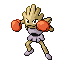

**XP**: 140 / MON_MALE

|         |         |         |         |         |         |         |         |
|---------|---------|---------|---------|---------|---------|---------|---------|
| **type1** | TYPE_FIGHTING | **type2** | TYPE_FIGHTING | **catchRate** | 45 | **safariZoneFleeRate** | 0 |
| **baseAttack** | 105 | **baseSpAttack** | 35 | **evYield_Attack** | 0 | **evYield_SpAttack** | 0 |
| **baseDefense** | 79 | **baseSpDefense** | 110 | **evYield_Defense** | 0 | **evYield_SpDefense** | 2 |
| **baseHP** | 50 | **baseSpeed** | 76 | **evYield_HP** | 0 | **evYield_SpDefense** | 2 |
| **eggGroup1** | EGG_GROUP_HUMAN_LIKE | **eggGroup2** | EGG_GROUP_HUMAN_LIKE | **eggCycles** | 25 | **friendship** | 70 |
| **item1** | ITEM_NONE | **item2** | ITEM_NONE | **abilities** | ABILITY_KEEN_EYE | **growthRate** | GROWTH_MEDIUM_FAST |

**Found at:** 

| Level | Move Name |
|---------|---------|
| 1 | Comet punch |
| 7 | Agility |
| 13 | Pursuit |
| 20 | Mach punch |
| 26 | Fire punch |
| 32 | Sky uppercut |
| 38 | Mega punch |
| 44 | Detect |
| 50 | Counter |

| TM or HM |
|---------|
| Tm01 focus punch |
| Tm06 toxic |
| Tm08 bulk up |
| Tm10 hidden power |
| Tm11 sunny day |
| Tm17 protect |
| Tm18 rain dance |
| Tm21 frustration |
| Tm26 earthquake |
| Tm27 return |
| Tm31 brick break |
| Tm32 double team |
| Tm39 rock tomb |
| Tm42 facade |
| Tm43 secret power |
| Tm44 rest |
| Tm45 attract |
| Tm46 thief |
| Hm04 strength |
| Hm06 rock smash |

### LICKITUNG

**XP**: 127 / PERCENT_FEMALE(50)

|         |         |         |         |         |         |         |         |
|---------|---------|---------|---------|---------|---------|---------|---------|
| **type1** | TYPE_NORMAL | **type2** | TYPE_NORMAL | **catchRate** | 45 | **safariZoneFleeRate** | 0 |
| **baseAttack** | 55 | **baseSpAttack** | 60 | **evYield_Attack** | 0 | **evYield_SpAttack** | 0 |
| **baseDefense** | 75 | **baseSpDefense** | 75 | **evYield_Defense** | 0 | **evYield_SpDefense** | 0 |
| **baseHP** | 90 | **baseSpeed** | 30 | **evYield_HP** | 2 | **evYield_SpDefense** | 0 |
| **eggGroup1** | EGG_GROUP_MONSTER | **eggGroup2** | EGG_GROUP_MONSTER | **eggCycles** | 20 | **friendship** | 70 |
| **item1** | ITEM_NONE | **item2** | ITEM_NONE | **abilities** | ABILITY_OWN_TEMPO | **growthRate** | GROWTH_MEDIUM_FAST |

**Found at:** MAP_ROUTE21_NORTH

| Level | Move Name |
|---------|---------|
| 1 | Lick |
| 7 | Supersonic |
| 12 | Defense curl |
| 18 | Knock off |
| 23 | Stomp |
| 29 | Wrap |
| 34 | Disable |
| 40 | Slam |
| 45 | Screech |
| 51 | Refresh |

| TM or HM |
|---------|
| Tm01 focus punch |
| Tm03 water pulse |
| Tm06 toxic |
| Tm10 hidden power |
| Tm11 sunny day |
| Tm13 ice beam |
| Tm14 blizzard |
| Tm15 hyper beam |
| Tm17 protect |
| Tm18 rain dance |
| Tm21 frustration |
| Tm22 solar beam |
| Tm23 iron tail |
| Tm24 thunderbolt |
| Tm25 thunder |
| Tm26 earthquake |
| Tm27 return |
| Tm28 dig |
| Tm30 shadow ball |
| Tm31 brick break |
| Tm32 double team |
| Tm34 shock wave |
| Tm35 flamethrower |
| Tm37 sandstorm |
| Tm38 fire blast |
| Tm39 rock tomb |
| Tm42 facade |
| Tm43 secret power |
| Tm44 rest |
| Tm45 attract |
| Tm46 thief |
| Hm01 cut |
| Hm03 surf |
| Hm04 strength |
| Hm06 rock smash |

### KOFFING

**XP**: 114 / PERCENT_FEMALE(50)

|         |         |         |         |         |         |         |         |
|---------|---------|---------|---------|---------|---------|---------|---------|
| **type1** | TYPE_POISON | **type2** | TYPE_POISON | **catchRate** | 190 | **safariZoneFleeRate** | 0 |
| **baseAttack** | 65 | **baseSpAttack** | 60 | **evYield_Attack** | 0 | **evYield_SpAttack** | 0 |
| **baseDefense** | 95 | **baseSpDefense** | 45 | **evYield_Defense** | 1 | **evYield_SpDefense** | 0 |
| **baseHP** | 40 | **baseSpeed** | 35 | **evYield_HP** | 0 | **evYield_SpDefense** | 0 |
| **eggGroup1** | EGG_GROUP_AMORPHOUS | **eggGroup2** | EGG_GROUP_AMORPHOUS | **eggCycles** | 20 | **friendship** | 70 |
| **item1** | ITEM_NONE | **item2** | ITEM_NONE | **abilities** | ABILITY_LEVITATE | **growthRate** | GROWTH_MEDIUM_FAST |

**Found at:** MAP_POKEMON_MANSION_3F, MAP_POKEMON_MANSION_1F, MAP_CELADON_CITY, MAP_POKEMON_MANSION_B1F, MAP_POKEMON_MANSION_2F

| Level | Move Name |
|---------|---------|
| 1 | Tackle |
| 9 | Smog |
| 17 | Self destruct |
| 21 | Sludge |
| 25 | Smokescreen |
| 33 | Haze |
| 41 | Explosion |
| 45 | Destiny bond |
| 49 | Memento |

| TM or HM |
|---------|
| Tm06 toxic |
| Tm10 hidden power |
| Tm11 sunny day |
| Tm12 taunt |
| Tm17 protect |
| Tm18 rain dance |
| Tm21 frustration |
| Tm24 thunderbolt |
| Tm25 thunder |
| Tm27 return |
| Tm30 shadow ball |
| Tm32 double team |
| Tm34 shock wave |
| Tm35 flamethrower |
| Tm36 sludge bomb |
| Tm38 fire blast |
| Tm41 torment |
| Tm42 facade |
| Tm43 secret power |
| Tm44 rest |
| Tm45 attract |
| Tm46 thief |
| Hm05 flash |

### WEEZING

**XP**: 173 / PERCENT_FEMALE(50)

|         |         |         |         |         |         |         |         |
|---------|---------|---------|---------|---------|---------|---------|---------|
| **type1** | TYPE_POISON | **type2** | TYPE_POISON | **catchRate** | 60 | **safariZoneFleeRate** | 0 |
| **baseAttack** | 90 | **baseSpAttack** | 85 | **evYield_Attack** | 0 | **evYield_SpAttack** | 0 |
| **baseDefense** | 120 | **baseSpDefense** | 70 | **evYield_Defense** | 2 | **evYield_SpDefense** | 0 |
| **baseHP** | 65 | **baseSpeed** | 60 | **evYield_HP** | 0 | **evYield_SpDefense** | 0 |
| **eggGroup1** | EGG_GROUP_AMORPHOUS | **eggGroup2** | EGG_GROUP_AMORPHOUS | **eggCycles** | 20 | **friendship** | 70 |
| **item1** | ITEM_NONE | **item2** | ITEM_NONE | **abilities** | ABILITY_LEVITATE | **growthRate** | GROWTH_MEDIUM_FAST |

**Found at:** MAP_POKEMON_MANSION_2F, MAP_POKEMON_MANSION_3F, MAP_POKEMON_MANSION_1F, MAP_POKEMON_MANSION_B1F

| Level | Move Name |
|---------|---------|
| 1 | Self destruct |
| 9 | Smog |
| 17 | Self destruct |
| 21 | Sludge |
| 25 | Smokescreen |
| 33 | Haze |
| 44 | Explosion |
| 51 | Destiny bond |
| 58 | Memento |

| TM or HM |
|---------|
| Tm06 toxic |
| Tm10 hidden power |
| Tm11 sunny day |
| Tm12 taunt |
| Tm15 hyper beam |
| Tm17 protect |
| Tm18 rain dance |
| Tm21 frustration |
| Tm24 thunderbolt |
| Tm25 thunder |
| Tm27 return |
| Tm30 shadow ball |
| Tm32 double team |
| Tm34 shock wave |
| Tm35 flamethrower |
| Tm36 sludge bomb |
| Tm38 fire blast |
| Tm41 torment |
| Tm42 facade |
| Tm43 secret power |
| Tm44 rest |
| Tm45 attract |
| Tm46 thief |
| Hm05 flash |

### RHYHORN

**XP**: 135 / PERCENT_FEMALE(50)

|         |         |         |         |         |         |         |         |
|---------|---------|---------|---------|---------|---------|---------|---------|
| **type1** | TYPE_GROUND | **type2** | TYPE_ROCK | **catchRate** | 120 | **safariZoneFleeRate** | 75 |
| **baseAttack** | 85 | **baseSpAttack** | 30 | **evYield_Attack** | 0 | **evYield_SpAttack** | 0 |
| **baseDefense** | 95 | **baseSpDefense** | 30 | **evYield_Defense** | 1 | **evYield_SpDefense** | 0 |
| **baseHP** | 80 | **baseSpeed** | 25 | **evYield_HP** | 0 | **evYield_SpDefense** | 0 |
| **eggGroup1** | EGG_GROUP_MONSTER | **eggGroup2** | EGG_GROUP_FIELD | **eggCycles** | 20 | **friendship** | 70 |
| **item1** | ITEM_NONE | **item2** | ITEM_NONE | **abilities** | ABILITY_LIGHTNING_ROD | **growthRate** | GROWTH_SLOW |

**Found at:** MAP_SAFARI_ZONE_NORTH, MAP_SAFARI_ZONE_CENTER

| Level | Move Name |
|---------|---------|
| 1 | Tail whip |
| 10 | Stomp |
| 15 | Fury attack |
| 24 | Scary face |
| 29 | Rock blast |
| 38 | Horn drill |
| 43 | Take down |
| 52 | Earthquake |
| 57 | Megahorn |

| TM or HM |
|---------|
| Tm05 roar |
| Tm06 toxic |
| Tm10 hidden power |
| Tm11 sunny day |
| Tm13 ice beam |
| Tm14 blizzard |
| Tm17 protect |
| Tm18 rain dance |
| Tm21 frustration |
| Tm23 iron tail |
| Tm24 thunderbolt |
| Tm25 thunder |
| Tm26 earthquake |
| Tm27 return |
| Tm28 dig |
| Tm32 double team |
| Tm34 shock wave |
| Tm35 flamethrower |
| Tm37 sandstorm |
| Tm38 fire blast |
| Tm39 rock tomb |
| Tm42 facade |
| Tm43 secret power |
| Tm44 rest |
| Tm45 attract |
| Tm46 thief |
| Hm04 strength |
| Hm06 rock smash |

### RHYDON

**XP**: 204 / PERCENT_FEMALE(50)

|         |         |         |         |         |         |         |         |
|---------|---------|---------|---------|---------|---------|---------|---------|
| **type1** | TYPE_GROUND | **type2** | TYPE_ROCK | **catchRate** | 60 | **safariZoneFleeRate** | 0 |
| **baseAttack** | 130 | **baseSpAttack** | 45 | **evYield_Attack** | 2 | **evYield_SpAttack** | 0 |
| **baseDefense** | 120 | **baseSpDefense** | 45 | **evYield_Defense** | 0 | **evYield_SpDefense** | 0 |
| **baseHP** | 105 | **baseSpeed** | 40 | **evYield_HP** | 0 | **evYield_SpDefense** | 0 |
| **eggGroup1** | EGG_GROUP_MONSTER | **eggGroup2** | EGG_GROUP_FIELD | **eggCycles** | 20 | **friendship** | 70 |
| **item1** | ITEM_NONE | **item2** | ITEM_NONE | **abilities** | ABILITY_LIGHTNING_ROD | **growthRate** | GROWTH_SLOW |

**Found at:** 

| Level | Move Name |
|---------|---------|
| 1 | Fury attack |
| 10 | Stomp |
| 15 | Fury attack |
| 24 | Scary face |
| 29 | Rock blast |
| 38 | Horn drill |
| 46 | Take down |
| 58 | Earthquake |
| 66 | Megahorn |

| TM or HM |
|---------|
| Tm01 focus punch |
| Tm05 roar |
| Tm06 toxic |
| Tm10 hidden power |
| Tm11 sunny day |
| Tm13 ice beam |
| Tm14 blizzard |
| Tm15 hyper beam |
| Tm17 protect |
| Tm18 rain dance |
| Tm21 frustration |
| Tm23 iron tail |
| Tm24 thunderbolt |
| Tm25 thunder |
| Tm26 earthquake |
| Tm27 return |
| Tm28 dig |
| Tm31 brick break |
| Tm32 double team |
| Tm34 shock wave |
| Tm35 flamethrower |
| Tm37 sandstorm |
| Tm38 fire blast |
| Tm39 rock tomb |
| Tm42 facade |
| Tm43 secret power |
| Tm44 rest |
| Tm45 attract |
| Tm46 thief |
| Hm01 cut |
| Hm03 surf |
| Hm04 strength |
| Hm06 rock smash |

### CHANSEY

**XP**: 255 / MON_FEMALE

|         |         |         |         |         |         |         |         |
|---------|---------|---------|---------|---------|---------|---------|---------|
| **type1** | TYPE_NORMAL | **type2** | TYPE_NORMAL | **catchRate** | 30 | **safariZoneFleeRate** | 125 |
| **baseAttack** | 5 | **baseSpAttack** | 35 | **evYield_Attack** | 0 | **evYield_SpAttack** | 0 |
| **baseDefense** | 5 | **baseSpDefense** | 105 | **evYield_Defense** | 0 | **evYield_SpDefense** | 0 |
| **baseHP** | 250 | **baseSpeed** | 50 | **evYield_HP** | 2 | **evYield_SpDefense** | 0 |
| **eggGroup1** | EGG_GROUP_FAIRY | **eggGroup2** | EGG_GROUP_FAIRY | **eggCycles** | 40 | **friendship** | 140 |
| **item1** | ITEM_NONE | **item2** | ITEM_LUCKY_EGG | **abilities** | ABILITY_NATURAL_CURE | **growthRate** | GROWTH_FAST |

**Found at:** MAP_SAFARI_ZONE_NORTH, MAP_SAFARI_ZONE_CENTER

| Level | Move Name |
|---------|---------|
| 1 | Growl |
| 5 | Tail whip |
| 9 | Refresh |
| 13 | Soft boiled |
| 17 | Double slap |
| 23 | Minimize |
| 29 | Sing |
| 35 | Egg bomb |
| 41 | Defense curl |
| 49 | Light screen |
| 57 | Double edge |

| TM or HM |
|---------|
| Tm01 focus punch |
| Tm03 water pulse |
| Tm04 calm mind |
| Tm06 toxic |
| Tm07 hail |
| Tm10 hidden power |
| Tm11 sunny day |
| Tm13 ice beam |
| Tm14 blizzard |
| Tm15 hyper beam |
| Tm16 light screen |
| Tm17 protect |
| Tm18 rain dance |
| Tm20 safeguard |
| Tm21 frustration |
| Tm22 solar beam |
| Tm23 iron tail |
| Tm24 thunderbolt |
| Tm25 thunder |
| Tm26 earthquake |
| Tm27 return |
| Tm29 psychic |
| Tm30 shadow ball |
| Tm31 brick break |
| Tm32 double team |
| Tm34 shock wave |
| Tm35 flamethrower |
| Tm37 sandstorm |
| Tm38 fire blast |
| Tm39 rock tomb |
| Tm42 facade |
| Tm43 secret power |
| Tm44 rest |
| Tm45 attract |
| Tm48 skill swap |
| Tm49 snatch |
| Hm04 strength |
| Hm05 flash |
| Hm06 rock smash |

### TANGELA

**XP**: 166 / PERCENT_FEMALE(50)

|         |         |         |         |         |         |         |         |
|---------|---------|---------|---------|---------|---------|---------|---------|
| **type1** | TYPE_GRASS | **type2** | TYPE_GRASS | **catchRate** | 45 | **safariZoneFleeRate** | 0 |
| **baseAttack** | 55 | **baseSpAttack** | 100 | **evYield_Attack** | 0 | **evYield_SpAttack** | 0 |
| **baseDefense** | 115 | **baseSpDefense** | 40 | **evYield_Defense** | 1 | **evYield_SpDefense** | 0 |
| **baseHP** | 65 | **baseSpeed** | 60 | **evYield_HP** | 0 | **evYield_SpDefense** | 0 |
| **eggGroup1** | EGG_GROUP_GRASS | **eggGroup2** | EGG_GROUP_GRASS | **eggCycles** | 20 | **friendship** | 70 |
| **item1** | ITEM_NONE | **item2** | ITEM_NONE | **abilities** | ABILITY_CHLOROPHYLL | **growthRate** | GROWTH_MEDIUM_FAST |

**Found at:** MAP_ROUTE21_SOUTH, MAP_ROUTE21_NORTH, MAP_ONE_ISLAND_TREASURE_BEACH

| Level | Move Name |
|---------|---------|
| 1 | Constrict |
| 4 | Sleep powder |
| 10 | Absorb |
| 13 | Growth |
| 19 | Poison powder |
| 22 | Vine whip |
| 28 | Bind |
| 31 | Mega drain |
| 37 | Stun spore |
| 40 | Slam |
| 46 | Tickle |

| TM or HM |
|---------|
| Tm06 toxic |
| Tm09 bullet seed |
| Tm10 hidden power |
| Tm11 sunny day |
| Tm15 hyper beam |
| Tm17 protect |
| Tm19 giga drain |
| Tm21 frustration |
| Tm22 solar beam |
| Tm27 return |
| Tm32 double team |
| Tm36 sludge bomb |
| Tm42 facade |
| Tm43 secret power |
| Tm44 rest |
| Tm45 attract |
| Tm46 thief |
| Hm01 cut |
| Hm05 flash |
| Hm06 rock smash |

### KANGASKHAN

**XP**: 175 / MON_FEMALE

|         |         |         |         |         |         |         |         |
|---------|---------|---------|---------|---------|---------|---------|---------|
| **type1** | TYPE_NORMAL | **type2** | TYPE_NORMAL | **catchRate** | 45 | **safariZoneFleeRate** | 125 |
| **baseAttack** | 95 | **baseSpAttack** | 40 | **evYield_Attack** | 0 | **evYield_SpAttack** | 0 |
| **baseDefense** | 80 | **baseSpDefense** | 80 | **evYield_Defense** | 0 | **evYield_SpDefense** | 0 |
| **baseHP** | 105 | **baseSpeed** | 90 | **evYield_HP** | 2 | **evYield_SpDefense** | 0 |
| **eggGroup1** | EGG_GROUP_MONSTER | **eggGroup2** | EGG_GROUP_MONSTER | **eggCycles** | 20 | **friendship** | 70 |
| **item1** | ITEM_NONE | **item2** | ITEM_NONE | **abilities** | ABILITY_EARLY_BIRD | **growthRate** | GROWTH_MEDIUM_FAST |

**Found at:** MAP_SAFARI_ZONE_WEST, MAP_SAFARI_ZONE_EAST

| Level | Move Name |
|---------|---------|
| 1 | Leer |
| 7 | Bite |
| 13 | Tail whip |
| 19 | Fake out |
| 25 | Mega punch |
| 31 | Rage |
| 37 | Endure |
| 43 | Dizzy punch |
| 49 | Reversal |

| TM or HM |
|---------|
| Tm01 focus punch |
| Tm03 water pulse |
| Tm05 roar |
| Tm06 toxic |
| Tm07 hail |
| Tm10 hidden power |
| Tm11 sunny day |
| Tm13 ice beam |
| Tm14 blizzard |
| Tm15 hyper beam |
| Tm17 protect |
| Tm18 rain dance |
| Tm21 frustration |
| Tm22 solar beam |
| Tm23 iron tail |
| Tm24 thunderbolt |
| Tm25 thunder |
| Tm26 earthquake |
| Tm27 return |
| Tm28 dig |
| Tm30 shadow ball |
| Tm31 brick break |
| Tm32 double team |
| Tm34 shock wave |
| Tm35 flamethrower |
| Tm37 sandstorm |
| Tm38 fire blast |
| Tm39 rock tomb |
| Tm40 aerial ace |
| Tm42 facade |
| Tm43 secret power |
| Tm44 rest |
| Tm45 attract |
| Tm46 thief |
| Hm01 cut |
| Hm03 surf |
| Hm04 strength |
| Hm06 rock smash |

### HORSEA

**XP**: 83 / PERCENT_FEMALE(50)

|         |         |         |         |         |         |         |         |
|---------|---------|---------|---------|---------|---------|---------|---------|
| **type1** | TYPE_WATER | **type2** | TYPE_WATER | **catchRate** | 225 | **safariZoneFleeRate** | 0 |
| **baseAttack** | 40 | **baseSpAttack** | 70 | **evYield_Attack** | 0 | **evYield_SpAttack** | 1 |
| **baseDefense** | 70 | **baseSpDefense** | 25 | **evYield_Defense** | 0 | **evYield_SpDefense** | 0 |
| **baseHP** | 30 | **baseSpeed** | 60 | **evYield_HP** | 0 | **evYield_SpDefense** | 0 |
| **eggGroup1** | EGG_GROUP_WATER_1 | **eggGroup2** | EGG_GROUP_DRAGON | **eggCycles** | 20 | **friendship** | 70 |
| **item1** | ITEM_NONE | **item2** | ITEM_NONE | **abilities** | ABILITY_SWIFT_SWIM | **growthRate** | GROWTH_MEDIUM_FAST |

**Found at:** MAP_ROUTE20, MAP_ONE_ISLAND_KINDLE_ROAD, MAP_FIVE_ISLAND, MAP_SSANNE_EXTERIOR, MAP_FIVE_ISLAND_MEADOW, MAP_ROUTE21_NORTH, MAP_ROUTE18, MAP_CINNABAR_ISLAND, MAP_SEVEN_ISLAND_TRAINER_TOWER, MAP_ONE_ISLAND_TREASURE_BEACH, MAP_FIVE_ISLAND_WATER_LABYRINTH, MAP_FIVE_ISLAND_RESORT_GORGEOUS, MAP_CERULEAN_CITY, MAP_VERMILION_CITY, MAP_PALLET_TOWN, MAP_SEAFOAM_ISLANDS_B3F, MAP_FOUR_ISLAND_ICEFALL_CAVE_BACK, MAP_ROUTE4, MAP_THREE_ISLAND_BOND_BRIDGE, MAP_SIX_ISLAND_OUTCAST_ISLAND, MAP_SEVEN_ISLAND_TANOBY_RUINS, MAP_ONE_ISLAND, MAP_SIX_ISLAND_WATER_PATH, MAP_SIX_ISLAND_GREEN_PATH, MAP_ROUTE10, MAP_ROUTE21_SOUTH, MAP_SEAFOAM_ISLANDS_B4F, MAP_FIVE_ISLAND_MEMORIAL_PILLAR, MAP_ROUTE11, MAP_ROUTE24, MAP_ROUTE12, MAP_ROUTE19, MAP_ROUTE13

| Level | Move Name |
|---------|---------|
| 1 | Bubble |
| 8 | Smokescreen |
| 15 | Leer |
| 22 | Water gun |
| 29 | Twister |
| 36 | Agility |
| 43 | Hydro pump |
| 50 | Dragon dance |

| TM or HM |
|---------|
| Tm03 water pulse |
| Tm06 toxic |
| Tm07 hail |
| Tm10 hidden power |
| Tm13 ice beam |
| Tm14 blizzard |
| Tm17 protect |
| Tm18 rain dance |
| Tm21 frustration |
| Tm27 return |
| Tm32 double team |
| Tm42 facade |
| Tm43 secret power |
| Tm44 rest |
| Tm45 attract |
| Hm03 surf |
| Hm07 waterfall |
| Hm08 dive |

### SEADRA

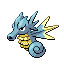

**XP**: 155 / PERCENT_FEMALE(50)

|         |         |         |         |         |         |         |         |
|---------|---------|---------|---------|---------|---------|---------|---------|
| **type1** | TYPE_WATER | **type2** | TYPE_WATER | **catchRate** | 75 | **safariZoneFleeRate** | 0 |
| **baseAttack** | 65 | **baseSpAttack** | 95 | **evYield_Attack** | 0 | **evYield_SpAttack** | 1 |
| **baseDefense** | 95 | **baseSpDefense** | 45 | **evYield_Defense** | 1 | **evYield_SpDefense** | 0 |
| **baseHP** | 55 | **baseSpeed** | 85 | **evYield_HP** | 0 | **evYield_SpDefense** | 0 |
| **eggGroup1** | EGG_GROUP_WATER_1 | **eggGroup2** | EGG_GROUP_DRAGON | **eggCycles** | 20 | **friendship** | 70 |
| **item1** | ITEM_NONE | **item2** | ITEM_NONE | **abilities** | ABILITY_POISON_POINT | **growthRate** | GROWTH_MEDIUM_FAST |

**Found at:** MAP_ROUTE20, MAP_ONE_ISLAND_KINDLE_ROAD, MAP_FIVE_ISLAND_MEADOW, MAP_ROUTE21_NORTH, MAP_CINNABAR_ISLAND, MAP_SEVEN_ISLAND_TRAINER_TOWER, MAP_ONE_ISLAND_TREASURE_BEACH, MAP_FIVE_ISLAND_WATER_LABYRINTH, MAP_FIVE_ISLAND_RESORT_GORGEOUS, MAP_PALLET_TOWN, MAP_FOUR_ISLAND_ICEFALL_CAVE_BACK, MAP_THREE_ISLAND_BOND_BRIDGE, MAP_SIX_ISLAND_OUTCAST_ISLAND, MAP_SEVEN_ISLAND_TANOBY_RUINS, MAP_ONE_ISLAND, MAP_SIX_ISLAND_WATER_PATH, MAP_SIX_ISLAND_GREEN_PATH, MAP_ROUTE21_SOUTH, MAP_FIVE_ISLAND_MEMORIAL_PILLAR, MAP_ROUTE19, MAP_FIVE_ISLAND

| Level | Move Name |
|---------|---------|
| 1 | Water gun |
| 8 | Smokescreen |
| 15 | Leer |
| 22 | Water gun |
| 29 | Twister |
| 40 | Agility |
| 51 | Hydro pump |
| 62 | Dragon dance |

| TM or HM |
|---------|
| Tm03 water pulse |
| Tm06 toxic |
| Tm07 hail |
| Tm10 hidden power |
| Tm13 ice beam |
| Tm14 blizzard |
| Tm15 hyper beam |
| Tm17 protect |
| Tm18 rain dance |
| Tm21 frustration |
| Tm27 return |
| Tm32 double team |
| Tm42 facade |
| Tm43 secret power |
| Tm44 rest |
| Tm45 attract |
| Hm03 surf |
| Hm07 waterfall |
| Hm08 dive |

### GOLDEEN

**XP**: 111 / PERCENT_FEMALE(50)

|         |         |         |         |         |         |         |         |
|---------|---------|---------|---------|---------|---------|---------|---------|
| **type1** | TYPE_WATER | **type2** | TYPE_WATER | **catchRate** | 225 | **safariZoneFleeRate** | 50 |
| **baseAttack** | 67 | **baseSpAttack** | 35 | **evYield_Attack** | 1 | **evYield_SpAttack** | 0 |
| **baseDefense** | 60 | **baseSpDefense** | 50 | **evYield_Defense** | 0 | **evYield_SpDefense** | 0 |
| **baseHP** | 45 | **baseSpeed** | 63 | **evYield_HP** | 0 | **evYield_SpDefense** | 0 |
| **eggGroup1** | EGG_GROUP_WATER_2 | **eggGroup2** | EGG_GROUP_WATER_2 | **eggCycles** | 20 | **friendship** | 70 |
| **item1** | ITEM_NONE | **item2** | ITEM_NONE | **abilities** | ABILITY_SWIFT_SWIM | **growthRate** | GROWTH_MEDIUM_FAST |

**Found at:** MAP_ROUTE6, MAP_FUCHSIA_CITY, MAP_CERULEAN_CAVE_1F, MAP_VIRIDIAN_CITY, MAP_FOUR_ISLAND_ICEFALL_CAVE_ENTRANCE, MAP_ROUTE25, MAP_ROUTE23, MAP_SAFARI_ZONE_WEST, MAP_SAFARI_ZONE_CENTER, MAP_TWO_ISLAND_CAPE_BRINK, MAP_SIX_ISLAND_RUIN_VALLEY, MAP_ROUTE21_NORTH, MAP_ROUTE18, MAP_FOUR_ISLAND, MAP_SAFARI_ZONE_NORTH, MAP_SAFARI_ZONE_EAST, MAP_CERULEAN_CAVE_B1F, MAP_ROUTE22, MAP_THREE_ISLAND_BERRY_FOREST, MAP_PALLET_TOWN

| Level | Move Name |
|---------|---------|
| 1 | Water sport |
| 10 | Supersonic |
| 15 | Horn attack |
| 24 | Flail |
| 29 | Fury attack |
| 38 | Waterfall |
| 43 | Horn drill |
| 52 | Agility |
| 57 | Megahorn |

| TM or HM |
|---------|
| Tm03 water pulse |
| Tm06 toxic |
| Tm07 hail |
| Tm10 hidden power |
| Tm13 ice beam |
| Tm14 blizzard |
| Tm17 protect |
| Tm18 rain dance |
| Tm21 frustration |
| Tm27 return |
| Tm32 double team |
| Tm42 facade |
| Tm43 secret power |
| Tm44 rest |
| Tm45 attract |
| Hm03 surf |
| Hm07 waterfall |
| Hm08 dive |

### SEAKING

**XP**: 170 / PERCENT_FEMALE(50)

|         |         |         |         |         |         |         |         |
|---------|---------|---------|---------|---------|---------|---------|---------|
| **type1** | TYPE_WATER | **type2** | TYPE_WATER | **catchRate** | 60 | **safariZoneFleeRate** | 75 |
| **baseAttack** | 92 | **baseSpAttack** | 65 | **evYield_Attack** | 2 | **evYield_SpAttack** | 0 |
| **baseDefense** | 65 | **baseSpDefense** | 80 | **evYield_Defense** | 0 | **evYield_SpDefense** | 0 |
| **baseHP** | 80 | **baseSpeed** | 68 | **evYield_HP** | 0 | **evYield_SpDefense** | 0 |
| **eggGroup1** | EGG_GROUP_WATER_2 | **eggGroup2** | EGG_GROUP_WATER_2 | **eggCycles** | 20 | **friendship** | 70 |
| **item1** | ITEM_NONE | **item2** | ITEM_NONE | **abilities** | ABILITY_SWIFT_SWIM | **growthRate** | GROWTH_MEDIUM_FAST |

**Found at:** MAP_FUCHSIA_CITY, MAP_SAFARI_ZONE_WEST, MAP_SAFARI_ZONE_CENTER, MAP_ROUTE18, MAP_SAFARI_ZONE_NORTH, MAP_SAFARI_ZONE_EAST, MAP_THREE_ISLAND_BERRY_FOREST

| Level | Move Name |
|---------|---------|
| 1 | Supersonic |
| 10 | Supersonic |
| 15 | Horn attack |
| 24 | Flail |
| 29 | Fury attack |
| 41 | Waterfall |
| 49 | Horn drill |
| 61 | Agility |
| 69 | Megahorn |

| TM or HM |
|---------|
| Tm03 water pulse |
| Tm06 toxic |
| Tm07 hail |
| Tm10 hidden power |
| Tm13 ice beam |
| Tm14 blizzard |
| Tm15 hyper beam |
| Tm17 protect |
| Tm18 rain dance |
| Tm21 frustration |
| Tm27 return |
| Tm32 double team |
| Tm42 facade |
| Tm43 secret power |
| Tm44 rest |
| Tm45 attract |
| Hm03 surf |
| Hm07 waterfall |
| Hm08 dive |

### STARYU

**XP**: 106 / MON_GENDERLESS

|         |         |         |         |         |         |         |         |
|---------|---------|---------|---------|---------|---------|---------|---------|
| **type1** | TYPE_WATER | **type2** | TYPE_WATER | **catchRate** | 225 | **safariZoneFleeRate** | 0 |
| **baseAttack** | 45 | **baseSpAttack** | 70 | **evYield_Attack** | 0 | **evYield_SpAttack** | 0 |
| **baseDefense** | 55 | **baseSpDefense** | 55 | **evYield_Defense** | 0 | **evYield_SpDefense** | 0 |
| **baseHP** | 30 | **baseSpeed** | 85 | **evYield_HP** | 0 | **evYield_SpDefense** | 0 |
| **eggGroup1** | EGG_GROUP_WATER_3 | **eggGroup2** | EGG_GROUP_WATER_3 | **eggCycles** | 20 | **friendship** | 70 |
| **item1** | ITEM_STARDUST | **item2** | ITEM_STAR_PIECE | **abilities** | ABILITY_ILLUMINATE | **growthRate** | GROWTH_SLOW |

**Found at:** MAP_ONE_ISLAND_KINDLE_ROAD, MAP_ROUTE18, MAP_VERMILION_CITY, MAP_ROUTE13

| Level | Move Name |
|---------|---------|
| 1 | Harden |
| 6 | Water gun |
| 10 | Rapid spin |
| 15 | Recover |
| 19 | Camouflage |
| 24 | Swift |
| 28 | Bubble beam |
| 33 | Minimize |
| 37 | Light screen |
| 42 | Cosmic power |
| 46 | Hydro pump |

| TM or HM |
|---------|
| Tm03 water pulse |
| Tm06 toxic |
| Tm07 hail |
| Tm10 hidden power |
| Tm13 ice beam |
| Tm14 blizzard |
| Tm16 light screen |
| Tm17 protect |
| Tm18 rain dance |
| Tm21 frustration |
| Tm24 thunderbolt |
| Tm25 thunder |
| Tm27 return |
| Tm29 psychic |
| Tm32 double team |
| Tm33 reflect |
| Tm42 facade |
| Tm43 secret power |
| Tm44 rest |
| Hm03 surf |
| Hm05 flash |
| Hm07 waterfall |
| Hm08 dive |

### STARMIE

**XP**: 207 / MON_GENDERLESS

|         |         |         |         |         |         |         |         |
|---------|---------|---------|---------|---------|---------|---------|---------|
| **type1** | TYPE_WATER | **type2** | TYPE_PSYCHIC | **catchRate** | 60 | **safariZoneFleeRate** | 0 |
| **baseAttack** | 75 | **baseSpAttack** | 100 | **evYield_Attack** | 0 | **evYield_SpAttack** | 0 |
| **baseDefense** | 85 | **baseSpDefense** | 85 | **evYield_Defense** | 0 | **evYield_SpDefense** | 0 |
| **baseHP** | 60 | **baseSpeed** | 115 | **evYield_HP** | 0 | **evYield_SpDefense** | 0 |
| **eggGroup1** | EGG_GROUP_WATER_3 | **eggGroup2** | EGG_GROUP_WATER_3 | **eggCycles** | 20 | **friendship** | 70 |
| **item1** | ITEM_STARDUST | **item2** | ITEM_STAR_PIECE | **abilities** | ABILITY_ILLUMINATE | **growthRate** | GROWTH_SLOW |

**Found at:** MAP_FIVE_ISLAND_MEMORIAL_PILLAR

| Level | Move Name |
|---------|---------|
| 1 | Swift |
| 33 | Confuse ray |

| TM or HM |
|---------|
| Tm03 water pulse |
| Tm06 toxic |
| Tm07 hail |
| Tm10 hidden power |
| Tm13 ice beam |
| Tm14 blizzard |
| Tm15 hyper beam |
| Tm16 light screen |
| Tm17 protect |
| Tm18 rain dance |
| Tm21 frustration |
| Tm24 thunderbolt |
| Tm25 thunder |
| Tm27 return |
| Tm29 psychic |
| Tm32 double team |
| Tm33 reflect |
| Tm42 facade |
| Tm43 secret power |
| Tm44 rest |
| Tm48 skill swap |
| Hm03 surf |
| Hm05 flash |
| Hm07 waterfall |
| Hm08 dive |

### MR_MIME

**XP**: 136 / PERCENT_FEMALE(50)

|         |         |         |         |         |         |         |         |
|---------|---------|---------|---------|---------|---------|---------|---------|
| **type1** | TYPE_PSYCHIC | **type2** | TYPE_PSYCHIC | **catchRate** | 45 | **safariZoneFleeRate** | 0 |
| **baseAttack** | 45 | **baseSpAttack** | 100 | **evYield_Attack** | 0 | **evYield_SpAttack** | 0 |
| **baseDefense** | 65 | **baseSpDefense** | 120 | **evYield_Defense** | 0 | **evYield_SpDefense** | 2 |
| **baseHP** | 40 | **baseSpeed** | 90 | **evYield_HP** | 0 | **evYield_SpDefense** | 2 |
| **eggGroup1** | EGG_GROUP_HUMAN_LIKE | **eggGroup2** | EGG_GROUP_HUMAN_LIKE | **eggCycles** | 25 | **friendship** | 70 |
| **item1** | ITEM_NONE | **item2** | ITEM_NONE | **abilities** | ABILITY_SOUNDPROOF | **growthRate** | GROWTH_MEDIUM_FAST |

**Found at:** MAP_ROUTE21_NORTH

| TM or HM |
|---------|
| Tm01 focus punch |
| Tm04 calm mind |
| Tm06 toxic |
| Tm10 hidden power |
| Tm11 sunny day |
| Tm12 taunt |
| Tm15 hyper beam |
| Tm16 light screen |
| Tm17 protect |
| Tm18 rain dance |
| Tm20 safeguard |
| Tm21 frustration |
| Tm22 solar beam |
| Tm24 thunderbolt |
| Tm25 thunder |
| Tm27 return |
| Tm29 psychic |
| Tm30 shadow ball |
| Tm31 brick break |
| Tm32 double team |
| Tm33 reflect |
| Tm34 shock wave |
| Tm41 torment |
| Tm42 facade |
| Tm43 secret power |
| Tm44 rest |
| Tm45 attract |
| Tm46 thief |
| Tm48 skill swap |
| Tm49 snatch |
| Hm05 flash |

### SCYTHER

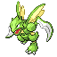

**XP**: 187 / PERCENT_FEMALE(50)

|         |         |         |         |         |         |         |         |
|---------|---------|---------|---------|---------|---------|---------|---------|
| **type1** | TYPE_BUG | **type2** | TYPE_FLYING | **catchRate** | 45 | **safariZoneFleeRate** | 125 |
| **baseAttack** | 110 | **baseSpAttack** | 55 | **evYield_Attack** | 1 | **evYield_SpAttack** | 0 |
| **baseDefense** | 80 | **baseSpDefense** | 80 | **evYield_Defense** | 0 | **evYield_SpDefense** | 0 |
| **baseHP** | 70 | **baseSpeed** | 105 | **evYield_HP** | 0 | **evYield_SpDefense** | 0 |
| **eggGroup1** | EGG_GROUP_BUG | **eggGroup2** | EGG_GROUP_BUG | **eggCycles** | 25 | **friendship** | 70 |
| **item1** | ITEM_NONE | **item2** | ITEM_NONE | **abilities** | ABILITY_SWARM | **growthRate** | GROWTH_MEDIUM_FAST |

**Found at:** MAP_FIVE_ISLAND_MEMORIAL_PILLAR, MAP_SAFARI_ZONE_EAST, MAP_SAFARI_ZONE_CENTER

| Level | Move Name |
|---------|---------|
| 1 | Leer |
| 6 | Focus energy |
| 11 | Pursuit |
| 16 | False swipe |
| 21 | Agility |
| 26 | Wing attack |
| 31 | Slash |
| 36 | Swords dance |
| 41 | Double team |
| 46 | Fury cutter |

| TM or HM |
|---------|
| Tm06 toxic |
| Tm10 hidden power |
| Tm11 sunny day |
| Tm15 hyper beam |
| Tm17 protect |
| Tm18 rain dance |
| Tm21 frustration |
| Tm27 return |
| Tm32 double team |
| Tm40 aerial ace |
| Tm42 facade |
| Tm43 secret power |
| Tm44 rest |
| Tm45 attract |
| Tm46 thief |
| Tm47 steel wing |
| Hm01 cut |
| Hm06 rock smash |

### JYNX

**XP**: 137 / MON_FEMALE

|         |         |         |         |         |         |         |         |
|---------|---------|---------|---------|---------|---------|---------|---------|
| **type1** | TYPE_ICE | **type2** | TYPE_PSYCHIC | **catchRate** | 45 | **safariZoneFleeRate** | 0 |
| **baseAttack** | 50 | **baseSpAttack** | 115 | **evYield_Attack** | 0 | **evYield_SpAttack** | 2 |
| **baseDefense** | 35 | **baseSpDefense** | 95 | **evYield_Defense** | 0 | **evYield_SpDefense** | 0 |
| **baseHP** | 65 | **baseSpeed** | 95 | **evYield_HP** | 0 | **evYield_SpDefense** | 0 |
| **eggGroup1** | EGG_GROUP_HUMAN_LIKE | **eggGroup2** | EGG_GROUP_HUMAN_LIKE | **eggCycles** | 25 | **friendship** | 70 |
| **item1** | ITEM_NONE | **item2** | ITEM_NONE | **abilities** | ABILITY_OBLIVIOUS | **growthRate** | GROWTH_MEDIUM_FAST |

**Found at:** 

| Level | Move Name |
|---------|---------|
| 1 | Powder snow |
| 9 | Lovely kiss |
| 13 | Powder snow |
| 21 | Double slap |
| 25 | Ice punch |
| 35 | Mean look |
| 41 | Fake tears |
| 51 | Body slam |
| 57 | Perish song |
| 67 | Blizzard |

| TM or HM |
|---------|
| Tm01 focus punch |
| Tm03 water pulse |
| Tm04 calm mind |
| Tm06 toxic |
| Tm07 hail |
| Tm10 hidden power |
| Tm12 taunt |
| Tm13 ice beam |
| Tm14 blizzard |
| Tm15 hyper beam |
| Tm16 light screen |
| Tm17 protect |
| Tm18 rain dance |
| Tm21 frustration |
| Tm27 return |
| Tm29 psychic |
| Tm30 shadow ball |
| Tm31 brick break |
| Tm32 double team |
| Tm33 reflect |
| Tm41 torment |
| Tm42 facade |
| Tm43 secret power |
| Tm44 rest |
| Tm45 attract |
| Tm46 thief |
| Tm48 skill swap |
| Hm05 flash |

### ELECTABUZZ

**XP**: 156 / PERCENT_FEMALE(25)

|         |         |         |         |         |         |         |         |
|---------|---------|---------|---------|---------|---------|---------|---------|
| **type1** | TYPE_ELECTRIC | **type2** | TYPE_ELECTRIC | **catchRate** | 45 | **safariZoneFleeRate** | 0 |
| **baseAttack** | 83 | **baseSpAttack** | 95 | **evYield_Attack** | 0 | **evYield_SpAttack** | 0 |
| **baseDefense** | 57 | **baseSpDefense** | 85 | **evYield_Defense** | 0 | **evYield_SpDefense** | 0 |
| **baseHP** | 65 | **baseSpeed** | 105 | **evYield_HP** | 0 | **evYield_SpDefense** | 0 |
| **eggGroup1** | EGG_GROUP_HUMAN_LIKE | **eggGroup2** | EGG_GROUP_HUMAN_LIKE | **eggCycles** | 25 | **friendship** | 70 |
| **item1** | ITEM_NONE | **item2** | ITEM_NONE | **abilities** | ABILITY_STATIC | **growthRate** | GROWTH_MEDIUM_FAST |

**Found at:** MAP_POWER_PLANT

| Level | Move Name |
|---------|---------|
| 1 | Thunder punch |
| 9 | Thunder punch |
| 17 | Light screen |
| 21 | Shock wave |
| 25 | Swift |
| 36 | Screech |
| 47 | Thunderbolt |
| 58 | Thunder |

| TM or HM |
|---------|
| Tm01 focus punch |
| Tm06 toxic |
| Tm10 hidden power |
| Tm15 hyper beam |
| Tm16 light screen |
| Tm17 protect |
| Tm18 rain dance |
| Tm21 frustration |
| Tm23 iron tail |
| Tm24 thunderbolt |
| Tm25 thunder |
| Tm27 return |
| Tm29 psychic |
| Tm31 brick break |
| Tm32 double team |
| Tm34 shock wave |
| Tm42 facade |
| Tm43 secret power |
| Tm44 rest |
| Tm45 attract |
| Tm46 thief |
| Hm04 strength |
| Hm05 flash |
| Hm06 rock smash |

### MAGMAR

**XP**: 167 / PERCENT_FEMALE(25)

|         |         |         |         |         |         |         |         |
|---------|---------|---------|---------|---------|---------|---------|---------|
| **type1** | TYPE_FIRE | **type2** | TYPE_FIRE | **catchRate** | 45 | **safariZoneFleeRate** | 0 |
| **baseAttack** | 95 | **baseSpAttack** | 100 | **evYield_Attack** | 0 | **evYield_SpAttack** | 2 |
| **baseDefense** | 57 | **baseSpDefense** | 85 | **evYield_Defense** | 0 | **evYield_SpDefense** | 0 |
| **baseHP** | 65 | **baseSpeed** | 93 | **evYield_HP** | 0 | **evYield_SpDefense** | 0 |
| **eggGroup1** | EGG_GROUP_HUMAN_LIKE | **eggGroup2** | EGG_GROUP_HUMAN_LIKE | **eggCycles** | 25 | **friendship** | 70 |
| **item1** | ITEM_NONE | **item2** | ITEM_NONE | **abilities** | ABILITY_FLAME_BODY | **growthRate** | GROWTH_MEDIUM_FAST |

**Found at:** MAP_ONE_ISLAND_KINDLE_ROAD, MAP_MT_EMBER_RUBY_PATH_B3F, MAP_MT_EMBER_EXTERIOR, MAP_FIVE_ISLAND_MEMORIAL_PILLAR

| Level | Move Name |
|---------|---------|
| 1 | Fire punch |
| 7 | Leer |
| 13 | Flame wheel |
| 19 | Fire punch |
| 25 | Smokescreen |
| 33 | Sunny day |
| 41 | Flamethrower |
| 49 | Confuse ray |
| 57 | Fire blast |

| TM or HM |
|---------|
| Tm01 focus punch |
| Tm06 toxic |
| Tm10 hidden power |
| Tm11 sunny day |
| Tm15 hyper beam |
| Tm17 protect |
| Tm21 frustration |
| Tm23 iron tail |
| Tm27 return |
| Tm29 psychic |
| Tm31 brick break |
| Tm32 double team |
| Tm35 flamethrower |
| Tm38 fire blast |
| Tm42 facade |
| Tm43 secret power |
| Tm44 rest |
| Tm45 attract |
| Tm46 thief |
| Hm04 strength |
| Hm06 rock smash |

### PINSIR

**XP**: 200 / PERCENT_FEMALE(50)

|         |         |         |         |         |         |         |         |
|---------|---------|---------|---------|---------|---------|---------|---------|
| **type1** | TYPE_BUG | **type2** | TYPE_BUG | **catchRate** | 45 | **safariZoneFleeRate** | 125 |
| **baseAttack** | 125 | **baseSpAttack** | 55 | **evYield_Attack** | 2 | **evYield_SpAttack** | 0 |
| **baseDefense** | 100 | **baseSpDefense** | 70 | **evYield_Defense** | 0 | **evYield_SpDefense** | 0 |
| **baseHP** | 65 | **baseSpeed** | 85 | **evYield_HP** | 0 | **evYield_SpDefense** | 0 |
| **eggGroup1** | EGG_GROUP_BUG | **eggGroup2** | EGG_GROUP_BUG | **eggCycles** | 25 | **friendship** | 70 |
| **item1** | ITEM_NONE | **item2** | ITEM_NONE | **abilities** | ABILITY_HYPER_CUTTER | **growthRate** | GROWTH_SLOW |

**Found at:** MAP_SAFARI_ZONE_CENTER

| Level | Move Name |
|---------|---------|
| 1 | Focus energy |
| 7 | Bind |
| 13 | Seismic toss |
| 19 | Harden |
| 25 | Revenge |
| 31 | Brick break |
| 37 | Guillotine |
| 43 | Submission |
| 49 | Swords dance |

| TM or HM |
|---------|
| Tm01 focus punch |
| Tm06 toxic |
| Tm08 bulk up |
| Tm10 hidden power |
| Tm11 sunny day |
| Tm15 hyper beam |
| Tm17 protect |
| Tm18 rain dance |
| Tm21 frustration |
| Tm26 earthquake |
| Tm27 return |
| Tm28 dig |
| Tm31 brick break |
| Tm32 double team |
| Tm39 rock tomb |
| Tm42 facade |
| Tm43 secret power |
| Tm44 rest |
| Tm45 attract |
| Tm46 thief |
| Hm01 cut |
| Hm04 strength |
| Hm06 rock smash |

### TAUROS

**XP**: 211 / MON_MALE

|         |         |         |         |         |         |         |         |
|---------|---------|---------|---------|---------|---------|---------|---------|
| **type1** | TYPE_NORMAL | **type2** | TYPE_NORMAL | **catchRate** | 45 | **safariZoneFleeRate** | 125 |
| **baseAttack** | 100 | **baseSpAttack** | 40 | **evYield_Attack** | 1 | **evYield_SpAttack** | 0 |
| **baseDefense** | 95 | **baseSpDefense** | 70 | **evYield_Defense** | 0 | **evYield_SpDefense** | 0 |
| **baseHP** | 75 | **baseSpeed** | 110 | **evYield_HP** | 0 | **evYield_SpDefense** | 0 |
| **eggGroup1** | EGG_GROUP_FIELD | **eggGroup2** | EGG_GROUP_FIELD | **eggCycles** | 20 | **friendship** | 70 |
| **item1** | ITEM_NONE | **item2** | ITEM_NONE | **abilities** | ABILITY_INTIMIDATE | **growthRate** | GROWTH_SLOW |

**Found at:** MAP_SIX_ISLAND_PATTERN_BUSH, MAP_SEVEN_ISLAND_TRAINER_TOWER, MAP_FOUR_ISLAND_ICEFALL_CAVE_BACK, MAP_SIX_ISLAND_WATER_PATH, MAP_SIX_ISLAND_ALTERING_CAVE, MAP_FOUR_ISLAND_ICEFALL_CAVE_ENTRANCE, MAP_FIVE_ISLAND_MEMORIAL_PILLAR, MAP_SAFARI_ZONE_WEST, MAP_SIX_ISLAND_RUIN_VALLEY, MAP_FIVE_ISLAND_MEADOW, MAP_FOUR_ISLAND, MAP_FIVE_ISLAND_WATER_LABYRINTH, MAP_FIVE_ISLAND_RESORT_GORGEOUS, MAP_SAFARI_ZONE_NORTH, MAP_FIVE_ISLAND, MAP_SEVEN_ISLAND_TANOBY_RUINS, MAP_SEVEN_ISLAND_SEVAULT_CANYON, MAP_SEVEN_ISLAND_SEVAULT_CANYON_ENTRANCE

| Level | Move Name |
|---------|---------|
| 1 | Tail whip |
| 4 | Rage |
| 8 | Horn attack |
| 11 | Scary face |
| 15 | Pursuit |
| 19 | Rest |
| 24 | Headbutt |
| 29 | Swagger |
| 43 | Thrash |
| 53 | Take down |

| TM or HM |
|---------|
| Tm03 water pulse |
| Tm06 toxic |
| Tm10 hidden power |
| Tm11 sunny day |
| Tm13 ice beam |
| Tm14 blizzard |
| Tm15 hyper beam |
| Tm17 protect |
| Tm18 rain dance |
| Tm21 frustration |
| Tm22 solar beam |
| Tm23 iron tail |
| Tm24 thunderbolt |
| Tm25 thunder |
| Tm26 earthquake |
| Tm27 return |
| Tm32 double team |
| Tm34 shock wave |
| Tm35 flamethrower |
| Tm37 sandstorm |
| Tm38 fire blast |
| Tm39 rock tomb |
| Tm42 facade |
| Tm43 secret power |
| Tm44 rest |
| Tm45 attract |
| Hm03 surf |
| Hm04 strength |
| Hm06 rock smash |

### MAGIKARP

**XP**: 20 / PERCENT_FEMALE(50)

|         |         |         |         |         |         |         |         |
|---------|---------|---------|---------|---------|---------|---------|---------|
| **type1** | TYPE_WATER | **type2** | TYPE_WATER | **catchRate** | 255 | **safariZoneFleeRate** | 25 |
| **baseAttack** | 10 | **baseSpAttack** | 15 | **evYield_Attack** | 0 | **evYield_SpAttack** | 0 |
| **baseDefense** | 55 | **baseSpDefense** | 20 | **evYield_Defense** | 0 | **evYield_SpDefense** | 0 |
| **baseHP** | 20 | **baseSpeed** | 80 | **evYield_HP** | 0 | **evYield_SpDefense** | 0 |
| **eggGroup1** | EGG_GROUP_WATER_2 | **eggGroup2** | EGG_GROUP_DRAGON | **eggCycles** | 5 | **friendship** | 70 |
| **item1** | ITEM_NONE | **item2** | ITEM_NONE | **abilities** | ABILITY_SWIFT_SWIM | **growthRate** | GROWTH_SLOW |

**Found at:** MAP_ROUTE20, MAP_CERULEAN_CAVE_1F, MAP_ONE_ISLAND_KINDLE_ROAD, MAP_FIVE_ISLAND, MAP_SSANNE_EXTERIOR, MAP_FIVE_ISLAND_MEADOW, MAP_ROUTE21_NORTH, MAP_CERULEAN_CAVE_B1F, MAP_CINNABAR_ISLAND, MAP_THREE_ISLAND_BERRY_FOREST, MAP_SEVEN_ISLAND_TRAINER_TOWER, MAP_ONE_ISLAND_TREASURE_BEACH, MAP_FUCHSIA_CITY, MAP_FOUR_ISLAND, MAP_SAFARI_ZONE_WEST, MAP_TWO_ISLAND_CAPE_BRINK, MAP_SIX_ISLAND_RUIN_VALLEY, MAP_FIVE_ISLAND_WATER_LABYRINTH, MAP_FIVE_ISLAND_RESORT_GORGEOUS, MAP_VIRIDIAN_CITY, MAP_CERULEAN_CITY, MAP_VERMILION_CITY, MAP_PALLET_TOWN, MAP_SEAFOAM_ISLANDS_B3F, MAP_FOUR_ISLAND_ICEFALL_CAVE_BACK, MAP_FOUR_ISLAND_ICEFALL_CAVE_ENTRANCE, MAP_ROUTE4, MAP_ROUTE23, MAP_ROUTE25, MAP_THREE_ISLAND_BOND_BRIDGE, MAP_CELADON_CITY, MAP_SIX_ISLAND_OUTCAST_ISLAND, MAP_SAFARI_ZONE_EAST, MAP_ROUTE22, MAP_SEVEN_ISLAND_TANOBY_RUINS, MAP_ROUTE6, MAP_ONE_ISLAND, MAP_SIX_ISLAND_WATER_PATH, MAP_SIX_ISLAND_GREEN_PATH, MAP_ROUTE10, MAP_ROUTE21_SOUTH, MAP_SEAFOAM_ISLANDS_B4F, MAP_FIVE_ISLAND_MEMORIAL_PILLAR, MAP_ROUTE11, MAP_SAFARI_ZONE_CENTER, MAP_ROUTE24, MAP_ROUTE12, MAP_SAFARI_ZONE_NORTH, MAP_ROUTE19, MAP_ROUTE13

| Level | Move Name |
|---------|---------|
| 1 | Splash |
| 15 | Tackle |
| 30 | Flail |

| TM or HM |
|---------|

### GYARADOS

**XP**: 214 / PERCENT_FEMALE(50)

|         |         |         |         |         |         |         |         |
|---------|---------|---------|---------|---------|---------|---------|---------|
| **type1** | TYPE_WATER | **type2** | TYPE_FLYING | **catchRate** | 45 | **safariZoneFleeRate** | 0 |
| **baseAttack** | 125 | **baseSpAttack** | 60 | **evYield_Attack** | 2 | **evYield_SpAttack** | 0 |
| **baseDefense** | 79 | **baseSpDefense** | 100 | **evYield_Defense** | 0 | **evYield_SpDefense** | 0 |
| **baseHP** | 95 | **baseSpeed** | 81 | **evYield_HP** | 0 | **evYield_SpDefense** | 0 |
| **eggGroup1** | EGG_GROUP_WATER_2 | **eggGroup2** | EGG_GROUP_DRAGON | **eggCycles** | 5 | **friendship** | 70 |
| **item1** | ITEM_NONE | **item2** | ITEM_NONE | **abilities** | ABILITY_INTIMIDATE | **growthRate** | GROWTH_SLOW |

**Found at:** MAP_ROUTE20, MAP_CERULEAN_CAVE_1F, MAP_ONE_ISLAND_KINDLE_ROAD, MAP_FIVE_ISLAND, MAP_SSANNE_EXTERIOR, MAP_FIVE_ISLAND_MEADOW, MAP_ROUTE21_NORTH, MAP_CERULEAN_CAVE_B1F, MAP_CINNABAR_ISLAND, MAP_THREE_ISLAND_BERRY_FOREST, MAP_SEVEN_ISLAND_TRAINER_TOWER, MAP_ONE_ISLAND_TREASURE_BEACH, MAP_FUCHSIA_CITY, MAP_FOUR_ISLAND, MAP_TWO_ISLAND_CAPE_BRINK, MAP_SIX_ISLAND_RUIN_VALLEY, MAP_FIVE_ISLAND_WATER_LABYRINTH, MAP_FIVE_ISLAND_RESORT_GORGEOUS, MAP_VIRIDIAN_CITY, MAP_CERULEAN_CITY, MAP_VERMILION_CITY, MAP_PALLET_TOWN, MAP_SEAFOAM_ISLANDS_B3F, MAP_FOUR_ISLAND_ICEFALL_CAVE_BACK, MAP_FOUR_ISLAND_ICEFALL_CAVE_ENTRANCE, MAP_ROUTE4, MAP_ROUTE23, MAP_ROUTE25, MAP_THREE_ISLAND_BOND_BRIDGE, MAP_SIX_ISLAND_OUTCAST_ISLAND, MAP_ROUTE22, MAP_SEVEN_ISLAND_TANOBY_RUINS, MAP_ROUTE6, MAP_ONE_ISLAND, MAP_SIX_ISLAND_WATER_PATH, MAP_SIX_ISLAND_GREEN_PATH, MAP_ROUTE10, MAP_ROUTE21_SOUTH, MAP_SEAFOAM_ISLANDS_B4F, MAP_FIVE_ISLAND_MEMORIAL_PILLAR, MAP_ROUTE11, MAP_ROUTE24, MAP_ROUTE12, MAP_ROUTE19, MAP_ROUTE13

| Level | Move Name |
|---------|---------|
| 1 | Thrash |
| 20 | Bite |
| 25 | Dragon rage |
| 30 | Leer |
| 35 | Twister |
| 40 | Hydro pump |
| 45 | Rain dance |
| 50 | Dragon dance |
| 55 | Hyper beam |

| TM or HM |
|---------|
| Tm03 water pulse |
| Tm05 roar |
| Tm06 toxic |
| Tm07 hail |
| Tm10 hidden power |
| Tm12 taunt |
| Tm13 ice beam |
| Tm14 blizzard |
| Tm15 hyper beam |
| Tm17 protect |
| Tm18 rain dance |
| Tm21 frustration |
| Tm24 thunderbolt |
| Tm25 thunder |
| Tm26 earthquake |
| Tm27 return |
| Tm32 double team |
| Tm35 flamethrower |
| Tm37 sandstorm |
| Tm38 fire blast |
| Tm41 torment |
| Tm42 facade |
| Tm43 secret power |
| Tm44 rest |
| Tm45 attract |
| Hm03 surf |
| Hm04 strength |
| Hm06 rock smash |
| Hm07 waterfall |
| Hm08 dive |

### LAPRAS

**XP**: 219 / PERCENT_FEMALE(50)

|         |         |         |         |         |         |         |         |
|---------|---------|---------|---------|---------|---------|---------|---------|
| **type1** | TYPE_WATER | **type2** | TYPE_ICE | **catchRate** | 45 | **safariZoneFleeRate** | 0 |
| **baseAttack** | 85 | **baseSpAttack** | 85 | **evYield_Attack** | 0 | **evYield_SpAttack** | 0 |
| **baseDefense** | 80 | **baseSpDefense** | 95 | **evYield_Defense** | 0 | **evYield_SpDefense** | 0 |
| **baseHP** | 130 | **baseSpeed** | 60 | **evYield_HP** | 2 | **evYield_SpDefense** | 0 |
| **eggGroup1** | EGG_GROUP_MONSTER | **eggGroup2** | EGG_GROUP_WATER_1 | **eggCycles** | 40 | **friendship** | 70 |
| **item1** | ITEM_NONE | **item2** | ITEM_NONE | **abilities** | ABILITY_WATER_ABSORB | **growthRate** | GROWTH_SLOW |

**Found at:** MAP_ROUTE18, MAP_FOUR_ISLAND_ICEFALL_CAVE_BACK

| Level | Move Name |
|---------|---------|
| 1 | Sing |
| 7 | Mist |
| 13 | Body slam |
| 19 | Confuse ray |
| 25 | Perish song |
| 31 | Ice beam |
| 37 | Rain dance |
| 43 | Safeguard |
| 49 | Hydro pump |
| 55 | Sheer cold |

| TM or HM |
|---------|
| Tm03 water pulse |
| Tm05 roar |
| Tm06 toxic |
| Tm07 hail |
| Tm10 hidden power |
| Tm13 ice beam |
| Tm14 blizzard |
| Tm15 hyper beam |
| Tm17 protect |
| Tm18 rain dance |
| Tm20 safeguard |
| Tm21 frustration |
| Tm23 iron tail |
| Tm24 thunderbolt |
| Tm25 thunder |
| Tm27 return |
| Tm29 psychic |
| Tm32 double team |
| Tm34 shock wave |
| Tm42 facade |
| Tm43 secret power |
| Tm44 rest |
| Tm45 attract |
| Hm03 surf |
| Hm04 strength |
| Hm06 rock smash |
| Hm07 waterfall |
| Hm08 dive |

### DITTO

**XP**: 61 / MON_GENDERLESS

|         |         |         |         |         |         |         |         |
|---------|---------|---------|---------|---------|---------|---------|---------|
| **type1** | TYPE_NORMAL | **type2** | TYPE_NORMAL | **catchRate** | 35 | **safariZoneFleeRate** | 0 |
| **baseAttack** | 48 | **baseSpAttack** | 48 | **evYield_Attack** | 0 | **evYield_SpAttack** | 0 |
| **baseDefense** | 48 | **baseSpDefense** | 48 | **evYield_Defense** | 0 | **evYield_SpDefense** | 0 |
| **baseHP** | 48 | **baseSpeed** | 48 | **evYield_HP** | 1 | **evYield_SpDefense** | 0 |
| **eggGroup1** | EGG_GROUP_DITTO | **eggGroup2** | EGG_GROUP_DITTO | **eggCycles** | 20 | **friendship** | 70 |
| **item1** | ITEM_NONE | **item2** | ITEM_METAL_POWDER | **abilities** | ABILITY_LIMBER | **growthRate** | GROWTH_MEDIUM_FAST |

**Found at:** MAP_ROUTE13, MAP_ROUTE15, MAP_CERULEAN_CAVE_1F, MAP_ROUTE14, MAP_POKEMON_MANSION_B1F, MAP_CERULEAN_CAVE_B1F, MAP_CERULEAN_CAVE_2F

| Level | Move Name |
|---------|---------|
| 1 | Transform |

| TM or HM |
|---------|

### EEVEE

**XP**: 92 / PERCENT_FEMALE(12.5)

|         |         |         |         |         |         |         |         |
|---------|---------|---------|---------|---------|---------|---------|---------|
| **type1** | TYPE_NORMAL | **type2** | TYPE_NORMAL | **catchRate** | 80 | **safariZoneFleeRate** | 0 |
| **baseAttack** | 55 | **baseSpAttack** | 45 | **evYield_Attack** | 0 | **evYield_SpAttack** | 0 |
| **baseDefense** | 50 | **baseSpDefense** | 65 | **evYield_Defense** | 0 | **evYield_SpDefense** | 1 |
| **baseHP** | 55 | **baseSpeed** | 55 | **evYield_HP** | 0 | **evYield_SpDefense** | 1 |
| **eggGroup1** | EGG_GROUP_FIELD | **eggGroup2** | EGG_GROUP_FIELD | **eggCycles** | 35 | **friendship** | 70 |
| **item1** | ITEM_NONE | **item2** | ITEM_NONE | **abilities** | ABILITY_RUN_AWAY | **growthRate** | GROWTH_MEDIUM_FAST |

**Found at:** MAP_ROUTE21_NORTH

| Level | Move Name |
|---------|---------|
| 1 | Helping hand |
| 8 | Sand attack |
| 16 | Growl |
| 23 | Quick attack |
| 30 | Bite |
| 36 | Baton pass |
| 42 | Take down |

| TM or HM |
|---------|
| Tm06 toxic |
| Tm10 hidden power |
| Tm11 sunny day |
| Tm17 protect |
| Tm18 rain dance |
| Tm21 frustration |
| Tm23 iron tail |
| Tm27 return |
| Tm28 dig |
| Tm30 shadow ball |
| Tm32 double team |
| Tm42 facade |
| Tm43 secret power |
| Tm44 rest |
| Tm45 attract |

### VAPOREON

**XP**: 196 / PERCENT_FEMALE(12.5)

|         |         |         |         |         |         |         |         |
|---------|---------|---------|---------|---------|---------|---------|---------|
| **type1** | TYPE_WATER | **type2** | TYPE_WATER | **catchRate** | 45 | **safariZoneFleeRate** | 0 |
| **baseAttack** | 65 | **baseSpAttack** | 110 | **evYield_Attack** | 0 | **evYield_SpAttack** | 0 |
| **baseDefense** | 60 | **baseSpDefense** | 95 | **evYield_Defense** | 0 | **evYield_SpDefense** | 0 |
| **baseHP** | 130 | **baseSpeed** | 65 | **evYield_HP** | 2 | **evYield_SpDefense** | 0 |
| **eggGroup1** | EGG_GROUP_FIELD | **eggGroup2** | EGG_GROUP_FIELD | **eggCycles** | 35 | **friendship** | 70 |
| **item1** | ITEM_NONE | **item2** | ITEM_NONE | **abilities** | ABILITY_WATER_ABSORB | **growthRate** | GROWTH_MEDIUM_FAST |

**Found at:** 

| Level | Move Name |
|---------|---------|
| 1 | Helping hand |
| 8 | Sand attack |
| 16 | Water gun |
| 23 | Quick attack |
| 30 | Bite |
| 36 | Aurora beam |
| 42 | Haze |
| 47 | Acid armor |
| 52 | Hydro pump |

| TM or HM |
|---------|
| Tm03 water pulse |
| Tm05 roar |
| Tm06 toxic |
| Tm07 hail |
| Tm10 hidden power |
| Tm11 sunny day |
| Tm13 ice beam |
| Tm14 blizzard |
| Tm15 hyper beam |
| Tm17 protect |
| Tm18 rain dance |
| Tm21 frustration |
| Tm23 iron tail |
| Tm27 return |
| Tm28 dig |
| Tm30 shadow ball |
| Tm32 double team |
| Tm42 facade |
| Tm43 secret power |
| Tm44 rest |
| Tm45 attract |
| Hm03 surf |
| Hm07 waterfall |
| Hm08 dive |

### JOLTEON

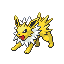

**XP**: 197 / PERCENT_FEMALE(12.5)

|         |         |         |         |         |         |         |         |
|---------|---------|---------|---------|---------|---------|---------|---------|
| **type1** | TYPE_ELECTRIC | **type2** | TYPE_ELECTRIC | **catchRate** | 45 | **safariZoneFleeRate** | 0 |
| **baseAttack** | 65 | **baseSpAttack** | 110 | **evYield_Attack** | 0 | **evYield_SpAttack** | 0 |
| **baseDefense** | 60 | **baseSpDefense** | 95 | **evYield_Defense** | 0 | **evYield_SpDefense** | 0 |
| **baseHP** | 65 | **baseSpeed** | 130 | **evYield_HP** | 0 | **evYield_SpDefense** | 0 |
| **eggGroup1** | EGG_GROUP_FIELD | **eggGroup2** | EGG_GROUP_FIELD | **eggCycles** | 35 | **friendship** | 70 |
| **item1** | ITEM_NONE | **item2** | ITEM_NONE | **abilities** | ABILITY_VOLT_ABSORB | **growthRate** | GROWTH_MEDIUM_FAST |

**Found at:** 

| Level | Move Name |
|---------|---------|
| 1 | Helping hand |
| 8 | Sand attack |
| 16 | Thunder shock |
| 23 | Quick attack |
| 30 | Double kick |
| 36 | Pin missile |
| 42 | Thunder wave |
| 47 | Agility |
| 52 | Thunder |

| TM or HM |
|---------|
| Tm05 roar |
| Tm06 toxic |
| Tm10 hidden power |
| Tm11 sunny day |
| Tm15 hyper beam |
| Tm17 protect |
| Tm18 rain dance |
| Tm21 frustration |
| Tm23 iron tail |
| Tm24 thunderbolt |
| Tm25 thunder |
| Tm27 return |
| Tm28 dig |
| Tm30 shadow ball |
| Tm32 double team |
| Tm34 shock wave |
| Tm42 facade |
| Tm43 secret power |
| Tm44 rest |
| Tm45 attract |
| Hm05 flash |

### FLAREON

**XP**: 198 / PERCENT_FEMALE(12.5)

|         |         |         |         |         |         |         |         |
|---------|---------|---------|---------|---------|---------|---------|---------|
| **type1** | TYPE_FIRE | **type2** | TYPE_FIRE | **catchRate** | 45 | **safariZoneFleeRate** | 0 |
| **baseAttack** | 130 | **baseSpAttack** | 95 | **evYield_Attack** | 2 | **evYield_SpAttack** | 0 |
| **baseDefense** | 60 | **baseSpDefense** | 110 | **evYield_Defense** | 0 | **evYield_SpDefense** | 0 |
| **baseHP** | 65 | **baseSpeed** | 65 | **evYield_HP** | 0 | **evYield_SpDefense** | 0 |
| **eggGroup1** | EGG_GROUP_FIELD | **eggGroup2** | EGG_GROUP_FIELD | **eggCycles** | 35 | **friendship** | 70 |
| **item1** | ITEM_NONE | **item2** | ITEM_NONE | **abilities** | ABILITY_FLASH_FIRE | **growthRate** | GROWTH_MEDIUM_FAST |

**Found at:** 

| Level | Move Name |
|---------|---------|
| 1 | Helping hand |
| 8 | Sand attack |
| 16 | Flame wheel |
| 23 | Quick attack |
| 30 | Bite |
| 36 | Fire spin |
| 42 | Smog |
| 47 | Leer |
| 52 | Flamethrower |

| TM or HM |
|---------|
| Tm05 roar |
| Tm06 toxic |
| Tm10 hidden power |
| Tm11 sunny day |
| Tm15 hyper beam |
| Tm17 protect |
| Tm18 rain dance |
| Tm21 frustration |
| Tm23 iron tail |
| Tm27 return |
| Tm28 dig |
| Tm30 shadow ball |
| Tm32 double team |
| Tm35 flamethrower |
| Tm38 fire blast |
| Tm42 facade |
| Tm43 secret power |
| Tm44 rest |
| Tm45 attract |
| Tm50 overheat |

### PORYGON

**XP**: 130 / MON_GENDERLESS

|         |         |         |         |         |         |         |         |
|---------|---------|---------|---------|---------|---------|---------|---------|
| **type1** | TYPE_NORMAL | **type2** | TYPE_NORMAL | **catchRate** | 45 | **safariZoneFleeRate** | 0 |
| **baseAttack** | 60 | **baseSpAttack** | 85 | **evYield_Attack** | 0 | **evYield_SpAttack** | 1 |
| **baseDefense** | 70 | **baseSpDefense** | 75 | **evYield_Defense** | 0 | **evYield_SpDefense** | 0 |
| **baseHP** | 65 | **baseSpeed** | 40 | **evYield_HP** | 0 | **evYield_SpDefense** | 0 |
| **eggGroup1** | EGG_GROUP_MINERAL | **eggGroup2** | EGG_GROUP_MINERAL | **eggCycles** | 20 | **friendship** | 70 |
| **item1** | ITEM_NONE | **item2** | ITEM_NONE | **abilities** | ABILITY_TRACE | **growthRate** | GROWTH_MEDIUM_FAST |

**Found at:** MAP_THREE_ISLAND_PORT, MAP_ROUTE16

| Level | Move Name |
|---------|---------|
| 1 | Conversion |
| 9 | Agility |
| 12 | Psybeam |
| 20 | Recover |
| 24 | Sharpen |
| 32 | Lock on |
| 36 | Tri attack |
| 44 | Recycle |
| 48 | Zap cannon |

| TM or HM |
|---------|
| Tm06 toxic |
| Tm10 hidden power |
| Tm11 sunny day |
| Tm13 ice beam |
| Tm14 blizzard |
| Tm15 hyper beam |
| Tm17 protect |
| Tm18 rain dance |
| Tm21 frustration |
| Tm22 solar beam |
| Tm23 iron tail |
| Tm24 thunderbolt |
| Tm25 thunder |
| Tm27 return |
| Tm29 psychic |
| Tm30 shadow ball |
| Tm32 double team |
| Tm34 shock wave |
| Tm40 aerial ace |
| Tm42 facade |
| Tm43 secret power |
| Tm44 rest |
| Tm46 thief |
| Hm05 flash |

### OMANYTE

**XP**: 120 / PERCENT_FEMALE(12.5)

|         |         |         |         |         |         |         |         |
|---------|---------|---------|---------|---------|---------|---------|---------|
| **type1** | TYPE_ROCK | **type2** | TYPE_WATER | **catchRate** | 45 | **safariZoneFleeRate** | 0 |
| **baseAttack** | 40 | **baseSpAttack** | 90 | **evYield_Attack** | 0 | **evYield_SpAttack** | 0 |
| **baseDefense** | 100 | **baseSpDefense** | 55 | **evYield_Defense** | 1 | **evYield_SpDefense** | 0 |
| **baseHP** | 35 | **baseSpeed** | 35 | **evYield_HP** | 0 | **evYield_SpDefense** | 0 |
| **eggGroup1** | EGG_GROUP_WATER_1 | **eggGroup2** | EGG_GROUP_WATER_3 | **eggCycles** | 30 | **friendship** | 70 |
| **item1** | ITEM_NONE | **item2** | ITEM_NONE | **abilities** | ABILITY_SWIFT_SWIM | **growthRate** | GROWTH_MEDIUM_FAST |

**Found at:** 

| Level | Move Name |
|---------|---------|
| 1 | Withdraw |
| 13 | Bite |
| 19 | Water gun |
| 25 | Mud shot |
| 31 | Leer |
| 37 | Protect |
| 43 | Tickle |
| 49 | Ancient power |
| 55 | Hydro pump |

| TM or HM |
|---------|
| Tm03 water pulse |
| Tm06 toxic |
| Tm07 hail |
| Tm10 hidden power |
| Tm13 ice beam |
| Tm14 blizzard |
| Tm17 protect |
| Tm18 rain dance |
| Tm21 frustration |
| Tm27 return |
| Tm32 double team |
| Tm37 sandstorm |
| Tm39 rock tomb |
| Tm42 facade |
| Tm43 secret power |
| Tm44 rest |
| Tm45 attract |
| Tm46 thief |
| Hm03 surf |
| Hm06 rock smash |
| Hm07 waterfall |
| Hm08 dive |

### OMASTAR

**XP**: 199 / PERCENT_FEMALE(12.5)

|         |         |         |         |         |         |         |         |
|---------|---------|---------|---------|---------|---------|---------|---------|
| **type1** | TYPE_ROCK | **type2** | TYPE_WATER | **catchRate** | 45 | **safariZoneFleeRate** | 0 |
| **baseAttack** | 60 | **baseSpAttack** | 115 | **evYield_Attack** | 0 | **evYield_SpAttack** | 0 |
| **baseDefense** | 125 | **baseSpDefense** | 70 | **evYield_Defense** | 2 | **evYield_SpDefense** | 0 |
| **baseHP** | 70 | **baseSpeed** | 55 | **evYield_HP** | 0 | **evYield_SpDefense** | 0 |
| **eggGroup1** | EGG_GROUP_WATER_1 | **eggGroup2** | EGG_GROUP_WATER_3 | **eggCycles** | 30 | **friendship** | 70 |
| **item1** | ITEM_NONE | **item2** | ITEM_NONE | **abilities** | ABILITY_SWIFT_SWIM | **growthRate** | GROWTH_MEDIUM_FAST |

**Found at:** 

| Level | Move Name |
|---------|---------|
| 1 | Water gun |
| 13 | Bite |
| 19 | Water gun |
| 25 | Mud shot |
| 31 | Leer |
| 37 | Protect |
| 40 | Spike cannon |
| 46 | Tickle |
| 55 | Ancient power |
| 65 | Hydro pump |

| TM or HM |
|---------|
| Tm03 water pulse |
| Tm06 toxic |
| Tm07 hail |
| Tm10 hidden power |
| Tm13 ice beam |
| Tm14 blizzard |
| Tm15 hyper beam |
| Tm17 protect |
| Tm18 rain dance |
| Tm21 frustration |
| Tm27 return |
| Tm32 double team |
| Tm37 sandstorm |
| Tm39 rock tomb |
| Tm42 facade |
| Tm43 secret power |
| Tm44 rest |
| Tm45 attract |
| Tm46 thief |
| Hm03 surf |
| Hm06 rock smash |
| Hm07 waterfall |
| Hm08 dive |

### KABUTO

**XP**: 119 / PERCENT_FEMALE(12.5)

|         |         |         |         |         |         |         |         |
|---------|---------|---------|---------|---------|---------|---------|---------|
| **type1** | TYPE_GROUND | **type2** | TYPE_WATER | **catchRate** | 45 | **safariZoneFleeRate** | 0 |
| **baseAttack** | 80 | **baseSpAttack** | 55 | **evYield_Attack** | 0 | **evYield_SpAttack** | 0 |
| **baseDefense** | 90 | **baseSpDefense** | 45 | **evYield_Defense** | 1 | **evYield_SpDefense** | 0 |
| **baseHP** | 30 | **baseSpeed** | 55 | **evYield_HP** | 0 | **evYield_SpDefense** | 0 |
| **eggGroup1** | EGG_GROUP_WATER_1 | **eggGroup2** | EGG_GROUP_WATER_3 | **eggCycles** | 30 | **friendship** | 70 |
| **item1** | ITEM_NONE | **item2** | ITEM_NONE | **abilities** | ABILITY_SWIFT_SWIM | **growthRate** | GROWTH_MEDIUM_FAST |

**Found at:** 

| Level | Move Name |
|---------|---------|
| 1 | Harden |
| 13 | Absorb |
| 19 | Leer |
| 25 | Mud shot |
| 31 | Sand attack |
| 37 | Endure |
| 43 | Metal sound |
| 49 | Mega drain |
| 55 | Ancient power |

| TM or HM |
|---------|
| Tm03 water pulse |
| Tm06 toxic |
| Tm07 hail |
| Tm10 hidden power |
| Tm13 ice beam |
| Tm14 blizzard |
| Tm17 protect |
| Tm18 rain dance |
| Tm19 giga drain |
| Tm21 frustration |
| Tm27 return |
| Tm28 dig |
| Tm32 double team |
| Tm37 sandstorm |
| Tm39 rock tomb |
| Tm40 aerial ace |
| Tm42 facade |
| Tm43 secret power |
| Tm44 rest |
| Tm45 attract |
| Tm46 thief |
| Hm03 surf |
| Hm06 rock smash |
| Hm07 waterfall |

### KABUTOPS

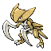

**XP**: 201 / PERCENT_FEMALE(12.5)

|         |         |         |         |         |         |         |         |
|---------|---------|---------|---------|---------|---------|---------|---------|
| **type1** | TYPE_GROUND | **type2** | TYPE_WATER | **catchRate** | 45 | **safariZoneFleeRate** | 0 |
| **baseAttack** | 115 | **baseSpAttack** | 65 | **evYield_Attack** | 2 | **evYield_SpAttack** | 0 |
| **baseDefense** | 105 | **baseSpDefense** | 70 | **evYield_Defense** | 0 | **evYield_SpDefense** | 0 |
| **baseHP** | 60 | **baseSpeed** | 80 | **evYield_HP** | 0 | **evYield_SpDefense** | 0 |
| **eggGroup1** | EGG_GROUP_WATER_1 | **eggGroup2** | EGG_GROUP_WATER_3 | **eggCycles** | 30 | **friendship** | 70 |
| **item1** | ITEM_NONE | **item2** | ITEM_NONE | **abilities** | ABILITY_SWIFT_SWIM | **growthRate** | GROWTH_MEDIUM_FAST |

**Found at:** 

| Level | Move Name |
|---------|---------|
| 1 | Leer |
| 13 | Absorb |
| 19 | Leer |
| 25 | Mud shot |
| 31 | Sand attack |
| 37 | Endure |
| 40 | Slash |
| 46 | Metal sound |
| 55 | Mega drain |
| 65 | Ancient power |

| TM or HM |
|---------|
| Tm03 water pulse |
| Tm06 toxic |
| Tm07 hail |
| Tm10 hidden power |
| Tm13 ice beam |
| Tm14 blizzard |
| Tm15 hyper beam |
| Tm17 protect |
| Tm18 rain dance |
| Tm19 giga drain |
| Tm21 frustration |
| Tm27 return |
| Tm28 dig |
| Tm31 brick break |
| Tm32 double team |
| Tm37 sandstorm |
| Tm39 rock tomb |
| Tm40 aerial ace |
| Tm42 facade |
| Tm43 secret power |
| Tm44 rest |
| Tm45 attract |
| Tm46 thief |
| Hm01 cut |
| Hm03 surf |
| Hm06 rock smash |
| Hm07 waterfall |
| Hm08 dive |

### AERODACTYL

**XP**: 202 / PERCENT_FEMALE(12.5)

|         |         |         |         |         |         |         |         |
|---------|---------|---------|---------|---------|---------|---------|---------|
| **type1** | TYPE_ROCK | **type2** | TYPE_FLYING | **catchRate** | 45 | **safariZoneFleeRate** | 0 |
| **baseAttack** | 105 | **baseSpAttack** | 60 | **evYield_Attack** | 0 | **evYield_SpAttack** | 0 |
| **baseDefense** | 65 | **baseSpDefense** | 75 | **evYield_Defense** | 0 | **evYield_SpDefense** | 0 |
| **baseHP** | 80 | **baseSpeed** | 130 | **evYield_HP** | 0 | **evYield_SpDefense** | 0 |
| **eggGroup1** | EGG_GROUP_FLYING | **eggGroup2** | EGG_GROUP_FLYING | **eggCycles** | 35 | **friendship** | 70 |
| **item1** | ITEM_NONE | **item2** | ITEM_NONE | **abilities** | ABILITY_ROCK_HEAD | **growthRate** | GROWTH_SLOW |

**Found at:** 

| Level | Move Name |
|---------|---------|
| 1 | Wing attack |
| 8 | Agility |
| 15 | Bite |
| 22 | Supersonic |
| 29 | Ancient power |
| 36 | Scary face |
| 43 | Take down |
| 50 | Hyper beam |

| TM or HM |
|---------|
| Tm02 dragon claw |
| Tm05 roar |
| Tm06 toxic |
| Tm10 hidden power |
| Tm11 sunny day |
| Tm12 taunt |
| Tm15 hyper beam |
| Tm17 protect |
| Tm18 rain dance |
| Tm21 frustration |
| Tm23 iron tail |
| Tm26 earthquake |
| Tm27 return |
| Tm32 double team |
| Tm35 flamethrower |
| Tm37 sandstorm |
| Tm38 fire blast |
| Tm39 rock tomb |
| Tm40 aerial ace |
| Tm41 torment |
| Tm42 facade |
| Tm43 secret power |
| Tm44 rest |
| Tm45 attract |
| Tm46 thief |
| Tm47 steel wing |
| Hm02 fly |
| Hm04 strength |
| Hm06 rock smash |

### SNORLAX

**XP**: 154 / PERCENT_FEMALE(12.5)

|         |         |         |         |         |         |         |         |
|---------|---------|---------|---------|---------|---------|---------|---------|
| **type1** | TYPE_NORMAL | **type2** | TYPE_NORMAL | **catchRate** | 25 | **safariZoneFleeRate** | 0 |
| **baseAttack** | 110 | **baseSpAttack** | 65 | **evYield_Attack** | 0 | **evYield_SpAttack** | 0 |
| **baseDefense** | 65 | **baseSpDefense** | 110 | **evYield_Defense** | 0 | **evYield_SpDefense** | 0 |
| **baseHP** | 160 | **baseSpeed** | 30 | **evYield_HP** | 2 | **evYield_SpDefense** | 0 |
| **eggGroup1** | EGG_GROUP_MONSTER | **eggGroup2** | EGG_GROUP_MONSTER | **eggCycles** | 40 | **friendship** | 70 |
| **item1** | ITEM_CHESTO_BERRY | **item2** | ITEM_CHESTO_BERRY | **abilities** | ABILITY_IMMUNITY | **growthRate** | GROWTH_SLOW |

**Found at:** 

| Level | Move Name |
|---------|---------|
| 1 | Tackle |
| 5 | Amnesia |
| 9 | Defense curl |
| 13 | Belly drum |
| 17 | Headbutt |
| 21 | Yawn |
| 25 | Rest |
| 29 | Snore |
| 33 | Body slam |
| 37 | Sleep talk |
| 41 | Block |
| 45 | Covet |
| 49 | Rollout |
| 53 | Hyper beam |

| TM or HM |
|---------|
| Tm01 focus punch |
| Tm03 water pulse |
| Tm06 toxic |
| Tm10 hidden power |
| Tm11 sunny day |
| Tm13 ice beam |
| Tm14 blizzard |
| Tm15 hyper beam |
| Tm17 protect |
| Tm18 rain dance |
| Tm21 frustration |
| Tm22 solar beam |
| Tm24 thunderbolt |
| Tm25 thunder |
| Tm26 earthquake |
| Tm27 return |
| Tm29 psychic |
| Tm30 shadow ball |
| Tm31 brick break |
| Tm32 double team |
| Tm34 shock wave |
| Tm35 flamethrower |
| Tm37 sandstorm |
| Tm38 fire blast |
| Tm39 rock tomb |
| Tm42 facade |
| Tm43 secret power |
| Tm44 rest |
| Tm45 attract |
| Hm03 surf |
| Hm04 strength |

### ARTICUNO

**XP**: 215 / MON_GENDERLESS

|         |         |         |         |         |         |         |         |
|---------|---------|---------|---------|---------|---------|---------|---------|
| **type1** | TYPE_ICE | **type2** | TYPE_FLYING | **catchRate** | 3 | **safariZoneFleeRate** | 0 |
| **baseAttack** | 85 | **baseSpAttack** | 95 | **evYield_Attack** | 0 | **evYield_SpAttack** | 0 |
| **baseDefense** | 100 | **baseSpDefense** | 125 | **evYield_Defense** | 0 | **evYield_SpDefense** | 3 |
| **baseHP** | 90 | **baseSpeed** | 85 | **evYield_HP** | 0 | **evYield_SpDefense** | 3 |
| **eggGroup1** | EGG_GROUP_UNDISCOVERED | **eggGroup2** | EGG_GROUP_UNDISCOVERED | **eggCycles** | 80 | **friendship** | 35 |
| **item1** | ITEM_NONE | **item2** | ITEM_NONE | **abilities** | ABILITY_PRESSURE | **growthRate** | GROWTH_SLOW |

**Found at:** 

| Level | Move Name |
|---------|---------|
| 1 | Powder snow |
| 13 | Mist |
| 25 | Agility |
| 37 | Mind reader |
| 49 | Ice beam |
| 61 | Reflect |
| 73 | Blizzard |
| 85 | Sheer cold |

| TM or HM |
|---------|
| Tm03 water pulse |
| Tm05 roar |
| Tm06 toxic |
| Tm07 hail |
| Tm10 hidden power |
| Tm11 sunny day |
| Tm13 ice beam |
| Tm14 blizzard |
| Tm15 hyper beam |
| Tm17 protect |
| Tm18 rain dance |
| Tm21 frustration |
| Tm27 return |
| Tm32 double team |
| Tm33 reflect |
| Tm37 sandstorm |
| Tm40 aerial ace |
| Tm42 facade |
| Tm43 secret power |
| Tm44 rest |
| Tm47 steel wing |
| Hm02 fly |
| Hm06 rock smash |

### ZAPDOS

**XP**: 216 / MON_GENDERLESS

|         |         |         |         |         |         |         |         |
|---------|---------|---------|---------|---------|---------|---------|---------|
| **type1** | TYPE_ELECTRIC | **type2** | TYPE_FLYING | **catchRate** | 3 | **safariZoneFleeRate** | 0 |
| **baseAttack** | 90 | **baseSpAttack** | 125 | **evYield_Attack** | 0 | **evYield_SpAttack** | 3 |
| **baseDefense** | 85 | **baseSpDefense** | 90 | **evYield_Defense** | 0 | **evYield_SpDefense** | 0 |
| **baseHP** | 90 | **baseSpeed** | 100 | **evYield_HP** | 0 | **evYield_SpDefense** | 0 |
| **eggGroup1** | EGG_GROUP_UNDISCOVERED | **eggGroup2** | EGG_GROUP_UNDISCOVERED | **eggCycles** | 80 | **friendship** | 35 |
| **item1** | ITEM_NONE | **item2** | ITEM_NONE | **abilities** | ABILITY_PRESSURE | **growthRate** | GROWTH_SLOW |

**Found at:** 

| Level | Move Name |
|---------|---------|
| 1 | Thunder shock |
| 13 | Thunder wave |
| 25 | Agility |
| 37 | Detect |
| 49 | Drill peck |
| 61 | Charge |
| 73 | Light screen |
| 85 | Thunder |

| TM or HM |
|---------|
| Tm05 roar |
| Tm06 toxic |
| Tm10 hidden power |
| Tm11 sunny day |
| Tm15 hyper beam |
| Tm16 light screen |
| Tm17 protect |
| Tm18 rain dance |
| Tm21 frustration |
| Tm24 thunderbolt |
| Tm25 thunder |
| Tm27 return |
| Tm32 double team |
| Tm34 shock wave |
| Tm37 sandstorm |
| Tm40 aerial ace |
| Tm42 facade |
| Tm43 secret power |
| Tm44 rest |
| Tm47 steel wing |
| Hm02 fly |
| Hm05 flash |
| Hm06 rock smash |

### MOLTRES

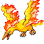

**XP**: 217 / MON_GENDERLESS

|         |         |         |         |         |         |         |         |
|---------|---------|---------|---------|---------|---------|---------|---------|
| **type1** | TYPE_FIRE | **type2** | TYPE_FLYING | **catchRate** | 3 | **safariZoneFleeRate** | 0 |
| **baseAttack** | 100 | **baseSpAttack** | 125 | **evYield_Attack** | 0 | **evYield_SpAttack** | 3 |
| **baseDefense** | 90 | **baseSpDefense** | 85 | **evYield_Defense** | 0 | **evYield_SpDefense** | 0 |
| **baseHP** | 90 | **baseSpeed** | 90 | **evYield_HP** | 0 | **evYield_SpDefense** | 0 |
| **eggGroup1** | EGG_GROUP_UNDISCOVERED | **eggGroup2** | EGG_GROUP_UNDISCOVERED | **eggCycles** | 80 | **friendship** | 35 |
| **item1** | ITEM_NONE | **item2** | ITEM_NONE | **abilities** | ABILITY_PRESSURE | **growthRate** | GROWTH_SLOW |

**Found at:** 

| Level | Move Name |
|---------|---------|
| 1 | Ember |
| 13 | Fire spin |
| 25 | Agility |
| 37 | Endure |
| 49 | Flamethrower |
| 61 | Safeguard |
| 73 | Fire blast |
| 85 | Sky attack |

| TM or HM |
|---------|
| Tm05 roar |
| Tm06 toxic |
| Tm10 hidden power |
| Tm11 sunny day |
| Tm15 hyper beam |
| Tm17 protect |
| Tm18 rain dance |
| Tm20 safeguard |
| Tm21 frustration |
| Tm27 return |
| Tm32 double team |
| Tm35 flamethrower |
| Tm37 sandstorm |
| Tm38 fire blast |
| Tm40 aerial ace |
| Tm42 facade |
| Tm43 secret power |
| Tm44 rest |
| Tm47 steel wing |
| Tm50 overheat |
| Hm02 fly |
| Hm06 rock smash |

### DRATINI

**XP**: 67 / PERCENT_FEMALE(50)

|         |         |         |         |         |         |         |         |
|---------|---------|---------|---------|---------|---------|---------|---------|
| **type1** | TYPE_DRAGON | **type2** | TYPE_DRAGON | **catchRate** | 45 | **safariZoneFleeRate** | 100 |
| **baseAttack** | 64 | **baseSpAttack** | 50 | **evYield_Attack** | 1 | **evYield_SpAttack** | 0 |
| **baseDefense** | 45 | **baseSpDefense** | 50 | **evYield_Defense** | 0 | **evYield_SpDefense** | 0 |
| **baseHP** | 41 | **baseSpeed** | 50 | **evYield_HP** | 0 | **evYield_SpDefense** | 0 |
| **eggGroup1** | EGG_GROUP_WATER_1 | **eggGroup2** | EGG_GROUP_DRAGON | **eggCycles** | 40 | **friendship** | 35 |
| **item1** | ITEM_NONE | **item2** | ITEM_NONE | **abilities** | ABILITY_SHED_SKIN | **growthRate** | GROWTH_SLOW |

**Found at:** MAP_SAFARI_ZONE_WEST, MAP_SAFARI_ZONE_NORTH, MAP_SAFARI_ZONE_EAST, MAP_SAFARI_ZONE_CENTER

| Level | Move Name |
|---------|---------|
| 1 | Leer |
| 8 | Thunder wave |
| 15 | Twister |
| 22 | Dragon rage |
| 29 | Slam |
| 36 | Agility |
| 43 | Safeguard |
| 50 | Outrage |
| 57 | Hyper beam |

| TM or HM |
|---------|
| Tm03 water pulse |
| Tm06 toxic |
| Tm07 hail |
| Tm10 hidden power |
| Tm11 sunny day |
| Tm13 ice beam |
| Tm14 blizzard |
| Tm15 hyper beam |
| Tm17 protect |
| Tm18 rain dance |
| Tm20 safeguard |
| Tm21 frustration |
| Tm23 iron tail |
| Tm24 thunderbolt |
| Tm25 thunder |
| Tm27 return |
| Tm32 double team |
| Tm34 shock wave |
| Tm35 flamethrower |
| Tm38 fire blast |
| Tm42 facade |
| Tm43 secret power |
| Tm44 rest |
| Tm45 attract |
| Hm03 surf |
| Hm07 waterfall |

### DRAGONAIR

**XP**: 144 / PERCENT_FEMALE(50)

|         |         |         |         |         |         |         |         |
|---------|---------|---------|---------|---------|---------|---------|---------|
| **type1** | TYPE_DRAGON | **type2** | TYPE_DRAGON | **catchRate** | 45 | **safariZoneFleeRate** | 125 |
| **baseAttack** | 84 | **baseSpAttack** | 70 | **evYield_Attack** | 2 | **evYield_SpAttack** | 0 |
| **baseDefense** | 65 | **baseSpDefense** | 70 | **evYield_Defense** | 0 | **evYield_SpDefense** | 0 |
| **baseHP** | 61 | **baseSpeed** | 70 | **evYield_HP** | 0 | **evYield_SpDefense** | 0 |
| **eggGroup1** | EGG_GROUP_WATER_1 | **eggGroup2** | EGG_GROUP_DRAGON | **eggCycles** | 40 | **friendship** | 35 |
| **item1** | ITEM_NONE | **item2** | ITEM_DRAGON_FANG | **abilities** | ABILITY_SHED_SKIN | **growthRate** | GROWTH_SLOW |

**Found at:** MAP_SAFARI_ZONE_WEST, MAP_SAFARI_ZONE_NORTH, MAP_SAFARI_ZONE_EAST, MAP_SAFARI_ZONE_CENTER

| Level | Move Name |
|---------|---------|
| 1 | Twister |
| 8 | Thunder wave |
| 15 | Twister |
| 22 | Dragon rage |
| 29 | Slam |
| 38 | Agility |
| 47 | Safeguard |
| 56 | Outrage |
| 65 | Hyper beam |

| TM or HM |
|---------|
| Tm03 water pulse |
| Tm06 toxic |
| Tm07 hail |
| Tm10 hidden power |
| Tm11 sunny day |
| Tm13 ice beam |
| Tm14 blizzard |
| Tm15 hyper beam |
| Tm17 protect |
| Tm18 rain dance |
| Tm20 safeguard |
| Tm21 frustration |
| Tm23 iron tail |
| Tm24 thunderbolt |
| Tm25 thunder |
| Tm27 return |
| Tm32 double team |
| Tm34 shock wave |
| Tm35 flamethrower |
| Tm38 fire blast |
| Tm42 facade |
| Tm43 secret power |
| Tm44 rest |
| Tm45 attract |
| Hm03 surf |
| Hm07 waterfall |

### DRAGONITE

**XP**: 218 / PERCENT_FEMALE(50)

|         |         |         |         |         |         |         |         |
|---------|---------|---------|---------|---------|---------|---------|---------|
| **type1** | TYPE_DRAGON | **type2** | TYPE_FLYING | **catchRate** | 45 | **safariZoneFleeRate** | 0 |
| **baseAttack** | 134 | **baseSpAttack** | 100 | **evYield_Attack** | 3 | **evYield_SpAttack** | 0 |
| **baseDefense** | 95 | **baseSpDefense** | 100 | **evYield_Defense** | 0 | **evYield_SpDefense** | 0 |
| **baseHP** | 91 | **baseSpeed** | 80 | **evYield_HP** | 0 | **evYield_SpDefense** | 0 |
| **eggGroup1** | EGG_GROUP_WATER_1 | **eggGroup2** | EGG_GROUP_DRAGON | **eggCycles** | 40 | **friendship** | 35 |
| **item1** | ITEM_NONE | **item2** | ITEM_DRAGON_FANG | **abilities** | ABILITY_INNER_FOCUS | **growthRate** | GROWTH_SLOW |

**Found at:** 

| Level | Move Name |
|---------|---------|
| 1 | Twister |
| 8 | Thunder wave |
| 15 | Twister |
| 22 | Dragon rage |
| 29 | Slam |
| 38 | Agility |
| 47 | Safeguard |
| 55 | Wing attack |
| 61 | Outrage |
| 75 | Hyper beam |

| TM or HM |
|---------|
| Tm01 focus punch |
| Tm02 dragon claw |
| Tm03 water pulse |
| Tm05 roar |
| Tm06 toxic |
| Tm07 hail |
| Tm10 hidden power |
| Tm11 sunny day |
| Tm13 ice beam |
| Tm14 blizzard |
| Tm15 hyper beam |
| Tm17 protect |
| Tm18 rain dance |
| Tm20 safeguard |
| Tm21 frustration |
| Tm23 iron tail |
| Tm24 thunderbolt |
| Tm25 thunder |
| Tm26 earthquake |
| Tm27 return |
| Tm31 brick break |
| Tm32 double team |
| Tm34 shock wave |
| Tm35 flamethrower |
| Tm37 sandstorm |
| Tm38 fire blast |
| Tm39 rock tomb |
| Tm40 aerial ace |
| Tm42 facade |
| Tm43 secret power |
| Tm44 rest |
| Tm45 attract |
| Tm47 steel wing |
| Hm01 cut |
| Hm02 fly |
| Hm03 surf |
| Hm04 strength |
| Hm06 rock smash |
| Hm07 waterfall |
| Hm08 dive |

### MEWTWO

**XP**: 220 / MON_GENDERLESS

|         |         |         |         |         |         |         |         |
|---------|---------|---------|---------|---------|---------|---------|---------|
| **type1** | TYPE_PSYCHIC | **type2** | TYPE_PSYCHIC | **catchRate** | 3 | **safariZoneFleeRate** | 0 |
| **baseAttack** | 110 | **baseSpAttack** | 154 | **evYield_Attack** | 0 | **evYield_SpAttack** | 3 |
| **baseDefense** | 90 | **baseSpDefense** | 90 | **evYield_Defense** | 0 | **evYield_SpDefense** | 0 |
| **baseHP** | 106 | **baseSpeed** | 130 | **evYield_HP** | 0 | **evYield_SpDefense** | 0 |
| **eggGroup1** | EGG_GROUP_UNDISCOVERED | **eggGroup2** | EGG_GROUP_UNDISCOVERED | **eggCycles** | 120 | **friendship** | 0 |
| **item1** | ITEM_NONE | **item2** | ITEM_NONE | **abilities** | ABILITY_PRESSURE | **growthRate** | GROWTH_SLOW |

**Found at:** 

| Level | Move Name |
|---------|---------|
| 1 | Disable |
| 11 | Barrier |
| 22 | Mist |
| 33 | Swift |
| 44 | Recover |
| 55 | Safeguard |
| 66 | Psychic |
| 77 | Psych up |
| 88 | Future sight |
| 99 | Amnesia |

| TM or HM |
|---------|
| Tm01 focus punch |
| Tm03 water pulse |
| Tm04 calm mind |
| Tm06 toxic |
| Tm07 hail |
| Tm08 bulk up |
| Tm10 hidden power |
| Tm11 sunny day |
| Tm12 taunt |
| Tm13 ice beam |
| Tm14 blizzard |
| Tm15 hyper beam |
| Tm16 light screen |
| Tm17 protect |
| Tm18 rain dance |
| Tm20 safeguard |
| Tm21 frustration |
| Tm22 solar beam |
| Tm23 iron tail |
| Tm24 thunderbolt |
| Tm25 thunder |
| Tm26 earthquake |
| Tm27 return |
| Tm29 psychic |
| Tm30 shadow ball |
| Tm31 brick break |
| Tm32 double team |
| Tm33 reflect |
| Tm34 shock wave |
| Tm35 flamethrower |
| Tm37 sandstorm |
| Tm38 fire blast |
| Tm39 rock tomb |
| Tm40 aerial ace |
| Tm41 torment |
| Tm42 facade |
| Tm43 secret power |
| Tm44 rest |
| Tm48 skill swap |
| Tm49 snatch |
| Hm04 strength |
| Hm05 flash |
| Hm06 rock smash |

### MEW

**XP**: 64 / MON_GENDERLESS

|         |         |         |         |         |         |         |         |
|---------|---------|---------|---------|---------|---------|---------|---------|
| **type1** | TYPE_PSYCHIC | **type2** | TYPE_PSYCHIC | **catchRate** | 45 | **safariZoneFleeRate** | 0 |
| **baseAttack** | 100 | **baseSpAttack** | 100 | **evYield_Attack** | 0 | **evYield_SpAttack** | 0 |
| **baseDefense** | 100 | **baseSpDefense** | 100 | **evYield_Defense** | 0 | **evYield_SpDefense** | 0 |
| **baseHP** | 100 | **baseSpeed** | 100 | **evYield_HP** | 3 | **evYield_SpDefense** | 0 |
| **eggGroup1** | EGG_GROUP_UNDISCOVERED | **eggGroup2** | EGG_GROUP_UNDISCOVERED | **eggCycles** | 120 | **friendship** | 100 |
| **item1** | ITEM_NONE | **item2** | ITEM_NONE | **abilities** | ABILITY_SYNCHRONIZE | **growthRate** | GROWTH_MEDIUM_SLOW |

**Found at:** 

| Level | Move Name |
|---------|---------|
| 1 | Pound |
| 10 | Transform |
| 20 | Mega punch |
| 30 | Metronome |
| 40 | Psychic |
| 50 | Ancient power |

| TM or HM |
|---------|
| Tm01 focus punch |
| Tm02 dragon claw |
| Tm03 water pulse |
| Tm04 calm mind |
| Tm05 roar |
| Tm06 toxic |
| Tm07 hail |
| Tm08 bulk up |
| Tm09 bullet seed |
| Tm10 hidden power |
| Tm11 sunny day |
| Tm12 taunt |
| Tm13 ice beam |
| Tm14 blizzard |
| Tm15 hyper beam |
| Tm16 light screen |
| Tm17 protect |
| Tm18 rain dance |
| Tm19 giga drain |
| Tm20 safeguard |
| Tm21 frustration |
| Tm22 solar beam |
| Tm23 iron tail |
| Tm24 thunderbolt |
| Tm25 thunder |
| Tm26 earthquake |
| Tm27 return |
| Tm28 dig |
| Tm29 psychic |
| Tm30 shadow ball |
| Tm31 brick break |
| Tm32 double team |
| Tm33 reflect |
| Tm34 shock wave |
| Tm35 flamethrower |
| Tm36 sludge bomb |
| Tm37 sandstorm |
| Tm38 fire blast |
| Tm39 rock tomb |
| Tm40 aerial ace |
| Tm41 torment |
| Tm42 facade |
| Tm43 secret power |
| Tm44 rest |
| Tm45 attract |
| Tm46 thief |
| Tm47 steel wing |
| Tm48 skill swap |
| Tm49 snatch |
| Tm50 overheat |
| Hm01 cut |
| Hm02 fly |
| Hm03 surf |
| Hm04 strength |
| Hm05 flash |
| Hm06 rock smash |
| Hm07 waterfall |
| Hm08 dive |

### LANTURN

**XP**: 156 / PERCENT_FEMALE(50)

|         |         |         |         |         |         |         |         |
|---------|---------|---------|---------|---------|---------|---------|---------|
| **type1** | TYPE_WATER | **type2** | TYPE_ELECTRIC | **catchRate** | 90 | **safariZoneFleeRate** | 0 |
| **baseAttack** | 58 | **baseSpAttack** | 76 | **evYield_Attack** | 0 | **evYield_SpAttack** | 0 |
| **baseDefense** | 58 | **baseSpDefense** | 76 | **evYield_Defense** | 0 | **evYield_SpDefense** | 0 |
| **baseHP** | 125 | **baseSpeed** | 67 | **evYield_HP** | 2 | **evYield_SpDefense** | 0 |
| **eggGroup1** | EGG_GROUP_WATER_2 | **eggGroup2** | EGG_GROUP_WATER_2 | **eggCycles** | 20 | **friendship** | 70 |
| **item1** | ITEM_NONE | **item2** | ITEM_YELLOW_SHARD | **abilities** | ABILITY_VOLT_ABSORB | **growthRate** | GROWTH_SLOW |

**Found at:** MAP_ROUTE10, MAP_ROUTE4, MAP_ROUTE24, MAP_ROUTE18, MAP_SIX_ISLAND_OUTCAST_ISLAND, MAP_CERULEAN_CITY

| Level | Move Name |
|---------|---------|
| 1 | Supersonic |
| 5 | Supersonic |
| 13 | Flail |
| 17 | Water gun |
| 25 | Spark |
| 32 | Confuse ray |
| 43 | Take down |
| 50 | Hydro pump |
| 61 | Charge |

| TM or HM |
|---------|
| Tm03 water pulse |
| Tm06 toxic |
| Tm07 hail |
| Tm10 hidden power |
| Tm13 ice beam |
| Tm14 blizzard |
| Tm15 hyper beam |
| Tm17 protect |
| Tm18 rain dance |
| Tm21 frustration |
| Tm24 thunderbolt |
| Tm25 thunder |
| Tm27 return |
| Tm32 double team |
| Tm34 shock wave |
| Tm42 facade |
| Tm43 secret power |
| Tm44 rest |
| Tm45 attract |
| Hm03 surf |
| Hm05 flash |
| Hm07 waterfall |
| Hm08 dive |

### PICHU

**XP**: 42 / PERCENT_FEMALE(50)

|         |         |         |         |         |         |         |         |
|---------|---------|---------|---------|---------|---------|---------|---------|
| **type1** | TYPE_ELECTRIC | **type2** | TYPE_ELECTRIC | **catchRate** | 190 | **safariZoneFleeRate** | 0 |
| **baseAttack** | 40 | **baseSpAttack** | 45 | **evYield_Attack** | 0 | **evYield_SpAttack** | 0 |
| **baseDefense** | 15 | **baseSpDefense** | 35 | **evYield_Defense** | 0 | **evYield_SpDefense** | 0 |
| **baseHP** | 20 | **baseSpeed** | 60 | **evYield_HP** | 0 | **evYield_SpDefense** | 0 |
| **eggGroup1** | EGG_GROUP_UNDISCOVERED | **eggGroup2** | EGG_GROUP_UNDISCOVERED | **eggCycles** | 10 | **friendship** | 70 |
| **item1** | ITEM_NONE | **item2** | ITEM_NONE | **abilities** | ABILITY_STATIC | **growthRate** | GROWTH_MEDIUM_FAST |

**Found at:** MAP_VIRIDIAN_FOREST

| Level | Move Name |
|---------|---------|
| 1 | Charm |
| 6 | Tail whip |
| 8 | Thunder wave |
| 11 | Sweet kiss |

| TM or HM |
|---------|
| Tm06 toxic |
| Tm10 hidden power |
| Tm16 light screen |
| Tm17 protect |
| Tm18 rain dance |
| Tm21 frustration |
| Tm23 iron tail |
| Tm24 thunderbolt |
| Tm25 thunder |
| Tm27 return |
| Tm32 double team |
| Tm34 shock wave |
| Tm42 facade |
| Tm43 secret power |
| Tm44 rest |
| Tm45 attract |
| Hm05 flash |

### TOGEPI

**XP**: 74 / PERCENT_FEMALE(12.5)

|         |         |         |         |         |         |         |         |
|---------|---------|---------|---------|---------|---------|---------|---------|
| **type1** | TYPE_NORMAL | **type2** | TYPE_NORMAL | **catchRate** | 190 | **safariZoneFleeRate** | 0 |
| **baseAttack** | 20 | **baseSpAttack** | 40 | **evYield_Attack** | 0 | **evYield_SpAttack** | 0 |
| **baseDefense** | 65 | **baseSpDefense** | 65 | **evYield_Defense** | 0 | **evYield_SpDefense** | 1 |
| **baseHP** | 35 | **baseSpeed** | 20 | **evYield_HP** | 0 | **evYield_SpDefense** | 1 |
| **eggGroup1** | EGG_GROUP_UNDISCOVERED | **eggGroup2** | EGG_GROUP_UNDISCOVERED | **eggCycles** | 10 | **friendship** | 70 |
| **item1** | ITEM_NONE | **item2** | ITEM_NONE | **abilities** | ABILITY_HUSTLE | **growthRate** | GROWTH_FAST |

**Found at:** 

| Level | Move Name |
|---------|---------|
| 1 | Charm |
| 4 | Metronome |
| 9 | Sweet kiss |
| 13 | Yawn |
| 17 | Encore |
| 21 | Ancient power |
| 25 | Follow me |
| 29 | Wish |
| 33 | Safeguard |
| 37 | Double edge |
| 41 | Baton pass |

| TM or HM |
|---------|
| Tm03 water pulse |
| Tm06 toxic |
| Tm10 hidden power |
| Tm11 sunny day |
| Tm16 light screen |
| Tm17 protect |
| Tm18 rain dance |
| Tm20 safeguard |
| Tm21 frustration |
| Tm22 solar beam |
| Tm27 return |
| Tm29 psychic |
| Tm30 shadow ball |
| Tm32 double team |
| Tm33 reflect |
| Tm34 shock wave |
| Tm35 flamethrower |
| Tm38 fire blast |
| Tm42 facade |
| Tm43 secret power |
| Tm44 rest |
| Tm45 attract |
| Hm05 flash |
| Hm06 rock smash |

### XATU

**XP**: 171 / PERCENT_FEMALE(50)

|         |         |         |         |         |         |         |         |
|---------|---------|---------|---------|---------|---------|---------|---------|
| **type1** | TYPE_PSYCHIC | **type2** | TYPE_FLYING | **catchRate** | 80 | **safariZoneFleeRate** | 0 |
| **baseAttack** | 75 | **baseSpAttack** | 95 | **evYield_Attack** | 0 | **evYield_SpAttack** | 1 |
| **baseDefense** | 70 | **baseSpDefense** | 70 | **evYield_Defense** | 0 | **evYield_SpDefense** | 0 |
| **baseHP** | 65 | **baseSpeed** | 95 | **evYield_HP** | 0 | **evYield_SpDefense** | 0 |
| **eggGroup1** | EGG_GROUP_FLYING | **eggGroup2** | EGG_GROUP_FLYING | **eggCycles** | 20 | **friendship** | 70 |
| **item1** | ITEM_NONE | **item2** | ITEM_NONE | **abilities** | ABILITY_SYNCHRONIZE | **growthRate** | GROWTH_MEDIUM_FAST |

**Found at:** MAP_ONE_ISLAND_TREASURE_BEACH

| Level | Move Name |
|---------|---------|
| 1 | Leer |
| 10 | Night shade |
| 20 | Teleport |
| 35 | Future sight |
| 50 | Confuse ray |
| 65 | Psychic |

| TM or HM |
|---------|
| Tm04 calm mind |
| Tm06 toxic |
| Tm10 hidden power |
| Tm11 sunny day |
| Tm15 hyper beam |
| Tm16 light screen |
| Tm17 protect |
| Tm18 rain dance |
| Tm19 giga drain |
| Tm21 frustration |
| Tm22 solar beam |
| Tm27 return |
| Tm29 psychic |
| Tm30 shadow ball |
| Tm32 double team |
| Tm33 reflect |
| Tm40 aerial ace |
| Tm42 facade |
| Tm43 secret power |
| Tm44 rest |
| Tm45 attract |
| Tm46 thief |
| Tm47 steel wing |
| Tm48 skill swap |
| Hm02 fly |
| Hm05 flash |

### MAREEP

**XP**: 59 / PERCENT_FEMALE(50)

|         |         |         |         |         |         |         |         |
|---------|---------|---------|---------|---------|---------|---------|---------|
| **type1** | TYPE_ELECTRIC | **type2** | TYPE_ELECTRIC | **catchRate** | 235 | **safariZoneFleeRate** | 0 |
| **baseAttack** | 40 | **baseSpAttack** | 65 | **evYield_Attack** | 0 | **evYield_SpAttack** | 1 |
| **baseDefense** | 40 | **baseSpDefense** | 45 | **evYield_Defense** | 0 | **evYield_SpDefense** | 0 |
| **baseHP** | 55 | **baseSpeed** | 35 | **evYield_HP** | 0 | **evYield_SpDefense** | 0 |
| **eggGroup1** | EGG_GROUP_MONSTER | **eggGroup2** | EGG_GROUP_FIELD | **eggCycles** | 20 | **friendship** | 70 |
| **item1** | ITEM_NONE | **item2** | ITEM_NONE | **abilities** | ABILITY_STATIC | **growthRate** | GROWTH_MEDIUM_SLOW |

**Found at:** MAP_ROUTE10, MAP_ROUTE1

| Level | Move Name |
|---------|---------|
| 1 | Growl |
| 9 | Thunder shock |
| 16 | Thunder wave |
| 23 | Cotton spore |
| 30 | Light screen |
| 37 | Thunder |

| TM or HM |
|---------|
| Tm06 toxic |
| Tm10 hidden power |
| Tm16 light screen |
| Tm17 protect |
| Tm18 rain dance |
| Tm21 frustration |
| Tm23 iron tail |
| Tm24 thunderbolt |
| Tm25 thunder |
| Tm27 return |
| Tm32 double team |
| Tm34 shock wave |
| Tm42 facade |
| Tm43 secret power |
| Tm44 rest |
| Tm45 attract |
| Hm05 flash |

### FLAAFFY

**XP**: 117 / PERCENT_FEMALE(50)

|         |         |         |         |         |         |         |         |
|---------|---------|---------|---------|---------|---------|---------|---------|
| **type1** | TYPE_ELECTRIC | **type2** | TYPE_ELECTRIC | **catchRate** | 120 | **safariZoneFleeRate** | 0 |
| **baseAttack** | 55 | **baseSpAttack** | 80 | **evYield_Attack** | 0 | **evYield_SpAttack** | 2 |
| **baseDefense** | 55 | **baseSpDefense** | 60 | **evYield_Defense** | 0 | **evYield_SpDefense** | 0 |
| **baseHP** | 70 | **baseSpeed** | 45 | **evYield_HP** | 0 | **evYield_SpDefense** | 0 |
| **eggGroup1** | EGG_GROUP_MONSTER | **eggGroup2** | EGG_GROUP_FIELD | **eggCycles** | 20 | **friendship** | 70 |
| **item1** | ITEM_NONE | **item2** | ITEM_NONE | **abilities** | ABILITY_STATIC | **growthRate** | GROWTH_MEDIUM_SLOW |

**Found at:** MAP_ROUTE10

| Level | Move Name |
|---------|---------|
| 1 | Thunder shock |
| 9 | Thunder shock |
| 18 | Thunder wave |
| 27 | Cotton spore |
| 36 | Light screen |
| 45 | Thunder |

| TM or HM |
|---------|
| Tm01 focus punch |
| Tm06 toxic |
| Tm10 hidden power |
| Tm16 light screen |
| Tm17 protect |
| Tm18 rain dance |
| Tm21 frustration |
| Tm23 iron tail |
| Tm24 thunderbolt |
| Tm25 thunder |
| Tm27 return |
| Tm31 brick break |
| Tm32 double team |
| Tm34 shock wave |
| Tm42 facade |
| Tm43 secret power |
| Tm44 rest |
| Tm45 attract |
| Hm04 strength |
| Hm05 flash |
| Hm06 rock smash |

### AMPHAROS

**XP**: 194 / PERCENT_FEMALE(50)

|         |         |         |         |         |         |         |         |
|---------|---------|---------|---------|---------|---------|---------|---------|
| **type1** | TYPE_ELECTRIC | **type2** | TYPE_ELECTRIC | **catchRate** | 45 | **safariZoneFleeRate** | 0 |
| **baseAttack** | 75 | **baseSpAttack** | 115 | **evYield_Attack** | 0 | **evYield_SpAttack** | 3 |
| **baseDefense** | 75 | **baseSpDefense** | 90 | **evYield_Defense** | 0 | **evYield_SpDefense** | 0 |
| **baseHP** | 90 | **baseSpeed** | 55 | **evYield_HP** | 0 | **evYield_SpDefense** | 0 |
| **eggGroup1** | EGG_GROUP_MONSTER | **eggGroup2** | EGG_GROUP_FIELD | **eggCycles** | 20 | **friendship** | 70 |
| **item1** | ITEM_NONE | **item2** | ITEM_NONE | **abilities** | ABILITY_STATIC | **growthRate** | GROWTH_MEDIUM_SLOW |

**Found at:** MAP_POWER_PLANT, MAP_FIVE_ISLAND_MEMORIAL_PILLAR

| Level | Move Name |
|---------|---------|
| 1 | Thunder wave |
| 9 | Thunder shock |
| 18 | Thunder wave |
| 27 | Cotton spore |
| 30 | Thunder punch |
| 42 | Light screen |
| 57 | Thunder |

| TM or HM |
|---------|
| Tm01 focus punch |
| Tm06 toxic |
| Tm10 hidden power |
| Tm15 hyper beam |
| Tm16 light screen |
| Tm17 protect |
| Tm18 rain dance |
| Tm21 frustration |
| Tm23 iron tail |
| Tm24 thunderbolt |
| Tm25 thunder |
| Tm27 return |
| Tm31 brick break |
| Tm32 double team |
| Tm34 shock wave |
| Tm42 facade |
| Tm43 secret power |
| Tm44 rest |
| Tm45 attract |
| Hm04 strength |
| Hm05 flash |
| Hm06 rock smash |

### ESPEON

**XP**: 197 / PERCENT_FEMALE(12.5)

|         |         |         |         |         |         |         |         |
|---------|---------|---------|---------|---------|---------|---------|---------|
| **type1** | TYPE_PSYCHIC | **type2** | TYPE_PSYCHIC | **catchRate** | 45 | **safariZoneFleeRate** | 0 |
| **baseAttack** | 65 | **baseSpAttack** | 130 | **evYield_Attack** | 0 | **evYield_SpAttack** | 2 |
| **baseDefense** | 60 | **baseSpDefense** | 95 | **evYield_Defense** | 0 | **evYield_SpDefense** | 0 |
| **baseHP** | 65 | **baseSpeed** | 110 | **evYield_HP** | 0 | **evYield_SpDefense** | 0 |
| **eggGroup1** | EGG_GROUP_FIELD | **eggGroup2** | EGG_GROUP_FIELD | **eggCycles** | 35 | **friendship** | 70 |
| **item1** | ITEM_NONE | **item2** | ITEM_NONE | **abilities** | ABILITY_SYNCHRONIZE | **growthRate** | GROWTH_MEDIUM_FAST |

**Found at:** 

| Level | Move Name |
|---------|---------|
| 1 | Helping hand |
| 8 | Sand attack |
| 16 | Confusion |
| 23 | Quick attack |
| 30 | Swift |
| 36 | Psybeam |
| 42 | Psych up |
| 47 | Psychic |
| 52 | Morning sun |

| TM or HM |
|---------|
| Tm04 calm mind |
| Tm06 toxic |
| Tm10 hidden power |
| Tm11 sunny day |
| Tm15 hyper beam |
| Tm16 light screen |
| Tm17 protect |
| Tm18 rain dance |
| Tm21 frustration |
| Tm23 iron tail |
| Tm27 return |
| Tm28 dig |
| Tm29 psychic |
| Tm30 shadow ball |
| Tm32 double team |
| Tm33 reflect |
| Tm42 facade |
| Tm43 secret power |
| Tm44 rest |
| Tm45 attract |
| Tm48 skill swap |
| Hm01 cut |
| Hm05 flash |

### UMBREON

**XP**: 197 / PERCENT_FEMALE(12.5)

|         |         |         |         |         |         |         |         |
|---------|---------|---------|---------|---------|---------|---------|---------|
| **type1** | TYPE_DARK | **type2** | TYPE_DARK | **catchRate** | 45 | **safariZoneFleeRate** | 0 |
| **baseAttack** | 65 | **baseSpAttack** | 60 | **evYield_Attack** | 0 | **evYield_SpAttack** | 0 |
| **baseDefense** | 110 | **baseSpDefense** | 130 | **evYield_Defense** | 0 | **evYield_SpDefense** | 2 |
| **baseHP** | 95 | **baseSpeed** | 65 | **evYield_HP** | 0 | **evYield_SpDefense** | 2 |
| **eggGroup1** | EGG_GROUP_FIELD | **eggGroup2** | EGG_GROUP_FIELD | **eggCycles** | 35 | **friendship** | 35 |
| **item1** | ITEM_NONE | **item2** | ITEM_NONE | **abilities** | ABILITY_SYNCHRONIZE | **growthRate** | GROWTH_MEDIUM_FAST |

**Found at:** 

| Level | Move Name |
|---------|---------|
| 1 | Helping hand |
| 8 | Sand attack |
| 16 | Pursuit |
| 23 | Quick attack |
| 30 | Confuse ray |
| 36 | Faint attack |
| 42 | Mean look |
| 47 | Screech |
| 52 | Moonlight |

| TM or HM |
|---------|
| Tm06 toxic |
| Tm10 hidden power |
| Tm11 sunny day |
| Tm12 taunt |
| Tm15 hyper beam |
| Tm17 protect |
| Tm18 rain dance |
| Tm21 frustration |
| Tm23 iron tail |
| Tm27 return |
| Tm28 dig |
| Tm29 psychic |
| Tm30 shadow ball |
| Tm32 double team |
| Tm41 torment |
| Tm42 facade |
| Tm43 secret power |
| Tm44 rest |
| Tm45 attract |
| Tm49 snatch |
| Hm01 cut |
| Hm05 flash |

### MURKROW

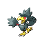

**XP**: 107 / PERCENT_FEMALE(50)

|         |         |         |         |         |         |         |         |
|---------|---------|---------|---------|---------|---------|---------|---------|
| **type1** | TYPE_DARK | **type2** | TYPE_FLYING | **catchRate** | 150 | **safariZoneFleeRate** | 0 |
| **baseAttack** | 85 | **baseSpAttack** | 85 | **evYield_Attack** | 0 | **evYield_SpAttack** | 0 |
| **baseDefense** | 42 | **baseSpDefense** | 42 | **evYield_Defense** | 0 | **evYield_SpDefense** | 0 |
| **baseHP** | 60 | **baseSpeed** | 91 | **evYield_HP** | 0 | **evYield_SpDefense** | 0 |
| **eggGroup1** | EGG_GROUP_FLYING | **eggGroup2** | EGG_GROUP_FLYING | **eggCycles** | 20 | **friendship** | 35 |
| **item1** | ITEM_NONE | **item2** | ITEM_NONE | **abilities** | ABILITY_INSOMNIA | **growthRate** | GROWTH_MEDIUM_SLOW |

**Found at:** MAP_FIVE_ISLAND_LOST_CAVE_ROOM13, MAP_FIVE_ISLAND_LOST_CAVE_ROOM3, MAP_FIVE_ISLAND_LOST_CAVE_ROOM7, MAP_FIVE_ISLAND_LOST_CAVE_ROOM6, MAP_ROUTE15, MAP_THREE_ISLAND_PORT, MAP_FIVE_ISLAND_LOST_CAVE_ROOM1, MAP_FIVE_ISLAND_LOST_CAVE_ROOM14, MAP_FIVE_ISLAND_LOST_CAVE_ROOM2, MAP_FIVE_ISLAND_LOST_CAVE_ROOM12, MAP_FIVE_ISLAND_LOST_CAVE_ROOM4, MAP_FIVE_ISLAND_LOST_CAVE_ROOM10, MAP_ROUTE1, MAP_FIVE_ISLAND_LOST_CAVE_ROOM8, MAP_FIVE_ISLAND_LOST_CAVE_ROOM11, MAP_FIVE_ISLAND_LOST_CAVE_ROOM9, MAP_FIVE_ISLAND_LOST_CAVE_ROOM5

| Level | Move Name |
|---------|---------|
| 1 | Peck |
| 9 | Astonish |
| 14 | Pursuit |
| 22 | Haze |
| 27 | Night shade |
| 35 | Faint attack |
| 40 | Taunt |
| 48 | Mean look |

| TM or HM |
|---------|
| Tm04 calm mind |
| Tm06 toxic |
| Tm10 hidden power |
| Tm11 sunny day |
| Tm12 taunt |
| Tm17 protect |
| Tm18 rain dance |
| Tm21 frustration |
| Tm27 return |
| Tm30 shadow ball |
| Tm32 double team |
| Tm40 aerial ace |
| Tm41 torment |
| Tm42 facade |
| Tm43 secret power |
| Tm44 rest |
| Tm45 attract |
| Tm46 thief |
| Tm47 steel wing |
| Tm49 snatch |
| Hm02 fly |

### MISDREAVUS

**XP**: 147 / PERCENT_FEMALE(50)

|         |         |         |         |         |         |         |         |
|---------|---------|---------|---------|---------|---------|---------|---------|
| **type1** | TYPE_GHOST | **type2** | TYPE_GHOST | **catchRate** | 45 | **safariZoneFleeRate** | 0 |
| **baseAttack** | 60 | **baseSpAttack** | 85 | **evYield_Attack** | 0 | **evYield_SpAttack** | 1 |
| **baseDefense** | 60 | **baseSpDefense** | 85 | **evYield_Defense** | 0 | **evYield_SpDefense** | 1 |
| **baseHP** | 60 | **baseSpeed** | 85 | **evYield_HP** | 0 | **evYield_SpDefense** | 1 |
| **eggGroup1** | EGG_GROUP_AMORPHOUS | **eggGroup2** | EGG_GROUP_AMORPHOUS | **eggCycles** | 25 | **friendship** | 35 |
| **item1** | ITEM_NONE | **item2** | ITEM_SPELL_TAG | **abilities** | ABILITY_LEVITATE | **growthRate** | GROWTH_FAST |

**Found at:** MAP_POKEMON_TOWER_4F, MAP_FIVE_ISLAND_LOST_CAVE_ROOM3, MAP_FIVE_ISLAND_LOST_CAVE_ROOM7, MAP_FIVE_ISLAND_LOST_CAVE_ROOM6, MAP_FIVE_ISLAND_LOST_CAVE_ROOM13, MAP_POKEMON_TOWER_5F, MAP_FIVE_ISLAND_LOST_CAVE_ROOM1, MAP_FIVE_ISLAND_LOST_CAVE_ROOM9, MAP_FIVE_ISLAND_LOST_CAVE_ROOM14, MAP_FIVE_ISLAND_LOST_CAVE_ROOM2, MAP_FIVE_ISLAND_LOST_CAVE_ROOM12, MAP_FIVE_ISLAND_LOST_CAVE_ROOM4, MAP_FIVE_ISLAND_LOST_CAVE_ROOM10, MAP_FIVE_ISLAND_LOST_CAVE_ROOM8, MAP_FIVE_ISLAND_LOST_CAVE_ROOM11, MAP_POKEMON_TOWER_3F, MAP_FIVE_ISLAND_LOST_CAVE_ROOM5

| Level | Move Name |
|---------|---------|
| 1 | Psywave |
| 6 | Spite |
| 11 | Astonish |
| 17 | Confuse ray |
| 23 | Mean look |
| 30 | Psybeam |
| 37 | Pain split |
| 45 | Perish song |
| 53 | Grudge |

| TM or HM |
|---------|
| Tm04 calm mind |
| Tm06 toxic |
| Tm10 hidden power |
| Tm11 sunny day |
| Tm12 taunt |
| Tm17 protect |
| Tm18 rain dance |
| Tm21 frustration |
| Tm24 thunderbolt |
| Tm25 thunder |
| Tm27 return |
| Tm29 psychic |
| Tm30 shadow ball |
| Tm32 double team |
| Tm34 shock wave |
| Tm40 aerial ace |
| Tm41 torment |
| Tm42 facade |
| Tm43 secret power |
| Tm44 rest |
| Tm45 attract |
| Tm46 thief |
| Tm48 skill swap |
| Tm49 snatch |
| Hm05 flash |

### UNOWN

**XP**: 61 / MON_GENDERLESS

|         |         |         |         |         |         |         |         |
|---------|---------|---------|---------|---------|---------|---------|---------|
| **type1** | TYPE_PSYCHIC | **type2** | TYPE_PSYCHIC | **catchRate** | 225 | **safariZoneFleeRate** | 0 |
| **baseAttack** | 72 | **baseSpAttack** | 72 | **evYield_Attack** | 1 | **evYield_SpAttack** | 1 |
| **baseDefense** | 48 | **baseSpDefense** | 48 | **evYield_Defense** | 0 | **evYield_SpDefense** | 0 |
| **baseHP** | 48 | **baseSpeed** | 48 | **evYield_HP** | 0 | **evYield_SpDefense** | 0 |
| **eggGroup1** | EGG_GROUP_UNDISCOVERED | **eggGroup2** | EGG_GROUP_UNDISCOVERED | **eggCycles** | 40 | **friendship** | 70 |
| **item1** | ITEM_NONE | **item2** | ITEM_NONE | **abilities** | ABILITY_LEVITATE | **growthRate** | GROWTH_MEDIUM_FAST |

**Found at:** MAP_SEVEN_ISLAND_TANOBY_RUINS_SCUFIB_CHAMBER, MAP_SEVEN_ISLAND_TANOBY_RUINS_WEEPTH_CHAMBER, MAP_SEVEN_ISLAND_TANOBY_RUINS_LIPTOO_CHAMBER, MAP_SEVEN_ISLAND_TANOBY_RUINS_DILFORD_CHAMBER, MAP_SEVEN_ISLAND_TANOBY_RUINS_MONEAN_CHAMBER, MAP_SEVEN_ISLAND_TANOBY_RUINS_RIXY_CHAMBER, MAP_SEVEN_ISLAND_TANOBY_RUINS_VIAPOIS_CHAMBER

| Level | Move Name |
|---------|---------|
| 1 | Hidden power |

| TM or HM |
|---------|

### WOBBUFFET

**XP**: 177 / PERCENT_FEMALE(50)

|         |         |         |         |         |         |         |         |
|---------|---------|---------|---------|---------|---------|---------|---------|
| **type1** | TYPE_PSYCHIC | **type2** | TYPE_PSYCHIC | **catchRate** | 45 | **safariZoneFleeRate** | 0 |
| **baseAttack** | 33 | **baseSpAttack** | 33 | **evYield_Attack** | 0 | **evYield_SpAttack** | 0 |
| **baseDefense** | 58 | **baseSpDefense** | 58 | **evYield_Defense** | 0 | **evYield_SpDefense** | 0 |
| **baseHP** | 190 | **baseSpeed** | 33 | **evYield_HP** | 2 | **evYield_SpDefense** | 0 |
| **eggGroup1** | EGG_GROUP_AMORPHOUS | **eggGroup2** | EGG_GROUP_AMORPHOUS | **eggCycles** | 20 | **friendship** | 70 |
| **item1** | ITEM_NONE | **item2** | ITEM_NONE | **abilities** | ABILITY_SHADOW_TAG | **growthRate** | GROWTH_MEDIUM_FAST |

**Found at:** MAP_CERULEAN_CAVE_1F, MAP_ROUTE11, MAP_SIX_ISLAND_RUIN_VALLEY, MAP_CERULEAN_CAVE_B1F, MAP_CERULEAN_CAVE_2F

| Level | Move Name |
|---------|---------|
| 1 | Destiny bond |

| TM or HM |
|---------|

### GIRAFARIG

**XP**: 149 / PERCENT_FEMALE(50)

|         |         |         |         |         |         |         |         |
|---------|---------|---------|---------|---------|---------|---------|---------|
| **type1** | TYPE_NORMAL | **type2** | TYPE_PSYCHIC | **catchRate** | 60 | **safariZoneFleeRate** | 0 |
| **baseAttack** | 80 | **baseSpAttack** | 90 | **evYield_Attack** | 0 | **evYield_SpAttack** | 2 |
| **baseDefense** | 65 | **baseSpDefense** | 65 | **evYield_Defense** | 0 | **evYield_SpDefense** | 0 |
| **baseHP** | 70 | **baseSpeed** | 85 | **evYield_HP** | 0 | **evYield_SpDefense** | 0 |
| **eggGroup1** | EGG_GROUP_FIELD | **eggGroup2** | EGG_GROUP_FIELD | **eggCycles** | 20 | **friendship** | 70 |
| **item1** | ITEM_NONE | **item2** | ITEM_PERSIM_BERRY | **abilities** | ABILITY_INNER_FOCUS | **growthRate** | GROWTH_MEDIUM_FAST |

**Found at:** MAP_ROUTE11

| Level | Move Name |
|---------|---------|
| 1 | Growl |
| 7 | Astonish |
| 13 | Confusion |
| 19 | Stomp |
| 25 | Odor sleuth |
| 31 | Agility |
| 37 | Baton pass |
| 43 | Psybeam |
| 49 | Crunch |

| TM or HM |
|---------|
| Tm04 calm mind |
| Tm06 toxic |
| Tm10 hidden power |
| Tm11 sunny day |
| Tm16 light screen |
| Tm17 protect |
| Tm18 rain dance |
| Tm21 frustration |
| Tm23 iron tail |
| Tm24 thunderbolt |
| Tm25 thunder |
| Tm26 earthquake |
| Tm27 return |
| Tm29 psychic |
| Tm30 shadow ball |
| Tm32 double team |
| Tm33 reflect |
| Tm34 shock wave |
| Tm42 facade |
| Tm43 secret power |
| Tm44 rest |
| Tm45 attract |
| Tm46 thief |
| Tm48 skill swap |
| Hm04 strength |
| Hm05 flash |
| Hm06 rock smash |

### GLIGAR

**XP**: 108 / PERCENT_FEMALE(50)

|         |         |         |         |         |         |         |         |
|---------|---------|---------|---------|---------|---------|---------|---------|
| **type1** | TYPE_GROUND | **type2** | TYPE_FLYING | **catchRate** | 60 | **safariZoneFleeRate** | 0 |
| **baseAttack** | 75 | **baseSpAttack** | 35 | **evYield_Attack** | 0 | **evYield_SpAttack** | 0 |
| **baseDefense** | 105 | **baseSpDefense** | 65 | **evYield_Defense** | 1 | **evYield_SpDefense** | 0 |
| **baseHP** | 65 | **baseSpeed** | 85 | **evYield_HP** | 0 | **evYield_SpDefense** | 0 |
| **eggGroup1** | EGG_GROUP_BUG | **eggGroup2** | EGG_GROUP_BUG | **eggCycles** | 20 | **friendship** | 70 |
| **item1** | ITEM_NONE | **item2** | ITEM_NONE | **abilities** | ABILITY_HYPER_CUTTER | **growthRate** | GROWTH_MEDIUM_SLOW |

**Found at:** MAP_MT_MOON_1F, MAP_ROCK_TUNNEL_1F

| Level | Move Name |
|---------|---------|
| 1 | Poison sting |
| 6 | Sand attack |
| 13 | Harden |
| 20 | Quick attack |
| 28 | Faint attack |
| 36 | Slash |
| 44 | Screech |
| 52 | Guillotine |

| TM or HM |
|---------|
| Tm06 toxic |
| Tm10 hidden power |
| Tm11 sunny day |
| Tm17 protect |
| Tm18 rain dance |
| Tm21 frustration |
| Tm23 iron tail |
| Tm26 earthquake |
| Tm27 return |
| Tm28 dig |
| Tm32 double team |
| Tm36 sludge bomb |
| Tm37 sandstorm |
| Tm39 rock tomb |
| Tm40 aerial ace |
| Tm42 facade |
| Tm43 secret power |
| Tm44 rest |
| Tm45 attract |
| Tm46 thief |
| Tm47 steel wing |
| Hm01 cut |
| Hm04 strength |
| Hm06 rock smash |

### HERACROSS

**XP**: 130 / PERCENT_FEMALE(50)

|         |         |         |         |         |         |         |         |
|---------|---------|---------|---------|---------|---------|---------|---------|
| **type1** | TYPE_BUG | **type2** | TYPE_FIGHTING | **catchRate** | 150 | **safariZoneFleeRate** | 0 |
| **baseAttack** | 125 | **baseSpAttack** | 40 | **evYield_Attack** | 2 | **evYield_SpAttack** | 0 |
| **baseDefense** | 75 | **baseSpDefense** | 95 | **evYield_Defense** | 0 | **evYield_SpDefense** | 0 |
| **baseHP** | 80 | **baseSpeed** | 85 | **evYield_HP** | 0 | **evYield_SpDefense** | 0 |
| **eggGroup1** | EGG_GROUP_BUG | **eggGroup2** | EGG_GROUP_BUG | **eggCycles** | 25 | **friendship** | 70 |
| **item1** | ITEM_NONE | **item2** | ITEM_NONE | **abilities** | ABILITY_SWARM | **growthRate** | GROWTH_SLOW |

**Found at:** MAP_SIX_ISLAND_PATTERN_BUSH, MAP_VIRIDIAN_FOREST

| Level | Move Name |
|---------|---------|
| 1 | Leer |
| 6 | Horn attack |
| 11 | Endure |
| 17 | Fury attack |
| 23 | Brick break |
| 30 | Counter |
| 37 | Take down |
| 45 | Reversal |
| 53 | Megahorn |

| TM or HM |
|---------|
| Tm01 focus punch |
| Tm06 toxic |
| Tm08 bulk up |
| Tm10 hidden power |
| Tm11 sunny day |
| Tm15 hyper beam |
| Tm17 protect |
| Tm18 rain dance |
| Tm21 frustration |
| Tm26 earthquake |
| Tm27 return |
| Tm28 dig |
| Tm31 brick break |
| Tm32 double team |
| Tm39 rock tomb |
| Tm42 facade |
| Tm43 secret power |
| Tm44 rest |
| Tm45 attract |
| Tm46 thief |
| Hm01 cut |
| Hm04 strength |
| Hm06 rock smash |

### SNEASEL

**XP**: 132 / PERCENT_FEMALE(50)

|         |         |         |         |         |         |         |         |
|---------|---------|---------|---------|---------|---------|---------|---------|
| **type1** | TYPE_DARK | **type2** | TYPE_ICE | **catchRate** | 60 | **safariZoneFleeRate** | 0 |
| **baseAttack** | 95 | **baseSpAttack** | 35 | **evYield_Attack** | 0 | **evYield_SpAttack** | 0 |
| **baseDefense** | 55 | **baseSpDefense** | 75 | **evYield_Defense** | 0 | **evYield_SpDefense** | 0 |
| **baseHP** | 55 | **baseSpeed** | 115 | **evYield_HP** | 0 | **evYield_SpDefense** | 0 |
| **eggGroup1** | EGG_GROUP_FIELD | **eggGroup2** | EGG_GROUP_FIELD | **eggCycles** | 20 | **friendship** | 35 |
| **item1** | ITEM_NONE | **item2** | ITEM_NONE | **abilities** | ABILITY_INNER_FOCUS | **growthRate** | GROWTH_MEDIUM_SLOW |

**Found at:** MAP_SEAFOAM_ISLANDS_B1F, MAP_FOUR_ISLAND_ICEFALL_CAVE_1F

| Level | Move Name |
|---------|---------|
| 1 | Taunt |
| 8 | Quick attack |
| 15 | Screech |
| 22 | Faint attack |
| 29 | Fury swipes |
| 36 | Agility |
| 43 | Icy wind |
| 50 | Slash |
| 57 | Beat up |
| 64 | Metal claw |

| TM or HM |
|---------|
| Tm01 focus punch |
| Tm04 calm mind |
| Tm06 toxic |
| Tm07 hail |
| Tm10 hidden power |
| Tm11 sunny day |
| Tm12 taunt |
| Tm13 ice beam |
| Tm14 blizzard |
| Tm17 protect |
| Tm18 rain dance |
| Tm21 frustration |
| Tm23 iron tail |
| Tm27 return |
| Tm28 dig |
| Tm30 shadow ball |
| Tm31 brick break |
| Tm32 double team |
| Tm40 aerial ace |
| Tm41 torment |
| Tm42 facade |
| Tm43 secret power |
| Tm44 rest |
| Tm45 attract |
| Tm46 thief |
| Tm49 snatch |
| Hm01 cut |
| Hm03 surf |
| Hm04 strength |
| Hm06 rock smash |

### SLUGMA

**XP**: 78 / PERCENT_FEMALE(50)

|         |         |         |         |         |         |         |         |
|---------|---------|---------|---------|---------|---------|---------|---------|
| **type1** | TYPE_FIRE | **type2** | TYPE_FIRE | **catchRate** | 190 | **safariZoneFleeRate** | 0 |
| **baseAttack** | 40 | **baseSpAttack** | 70 | **evYield_Attack** | 0 | **evYield_SpAttack** | 1 |
| **baseDefense** | 40 | **baseSpDefense** | 40 | **evYield_Defense** | 0 | **evYield_SpDefense** | 0 |
| **baseHP** | 40 | **baseSpeed** | 20 | **evYield_HP** | 0 | **evYield_SpDefense** | 0 |
| **eggGroup1** | EGG_GROUP_AMORPHOUS | **eggGroup2** | EGG_GROUP_AMORPHOUS | **eggCycles** | 20 | **friendship** | 70 |
| **item1** | ITEM_NONE | **item2** | ITEM_NONE | **abilities** | ABILITY_MAGMA_ARMOR | **growthRate** | GROWTH_MEDIUM_FAST |

**Found at:** MAP_MT_EMBER_RUBY_PATH_B2F_STAIRS, MAP_MT_EMBER_RUBY_PATH_B3F, MAP_MT_EMBER_RUBY_PATH_B2F, MAP_MT_EMBER_RUBY_PATH_B1F_STAIRS, MAP_MT_EMBER_RUBY_PATH_B1F

| Level | Move Name |
|---------|---------|
| 1 | Smog |
| 8 | Ember |
| 15 | Rock throw |
| 22 | Harden |
| 29 | Amnesia |
| 36 | Flamethrower |
| 43 | Rock slide |
| 50 | Body slam |

| TM or HM |
|---------|
| Tm06 toxic |
| Tm10 hidden power |
| Tm11 sunny day |
| Tm16 light screen |
| Tm17 protect |
| Tm21 frustration |
| Tm27 return |
| Tm32 double team |
| Tm33 reflect |
| Tm35 flamethrower |
| Tm38 fire blast |
| Tm42 facade |
| Tm43 secret power |
| Tm44 rest |
| Tm45 attract |
| Tm50 overheat |
| Hm06 rock smash |

### MAGCARGO

**XP**: 78 / PERCENT_FEMALE(50)

|         |         |         |         |         |         |         |         |
|---------|---------|---------|---------|---------|---------|---------|---------|
| **type1** | TYPE_FIRE | **type2** | TYPE_ROCK | **catchRate** | 75 | **safariZoneFleeRate** | 0 |
| **baseAttack** | 50 | **baseSpAttack** | 90 | **evYield_Attack** | 0 | **evYield_SpAttack** | 0 |
| **baseDefense** | 120 | **baseSpDefense** | 90 | **evYield_Defense** | 2 | **evYield_SpDefense** | 0 |
| **baseHP** | 65 | **baseSpeed** | 30 | **evYield_HP** | 0 | **evYield_SpDefense** | 0 |
| **eggGroup1** | EGG_GROUP_AMORPHOUS | **eggGroup2** | EGG_GROUP_AMORPHOUS | **eggCycles** | 20 | **friendship** | 70 |
| **item1** | ITEM_NONE | **item2** | ITEM_NONE | **abilities** | ABILITY_MAGMA_ARMOR | **growthRate** | GROWTH_MEDIUM_FAST |

**Found at:** MAP_MT_EMBER_RUBY_PATH_B3F

| Level | Move Name |
|---------|---------|
| 1 | Rock throw |
| 8 | Ember |
| 15 | Rock throw |
| 22 | Harden |
| 29 | Amnesia |
| 36 | Flamethrower |
| 48 | Rock slide |
| 60 | Body slam |

| TM or HM |
|---------|
| Tm06 toxic |
| Tm10 hidden power |
| Tm11 sunny day |
| Tm15 hyper beam |
| Tm16 light screen |
| Tm17 protect |
| Tm21 frustration |
| Tm26 earthquake |
| Tm27 return |
| Tm32 double team |
| Tm33 reflect |
| Tm35 flamethrower |
| Tm37 sandstorm |
| Tm38 fire blast |
| Tm39 rock tomb |
| Tm42 facade |
| Tm43 secret power |
| Tm44 rest |
| Tm45 attract |
| Tm50 overheat |
| Hm04 strength |
| Hm06 rock smash |

### SWINUB

**XP**: 78 / PERCENT_FEMALE(50)

|         |         |         |         |         |         |         |         |
|---------|---------|---------|---------|---------|---------|---------|---------|
| **type1** | TYPE_ICE | **type2** | TYPE_GROUND | **catchRate** | 225 | **safariZoneFleeRate** | 0 |
| **baseAttack** | 50 | **baseSpAttack** | 35 | **evYield_Attack** | 1 | **evYield_SpAttack** | 0 |
| **baseDefense** | 45 | **baseSpDefense** | 35 | **evYield_Defense** | 0 | **evYield_SpDefense** | 0 |
| **baseHP** | 55 | **baseSpeed** | 50 | **evYield_HP** | 0 | **evYield_SpDefense** | 0 |
| **eggGroup1** | EGG_GROUP_FIELD | **eggGroup2** | EGG_GROUP_FIELD | **eggCycles** | 20 | **friendship** | 70 |
| **item1** | ITEM_ASPEAR_BERRY | **item2** | ITEM_NONE | **abilities** | ABILITY_OBLIVIOUS | **growthRate** | GROWTH_SLOW |

**Found at:** MAP_FOUR_ISLAND_ICEFALL_CAVE_1F, MAP_ONE_ISLAND_TREASURE_BEACH, MAP_FOUR_ISLAND_ICEFALL_CAVE_B1F

| Level | Move Name |
|---------|---------|
| 1 | Odor sleuth |
| 10 | Powder snow |
| 19 | Endure |
| 28 | Take down |
| 37 | Mist |
| 46 | Blizzard |
| 55 | Amnesia |

| TM or HM |
|---------|
| Tm05 roar |
| Tm06 toxic |
| Tm07 hail |
| Tm10 hidden power |
| Tm13 ice beam |
| Tm14 blizzard |
| Tm16 light screen |
| Tm17 protect |
| Tm18 rain dance |
| Tm21 frustration |
| Tm26 earthquake |
| Tm27 return |
| Tm28 dig |
| Tm32 double team |
| Tm33 reflect |
| Tm37 sandstorm |
| Tm39 rock tomb |
| Tm42 facade |
| Tm43 secret power |
| Tm44 rest |
| Tm45 attract |
| Hm04 strength |
| Hm06 rock smash |

### PILOSWINE

**XP**: 160 / PERCENT_FEMALE(50)

|         |         |         |         |         |         |         |         |
|---------|---------|---------|---------|---------|---------|---------|---------|
| **type1** | TYPE_ICE | **type2** | TYPE_GROUND | **catchRate** | 75 | **safariZoneFleeRate** | 0 |
| **baseAttack** | 100 | **baseSpAttack** | 60 | **evYield_Attack** | 1 | **evYield_SpAttack** | 0 |
| **baseDefense** | 80 | **baseSpDefense** | 60 | **evYield_Defense** | 0 | **evYield_SpDefense** | 0 |
| **baseHP** | 100 | **baseSpeed** | 50 | **evYield_HP** | 1 | **evYield_SpDefense** | 0 |
| **eggGroup1** | EGG_GROUP_FIELD | **eggGroup2** | EGG_GROUP_FIELD | **eggCycles** | 20 | **friendship** | 70 |
| **item1** | ITEM_ASPEAR_BERRY | **item2** | ITEM_NEVER_MELT_ICE | **abilities** | ABILITY_OBLIVIOUS | **growthRate** | GROWTH_SLOW |

**Found at:** 

| Level | Move Name |
|---------|---------|
| 1 | Endure |
| 10 | Powder snow |
| 19 | Endure |
| 28 | Take down |
| 33 | Fury attack |
| 42 | Mist |
| 56 | Blizzard |
| 70 | Amnesia |

| TM or HM |
|---------|
| Tm05 roar |
| Tm06 toxic |
| Tm07 hail |
| Tm10 hidden power |
| Tm13 ice beam |
| Tm14 blizzard |
| Tm15 hyper beam |
| Tm16 light screen |
| Tm17 protect |
| Tm18 rain dance |
| Tm21 frustration |
| Tm26 earthquake |
| Tm27 return |
| Tm28 dig |
| Tm32 double team |
| Tm33 reflect |
| Tm37 sandstorm |
| Tm39 rock tomb |
| Tm42 facade |
| Tm43 secret power |
| Tm44 rest |
| Tm45 attract |
| Hm04 strength |
| Hm06 rock smash |

### DELIBIRD

**XP**: 183 / PERCENT_FEMALE(50)

|         |         |         |         |         |         |         |         |
|---------|---------|---------|---------|---------|---------|---------|---------|
| **type1** | TYPE_ICE | **type2** | TYPE_FLYING | **catchRate** | 45 | **safariZoneFleeRate** | 0 |
| **baseAttack** | 55 | **baseSpAttack** | 65 | **evYield_Attack** | 0 | **evYield_SpAttack** | 0 |
| **baseDefense** | 45 | **baseSpDefense** | 45 | **evYield_Defense** | 0 | **evYield_SpDefense** | 0 |
| **baseHP** | 45 | **baseSpeed** | 75 | **evYield_HP** | 0 | **evYield_SpDefense** | 0 |
| **eggGroup1** | EGG_GROUP_WATER_1 | **eggGroup2** | EGG_GROUP_FIELD | **eggCycles** | 20 | **friendship** | 70 |
| **item1** | ITEM_NONE | **item2** | ITEM_NONE | **abilities** | ABILITY_VITAL_SPIRIT | **growthRate** | GROWTH_FAST |

**Found at:** MAP_THREE_ISLAND_PORT, MAP_FOUR_ISLAND_ICEFALL_CAVE_1F, MAP_SEAFOAM_ISLANDS_1F, MAP_FOUR_ISLAND_ICEFALL_CAVE_B1F

| Level | Move Name |
|---------|---------|
| 1 | Present |

| TM or HM |
|---------|
| Tm01 focus punch |
| Tm03 water pulse |
| Tm06 toxic |
| Tm07 hail |
| Tm10 hidden power |
| Tm13 ice beam |
| Tm14 blizzard |
| Tm17 protect |
| Tm18 rain dance |
| Tm21 frustration |
| Tm27 return |
| Tm32 double team |
| Tm40 aerial ace |
| Tm42 facade |
| Tm43 secret power |
| Tm44 rest |
| Tm45 attract |
| Tm46 thief |
| Hm02 fly |

### MANTINE

**XP**: 168 / PERCENT_FEMALE(50)

|         |         |         |         |         |         |         |         |
|---------|---------|---------|---------|---------|---------|---------|---------|
| **type1** | TYPE_WATER | **type2** | TYPE_FLYING | **catchRate** | 25 | **safariZoneFleeRate** | 0 |
| **baseAttack** | 40 | **baseSpAttack** | 80 | **evYield_Attack** | 0 | **evYield_SpAttack** | 0 |
| **baseDefense** | 70 | **baseSpDefense** | 140 | **evYield_Defense** | 0 | **evYield_SpDefense** | 2 |
| **baseHP** | 65 | **baseSpeed** | 70 | **evYield_HP** | 0 | **evYield_SpDefense** | 2 |
| **eggGroup1** | EGG_GROUP_WATER_1 | **eggGroup2** | EGG_GROUP_WATER_1 | **eggCycles** | 25 | **friendship** | 70 |
| **item1** | ITEM_NONE | **item2** | ITEM_NONE | **abilities** | ABILITY_SWIFT_SWIM | **growthRate** | GROWTH_SLOW |

**Found at:** MAP_SIX_ISLAND_GREEN_PATH, MAP_ROUTE4, MAP_FIVE_ISLAND_MEMORIAL_PILLAR, MAP_ROUTE24, MAP_ROUTE18, MAP_SEVEN_ISLAND_TANOBY_RUINS, MAP_CERULEAN_CITY

| Level | Move Name |
|---------|---------|
| 1 | Bubble |
| 8 | Supersonic |
| 15 | Bubble beam |
| 22 | Take down |
| 29 | Agility |
| 36 | Wing attack |
| 43 | Water pulse |
| 50 | Confuse ray |

| TM or HM |
|---------|
| Tm03 water pulse |
| Tm06 toxic |
| Tm07 hail |
| Tm10 hidden power |
| Tm13 ice beam |
| Tm14 blizzard |
| Tm17 protect |
| Tm18 rain dance |
| Tm21 frustration |
| Tm26 earthquake |
| Tm27 return |
| Tm32 double team |
| Tm40 aerial ace |
| Tm42 facade |
| Tm43 secret power |
| Tm44 rest |
| Tm45 attract |
| Hm03 surf |
| Hm07 waterfall |
| Hm08 dive |

### HOUNDOUR

**XP**: 90 / PERCENT_FEMALE(50)

|         |         |         |         |         |         |         |         |
|---------|---------|---------|---------|---------|---------|---------|---------|
| **type1** | TYPE_DARK | **type2** | TYPE_FIRE | **catchRate** | 120 | **safariZoneFleeRate** | 0 |
| **baseAttack** | 60 | **baseSpAttack** | 80 | **evYield_Attack** | 0 | **evYield_SpAttack** | 1 |
| **baseDefense** | 30 | **baseSpDefense** | 50 | **evYield_Defense** | 0 | **evYield_SpDefense** | 0 |
| **baseHP** | 45 | **baseSpeed** | 65 | **evYield_HP** | 0 | **evYield_SpDefense** | 0 |
| **eggGroup1** | EGG_GROUP_FIELD | **eggGroup2** | EGG_GROUP_FIELD | **eggCycles** | 20 | **friendship** | 35 |
| **item1** | ITEM_NONE | **item2** | ITEM_NONE | **abilities** | ABILITY_EARLY_BIRD | **growthRate** | GROWTH_SLOW |

**Found at:** MAP_ROUTE14, MAP_ROUTE15

| Level | Move Name |
|---------|---------|
| 1 | Ember |
| 7 | Howl |
| 13 | Smog |
| 19 | Roar |
| 25 | Bite |
| 31 | Odor sleuth |
| 37 | Faint attack |
| 43 | Flamethrower |
| 49 | Crunch |

| TM or HM |
|---------|
| Tm05 roar |
| Tm06 toxic |
| Tm10 hidden power |
| Tm11 sunny day |
| Tm12 taunt |
| Tm17 protect |
| Tm21 frustration |
| Tm22 solar beam |
| Tm23 iron tail |
| Tm27 return |
| Tm30 shadow ball |
| Tm32 double team |
| Tm35 flamethrower |
| Tm36 sludge bomb |
| Tm38 fire blast |
| Tm41 torment |
| Tm42 facade |
| Tm43 secret power |
| Tm44 rest |
| Tm45 attract |
| Tm46 thief |
| Tm49 snatch |
| Tm50 overheat |
| Hm06 rock smash |

### HOUNDOOM

**XP**: 140 / PERCENT_FEMALE(50)

|         |         |         |         |         |         |         |         |
|---------|---------|---------|---------|---------|---------|---------|---------|
| **type1** | TYPE_DARK | **type2** | TYPE_FIRE | **catchRate** | 45 | **safariZoneFleeRate** | 0 |
| **baseAttack** | 90 | **baseSpAttack** | 110 | **evYield_Attack** | 0 | **evYield_SpAttack** | 2 |
| **baseDefense** | 50 | **baseSpDefense** | 80 | **evYield_Defense** | 0 | **evYield_SpDefense** | 0 |
| **baseHP** | 75 | **baseSpeed** | 95 | **evYield_HP** | 0 | **evYield_SpDefense** | 0 |
| **eggGroup1** | EGG_GROUP_FIELD | **eggGroup2** | EGG_GROUP_FIELD | **eggCycles** | 20 | **friendship** | 35 |
| **item1** | ITEM_NONE | **item2** | ITEM_NONE | **abilities** | ABILITY_EARLY_BIRD | **growthRate** | GROWTH_SLOW |

**Found at:** MAP_ROUTE17

| Level | Move Name |
|---------|---------|
| 1 | Howl |
| 7 | Howl |
| 13 | Smog |
| 19 | Roar |
| 27 | Bite |
| 35 | Odor sleuth |
| 43 | Faint attack |
| 51 | Flamethrower |
| 59 | Crunch |

| TM or HM |
|---------|
| Tm05 roar |
| Tm06 toxic |
| Tm10 hidden power |
| Tm11 sunny day |
| Tm12 taunt |
| Tm15 hyper beam |
| Tm17 protect |
| Tm21 frustration |
| Tm22 solar beam |
| Tm23 iron tail |
| Tm27 return |
| Tm30 shadow ball |
| Tm32 double team |
| Tm35 flamethrower |
| Tm36 sludge bomb |
| Tm38 fire blast |
| Tm41 torment |
| Tm42 facade |
| Tm43 secret power |
| Tm44 rest |
| Tm45 attract |
| Tm46 thief |
| Tm49 snatch |
| Tm50 overheat |
| Hm04 strength |
| Hm06 rock smash |

### KINGDRA

**XP**: 207 / PERCENT_FEMALE(50)

|         |         |         |         |         |         |         |         |
|---------|---------|---------|---------|---------|---------|---------|---------|
| **type1** | TYPE_WATER | **type2** | TYPE_DRAGON | **catchRate** | 45 | **safariZoneFleeRate** | 0 |
| **baseAttack** | 95 | **baseSpAttack** | 95 | **evYield_Attack** | 1 | **evYield_SpAttack** | 1 |
| **baseDefense** | 95 | **baseSpDefense** | 95 | **evYield_Defense** | 0 | **evYield_SpDefense** | 1 |
| **baseHP** | 75 | **baseSpeed** | 85 | **evYield_HP** | 0 | **evYield_SpDefense** | 1 |
| **eggGroup1** | EGG_GROUP_WATER_1 | **eggGroup2** | EGG_GROUP_DRAGON | **eggCycles** | 20 | **friendship** | 70 |
| **item1** | ITEM_NONE | **item2** | ITEM_DRAGON_SCALE | **abilities** | ABILITY_SWIFT_SWIM | **growthRate** | GROWTH_MEDIUM_FAST |

**Found at:** MAP_FIVE_ISLAND_MEMORIAL_PILLAR

| Level | Move Name |
|---------|---------|
| 1 | Water gun |
| 8 | Smokescreen |
| 15 | Leer |
| 22 | Water gun |
| 29 | Twister |
| 40 | Agility |
| 51 | Hydro pump |
| 62 | Dragon dance |

| TM or HM |
|---------|
| Tm03 water pulse |
| Tm06 toxic |
| Tm07 hail |
| Tm10 hidden power |
| Tm13 ice beam |
| Tm14 blizzard |
| Tm15 hyper beam |
| Tm17 protect |
| Tm18 rain dance |
| Tm21 frustration |
| Tm27 return |
| Tm32 double team |
| Tm42 facade |
| Tm43 secret power |
| Tm44 rest |
| Tm45 attract |
| Hm03 surf |
| Hm07 waterfall |
| Hm08 dive |

### HITMONTOP

**XP**: 138 / MON_MALE

|         |         |         |         |         |         |         |         |
|---------|---------|---------|---------|---------|---------|---------|---------|
| **type1** | TYPE_FIGHTING | **type2** | TYPE_FIGHTING | **catchRate** | 45 | **safariZoneFleeRate** | 0 |
| **baseAttack** | 95 | **baseSpAttack** | 35 | **evYield_Attack** | 0 | **evYield_SpAttack** | 0 |
| **baseDefense** | 95 | **baseSpDefense** | 110 | **evYield_Defense** | 0 | **evYield_SpDefense** | 2 |
| **baseHP** | 50 | **baseSpeed** | 70 | **evYield_HP** | 0 | **evYield_SpDefense** | 2 |
| **eggGroup1** | EGG_GROUP_HUMAN_LIKE | **eggGroup2** | EGG_GROUP_HUMAN_LIKE | **eggCycles** | 25 | **friendship** | 70 |
| **item1** | ITEM_NONE | **item2** | ITEM_NONE | **abilities** | ABILITY_INTIMIDATE | **growthRate** | GROWTH_MEDIUM_FAST |

**Found at:** MAP_FIVE_ISLAND_MEMORIAL_PILLAR

| Level | Move Name |
|---------|---------|
| 1 | Rolling kick |
| 7 | Focus energy |
| 13 | Pursuit |
| 19 | Quick attack |
| 20 | Triple kick |
| 25 | Rapid spin |
| 31 | Counter |
| 37 | Agility |
| 43 | Detect |
| 49 | Endeavor |

| TM or HM |
|---------|
| Tm06 toxic |
| Tm08 bulk up |
| Tm10 hidden power |
| Tm11 sunny day |
| Tm17 protect |
| Tm18 rain dance |
| Tm21 frustration |
| Tm26 earthquake |
| Tm27 return |
| Tm28 dig |
| Tm31 brick break |
| Tm32 double team |
| Tm37 sandstorm |
| Tm42 facade |
| Tm43 secret power |
| Tm44 rest |
| Tm45 attract |
| Tm46 thief |
| Hm04 strength |
| Hm06 rock smash |

### ELEKID

**XP**: 106 / PERCENT_FEMALE(25)

|         |         |         |         |         |         |         |         |
|---------|---------|---------|---------|---------|---------|---------|---------|
| **type1** | TYPE_ELECTRIC | **type2** | TYPE_ELECTRIC | **catchRate** | 45 | **safariZoneFleeRate** | 0 |
| **baseAttack** | 63 | **baseSpAttack** | 65 | **evYield_Attack** | 0 | **evYield_SpAttack** | 0 |
| **baseDefense** | 37 | **baseSpDefense** | 55 | **evYield_Defense** | 0 | **evYield_SpDefense** | 0 |
| **baseHP** | 45 | **baseSpeed** | 95 | **evYield_HP** | 0 | **evYield_SpDefense** | 0 |
| **eggGroup1** | EGG_GROUP_UNDISCOVERED | **eggGroup2** | EGG_GROUP_UNDISCOVERED | **eggCycles** | 25 | **friendship** | 70 |
| **item1** | ITEM_NONE | **item2** | ITEM_NONE | **abilities** | ABILITY_STATIC | **growthRate** | GROWTH_MEDIUM_FAST |

**Found at:** MAP_POWER_PLANT, MAP_ROUTE10

| Level | Move Name |
|---------|---------|
| 1 | Leer |
| 9 | Thunder punch |
| 17 | Light screen |
| 25 | Swift |
| 33 | Screech |
| 41 | Thunderbolt |
| 49 | Thunder |

| TM or HM |
|---------|
| Tm01 focus punch |
| Tm06 toxic |
| Tm10 hidden power |
| Tm16 light screen |
| Tm17 protect |
| Tm18 rain dance |
| Tm21 frustration |
| Tm24 thunderbolt |
| Tm25 thunder |
| Tm27 return |
| Tm29 psychic |
| Tm31 brick break |
| Tm32 double team |
| Tm34 shock wave |
| Tm42 facade |
| Tm43 secret power |
| Tm44 rest |
| Tm45 attract |
| Tm46 thief |
| Hm05 flash |
| Hm06 rock smash |

### TREECKO

**XP**: 65 / PERCENT_FEMALE(12.5)

|         |         |         |         |         |         |         |         |
|---------|---------|---------|---------|---------|---------|---------|---------|
| **type1** | TYPE_GRASS | **type2** | TYPE_GRASS | **catchRate** | 80 | **safariZoneFleeRate** | 0 |
| **baseAttack** | 45 | **baseSpAttack** | 65 | **evYield_Attack** | 0 | **evYield_SpAttack** | 0 |
| **baseDefense** | 35 | **baseSpDefense** | 55 | **evYield_Defense** | 0 | **evYield_SpDefense** | 0 |
| **baseHP** | 40 | **baseSpeed** | 70 | **evYield_HP** | 0 | **evYield_SpDefense** | 0 |
| **eggGroup1** | EGG_GROUP_MONSTER | **eggGroup2** | EGG_GROUP_DRAGON | **eggCycles** | 20 | **friendship** | 70 |
| **item1** | ITEM_NONE | **item2** | ITEM_NONE | **abilities** | ABILITY_OVERGROW | **growthRate** | GROWTH_MEDIUM_SLOW |

**Found at:** MAP_ROUTE5

| Level | Move Name |
|---------|---------|
| 1 | Leer |
| 6 | Absorb |
| 11 | Quick attack |
| 16 | Pursuit |
| 21 | Screech |
| 26 | Mega drain |
| 31 | Agility |
| 36 | Slam |
| 41 | Detect |
| 46 | Giga drain |

| TM or HM |
|---------|
| Tm01 focus punch |
| Tm06 toxic |
| Tm09 bullet seed |
| Tm10 hidden power |
| Tm11 sunny day |
| Tm17 protect |
| Tm19 giga drain |
| Tm20 safeguard |
| Tm21 frustration |
| Tm22 solar beam |
| Tm23 iron tail |
| Tm27 return |
| Tm28 dig |
| Tm31 brick break |
| Tm32 double team |
| Tm39 rock tomb |
| Tm40 aerial ace |
| Tm42 facade |
| Tm43 secret power |
| Tm44 rest |
| Tm45 attract |
| Hm01 cut |
| Hm04 strength |
| Hm05 flash |
| Hm06 rock smash |

### GROVYLE

**XP**: 141 / PERCENT_FEMALE(12.5)

|         |         |         |         |         |         |         |         |
|---------|---------|---------|---------|---------|---------|---------|---------|
| **type1** | TYPE_GRASS | **type2** | TYPE_GRASS | **catchRate** | 45 | **safariZoneFleeRate** | 0 |
| **baseAttack** | 65 | **baseSpAttack** | 85 | **evYield_Attack** | 0 | **evYield_SpAttack** | 0 |
| **baseDefense** | 45 | **baseSpDefense** | 65 | **evYield_Defense** | 0 | **evYield_SpDefense** | 0 |
| **baseHP** | 50 | **baseSpeed** | 95 | **evYield_HP** | 0 | **evYield_SpDefense** | 0 |
| **eggGroup1** | EGG_GROUP_MONSTER | **eggGroup2** | EGG_GROUP_DRAGON | **eggCycles** | 20 | **friendship** | 70 |
| **item1** | ITEM_NONE | **item2** | ITEM_NONE | **abilities** | ABILITY_OVERGROW | **growthRate** | GROWTH_MEDIUM_SLOW |

**Found at:** 

| Level | Move Name |
|---------|---------|
| 1 | Quick attack |
| 6 | Absorb |
| 11 | Quick attack |
| 16 | Fury cutter |
| 17 | Pursuit |
| 23 | Screech |
| 29 | Leaf blade |
| 35 | Agility |
| 41 | Slam |
| 47 | Detect |
| 53 | False swipe |

| TM or HM |
|---------|
| Tm01 focus punch |
| Tm06 toxic |
| Tm09 bullet seed |
| Tm10 hidden power |
| Tm11 sunny day |
| Tm17 protect |
| Tm19 giga drain |
| Tm20 safeguard |
| Tm21 frustration |
| Tm22 solar beam |
| Tm23 iron tail |
| Tm27 return |
| Tm28 dig |
| Tm31 brick break |
| Tm32 double team |
| Tm39 rock tomb |
| Tm40 aerial ace |
| Tm42 facade |
| Tm43 secret power |
| Tm44 rest |
| Tm45 attract |
| Hm01 cut |
| Hm04 strength |
| Hm05 flash |
| Hm06 rock smash |

### SCEPTILE

**XP**: 208 / PERCENT_FEMALE(12.5)

|         |         |         |         |         |         |         |         |
|---------|---------|---------|---------|---------|---------|---------|---------|
| **type1** | TYPE_GRASS | **type2** | TYPE_GRASS | **catchRate** | 45 | **safariZoneFleeRate** | 0 |
| **baseAttack** | 85 | **baseSpAttack** | 105 | **evYield_Attack** | 0 | **evYield_SpAttack** | 0 |
| **baseDefense** | 65 | **baseSpDefense** | 85 | **evYield_Defense** | 0 | **evYield_SpDefense** | 0 |
| **baseHP** | 70 | **baseSpeed** | 120 | **evYield_HP** | 0 | **evYield_SpDefense** | 0 |
| **eggGroup1** | EGG_GROUP_MONSTER | **eggGroup2** | EGG_GROUP_DRAGON | **eggCycles** | 20 | **friendship** | 70 |
| **item1** | ITEM_NONE | **item2** | ITEM_NONE | **abilities** | ABILITY_OVERGROW | **growthRate** | GROWTH_MEDIUM_SLOW |

**Found at:** 

| Level | Move Name |
|---------|---------|
| 1 | Quick attack |
| 6 | Absorb |
| 11 | Quick attack |
| 16 | Fury cutter |
| 17 | Pursuit |
| 23 | Screech |
| 29 | Leaf blade |
| 35 | Agility |
| 43 | Slam |
| 51 | Detect |
| 59 | False swipe |

| TM or HM |
|---------|
| Tm01 focus punch |
| Tm02 dragon claw |
| Tm05 roar |
| Tm06 toxic |
| Tm09 bullet seed |
| Tm10 hidden power |
| Tm11 sunny day |
| Tm15 hyper beam |
| Tm17 protect |
| Tm19 giga drain |
| Tm20 safeguard |
| Tm21 frustration |
| Tm22 solar beam |
| Tm23 iron tail |
| Tm26 earthquake |
| Tm27 return |
| Tm28 dig |
| Tm31 brick break |
| Tm32 double team |
| Tm39 rock tomb |
| Tm40 aerial ace |
| Tm42 facade |
| Tm43 secret power |
| Tm44 rest |
| Tm45 attract |
| Hm01 cut |
| Hm04 strength |
| Hm05 flash |
| Hm06 rock smash |

### TORCHIC

**XP**: 65 / PERCENT_FEMALE(12.5)

|         |         |         |         |         |         |         |         |
|---------|---------|---------|---------|---------|---------|---------|---------|
| **type1** | TYPE_FIRE | **type2** | TYPE_FIRE | **catchRate** | 120 | **safariZoneFleeRate** | 0 |
| **baseAttack** | 60 | **baseSpAttack** | 70 | **evYield_Attack** | 0 | **evYield_SpAttack** | 1 |
| **baseDefense** | 40 | **baseSpDefense** | 50 | **evYield_Defense** | 0 | **evYield_SpDefense** | 0 |
| **baseHP** | 45 | **baseSpeed** | 45 | **evYield_HP** | 0 | **evYield_SpDefense** | 0 |
| **eggGroup1** | EGG_GROUP_FIELD | **eggGroup2** | EGG_GROUP_FIELD | **eggCycles** | 20 | **friendship** | 70 |
| **item1** | ITEM_NONE | **item2** | ITEM_NONE | **abilities** | ABILITY_BLAZE | **growthRate** | GROWTH_MEDIUM_SLOW |

**Found at:** MAP_ROUTE2, MAP_ROUTE1

| Level | Move Name |
|---------|---------|
| 1 | Growl |
| 7 | Focus energy |
| 10 | Ember |
| 16 | Peck |
| 19 | Sand attack |
| 25 | Fire spin |
| 28 | Quick attack |
| 34 | Slash |
| 37 | Mirror move |
| 43 | Flamethrower |

| TM or HM |
|---------|
| Tm06 toxic |
| Tm10 hidden power |
| Tm11 sunny day |
| Tm17 protect |
| Tm21 frustration |
| Tm27 return |
| Tm28 dig |
| Tm32 double team |
| Tm35 flamethrower |
| Tm38 fire blast |
| Tm39 rock tomb |
| Tm40 aerial ace |
| Tm42 facade |
| Tm43 secret power |
| Tm44 rest |
| Tm45 attract |
| Tm50 overheat |
| Hm01 cut |
| Hm04 strength |
| Hm06 rock smash |

### COMBUSKEN

**XP**: 142 / PERCENT_FEMALE(12.5)

|         |         |         |         |         |         |         |         |
|---------|---------|---------|---------|---------|---------|---------|---------|
| **type1** | TYPE_FIRE | **type2** | TYPE_FIGHTING | **catchRate** | 45 | **safariZoneFleeRate** | 0 |
| **baseAttack** | 85 | **baseSpAttack** | 85 | **evYield_Attack** | 1 | **evYield_SpAttack** | 1 |
| **baseDefense** | 60 | **baseSpDefense** | 60 | **evYield_Defense** | 0 | **evYield_SpDefense** | 0 |
| **baseHP** | 60 | **baseSpeed** | 55 | **evYield_HP** | 0 | **evYield_SpDefense** | 0 |
| **eggGroup1** | EGG_GROUP_FIELD | **eggGroup2** | EGG_GROUP_FIELD | **eggCycles** | 20 | **friendship** | 70 |
| **item1** | ITEM_NONE | **item2** | ITEM_NONE | **abilities** | ABILITY_BLAZE | **growthRate** | GROWTH_MEDIUM_SLOW |

**Found at:** 

| Level | Move Name |
|---------|---------|
| 1 | Ember |
| 7 | Focus energy |
| 13 | Ember |
| 16 | Double kick |
| 17 | Peck |
| 21 | Sand attack |
| 28 | Bulk up |
| 32 | Quick attack |
| 39 | Slash |
| 43 | Mirror move |
| 50 | Sky uppercut |

| TM or HM |
|---------|
| Tm01 focus punch |
| Tm06 toxic |
| Tm08 bulk up |
| Tm10 hidden power |
| Tm11 sunny day |
| Tm17 protect |
| Tm21 frustration |
| Tm27 return |
| Tm28 dig |
| Tm31 brick break |
| Tm32 double team |
| Tm35 flamethrower |
| Tm38 fire blast |
| Tm39 rock tomb |
| Tm40 aerial ace |
| Tm42 facade |
| Tm43 secret power |
| Tm44 rest |
| Tm45 attract |
| Tm50 overheat |
| Hm01 cut |
| Hm04 strength |
| Hm06 rock smash |

### BLAZIKEN

**XP**: 209 / PERCENT_FEMALE(12.5)

|         |         |         |         |         |         |         |         |
|---------|---------|---------|---------|---------|---------|---------|---------|
| **type1** | TYPE_FIRE | **type2** | TYPE_FIGHTING | **catchRate** | 45 | **safariZoneFleeRate** | 0 |
| **baseAttack** | 120 | **baseSpAttack** | 110 | **evYield_Attack** | 3 | **evYield_SpAttack** | 0 |
| **baseDefense** | 70 | **baseSpDefense** | 70 | **evYield_Defense** | 0 | **evYield_SpDefense** | 0 |
| **baseHP** | 80 | **baseSpeed** | 80 | **evYield_HP** | 0 | **evYield_SpDefense** | 0 |
| **eggGroup1** | EGG_GROUP_FIELD | **eggGroup2** | EGG_GROUP_FIELD | **eggCycles** | 20 | **friendship** | 70 |
| **item1** | ITEM_NONE | **item2** | ITEM_NONE | **abilities** | ABILITY_BLAZE | **growthRate** | GROWTH_MEDIUM_SLOW |

**Found at:** 

| Level | Move Name |
|---------|---------|
| 1 | Ember |
| 7 | Focus energy |
| 13 | Ember |
| 16 | Double kick |
| 17 | Peck |
| 21 | Sand attack |
| 28 | Bulk up |
| 32 | Quick attack |
| 36 | Blaze kick |
| 42 | Slash |
| 49 | Mirror move |
| 59 | Sky uppercut |

| TM or HM |
|---------|
| Tm01 focus punch |
| Tm05 roar |
| Tm06 toxic |
| Tm08 bulk up |
| Tm10 hidden power |
| Tm11 sunny day |
| Tm15 hyper beam |
| Tm17 protect |
| Tm21 frustration |
| Tm26 earthquake |
| Tm27 return |
| Tm28 dig |
| Tm31 brick break |
| Tm32 double team |
| Tm35 flamethrower |
| Tm38 fire blast |
| Tm39 rock tomb |
| Tm40 aerial ace |
| Tm42 facade |
| Tm43 secret power |
| Tm44 rest |
| Tm45 attract |
| Tm50 overheat |
| Hm01 cut |
| Hm04 strength |
| Hm06 rock smash |

### MUDKIP

**XP**: 65 / PERCENT_FEMALE(12.5)

|         |         |         |         |         |         |         |         |
|---------|---------|---------|---------|---------|---------|---------|---------|
| **type1** | TYPE_WATER | **type2** | TYPE_WATER | **catchRate** | 80 | **safariZoneFleeRate** | 0 |
| **baseAttack** | 70 | **baseSpAttack** | 50 | **evYield_Attack** | 1 | **evYield_SpAttack** | 0 |
| **baseDefense** | 50 | **baseSpDefense** | 50 | **evYield_Defense** | 0 | **evYield_SpDefense** | 0 |
| **baseHP** | 50 | **baseSpeed** | 40 | **evYield_HP** | 0 | **evYield_SpDefense** | 0 |
| **eggGroup1** | EGG_GROUP_MONSTER | **eggGroup2** | EGG_GROUP_WATER_1 | **eggCycles** | 20 | **friendship** | 70 |
| **item1** | ITEM_NONE | **item2** | ITEM_NONE | **abilities** | ABILITY_TORRENT | **growthRate** | GROWTH_MEDIUM_SLOW |

**Found at:** MAP_ROUTE18, MAP_FOUR_ISLAND_ICEFALL_CAVE_ENTRANCE, MAP_ROUTE3

| Level | Move Name |
|---------|---------|
| 1 | Growl |
| 6 | Mud slap |
| 10 | Water gun |
| 15 | Bide |
| 19 | Foresight |
| 24 | Mud sport |
| 28 | Take down |
| 33 | Whirlpool |
| 37 | Protect |
| 42 | Hydro pump |
| 46 | Endeavor |

| TM or HM |
|---------|
| Tm03 water pulse |
| Tm06 toxic |
| Tm07 hail |
| Tm10 hidden power |
| Tm13 ice beam |
| Tm14 blizzard |
| Tm17 protect |
| Tm18 rain dance |
| Tm21 frustration |
| Tm23 iron tail |
| Tm27 return |
| Tm28 dig |
| Tm32 double team |
| Tm39 rock tomb |
| Tm42 facade |
| Tm43 secret power |
| Tm44 rest |
| Tm45 attract |
| Hm03 surf |
| Hm04 strength |
| Hm06 rock smash |
| Hm07 waterfall |
| Hm08 dive |

### MARSHTOMP

**XP**: 143 / PERCENT_FEMALE(12.5)

|         |         |         |         |         |         |         |         |
|---------|---------|---------|---------|---------|---------|---------|---------|
| **type1** | TYPE_WATER | **type2** | TYPE_GROUND | **catchRate** | 45 | **safariZoneFleeRate** | 0 |
| **baseAttack** | 85 | **baseSpAttack** | 60 | **evYield_Attack** | 2 | **evYield_SpAttack** | 0 |
| **baseDefense** | 70 | **baseSpDefense** | 70 | **evYield_Defense** | 0 | **evYield_SpDefense** | 0 |
| **baseHP** | 70 | **baseSpeed** | 50 | **evYield_HP** | 0 | **evYield_SpDefense** | 0 |
| **eggGroup1** | EGG_GROUP_MONSTER | **eggGroup2** | EGG_GROUP_WATER_1 | **eggCycles** | 20 | **friendship** | 70 |
| **item1** | ITEM_NONE | **item2** | ITEM_NONE | **abilities** | ABILITY_TORRENT | **growthRate** | GROWTH_MEDIUM_SLOW |

**Found at:** MAP_SIX_ISLAND_WATER_PATH

| Level | Move Name |
|---------|---------|
| 1 | Water gun |
| 6 | Mud slap |
| 10 | Water gun |
| 15 | Bide |
| 16 | Mud shot |
| 20 | Foresight |
| 25 | Mud sport |
| 31 | Take down |
| 37 | Muddy water |
| 42 | Protect |
| 46 | Earthquake |
| 53 | Endeavor |

| TM or HM |
|---------|
| Tm03 water pulse |
| Tm06 toxic |
| Tm07 hail |
| Tm10 hidden power |
| Tm13 ice beam |
| Tm14 blizzard |
| Tm17 protect |
| Tm18 rain dance |
| Tm21 frustration |
| Tm23 iron tail |
| Tm26 earthquake |
| Tm27 return |
| Tm28 dig |
| Tm32 double team |
| Tm39 rock tomb |
| Tm42 facade |
| Tm43 secret power |
| Tm44 rest |
| Tm45 attract |
| Hm03 surf |
| Hm04 strength |
| Hm06 rock smash |
| Hm07 waterfall |
| Hm08 dive |

### SWAMPERT

**XP**: 210 / PERCENT_FEMALE(12.5)

|         |         |         |         |         |         |         |         |
|---------|---------|---------|---------|---------|---------|---------|---------|
| **type1** | TYPE_WATER | **type2** | TYPE_GROUND | **catchRate** | 45 | **safariZoneFleeRate** | 0 |
| **baseAttack** | 105 | **baseSpAttack** | 85 | **evYield_Attack** | 3 | **evYield_SpAttack** | 0 |
| **baseDefense** | 90 | **baseSpDefense** | 90 | **evYield_Defense** | 0 | **evYield_SpDefense** | 0 |
| **baseHP** | 100 | **baseSpeed** | 60 | **evYield_HP** | 0 | **evYield_SpDefense** | 0 |
| **eggGroup1** | EGG_GROUP_MONSTER | **eggGroup2** | EGG_GROUP_WATER_1 | **eggCycles** | 20 | **friendship** | 70 |
| **item1** | ITEM_NONE | **item2** | ITEM_NONE | **abilities** | ABILITY_TORRENT | **growthRate** | GROWTH_MEDIUM_SLOW |

**Found at:** MAP_SIX_ISLAND_RUIN_VALLEY

| Level | Move Name |
|---------|---------|
| 1 | Water gun |
| 6 | Mud slap |
| 10 | Water gun |
| 15 | Bide |
| 16 | Mud shot |
| 20 | Foresight |
| 25 | Mud sport |
| 31 | Take down |
| 39 | Muddy water |
| 46 | Protect |
| 52 | Earthquake |
| 61 | Endeavor |

| TM or HM |
|---------|
| Tm01 focus punch |
| Tm03 water pulse |
| Tm05 roar |
| Tm06 toxic |
| Tm07 hail |
| Tm10 hidden power |
| Tm13 ice beam |
| Tm14 blizzard |
| Tm15 hyper beam |
| Tm17 protect |
| Tm18 rain dance |
| Tm21 frustration |
| Tm23 iron tail |
| Tm26 earthquake |
| Tm27 return |
| Tm28 dig |
| Tm31 brick break |
| Tm32 double team |
| Tm39 rock tomb |
| Tm42 facade |
| Tm43 secret power |
| Tm44 rest |
| Tm45 attract |
| Hm03 surf |
| Hm04 strength |
| Hm06 rock smash |
| Hm07 waterfall |
| Hm08 dive |

### LUDICOLO

**XP**: 181 / PERCENT_FEMALE(50)

|         |         |         |         |         |         |         |         |
|---------|---------|---------|---------|---------|---------|---------|---------|
| **type1** | TYPE_WATER | **type2** | TYPE_GRASS | **catchRate** | 45 | **safariZoneFleeRate** | 0 |
| **baseAttack** | 70 | **baseSpAttack** | 90 | **evYield_Attack** | 0 | **evYield_SpAttack** | 0 |
| **baseDefense** | 70 | **baseSpDefense** | 100 | **evYield_Defense** | 0 | **evYield_SpDefense** | 3 |
| **baseHP** | 80 | **baseSpeed** | 70 | **evYield_HP** | 0 | **evYield_SpDefense** | 3 |
| **eggGroup1** | EGG_GROUP_WATER_1 | **eggGroup2** | EGG_GROUP_GRASS | **eggCycles** | 15 | **friendship** | 70 |
| **item1** | ITEM_NONE | **item2** | ITEM_NONE | **abilities** | ABILITY_SWIFT_SWIM | **growthRate** | GROWTH_MEDIUM_SLOW |

**Found at:** MAP_THREE_ISLAND_PORT, MAP_ROUTE25, MAP_ROUTE4, MAP_ROUTE18, MAP_ROUTE22

| Level | Move Name |
|---------|---------|
| 1 | Nature power |

| TM or HM |
|---------|
| Tm01 focus punch |
| Tm03 water pulse |
| Tm06 toxic |
| Tm07 hail |
| Tm09 bullet seed |
| Tm10 hidden power |
| Tm11 sunny day |
| Tm13 ice beam |
| Tm14 blizzard |
| Tm15 hyper beam |
| Tm17 protect |
| Tm18 rain dance |
| Tm19 giga drain |
| Tm21 frustration |
| Tm22 solar beam |
| Tm27 return |
| Tm31 brick break |
| Tm32 double team |
| Tm42 facade |
| Tm43 secret power |
| Tm44 rest |
| Tm45 attract |
| Tm46 thief |
| Hm03 surf |
| Hm04 strength |
| Hm05 flash |
| Hm06 rock smash |
| Hm07 waterfall |
| Hm08 dive |

### NUZLEAF

**XP**: 80 / PERCENT_FEMALE(50)

|         |         |         |         |         |         |         |         |
|---------|---------|---------|---------|---------|---------|---------|---------|
| **type1** | TYPE_GRASS | **type2** | TYPE_DARK | **catchRate** | 120 | **safariZoneFleeRate** | 0 |
| **baseAttack** | 70 | **baseSpAttack** | 60 | **evYield_Attack** | 2 | **evYield_SpAttack** | 0 |
| **baseDefense** | 40 | **baseSpDefense** | 40 | **evYield_Defense** | 0 | **evYield_SpDefense** | 0 |
| **baseHP** | 70 | **baseSpeed** | 60 | **evYield_HP** | 0 | **evYield_SpDefense** | 0 |
| **eggGroup1** | EGG_GROUP_FIELD | **eggGroup2** | EGG_GROUP_GRASS | **eggCycles** | 15 | **friendship** | 70 |
| **item1** | ITEM_NONE | **item2** | ITEM_NONE | **abilities** | ABILITY_CHLOROPHYLL | **growthRate** | GROWTH_MEDIUM_SLOW |

**Found at:** MAP_ROUTE17

| Level | Move Name |
|---------|---------|
| 1 | Pound |
| 3 | Harden |
| 7 | Growth |
| 13 | Nature power |
| 19 | Fake out |
| 25 | Torment |
| 31 | Faint attack |
| 37 | Razor wind |
| 43 | Swagger |
| 49 | Extrasensory |

| TM or HM |
|---------|
| Tm06 toxic |
| Tm09 bullet seed |
| Tm10 hidden power |
| Tm11 sunny day |
| Tm15 hyper beam |
| Tm17 protect |
| Tm19 giga drain |
| Tm21 frustration |
| Tm22 solar beam |
| Tm27 return |
| Tm28 dig |
| Tm30 shadow ball |
| Tm31 brick break |
| Tm32 double team |
| Tm39 rock tomb |
| Tm41 torment |
| Tm42 facade |
| Tm43 secret power |
| Tm44 rest |
| Tm45 attract |
| Tm46 thief |
| Hm01 cut |
| Hm04 strength |
| Hm05 flash |
| Hm06 rock smash |

### SHIFTRY

**XP**: 181 / PERCENT_FEMALE(50)

|         |         |         |         |         |         |         |         |
|---------|---------|---------|---------|---------|---------|---------|---------|
| **type1** | TYPE_GRASS | **type2** | TYPE_DARK | **catchRate** | 45 | **safariZoneFleeRate** | 0 |
| **baseAttack** | 100 | **baseSpAttack** | 90 | **evYield_Attack** | 3 | **evYield_SpAttack** | 0 |
| **baseDefense** | 60 | **baseSpDefense** | 60 | **evYield_Defense** | 0 | **evYield_SpDefense** | 0 |
| **baseHP** | 90 | **baseSpeed** | 80 | **evYield_HP** | 0 | **evYield_SpDefense** | 0 |
| **eggGroup1** | EGG_GROUP_FIELD | **eggGroup2** | EGG_GROUP_GRASS | **eggCycles** | 15 | **friendship** | 70 |
| **item1** | ITEM_NONE | **item2** | ITEM_NONE | **abilities** | ABILITY_CHLOROPHYLL | **growthRate** | GROWTH_MEDIUM_SLOW |

**Found at:** 

| Level | Move Name |
|---------|---------|
| 1 | Nature power |

| TM or HM |
|---------|
| Tm06 toxic |
| Tm09 bullet seed |
| Tm10 hidden power |
| Tm11 sunny day |
| Tm15 hyper beam |
| Tm17 protect |
| Tm19 giga drain |
| Tm21 frustration |
| Tm22 solar beam |
| Tm27 return |
| Tm28 dig |
| Tm30 shadow ball |
| Tm31 brick break |
| Tm32 double team |
| Tm39 rock tomb |
| Tm40 aerial ace |
| Tm41 torment |
| Tm42 facade |
| Tm43 secret power |
| Tm44 rest |
| Tm45 attract |
| Tm46 thief |
| Hm01 cut |
| Hm04 strength |
| Hm05 flash |
| Hm06 rock smash |

### SABLEYE

**XP**: 98 / PERCENT_FEMALE(50)

|         |         |         |         |         |         |         |         |
|---------|---------|---------|---------|---------|---------|---------|---------|
| **type1** | TYPE_DARK | **type2** | TYPE_GHOST | **catchRate** | 45 | **safariZoneFleeRate** | 0 |
| **baseAttack** | 75 | **baseSpAttack** | 65 | **evYield_Attack** | 1 | **evYield_SpAttack** | 0 |
| **baseDefense** | 75 | **baseSpDefense** | 65 | **evYield_Defense** | 1 | **evYield_SpDefense** | 0 |
| **baseHP** | 50 | **baseSpeed** | 50 | **evYield_HP** | 0 | **evYield_SpDefense** | 0 |
| **eggGroup1** | EGG_GROUP_HUMAN_LIKE | **eggGroup2** | EGG_GROUP_HUMAN_LIKE | **eggCycles** | 25 | **friendship** | 35 |
| **item1** | ITEM_NONE | **item2** | ITEM_NONE | **abilities** | ABILITY_KEEN_EYE | **growthRate** | GROWTH_MEDIUM_SLOW |

**Found at:** MAP_POKEMON_TOWER_6F

| Level | Move Name |
|---------|---------|
| 1 | Scratch |
| 5 | Foresight |
| 9 | Night shade |
| 13 | Astonish |
| 17 | Fury swipes |
| 21 | Fake out |
| 25 | Detect |
| 29 | Faint attack |
| 33 | Knock off |
| 37 | Confuse ray |
| 41 | Shadow ball |
| 45 | Mean look |

| TM or HM |
|---------|
| Tm01 focus punch |
| Tm03 water pulse |
| Tm04 calm mind |
| Tm06 toxic |
| Tm10 hidden power |
| Tm11 sunny day |
| Tm12 taunt |
| Tm17 protect |
| Tm18 rain dance |
| Tm21 frustration |
| Tm27 return |
| Tm28 dig |
| Tm29 psychic |
| Tm30 shadow ball |
| Tm31 brick break |
| Tm32 double team |
| Tm34 shock wave |
| Tm39 rock tomb |
| Tm40 aerial ace |
| Tm41 torment |
| Tm42 facade |
| Tm43 secret power |
| Tm44 rest |
| Tm45 attract |
| Tm46 thief |
| Tm49 snatch |
| Hm01 cut |
| Hm05 flash |
| Hm06 rock smash |

### CRAWDAUNT

**XP**: 161 / PERCENT_FEMALE(50)

|         |         |         |         |         |         |         |         |
|---------|---------|---------|---------|---------|---------|---------|---------|
| **type1** | TYPE_WATER | **type2** | TYPE_DARK | **catchRate** | 155 | **safariZoneFleeRate** | 0 |
| **baseAttack** | 120 | **baseSpAttack** | 90 | **evYield_Attack** | 2 | **evYield_SpAttack** | 0 |
| **baseDefense** | 85 | **baseSpDefense** | 55 | **evYield_Defense** | 0 | **evYield_SpDefense** | 0 |
| **baseHP** | 63 | **baseSpeed** | 55 | **evYield_HP** | 0 | **evYield_SpDefense** | 0 |
| **eggGroup1** | EGG_GROUP_WATER_1 | **eggGroup2** | EGG_GROUP_WATER_3 | **eggCycles** | 15 | **friendship** | 70 |
| **item1** | ITEM_NONE | **item2** | ITEM_NONE | **abilities** | ABILITY_HYPER_CUTTER | **growthRate** | GROWTH_FLUCTUATING |

**Found at:** MAP_ROUTE18

| Level | Move Name |
|---------|---------|
| 1 | Leer |
| 7 | Harden |
| 10 | Vice grip |
| 13 | Leer |
| 19 | Bubble beam |
| 22 | Protect |
| 25 | Knock off |
| 33 | Taunt |
| 38 | Crabhammer |
| 43 | Swords dance |
| 51 | Crunch |
| 56 | Guillotine |

| TM or HM |
|---------|
| Tm03 water pulse |
| Tm06 toxic |
| Tm07 hail |
| Tm10 hidden power |
| Tm12 taunt |
| Tm13 ice beam |
| Tm14 blizzard |
| Tm15 hyper beam |
| Tm17 protect |
| Tm18 rain dance |
| Tm21 frustration |
| Tm27 return |
| Tm28 dig |
| Tm31 brick break |
| Tm32 double team |
| Tm36 sludge bomb |
| Tm39 rock tomb |
| Tm40 aerial ace |
| Tm42 facade |
| Tm43 secret power |
| Tm44 rest |
| Tm45 attract |
| Hm01 cut |
| Hm03 surf |
| Hm04 strength |
| Hm06 rock smash |
| Hm07 waterfall |
| Hm08 dive |

### MANECTRIC

**XP**: 168 / PERCENT_FEMALE(50)

|         |         |         |         |         |         |         |         |
|---------|---------|---------|---------|---------|---------|---------|---------|
| **type1** | TYPE_ELECTRIC | **type2** | TYPE_ELECTRIC | **catchRate** | 60 | **safariZoneFleeRate** | 0 |
| **baseAttack** | 75 | **baseSpAttack** | 105 | **evYield_Attack** | 0 | **evYield_SpAttack** | 0 |
| **baseDefense** | 60 | **baseSpDefense** | 60 | **evYield_Defense** | 0 | **evYield_SpDefense** | 0 |
| **baseHP** | 70 | **baseSpeed** | 105 | **evYield_HP** | 0 | **evYield_SpDefense** | 0 |
| **eggGroup1** | EGG_GROUP_FIELD | **eggGroup2** | EGG_GROUP_FIELD | **eggCycles** | 20 | **friendship** | 70 |
| **item1** | ITEM_NONE | **item2** | ITEM_NONE | **abilities** | ABILITY_STATIC | **growthRate** | GROWTH_SLOW |

**Found at:** MAP_ROUTE6, MAP_ROUTE5

| Level | Move Name |
|---------|---------|
| 1 | Howl |
| 4 | Thunder wave |
| 9 | Leer |
| 12 | Howl |
| 17 | Quick attack |
| 20 | Spark |
| 25 | Odor sleuth |
| 31 | Roar |
| 39 | Bite |
| 45 | Thunder |
| 53 | Charge |

| TM or HM |
|---------|
| Tm05 roar |
| Tm06 toxic |
| Tm10 hidden power |
| Tm15 hyper beam |
| Tm17 protect |
| Tm18 rain dance |
| Tm21 frustration |
| Tm23 iron tail |
| Tm24 thunderbolt |
| Tm25 thunder |
| Tm27 return |
| Tm32 double team |
| Tm34 shock wave |
| Tm42 facade |
| Tm43 secret power |
| Tm44 rest |
| Tm45 attract |
| Tm46 thief |
| Hm04 strength |
| Hm05 flash |

### GLALIE

**XP**: 187 / PERCENT_FEMALE(50)

|         |         |         |         |         |         |         |         |
|---------|---------|---------|---------|---------|---------|---------|---------|
| **type1** | TYPE_ICE | **type2** | TYPE_ICE | **catchRate** | 75 | **safariZoneFleeRate** | 0 |
| **baseAttack** | 80 | **baseSpAttack** | 80 | **evYield_Attack** | 0 | **evYield_SpAttack** | 0 |
| **baseDefense** | 80 | **baseSpDefense** | 80 | **evYield_Defense** | 0 | **evYield_SpDefense** | 0 |
| **baseHP** | 80 | **baseSpeed** | 80 | **evYield_HP** | 2 | **evYield_SpDefense** | 0 |
| **eggGroup1** | EGG_GROUP_FAIRY | **eggGroup2** | EGG_GROUP_MINERAL | **eggCycles** | 20 | **friendship** | 70 |
| **item1** | ITEM_NONE | **item2** | ITEM_NEVER_MELT_ICE | **abilities** | ABILITY_INNER_FOCUS | **growthRate** | GROWTH_MEDIUM_FAST |

**Found at:** MAP_SEAFOAM_ISLANDS_B1F, MAP_SEAFOAM_ISLANDS_B2F

| Level | Move Name |
|---------|---------|
| 1 | Bite |
| 7 | Double team |
| 10 | Bite |
| 16 | Icy wind |
| 19 | Headbutt |
| 25 | Protect |
| 28 | Crunch |
| 34 | Ice beam |
| 42 | Hail |
| 53 | Blizzard |
| 61 | Sheer cold |

| TM or HM |
|---------|
| Tm03 water pulse |
| Tm06 toxic |
| Tm07 hail |
| Tm10 hidden power |
| Tm12 taunt |
| Tm13 ice beam |
| Tm14 blizzard |
| Tm15 hyper beam |
| Tm16 light screen |
| Tm17 protect |
| Tm18 rain dance |
| Tm20 safeguard |
| Tm21 frustration |
| Tm26 earthquake |
| Tm27 return |
| Tm30 shadow ball |
| Tm32 double team |
| Tm41 torment |
| Tm42 facade |
| Tm43 secret power |
| Tm44 rest |
| Tm45 attract |
| Hm05 flash |

### TROPIUS

**XP**: 169 / PERCENT_FEMALE(50)

|         |         |         |         |         |         |         |         |
|---------|---------|---------|---------|---------|---------|---------|---------|
| **type1** | TYPE_GRASS | **type2** | TYPE_FLYING | **catchRate** | 200 | **safariZoneFleeRate** | 0 |
| **baseAttack** | 75 | **baseSpAttack** | 72 | **evYield_Attack** | 0 | **evYield_SpAttack** | 0 |
| **baseDefense** | 83 | **baseSpDefense** | 87 | **evYield_Defense** | 0 | **evYield_SpDefense** | 0 |
| **baseHP** | 99 | **baseSpeed** | 60 | **evYield_HP** | 2 | **evYield_SpDefense** | 0 |
| **eggGroup1** | EGG_GROUP_MONSTER | **eggGroup2** | EGG_GROUP_GRASS | **eggCycles** | 25 | **friendship** | 70 |
| **item1** | ITEM_NONE | **item2** | ITEM_NONE | **abilities** | ABILITY_CHLOROPHYLL | **growthRate** | GROWTH_SLOW |

**Found at:** 

| Level | Move Name |
|---------|---------|
| 1 | Gust |
| 7 | Growth |
| 11 | Razor leaf |
| 17 | Stomp |
| 21 | Sweet scent |
| 27 | Whirlwind |
| 31 | Magical leaf |
| 37 | Body slam |
| 41 | Solar beam |
| 47 | Synthesis |

| TM or HM |
|---------|
| Tm05 roar |
| Tm06 toxic |
| Tm09 bullet seed |
| Tm10 hidden power |
| Tm11 sunny day |
| Tm15 hyper beam |
| Tm17 protect |
| Tm19 giga drain |
| Tm20 safeguard |
| Tm21 frustration |
| Tm22 solar beam |
| Tm26 earthquake |
| Tm27 return |
| Tm32 double team |
| Tm40 aerial ace |
| Tm42 facade |
| Tm43 secret power |
| Tm44 rest |
| Tm45 attract |
| Tm47 steel wing |
| Hm01 cut |
| Hm02 fly |
| Hm04 strength |
| Hm05 flash |
| Hm06 rock smash |

### BANETTE

**XP**: 179 / PERCENT_FEMALE(50)

|         |         |         |         |         |         |         |         |
|---------|---------|---------|---------|---------|---------|---------|---------|
| **type1** | TYPE_GHOST | **type2** | TYPE_GHOST | **catchRate** | 45 | **safariZoneFleeRate** | 0 |
| **baseAttack** | 115 | **baseSpAttack** | 83 | **evYield_Attack** | 2 | **evYield_SpAttack** | 0 |
| **baseDefense** | 65 | **baseSpDefense** | 63 | **evYield_Defense** | 0 | **evYield_SpDefense** | 0 |
| **baseHP** | 64 | **baseSpeed** | 65 | **evYield_HP** | 0 | **evYield_SpDefense** | 0 |
| **eggGroup1** | EGG_GROUP_AMORPHOUS | **eggGroup2** | EGG_GROUP_AMORPHOUS | **eggCycles** | 25 | **friendship** | 35 |
| **item1** | ITEM_NONE | **item2** | ITEM_SPELL_TAG | **abilities** | ABILITY_INSOMNIA | **growthRate** | GROWTH_FAST |

**Found at:** 

| Level | Move Name |
|---------|---------|
| 1 | Curse |
| 8 | Screech |
| 13 | Night shade |
| 20 | Curse |
| 25 | Spite |
| 32 | Will o wisp |
| 39 | Faint attack |
| 48 | Shadow ball |
| 55 | Snatch |
| 64 | Grudge |

| TM or HM |
|---------|
| Tm04 calm mind |
| Tm06 toxic |
| Tm10 hidden power |
| Tm11 sunny day |
| Tm12 taunt |
| Tm15 hyper beam |
| Tm17 protect |
| Tm18 rain dance |
| Tm21 frustration |
| Tm24 thunderbolt |
| Tm25 thunder |
| Tm27 return |
| Tm29 psychic |
| Tm30 shadow ball |
| Tm32 double team |
| Tm34 shock wave |
| Tm41 torment |
| Tm42 facade |
| Tm43 secret power |
| Tm44 rest |
| Tm45 attract |
| Tm46 thief |
| Tm48 skill swap |
| Tm49 snatch |
| Hm05 flash |

### LILEEP

**XP**: 121 / PERCENT_FEMALE(12.5)

|         |         |         |         |         |         |         |         |
|---------|---------|---------|---------|---------|---------|---------|---------|
| **type1** | TYPE_ROCK | **type2** | TYPE_GRASS | **catchRate** | 45 | **safariZoneFleeRate** | 0 |
| **baseAttack** | 41 | **baseSpAttack** | 61 | **evYield_Attack** | 0 | **evYield_SpAttack** | 0 |
| **baseDefense** | 77 | **baseSpDefense** | 87 | **evYield_Defense** | 0 | **evYield_SpDefense** | 1 |
| **baseHP** | 66 | **baseSpeed** | 23 | **evYield_HP** | 0 | **evYield_SpDefense** | 1 |
| **eggGroup1** | EGG_GROUP_WATER_3 | **eggGroup2** | EGG_GROUP_WATER_3 | **eggCycles** | 30 | **friendship** | 70 |
| **item1** | ITEM_NONE | **item2** | ITEM_NONE | **abilities** | ABILITY_SUCTION_CUPS | **growthRate** | GROWTH_ERRATIC |

**Found at:** 

| Level | Move Name |
|---------|---------|
| 1 | Astonish |
| 8 | Constrict |
| 15 | Acid |
| 22 | Ingrain |
| 29 | Confuse ray |
| 36 | Amnesia |
| 43 | Ancient power |
| 50 | Swallow |

| TM or HM |
|---------|
| Tm06 toxic |
| Tm09 bullet seed |
| Tm10 hidden power |
| Tm11 sunny day |
| Tm17 protect |
| Tm19 giga drain |
| Tm21 frustration |
| Tm22 solar beam |
| Tm27 return |
| Tm32 double team |
| Tm36 sludge bomb |
| Tm37 sandstorm |
| Tm42 facade |
| Tm43 secret power |
| Tm44 rest |
| Tm45 attract |

### CRADILY

**XP**: 201 / PERCENT_FEMALE(12.5)

|         |         |         |         |         |         |         |         |
|---------|---------|---------|---------|---------|---------|---------|---------|
| **type1** | TYPE_ROCK | **type2** | TYPE_GRASS | **catchRate** | 45 | **safariZoneFleeRate** | 0 |
| **baseAttack** | 81 | **baseSpAttack** | 81 | **evYield_Attack** | 0 | **evYield_SpAttack** | 0 |
| **baseDefense** | 97 | **baseSpDefense** | 107 | **evYield_Defense** | 0 | **evYield_SpDefense** | 2 |
| **baseHP** | 86 | **baseSpeed** | 43 | **evYield_HP** | 0 | **evYield_SpDefense** | 2 |
| **eggGroup1** | EGG_GROUP_WATER_3 | **eggGroup2** | EGG_GROUP_WATER_3 | **eggCycles** | 30 | **friendship** | 70 |
| **item1** | ITEM_NONE | **item2** | ITEM_NONE | **abilities** | ABILITY_SUCTION_CUPS | **growthRate** | GROWTH_ERRATIC |

**Found at:** 

| Level | Move Name |
|---------|---------|
| 1 | Ingrain |
| 8 | Constrict |
| 15 | Acid |
| 22 | Ingrain |
| 29 | Confuse ray |
| 36 | Amnesia |
| 48 | Ancient power |
| 60 | Swallow |

| TM or HM |
|---------|
| Tm06 toxic |
| Tm09 bullet seed |
| Tm10 hidden power |
| Tm11 sunny day |
| Tm15 hyper beam |
| Tm17 protect |
| Tm19 giga drain |
| Tm21 frustration |
| Tm22 solar beam |
| Tm26 earthquake |
| Tm27 return |
| Tm32 double team |
| Tm36 sludge bomb |
| Tm37 sandstorm |
| Tm39 rock tomb |
| Tm42 facade |
| Tm43 secret power |
| Tm44 rest |
| Tm45 attract |
| Hm04 strength |
| Hm06 rock smash |

### ANORITH

**XP**: 119 / PERCENT_FEMALE(12.5)

|         |         |         |         |         |         |         |         |
|---------|---------|---------|---------|---------|---------|---------|---------|
| **type1** | TYPE_ROCK | **type2** | TYPE_BUG | **catchRate** | 45 | **safariZoneFleeRate** | 0 |
| **baseAttack** | 95 | **baseSpAttack** | 40 | **evYield_Attack** | 1 | **evYield_SpAttack** | 0 |
| **baseDefense** | 50 | **baseSpDefense** | 50 | **evYield_Defense** | 0 | **evYield_SpDefense** | 0 |
| **baseHP** | 45 | **baseSpeed** | 75 | **evYield_HP** | 0 | **evYield_SpDefense** | 0 |
| **eggGroup1** | EGG_GROUP_WATER_3 | **eggGroup2** | EGG_GROUP_WATER_3 | **eggCycles** | 30 | **friendship** | 70 |
| **item1** | ITEM_NONE | **item2** | ITEM_NONE | **abilities** | ABILITY_BATTLE_ARMOR | **growthRate** | GROWTH_ERRATIC |

**Found at:** 

| Level | Move Name |
|---------|---------|
| 1 | Scratch |
| 7 | Harden |
| 13 | Mud sport |
| 19 | Water gun |
| 25 | Metal claw |
| 31 | Protect |
| 37 | Ancient power |
| 43 | Fury cutter |
| 49 | Slash |
| 55 | Rock blast |

| TM or HM |
|---------|
| Tm03 water pulse |
| Tm06 toxic |
| Tm10 hidden power |
| Tm11 sunny day |
| Tm17 protect |
| Tm21 frustration |
| Tm27 return |
| Tm28 dig |
| Tm31 brick break |
| Tm32 double team |
| Tm37 sandstorm |
| Tm39 rock tomb |
| Tm40 aerial ace |
| Tm42 facade |
| Tm43 secret power |
| Tm44 rest |
| Tm45 attract |
| Hm01 cut |
| Hm06 rock smash |

### ARMALDO

**XP**: 200 / PERCENT_FEMALE(12.5)

|         |         |         |         |         |         |         |         |
|---------|---------|---------|---------|---------|---------|---------|---------|
| **type1** | TYPE_ROCK | **type2** | TYPE_BUG | **catchRate** | 45 | **safariZoneFleeRate** | 0 |
| **baseAttack** | 125 | **baseSpAttack** | 70 | **evYield_Attack** | 2 | **evYield_SpAttack** | 0 |
| **baseDefense** | 100 | **baseSpDefense** | 80 | **evYield_Defense** | 0 | **evYield_SpDefense** | 0 |
| **baseHP** | 75 | **baseSpeed** | 45 | **evYield_HP** | 0 | **evYield_SpDefense** | 0 |
| **eggGroup1** | EGG_GROUP_WATER_3 | **eggGroup2** | EGG_GROUP_WATER_3 | **eggCycles** | 30 | **friendship** | 70 |
| **item1** | ITEM_NONE | **item2** | ITEM_NONE | **abilities** | ABILITY_BATTLE_ARMOR | **growthRate** | GROWTH_ERRATIC |

**Found at:** 

| Level | Move Name |
|---------|---------|
| 1 | Water gun |
| 7 | Harden |
| 13 | Mud sport |
| 19 | Water gun |
| 25 | Metal claw |
| 31 | Protect |
| 37 | Ancient power |
| 46 | Fury cutter |
| 55 | Slash |
| 64 | Rock blast |

| TM or HM |
|---------|
| Tm03 water pulse |
| Tm06 toxic |
| Tm10 hidden power |
| Tm11 sunny day |
| Tm15 hyper beam |
| Tm17 protect |
| Tm21 frustration |
| Tm23 iron tail |
| Tm26 earthquake |
| Tm27 return |
| Tm28 dig |
| Tm31 brick break |
| Tm32 double team |
| Tm37 sandstorm |
| Tm39 rock tomb |
| Tm40 aerial ace |
| Tm42 facade |
| Tm43 secret power |
| Tm44 rest |
| Tm45 attract |
| Hm01 cut |
| Hm04 strength |
| Hm06 rock smash |

### SALAMENCE

**XP**: 218 / PERCENT_FEMALE(50)

|         |         |         |         |         |         |         |         |
|---------|---------|---------|---------|---------|---------|---------|---------|
| **type1** | TYPE_DRAGON | **type2** | TYPE_FLYING | **catchRate** | 45 | **safariZoneFleeRate** | 0 |
| **baseAttack** | 110 | **baseSpAttack** | 100 | **evYield_Attack** | 3 | **evYield_SpAttack** | 0 |
| **baseDefense** | 80 | **baseSpDefense** | 80 | **evYield_Defense** | 0 | **evYield_SpDefense** | 0 |
| **baseHP** | 85 | **baseSpeed** | 90 | **evYield_HP** | 0 | **evYield_SpDefense** | 0 |
| **eggGroup1** | EGG_GROUP_DRAGON | **eggGroup2** | EGG_GROUP_DRAGON | **eggCycles** | 40 | **friendship** | 35 |
| **item1** | ITEM_NONE | **item2** | ITEM_DRAGON_SCALE | **abilities** | ABILITY_INTIMIDATE | **growthRate** | GROWTH_SLOW |

**Found at:** MAP_THREE_ISLAND_PORT

| Level | Move Name |
|---------|---------|
| 1 | Headbutt |
| 5 | Bite |
| 9 | Leer |
| 17 | Headbutt |
| 21 | Focus energy |
| 25 | Ember |
| 30 | Protect |
| 38 | Dragon breath |
| 47 | Scary face |
| 50 | Fly |
| 61 | Crunch |
| 79 | Dragon claw |
| 93 | Double edge |

| TM or HM |
|---------|
| Tm02 dragon claw |
| Tm05 roar |
| Tm06 toxic |
| Tm10 hidden power |
| Tm11 sunny day |
| Tm15 hyper beam |
| Tm17 protect |
| Tm18 rain dance |
| Tm21 frustration |
| Tm23 iron tail |
| Tm26 earthquake |
| Tm27 return |
| Tm31 brick break |
| Tm32 double team |
| Tm35 flamethrower |
| Tm38 fire blast |
| Tm39 rock tomb |
| Tm40 aerial ace |
| Tm42 facade |
| Tm43 secret power |
| Tm44 rest |
| Tm45 attract |
| Tm47 steel wing |
| Hm01 cut |
| Hm02 fly |
| Hm04 strength |
| Hm06 rock smash |

### DEOXYS

**XP**: 215 / MON_GENDERLESS

|         |         |         |         |         |         |         |         |
|---------|---------|---------|---------|---------|---------|---------|---------|
| **type1** | TYPE_PSYCHIC | **type2** | TYPE_PSYCHIC | **catchRate** | 3 | **safariZoneFleeRate** | 0 |
| **baseAttack** | 150 | **baseSpAttack** | 150 | **evYield_Attack** | 1 | **evYield_SpAttack** | 1 |
| **baseDefense** | 50 | **baseSpDefense** | 50 | **evYield_Defense** | 0 | **evYield_SpDefense** | 0 |
| **baseHP** | 50 | **baseSpeed** | 150 | **evYield_HP** | 0 | **evYield_SpDefense** | 0 |
| **eggGroup1** | EGG_GROUP_UNDISCOVERED | **eggGroup2** | EGG_GROUP_UNDISCOVERED | **eggCycles** | 120 | **friendship** | 0 |
| **item1** | ITEM_NONE | **item2** | ITEM_NONE | **abilities** | ABILITY_PRESSURE | **growthRate** | GROWTH_SLOW |

**Found at:** 

### GIBLE

**XP**: 67 / PERCENT_FEMALE(50)

|         |         |         |         |         |         |         |         |
|---------|---------|---------|---------|---------|---------|---------|---------|
| **type1** | TYPE_DRAGON | **type2** | TYPE_GROUND | **catchRate** | 45 | **safariZoneFleeRate** | 0 |
| **baseAttack** | 70 | **baseSpAttack** | 40 | **evYield_Attack** | 1 | **evYield_SpAttack** | 0 |
| **baseDefense** | 45 | **baseSpDefense** | 45 | **evYield_Defense** | 0 | **evYield_SpDefense** | 0 |
| **baseHP** | 58 | **baseSpeed** | 42 | **evYield_HP** | 0 | **evYield_SpDefense** | 0 |
| **eggGroup1** | EGG_GROUP_DRAGON | **eggGroup2** | EGG_GROUP_MONSTER | **eggCycles** | 40 | **friendship** | 70 |
| **item1** | ITEM_NONE | **item2** | ITEM_NONE | **abilities** | ABILITY_SAND_VEIL | **growthRate** | GROWTH_MEDIUM_SLOW |

**Found at:** 

| TM or HM |
|---------|
| Tm17 protect |
| Tm42 facade |
| Tm39 rock tomb |
| Tm11 sunny day |
| Tm18 rain dance |
| Tm37 sandstorm |
| Tm28 dig |
| Tm44 rest |
| Tm35 flamethrower |
| Tm38 fire blast |
| Tm26 earthquake |

### GABITE

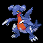

**XP**: 144 / PERCENT_FEMALE(50)

|         |         |         |         |         |         |         |         |
|---------|---------|---------|---------|---------|---------|---------|---------|
| **type1** | TYPE_DRAGON | **type2** | TYPE_GROUND | **catchRate** | 45 | **safariZoneFleeRate** | 0 |
| **baseAttack** | 90 | **baseSpAttack** | 50 | **evYield_Attack** | 2 | **evYield_SpAttack** | 0 |
| **baseDefense** | 65 | **baseSpDefense** | 55 | **evYield_Defense** | 0 | **evYield_SpDefense** | 0 |
| **baseHP** | 68 | **baseSpeed** | 82 | **evYield_HP** | 0 | **evYield_SpDefense** | 0 |
| **eggGroup1** | EGG_GROUP_DRAGON | **eggGroup2** | EGG_GROUP_MONSTER | **eggCycles** | 40 | **friendship** | 50 |
| **item1** | ITEM_NONE | **item2** | ITEM_NONE | **abilities** | ABILITY_SAND_VEIL | **growthRate** | GROWTH_SLOW |

**Found at:** 

| TM or HM |
|---------|
| Tm17 protect |
| Tm42 facade |
| Tm39 rock tomb |
| Tm11 sunny day |
| Tm18 rain dance |
| Tm37 sandstorm |
| Tm28 dig |
| Tm44 rest |
| Tm35 flamethrower |
| Tm38 fire blast |
| Tm26 earthquake |

### GARCHOMP

**XP**: 144 / PERCENT_FEMALE(50)

|         |         |         |         |         |         |         |         |
|---------|---------|---------|---------|---------|---------|---------|---------|
| **type1** | TYPE_DRAGON | **type2** | TYPE_GROUND | **catchRate** | 45 | **safariZoneFleeRate** | 0 |
| **baseAttack** | 110 | **baseSpAttack** | 60 | **evYield_Attack** | 3 | **evYield_SpAttack** | 0 |
| **baseDefense** | 95 | **baseSpDefense** | 75 | **evYield_Defense** | 0 | **evYield_SpDefense** | 0 |
| **baseHP** | 100 | **baseSpeed** | 100 | **evYield_HP** | 0 | **evYield_SpDefense** | 0 |
| **eggGroup1** | EGG_GROUP_DRAGON | **eggGroup2** | EGG_GROUP_MONSTER | **eggCycles** | 40 | **friendship** | 50 |
| **item1** | ITEM_NONE | **item2** | ITEM_NONE | **abilities** | ABILITY_SAND_VEIL | **growthRate** | GROWTH_SLOW |

**Found at:** 

| TM or HM |
|---------|
| Tm17 protect |
| Tm42 facade |
| Tm39 rock tomb |
| Tm11 sunny day |
| Tm18 rain dance |
| Tm37 sandstorm |
| Tm28 dig |
| Tm44 rest |
| Tm35 flamethrower |
| Tm38 fire blast |
| Tm26 earthquake |

### ANNIHILAPE

**XP**: 144 / PERCENT_FEMALE(50)

|         |         |         |         |         |         |         |         |
|---------|---------|---------|---------|---------|---------|---------|---------|
| **type1** | TYPE_FIGHTING | **type2** | TYPE_GHOST | **catchRate** | 45 | **safariZoneFleeRate** | 0 |
| **baseAttack** | 115 | **baseSpAttack** | 50 | **evYield_Attack** | 3 | **evYield_SpAttack** | 0 |
| **baseDefense** | 80 | **baseSpDefense** | 90 | **evYield_Defense** | 0 | **evYield_SpDefense** | 0 |
| **baseHP** | 100 | **baseSpeed** | 90 | **evYield_HP** | 0 | **evYield_SpDefense** | 0 |
| **eggGroup1** | EGG_GROUP_FIELD | **eggGroup2** | EGG_GROUP_NONE | **eggCycles** | 20 | **friendship** | 50 |
| **item1** | ITEM_NONE | **item2** | ITEM_NONE | **abilities** | ABILITY_VITAL_SPIRIT | **growthRate** | GROWTH_MEDIUM_FAST |

**Found at:** 

| TM or HM |
|---------|
| Tm17 protect |
| Tm46 thief |
| Tm42 facade |
| Tm39 rock tomb |
| Tm18 rain dance |
| Tm11 sunny day |
| Tm28 dig |
| Tm31 brick break |
| Tm08 bulk up |
| Tm44 rest |
| Tm12 taunt |
| Tm30 shadow ball |
| Tm50 overheat |
| Tm25 thunder |

### ARCTBAX

**XP**: 100 / PERCENT_FEMALE(50)

|         |         |         |         |         |         |         |         |
|---------|---------|---------|---------|---------|---------|---------|---------|
| **type1** | TYPE_DRAGON | **type2** | TYPE_ICE | **catchRate** | 45 | **safariZoneFleeRate** | 0 |
| **baseAttack** | 95 | **baseSpAttack** | 45 | **evYield_Attack** | 2 | **evYield_SpAttack** | 0 |
| **baseDefense** | 66 | **baseSpDefense** | 65 | **evYield_Defense** | 0 | **evYield_SpDefense** | 0 |
| **baseHP** | 90 | **baseSpeed** | 62 | **evYield_HP** | 0 | **evYield_SpDefense** | 0 |
| **eggGroup1** | EGG_GROUP_DRAGON | **eggGroup2** | EGG_GROUP_MINERAL | **eggCycles** | 40 | **friendship** | 50 |
| **item1** | ITEM_NONE | **item2** | ITEM_NONE | **abilities** | ABILITY_ARENA_TRAP | **growthRate** | GROWTH_SLOW |

**Found at:** MAP_SEAFOAM_ISLANDS_1F

| TM or HM |
|---------|
| Tm17 protect |
| Tm13 ice beam |
| Tm42 facade |
| Tm40 aerial ace |
| Tm18 rain dance |
| Tm28 dig |
| Tm31 brick break |
| Tm02 dragon claw |
| Tm44 rest |
| Tm14 blizzard |

### GIRATINA

**XP**: 100 / PERCENT_FEMALE(50)

|         |         |         |         |         |         |         |         |
|---------|---------|---------|---------|---------|---------|---------|---------|
| **type1** | TYPE_DRAGON | **type2** | TYPE_GHOST | **catchRate** | 45 | **safariZoneFleeRate** | 0 |
| **baseAttack** | 80 | **baseSpAttack** | 80 | **evYield_Attack** | 0 | **evYield_SpAttack** | 0 |
| **baseDefense** | 95 | **baseSpDefense** | 95 | **evYield_Defense** | 0 | **evYield_SpDefense** | 0 |
| **baseHP** | 100 | **baseSpeed** | 70 | **evYield_HP** | 3 | **evYield_SpDefense** | 0 |
| **eggGroup1** | EGG_GROUP_UNDISCOVERED | **eggGroup2** | EGG_GROUP_DRAGON | **eggCycles** | 120 | **friendship** | 50 |
| **item1** | ITEM_NONE | **item2** | ITEM_NONE | **abilities** | ABILITY_PRESSURE | **growthRate** | GROWTH_SLOW |

**Found at:** MAP_POKEMON_TOWER_6F

| TM or HM |
|---------|
| Tm17 protect |
| Tm04 calm mind |
| Tm06 toxic |
| Tm11 sunny day |
| Tm15 hyper beam |
| Tm17 protect |
| Tm18 rain dance |
| Tm02 dragon claw |
| Tm24 thunderbolt |
| Tm25 thunder |
| Tm26 earthquake |
| Tm27 return |
| Tm34 shock wave |
| Tm42 facade |
| Tm20 safeguard |
| Tm44 rest |
| Tm30 shadow ball |
| Tm20 safeguard |
| Tm21 frustration |
