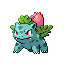

# POKEMON Stats, Locations & Move sets

### BULBASAUR

**XP**: 64 / PERCENT_FEMALE(12.5)

|         |         |         |         |         |         |         |         |
|---------|---------|---------|---------|---------|---------|---------|---------|
| **type1** | TYPE_GRASS | **type2** | TYPE_POISON | **catchRate** | 80 | **safariZoneFleeRate** | 0 |
| **baseAttack** | 45 | **baseSpAttack** | 65 | **evYield_Attack** | 0 | **evYield_SpAttack** | 1 |
| **baseDefense** | 49 | **baseSpDefense** | 65 | **evYield_Defense** | 0 | **evYield_SpDefense** | 0 |
| **baseHP** | 45 | **baseSpeed** | 45 | **evYield_HP** | 0 | **evYield_SpDefense** | 0 |
| **eggGroup1** | EGG_GROUP_MONSTER | **eggGroup2** | EGG_GROUP_GRASS | **eggCycles** | 20 | **friendship** | 70 |
| **item1** | ITEM_NONE | **item2** | ITEM_NONE | **abilities** | ABILITY_OVERGROW | **growthRate** | GROWTH_MEDIUM_SLOW |

**Found at:** MAP_ROUTE21_NORTH, MAP_ROUTE24

### IVYSAUR

**XP**: 141 / PERCENT_FEMALE(12.5)

|         |         |         |         |         |         |         |         |
|---------|---------|---------|---------|---------|---------|---------|---------|
| **type1** | TYPE_GRASS | **type2** | TYPE_POISON | **catchRate** | 45 | **safariZoneFleeRate** | 0 |
| **baseAttack** | 62 | **baseSpAttack** | 80 | **evYield_Attack** | 0 | **evYield_SpAttack** | 1 |
| **baseDefense** | 63 | **baseSpDefense** | 80 | **evYield_Defense** | 0 | **evYield_SpDefense** | 1 |
| **baseHP** | 60 | **baseSpeed** | 60 | **evYield_HP** | 0 | **evYield_SpDefense** | 1 |
| **eggGroup1** | EGG_GROUP_MONSTER | **eggGroup2** | EGG_GROUP_GRASS | **eggCycles** | 20 | **friendship** | 70 |
| **item1** | ITEM_NONE | **item2** | ITEM_NONE | **abilities** | ABILITY_OVERGROW | **growthRate** | GROWTH_MEDIUM_SLOW |

**Found at:** 

### VENUSAUR

**XP**: 208 / PERCENT_FEMALE(12.5)

|         |         |         |         |         |         |         |         |
|---------|---------|---------|---------|---------|---------|---------|---------|
| **type1** | TYPE_GRASS | **type2** | TYPE_POISON | **catchRate** | 45 | **safariZoneFleeRate** | 0 |
| **baseAttack** | 82 | **baseSpAttack** | 100 | **evYield_Attack** | 0 | **evYield_SpAttack** | 2 |
| **baseDefense** | 83 | **baseSpDefense** | 100 | **evYield_Defense** | 0 | **evYield_SpDefense** | 1 |
| **baseHP** | 80 | **baseSpeed** | 85 | **evYield_HP** | 0 | **evYield_SpDefense** | 1 |
| **eggGroup1** | EGG_GROUP_MONSTER | **eggGroup2** | EGG_GROUP_GRASS | **eggCycles** | 20 | **friendship** | 70 |
| **item1** | ITEM_NONE | **item2** | ITEM_NONE | **abilities** | ABILITY_OVERGROW | **growthRate** | GROWTH_MEDIUM_SLOW |

**Found at:** 

### CHARMANDER

**XP**: 65 / PERCENT_FEMALE(12.5)

|         |         |         |         |         |         |         |         |
|---------|---------|---------|---------|---------|---------|---------|---------|
| **type1** | TYPE_FIRE | **type2** | TYPE_FIRE | **catchRate** | 80 | **safariZoneFleeRate** | 0 |
| **baseAttack** | 52 | **baseSpAttack** | 60 | **evYield_Attack** | 0 | **evYield_SpAttack** | 0 |
| **baseDefense** | 50 | **baseSpDefense** | 50 | **evYield_Defense** | 0 | **evYield_SpDefense** | 0 |
| **baseHP** | 39 | **baseSpeed** | 65 | **evYield_HP** | 0 | **evYield_SpDefense** | 0 |
| **eggGroup1** | EGG_GROUP_MONSTER | **eggGroup2** | EGG_GROUP_DRAGON | **eggCycles** | 20 | **friendship** | 70 |
| **item1** | ITEM_NONE | **item2** | ITEM_NONE | **abilities** | ABILITY_BLAZE | **growthRate** | GROWTH_MEDIUM_SLOW |

**Found at:** MAP_ROUTE21_NORTH, MAP_ROUTE25

### CHARMELEON

**XP**: 142 / PERCENT_FEMALE(12.5)

|         |         |         |         |         |         |         |         |
|---------|---------|---------|---------|---------|---------|---------|---------|
| **type1** | TYPE_FIRE | **type2** | TYPE_FIRE | **catchRate** | 45 | **safariZoneFleeRate** | 0 |
| **baseAttack** | 64 | **baseSpAttack** | 80 | **evYield_Attack** | 0 | **evYield_SpAttack** | 1 |
| **baseDefense** | 58 | **baseSpDefense** | 65 | **evYield_Defense** | 0 | **evYield_SpDefense** | 0 |
| **baseHP** | 58 | **baseSpeed** | 80 | **evYield_HP** | 0 | **evYield_SpDefense** | 0 |
| **eggGroup1** | EGG_GROUP_MONSTER | **eggGroup2** | EGG_GROUP_DRAGON | **eggCycles** | 20 | **friendship** | 70 |
| **item1** | ITEM_NONE | **item2** | ITEM_NONE | **abilities** | ABILITY_BLAZE | **growthRate** | GROWTH_MEDIUM_SLOW |

**Found at:** 

### CHARIZARD

**XP**: 209 / PERCENT_FEMALE(12.5)

|         |         |         |         |         |         |         |         |
|---------|---------|---------|---------|---------|---------|---------|---------|
| **type1** | TYPE_FIRE | **type2** | TYPE_FLYING | **catchRate** | 45 | **safariZoneFleeRate** | 0 |
| **baseAttack** | 84 | **baseSpAttack** | 105 | **evYield_Attack** | 0 | **evYield_SpAttack** | 3 |
| **baseDefense** | 78 | **baseSpDefense** | 85 | **evYield_Defense** | 0 | **evYield_SpDefense** | 0 |
| **baseHP** | 78 | **baseSpeed** | 100 | **evYield_HP** | 0 | **evYield_SpDefense** | 0 |
| **eggGroup1** | EGG_GROUP_MONSTER | **eggGroup2** | EGG_GROUP_DRAGON | **eggCycles** | 20 | **friendship** | 70 |
| **item1** | ITEM_NONE | **item2** | ITEM_NONE | **abilities** | ABILITY_BLAZE | **growthRate** | GROWTH_MEDIUM_SLOW |

**Found at:** MAP_SIX_ISLAND_RUIN_VALLEY

### SQUIRTLE

**XP**: 66 / PERCENT_FEMALE(12.5)

|         |         |         |         |         |         |         |         |
|---------|---------|---------|---------|---------|---------|---------|---------|
| **type1** | TYPE_WATER | **type2** | TYPE_WATER | **catchRate** | 80 | **safariZoneFleeRate** | 0 |
| **baseAttack** | 48 | **baseSpAttack** | 50 | **evYield_Attack** | 0 | **evYield_SpAttack** | 0 |
| **baseDefense** | 65 | **baseSpDefense** | 64 | **evYield_Defense** | 1 | **evYield_SpDefense** | 0 |
| **baseHP** | 44 | **baseSpeed** | 43 | **evYield_HP** | 0 | **evYield_SpDefense** | 0 |
| **eggGroup1** | EGG_GROUP_MONSTER | **eggGroup2** | EGG_GROUP_WATER_1 | **eggCycles** | 20 | **friendship** | 70 |
| **item1** | ITEM_NONE | **item2** | ITEM_NONE | **abilities** | ABILITY_TORRENT | **growthRate** | GROWTH_MEDIUM_SLOW |

**Found at:** MAP_PALLET_TOWN, MAP_ROUTE4, MAP_ROUTE21_NORTH

### WARTORTLE

**XP**: 143 / PERCENT_FEMALE(12.5)

|         |         |         |         |         |         |         |         |
|---------|---------|---------|---------|---------|---------|---------|---------|
| **type1** | TYPE_WATER | **type2** | TYPE_WATER | **catchRate** | 45 | **safariZoneFleeRate** | 0 |
| **baseAttack** | 63 | **baseSpAttack** | 65 | **evYield_Attack** | 0 | **evYield_SpAttack** | 0 |
| **baseDefense** | 80 | **baseSpDefense** | 80 | **evYield_Defense** | 1 | **evYield_SpDefense** | 1 |
| **baseHP** | 59 | **baseSpeed** | 58 | **evYield_HP** | 0 | **evYield_SpDefense** | 1 |
| **eggGroup1** | EGG_GROUP_MONSTER | **eggGroup2** | EGG_GROUP_WATER_1 | **eggCycles** | 20 | **friendship** | 70 |
| **item1** | ITEM_NONE | **item2** | ITEM_NONE | **abilities** | ABILITY_TORRENT | **growthRate** | GROWTH_MEDIUM_SLOW |

**Found at:** 

### BLASTOISE

**XP**: 210 / PERCENT_FEMALE(12.5)

|         |         |         |         |         |         |         |         |
|---------|---------|---------|---------|---------|---------|---------|---------|
| **type1** | TYPE_WATER | **type2** | TYPE_WATER | **catchRate** | 45 | **safariZoneFleeRate** | 0 |
| **baseAttack** | 83 | **baseSpAttack** | 85 | **evYield_Attack** | 0 | **evYield_SpAttack** | 0 |
| **baseDefense** | 100 | **baseSpDefense** | 105 | **evYield_Defense** | 0 | **evYield_SpDefense** | 3 |
| **baseHP** | 79 | **baseSpeed** | 78 | **evYield_HP** | 0 | **evYield_SpDefense** | 3 |
| **eggGroup1** | EGG_GROUP_MONSTER | **eggGroup2** | EGG_GROUP_WATER_1 | **eggCycles** | 20 | **friendship** | 70 |
| **item1** | ITEM_NONE | **item2** | ITEM_NONE | **abilities** | ABILITY_TORRENT | **growthRate** | GROWTH_MEDIUM_SLOW |

**Found at:** MAP_SIX_ISLAND_RUIN_VALLEY

### CATERPIE

**XP**: 53 / PERCENT_FEMALE(50)

|         |         |         |         |         |         |         |         |
|---------|---------|---------|---------|---------|---------|---------|---------|
| **type1** | TYPE_BUG | **type2** | TYPE_BUG | **catchRate** | 255 | **safariZoneFleeRate** | 0 |
| **baseAttack** | 30 | **baseSpAttack** | 20 | **evYield_Attack** | 0 | **evYield_SpAttack** | 0 |
| **baseDefense** | 35 | **baseSpDefense** | 20 | **evYield_Defense** | 0 | **evYield_SpDefense** | 0 |
| **baseHP** | 45 | **baseSpeed** | 45 | **evYield_HP** | 1 | **evYield_SpDefense** | 0 |
| **eggGroup1** | EGG_GROUP_BUG | **eggGroup2** | EGG_GROUP_BUG | **eggCycles** | 15 | **friendship** | 70 |
| **item1** | ITEM_NONE | **item2** | ITEM_NONE | **abilities** | ABILITY_SHIELD_DUST | **growthRate** | GROWTH_MEDIUM_FAST |

**Found at:** MAP_ROUTE2, MAP_ROUTE25, MAP_ROUTE24, MAP_SIX_ISLAND_PATTERN_BUSH, MAP_VIRIDIAN_FOREST

### METAPOD

**XP**: 72 / PERCENT_FEMALE(50)

|         |         |         |         |         |         |         |         |
|---------|---------|---------|---------|---------|---------|---------|---------|
| **type1** | TYPE_BUG | **type2** | TYPE_BUG | **catchRate** | 120 | **safariZoneFleeRate** | 0 |
| **baseAttack** | 20 | **baseSpAttack** | 25 | **evYield_Attack** | 0 | **evYield_SpAttack** | 0 |
| **baseDefense** | 55 | **baseSpDefense** | 25 | **evYield_Defense** | 2 | **evYield_SpDefense** | 0 |
| **baseHP** | 50 | **baseSpeed** | 30 | **evYield_HP** | 0 | **evYield_SpDefense** | 0 |
| **eggGroup1** | EGG_GROUP_BUG | **eggGroup2** | EGG_GROUP_BUG | **eggCycles** | 15 | **friendship** | 70 |
| **item1** | ITEM_NONE | **item2** | ITEM_NONE | **abilities** | ABILITY_SHED_SKIN | **growthRate** | GROWTH_MEDIUM_FAST |

**Found at:** MAP_SIX_ISLAND_PATTERN_BUSH, MAP_VIRIDIAN_FOREST

### BUTTERFREE

**XP**: 160 / PERCENT_FEMALE(50)

|         |         |         |         |         |         |         |         |
|---------|---------|---------|---------|---------|---------|---------|---------|
| **type1** | TYPE_BUG | **type2** | TYPE_FLYING | **catchRate** | 45 | **safariZoneFleeRate** | 0 |
| **baseAttack** | 45 | **baseSpAttack** | 90 | **evYield_Attack** | 0 | **evYield_SpAttack** | 2 |
| **baseDefense** | 50 | **baseSpDefense** | 80 | **evYield_Defense** | 0 | **evYield_SpDefense** | 1 |
| **baseHP** | 70 | **baseSpeed** | 70 | **evYield_HP** | 0 | **evYield_SpDefense** | 1 |
| **eggGroup1** | EGG_GROUP_BUG | **eggGroup2** | EGG_GROUP_BUG | **eggCycles** | 15 | **friendship** | 70 |
| **item1** | ITEM_NONE | **item2** | ITEM_SILVER_POWDER | **abilities** | ABILITY_COMPOUND_EYES | **growthRate** | GROWTH_MEDIUM_FAST |

**Found at:** 

### WEEDLE

**XP**: 52 / PERCENT_FEMALE(50)

|         |         |         |         |         |         |         |         |
|---------|---------|---------|---------|---------|---------|---------|---------|
| **type1** | TYPE_BUG | **type2** | TYPE_POISON | **catchRate** | 255 | **safariZoneFleeRate** | 0 |
| **baseAttack** | 35 | **baseSpAttack** | 20 | **evYield_Attack** | 0 | **evYield_SpAttack** | 0 |
| **baseDefense** | 30 | **baseSpDefense** | 20 | **evYield_Defense** | 0 | **evYield_SpDefense** | 0 |
| **baseHP** | 40 | **baseSpeed** | 50 | **evYield_HP** | 0 | **evYield_SpDefense** | 0 |
| **eggGroup1** | EGG_GROUP_BUG | **eggGroup2** | EGG_GROUP_BUG | **eggCycles** | 15 | **friendship** | 70 |
| **item1** | ITEM_NONE | **item2** | ITEM_NONE | **abilities** | ABILITY_SHIELD_DUST | **growthRate** | GROWTH_MEDIUM_FAST |

**Found at:** MAP_ROUTE2, MAP_ROUTE25, MAP_ROUTE24, MAP_SIX_ISLAND_PATTERN_BUSH, MAP_VIRIDIAN_FOREST

### KAKUNA

**XP**: 71 / PERCENT_FEMALE(50)

|         |         |         |         |         |         |         |         |
|---------|---------|---------|---------|---------|---------|---------|---------|
| **type1** | TYPE_BUG | **type2** | TYPE_POISON | **catchRate** | 120 | **safariZoneFleeRate** | 0 |
| **baseAttack** | 25 | **baseSpAttack** | 25 | **evYield_Attack** | 0 | **evYield_SpAttack** | 0 |
| **baseDefense** | 50 | **baseSpDefense** | 25 | **evYield_Defense** | 2 | **evYield_SpDefense** | 0 |
| **baseHP** | 45 | **baseSpeed** | 35 | **evYield_HP** | 0 | **evYield_SpDefense** | 0 |
| **eggGroup1** | EGG_GROUP_BUG | **eggGroup2** | EGG_GROUP_BUG | **eggCycles** | 15 | **friendship** | 70 |
| **item1** | ITEM_NONE | **item2** | ITEM_NONE | **abilities** | ABILITY_SHED_SKIN | **growthRate** | GROWTH_MEDIUM_FAST |

**Found at:** MAP_SIX_ISLAND_PATTERN_BUSH, MAP_VIRIDIAN_FOREST

### BEEDRILL

**XP**: 159 / PERCENT_FEMALE(50)

|         |         |         |         |         |         |         |         |
|---------|---------|---------|---------|---------|---------|---------|---------|
| **type1** | TYPE_BUG | **type2** | TYPE_POISON | **catchRate** | 45 | **safariZoneFleeRate** | 0 |
| **baseAttack** | 90 | **baseSpAttack** | 45 | **evYield_Attack** | 2 | **evYield_SpAttack** | 0 |
| **baseDefense** | 40 | **baseSpDefense** | 80 | **evYield_Defense** | 0 | **evYield_SpDefense** | 1 |
| **baseHP** | 70 | **baseSpeed** | 85 | **evYield_HP** | 0 | **evYield_SpDefense** | 1 |
| **eggGroup1** | EGG_GROUP_BUG | **eggGroup2** | EGG_GROUP_BUG | **eggCycles** | 15 | **friendship** | 70 |
| **item1** | ITEM_NONE | **item2** | ITEM_POISON_BARB | **abilities** | ABILITY_SWARM | **growthRate** | GROWTH_MEDIUM_FAST |

**Found at:** 

### PIDGEY

**XP**: 55 / PERCENT_FEMALE(50)

|         |         |         |         |         |         |         |         |
|---------|---------|---------|---------|---------|---------|---------|---------|
| **type1** | TYPE_NORMAL | **type2** | TYPE_FLYING | **catchRate** | 255 | **safariZoneFleeRate** | 0 |
| **baseAttack** | 45 | **baseSpAttack** | 35 | **evYield_Attack** | 0 | **evYield_SpAttack** | 0 |
| **baseDefense** | 40 | **baseSpDefense** | 35 | **evYield_Defense** | 0 | **evYield_SpDefense** | 0 |
| **baseHP** | 40 | **baseSpeed** | 56 | **evYield_HP** | 0 | **evYield_SpDefense** | 0 |
| **eggGroup1** | EGG_GROUP_FLYING | **eggGroup2** | EGG_GROUP_FLYING | **eggCycles** | 15 | **friendship** | 70 |
| **item1** | ITEM_NONE | **item2** | ITEM_NONE | **abilities** | ABILITY_KEEN_EYE | **growthRate** | GROWTH_MEDIUM_SLOW |

**Found at:** MAP_ROUTE6, MAP_ROUTE9, MAP_ROUTE7, MAP_ROUTE13, MAP_THREE_ISLAND_BERRY_FOREST, MAP_ROUTE14, MAP_ROUTE2, MAP_ROUTE8, MAP_ROUTE5, MAP_THREE_ISLAND_BOND_BRIDGE, MAP_ROUTE15, MAP_ROUTE12, MAP_ROUTE24, MAP_ROUTE25, MAP_ROUTE1, MAP_FIVE_ISLAND_MEADOW

### PIDGEOTTO

**XP**: 113 / PERCENT_FEMALE(50)

|         |         |         |         |         |         |         |         |
|---------|---------|---------|---------|---------|---------|---------|---------|
| **type1** | TYPE_NORMAL | **type2** | TYPE_FLYING | **catchRate** | 120 | **safariZoneFleeRate** | 0 |
| **baseAttack** | 60 | **baseSpAttack** | 50 | **evYield_Attack** | 0 | **evYield_SpAttack** | 0 |
| **baseDefense** | 55 | **baseSpDefense** | 50 | **evYield_Defense** | 0 | **evYield_SpDefense** | 0 |
| **baseHP** | 63 | **baseSpeed** | 71 | **evYield_HP** | 0 | **evYield_SpDefense** | 0 |
| **eggGroup1** | EGG_GROUP_FLYING | **eggGroup2** | EGG_GROUP_FLYING | **eggCycles** | 15 | **friendship** | 70 |
| **item1** | ITEM_NONE | **item2** | ITEM_NONE | **abilities** | ABILITY_KEEN_EYE | **growthRate** | GROWTH_MEDIUM_SLOW |

**Found at:** MAP_ROUTE13, MAP_THREE_ISLAND_BERRY_FOREST, MAP_ROUTE14, MAP_ROUTE15, MAP_THREE_ISLAND_BOND_BRIDGE, MAP_FIVE_ISLAND_MEADOW

### PIDGEOT

**XP**: 172 / PERCENT_FEMALE(50)

|         |         |         |         |         |         |         |         |
|---------|---------|---------|---------|---------|---------|---------|---------|
| **type1** | TYPE_NORMAL | **type2** | TYPE_FLYING | **catchRate** | 45 | **safariZoneFleeRate** | 0 |
| **baseAttack** | 80 | **baseSpAttack** | 70 | **evYield_Attack** | 0 | **evYield_SpAttack** | 0 |
| **baseDefense** | 75 | **baseSpDefense** | 70 | **evYield_Defense** | 0 | **evYield_SpDefense** | 0 |
| **baseHP** | 83 | **baseSpeed** | 91 | **evYield_HP** | 0 | **evYield_SpDefense** | 0 |
| **eggGroup1** | EGG_GROUP_FLYING | **eggGroup2** | EGG_GROUP_FLYING | **eggCycles** | 15 | **friendship** | 70 |
| **item1** | ITEM_NONE | **item2** | ITEM_NONE | **abilities** | ABILITY_KEEN_EYE | **growthRate** | GROWTH_MEDIUM_SLOW |

**Found at:** 

### RATTATA

**XP**: 57 / PERCENT_FEMALE(50)

|         |         |         |         |         |         |         |         |
|---------|---------|---------|---------|---------|---------|---------|---------|
| **type1** | TYPE_NORMAL | **type2** | TYPE_NORMAL | **catchRate** | 255 | **safariZoneFleeRate** | 0 |
| **baseAttack** | 56 | **baseSpAttack** | 25 | **evYield_Attack** | 0 | **evYield_SpAttack** | 0 |
| **baseDefense** | 35 | **baseSpDefense** | 35 | **evYield_Defense** | 0 | **evYield_SpDefense** | 0 |
| **baseHP** | 30 | **baseSpeed** | 72 | **evYield_HP** | 0 | **evYield_SpDefense** | 0 |
| **eggGroup1** | EGG_GROUP_FIELD | **eggGroup2** | EGG_GROUP_FIELD | **eggCycles** | 15 | **friendship** | 70 |
| **item1** | ITEM_NONE | **item2** | ITEM_NONE | **abilities** | ABILITY_RUN_AWAY | **growthRate** | GROWTH_MEDIUM_FAST |

**Found at:** MAP_POKEMON_MANSION_3F, MAP_ROUTE16, MAP_ROUTE9, MAP_ROUTE17, MAP_ROUTE22, MAP_ROUTE2, MAP_ROUTE18, MAP_ROUTE4, MAP_ROUTE1, MAP_POKEMON_MANSION_1F, MAP_POKEMON_MANSION_2F, MAP_POKEMON_MANSION_B1F

### RATICATE

**XP**: 116 / PERCENT_FEMALE(50)

|         |         |         |         |         |         |         |         |
|---------|---------|---------|---------|---------|---------|---------|---------|
| **type1** | TYPE_NORMAL | **type2** | TYPE_NORMAL | **catchRate** | 127 | **safariZoneFleeRate** | 0 |
| **baseAttack** | 81 | **baseSpAttack** | 50 | **evYield_Attack** | 0 | **evYield_SpAttack** | 0 |
| **baseDefense** | 60 | **baseSpDefense** | 70 | **evYield_Defense** | 0 | **evYield_SpDefense** | 0 |
| **baseHP** | 55 | **baseSpeed** | 97 | **evYield_HP** | 0 | **evYield_SpDefense** | 0 |
| **eggGroup1** | EGG_GROUP_FIELD | **eggGroup2** | EGG_GROUP_FIELD | **eggCycles** | 15 | **friendship** | 70 |
| **item1** | ITEM_ORAN_BERRY | **item2** | ITEM_SITRUS_BERRY | **abilities** | ABILITY_RUN_AWAY | **growthRate** | GROWTH_MEDIUM_FAST |

**Found at:** MAP_POKEMON_MANSION_3F, MAP_ROUTE16, MAP_ROUTE17, MAP_ROUTE18, MAP_POKEMON_MANSION_1F, MAP_POKEMON_MANSION_2F, MAP_POKEMON_MANSION_B1F

### SPEAROW

**XP**: 58 / PERCENT_FEMALE(50)

|         |         |         |         |         |         |         |         |
|---------|---------|---------|---------|---------|---------|---------|---------|
| **type1** | TYPE_FLYING | **type2** | TYPE_FLYING | **catchRate** | 255 | **safariZoneFleeRate** | 0 |
| **baseAttack** | 60 | **baseSpAttack** | 31 | **evYield_Attack** | 0 | **evYield_SpAttack** | 0 |
| **baseDefense** | 30 | **baseSpDefense** | 31 | **evYield_Defense** | 0 | **evYield_SpDefense** | 0 |
| **baseHP** | 40 | **baseSpeed** | 70 | **evYield_HP** | 0 | **evYield_SpDefense** | 0 |
| **eggGroup1** | EGG_GROUP_FLYING | **eggGroup2** | EGG_GROUP_FLYING | **eggCycles** | 15 | **friendship** | 70 |
| **item1** | ITEM_NONE | **item2** | ITEM_NONE | **abilities** | ABILITY_KEEN_EYE | **growthRate** | GROWTH_MEDIUM_FAST |

**Found at:** MAP_ONE_ISLAND_TREASURE_BEACH, MAP_ROUTE10, MAP_ROUTE9, MAP_ROUTE16, MAP_MT_EMBER_EXTERIOR, MAP_ROUTE23, MAP_ROUTE17, MAP_SIX_ISLAND_RUIN_VALLEY, MAP_ROUTE22, MAP_SIX_ISLAND_WATER_PATH, MAP_ROUTE2, MAP_SEVEN_ISLAND_SEVAULT_CANYON_ENTRANCE, MAP_ROUTE3, MAP_ROUTE4, MAP_ROUTE18, MAP_TWO_ISLAND_CAPE_BRINK, MAP_ROUTE11, MAP_ONE_ISLAND_KINDLE_ROAD

### FEAROW

**XP**: 162 / PERCENT_FEMALE(50)

|         |         |         |         |         |         |         |         |
|---------|---------|---------|---------|---------|---------|---------|---------|
| **type1** | TYPE_FLYING | **type2** | TYPE_FLYING | **catchRate** | 90 | **safariZoneFleeRate** | 0 |
| **baseAttack** | 90 | **baseSpAttack** | 61 | **evYield_Attack** | 0 | **evYield_SpAttack** | 0 |
| **baseDefense** | 65 | **baseSpDefense** | 61 | **evYield_Defense** | 0 | **evYield_SpDefense** | 0 |
| **baseHP** | 65 | **baseSpeed** | 100 | **evYield_HP** | 0 | **evYield_SpDefense** | 0 |
| **eggGroup1** | EGG_GROUP_FLYING | **eggGroup2** | EGG_GROUP_FLYING | **eggCycles** | 15 | **friendship** | 70 |
| **item1** | ITEM_NONE | **item2** | ITEM_SHARP_BEAK | **abilities** | ABILITY_KEEN_EYE | **growthRate** | GROWTH_MEDIUM_FAST |

**Found at:** MAP_ONE_ISLAND_TREASURE_BEACH, MAP_MT_EMBER_EXTERIOR, MAP_ROUTE23, MAP_ROUTE17, MAP_SIX_ISLAND_RUIN_VALLEY, MAP_SIX_ISLAND_WATER_PATH, MAP_SEVEN_ISLAND_SEVAULT_CANYON_ENTRANCE, MAP_ROUTE18, MAP_SEVEN_ISLAND_SEVAULT_CANYON, MAP_TWO_ISLAND_CAPE_BRINK, MAP_ONE_ISLAND_KINDLE_ROAD

### EKANS

**XP**: 62 / PERCENT_FEMALE(50)

|         |         |         |         |         |         |         |         |
|---------|---------|---------|---------|---------|---------|---------|---------|
| **type1** | TYPE_POISON | **type2** | TYPE_POISON | **catchRate** | 255 | **safariZoneFleeRate** | 0 |
| **baseAttack** | 60 | **baseSpAttack** | 40 | **evYield_Attack** | 1 | **evYield_SpAttack** | 0 |
| **baseDefense** | 44 | **baseSpDefense** | 54 | **evYield_Defense** | 0 | **evYield_SpDefense** | 0 |
| **baseHP** | 35 | **baseSpeed** | 55 | **evYield_HP** | 0 | **evYield_SpDefense** | 0 |
| **eggGroup1** | EGG_GROUP_FIELD | **eggGroup2** | EGG_GROUP_DRAGON | **eggCycles** | 20 | **friendship** | 70 |
| **item1** | ITEM_NONE | **item2** | ITEM_NONE | **abilities** | ABILITY_INTIMIDATE | **growthRate** | GROWTH_MEDIUM_FAST |

**Found at:** MAP_ROUTE10, MAP_ROUTE9, MAP_ROUTE23, MAP_ROUTE8, MAP_ROUTE4, MAP_ROUTE11

### ARBOK

**XP**: 147 / PERCENT_FEMALE(50)

|         |         |         |         |         |         |         |         |
|---------|---------|---------|---------|---------|---------|---------|---------|
| **type1** | TYPE_POISON | **type2** | TYPE_POISON | **catchRate** | 90 | **safariZoneFleeRate** | 0 |
| **baseAttack** | 85 | **baseSpAttack** | 65 | **evYield_Attack** | 2 | **evYield_SpAttack** | 0 |
| **baseDefense** | 69 | **baseSpDefense** | 79 | **evYield_Defense** | 0 | **evYield_SpDefense** | 0 |
| **baseHP** | 60 | **baseSpeed** | 80 | **evYield_HP** | 0 | **evYield_SpDefense** | 0 |
| **eggGroup1** | EGG_GROUP_FIELD | **eggGroup2** | EGG_GROUP_DRAGON | **eggCycles** | 20 | **friendship** | 70 |
| **item1** | ITEM_NONE | **item2** | ITEM_POISON_BARB | **abilities** | ABILITY_INTIMIDATE | **growthRate** | GROWTH_MEDIUM_FAST |

**Found at:** MAP_VICTORY_ROAD_3F, MAP_VICTORY_ROAD_2F, MAP_VICTORY_ROAD_1F, MAP_ROUTE23

### PIKACHU

**XP**: 82 / PERCENT_FEMALE(50)

|         |         |         |         |         |         |         |         |
|---------|---------|---------|---------|---------|---------|---------|---------|
| **type1** | TYPE_ELECTRIC | **type2** | TYPE_ELECTRIC | **catchRate** | 190 | **safariZoneFleeRate** | 0 |
| **baseAttack** | 55 | **baseSpAttack** | 50 | **evYield_Attack** | 0 | **evYield_SpAttack** | 0 |
| **baseDefense** | 30 | **baseSpDefense** | 40 | **evYield_Defense** | 0 | **evYield_SpDefense** | 0 |
| **baseHP** | 35 | **baseSpeed** | 90 | **evYield_HP** | 0 | **evYield_SpDefense** | 0 |
| **eggGroup1** | EGG_GROUP_FIELD | **eggGroup2** | EGG_GROUP_FAIRY | **eggCycles** | 10 | **friendship** | 70 |
| **item1** | ITEM_NONE | **item2** | ITEM_NONE | **abilities** | ABILITY_STATIC | **growthRate** | GROWTH_MEDIUM_FAST |

**Found at:** MAP_POWER_PLANT, MAP_VIRIDIAN_FOREST

### RAICHU

**XP**: 122 / PERCENT_FEMALE(50)

|         |         |         |         |         |         |         |         |
|---------|---------|---------|---------|---------|---------|---------|---------|
| **type1** | TYPE_ELECTRIC | **type2** | TYPE_ELECTRIC | **catchRate** | 75 | **safariZoneFleeRate** | 0 |
| **baseAttack** | 90 | **baseSpAttack** | 90 | **evYield_Attack** | 0 | **evYield_SpAttack** | 0 |
| **baseDefense** | 55 | **baseSpDefense** | 80 | **evYield_Defense** | 0 | **evYield_SpDefense** | 0 |
| **baseHP** | 60 | **baseSpeed** | 100 | **evYield_HP** | 0 | **evYield_SpDefense** | 0 |
| **eggGroup1** | EGG_GROUP_FIELD | **eggGroup2** | EGG_GROUP_FAIRY | **eggCycles** | 10 | **friendship** | 70 |
| **item1** | ITEM_NONE | **item2** | ITEM_NONE | **abilities** | ABILITY_STATIC | **growthRate** | GROWTH_MEDIUM_FAST |

**Found at:** 

### SANDSHREW

**XP**: 93 / PERCENT_FEMALE(50)

|         |         |         |         |         |         |         |         |
|---------|---------|---------|---------|---------|---------|---------|---------|
| **type1** | TYPE_GROUND | **type2** | TYPE_GROUND | **catchRate** | 255 | **safariZoneFleeRate** | 0 |
| **baseAttack** | 75 | **baseSpAttack** | 20 | **evYield_Attack** | 0 | **evYield_SpAttack** | 0 |
| **baseDefense** | 85 | **baseSpDefense** | 30 | **evYield_Defense** | 1 | **evYield_SpDefense** | 0 |
| **baseHP** | 50 | **baseSpeed** | 40 | **evYield_HP** | 0 | **evYield_SpDefense** | 0 |
| **eggGroup1** | EGG_GROUP_FIELD | **eggGroup2** | EGG_GROUP_FIELD | **eggCycles** | 20 | **friendship** | 70 |
| **item1** | ITEM_NONE | **item2** | ITEM_NONE | **abilities** | ABILITY_SAND_VEIL | **growthRate** | GROWTH_MEDIUM_FAST |

**Found at:** MAP_ROUTE9, MAP_ROUTE4, MAP_ROUTE8, MAP_ROUTE11

### SANDSLASH

**XP**: 163 / PERCENT_FEMALE(50)

|         |         |         |         |         |         |         |         |
|---------|---------|---------|---------|---------|---------|---------|---------|
| **type1** | TYPE_GROUND | **type2** | TYPE_GROUND | **catchRate** | 90 | **safariZoneFleeRate** | 0 |
| **baseAttack** | 100 | **baseSpAttack** | 45 | **evYield_Attack** | 0 | **evYield_SpAttack** | 0 |
| **baseDefense** | 110 | **baseSpDefense** | 55 | **evYield_Defense** | 2 | **evYield_SpDefense** | 0 |
| **baseHP** | 75 | **baseSpeed** | 65 | **evYield_HP** | 0 | **evYield_SpDefense** | 0 |
| **eggGroup1** | EGG_GROUP_FIELD | **eggGroup2** | EGG_GROUP_FIELD | **eggCycles** | 20 | **friendship** | 70 |
| **item1** | ITEM_NONE | **item2** | ITEM_SOFT_SAND | **abilities** | ABILITY_SAND_VEIL | **growthRate** | GROWTH_MEDIUM_FAST |

**Found at:** MAP_ROUTE23

### NIDORAN_F

**XP**: 59 / MON_FEMALE

|         |         |         |         |         |         |         |         |
|---------|---------|---------|---------|---------|---------|---------|---------|
| **type1** | TYPE_POISON | **type2** | TYPE_POISON | **catchRate** | 235 | **safariZoneFleeRate** | 50 |
| **baseAttack** | 47 | **baseSpAttack** | 40 | **evYield_Attack** | 0 | **evYield_SpAttack** | 0 |
| **baseDefense** | 52 | **baseSpDefense** | 40 | **evYield_Defense** | 0 | **evYield_SpDefense** | 0 |
| **baseHP** | 55 | **baseSpeed** | 41 | **evYield_HP** | 1 | **evYield_SpDefense** | 0 |
| **eggGroup1** | EGG_GROUP_MONSTER | **eggGroup2** | EGG_GROUP_FIELD | **eggCycles** | 20 | **friendship** | 70 |
| **item1** | ITEM_NONE | **item2** | ITEM_NONE | **abilities** | ABILITY_POISON_POINT | **growthRate** | GROWTH_MEDIUM_SLOW |

**Found at:** MAP_ROUTE3, MAP_SAFARI_ZONE_EAST, MAP_ROUTE22, MAP_SAFARI_ZONE_WEST

### NIDORINA

**XP**: 117 / MON_FEMALE

|         |         |         |         |         |         |         |         |
|---------|---------|---------|---------|---------|---------|---------|---------|
| **type1** | TYPE_POISON | **type2** | TYPE_POISON | **catchRate** | 120 | **safariZoneFleeRate** | 75 |
| **baseAttack** | 62 | **baseSpAttack** | 55 | **evYield_Attack** | 0 | **evYield_SpAttack** | 0 |
| **baseDefense** | 67 | **baseSpDefense** | 55 | **evYield_Defense** | 0 | **evYield_SpDefense** | 0 |
| **baseHP** | 70 | **baseSpeed** | 56 | **evYield_HP** | 2 | **evYield_SpDefense** | 0 |
| **eggGroup1** | EGG_GROUP_UNDISCOVERED | **eggGroup2** | EGG_GROUP_UNDISCOVERED | **eggCycles** | 20 | **friendship** | 70 |
| **item1** | ITEM_NONE | **item2** | ITEM_NONE | **abilities** | ABILITY_POISON_POINT | **growthRate** | GROWTH_MEDIUM_SLOW |

**Found at:** MAP_SAFARI_ZONE_CENTER, MAP_SAFARI_ZONE_NORTH

### NIDOQUEEN

**XP**: 194 / MON_FEMALE

|         |         |         |         |         |         |         |         |
|---------|---------|---------|---------|---------|---------|---------|---------|
| **type1** | TYPE_POISON | **type2** | TYPE_ICE | **catchRate** | 45 | **safariZoneFleeRate** | 0 |
| **baseAttack** | 82 | **baseSpAttack** | 75 | **evYield_Attack** | 0 | **evYield_SpAttack** | 0 |
| **baseDefense** | 87 | **baseSpDefense** | 85 | **evYield_Defense** | 0 | **evYield_SpDefense** | 0 |
| **baseHP** | 90 | **baseSpeed** | 76 | **evYield_HP** | 3 | **evYield_SpDefense** | 0 |
| **eggGroup1** | EGG_GROUP_UNDISCOVERED | **eggGroup2** | EGG_GROUP_UNDISCOVERED | **eggCycles** | 20 | **friendship** | 70 |
| **item1** | ITEM_NONE | **item2** | ITEM_NONE | **abilities** | ABILITY_POISON_POINT | **growthRate** | GROWTH_MEDIUM_SLOW |

**Found at:** 

### NIDORAN_M

**XP**: 60 / MON_MALE

|         |         |         |         |         |         |         |         |
|---------|---------|---------|---------|---------|---------|---------|---------|
| **type1** | TYPE_POISON | **type2** | TYPE_POISON | **catchRate** | 235 | **safariZoneFleeRate** | 50 |
| **baseAttack** | 57 | **baseSpAttack** | 40 | **evYield_Attack** | 1 | **evYield_SpAttack** | 0 |
| **baseDefense** | 40 | **baseSpDefense** | 40 | **evYield_Defense** | 0 | **evYield_SpDefense** | 0 |
| **baseHP** | 46 | **baseSpeed** | 50 | **evYield_HP** | 0 | **evYield_SpDefense** | 0 |
| **eggGroup1** | EGG_GROUP_MONSTER | **eggGroup2** | EGG_GROUP_FIELD | **eggCycles** | 20 | **friendship** | 70 |
| **item1** | ITEM_NONE | **item2** | ITEM_NONE | **abilities** | ABILITY_POISON_POINT | **growthRate** | GROWTH_MEDIUM_SLOW |

**Found at:** MAP_ROUTE22, MAP_ROUTE3, MAP_SAFARI_ZONE_CENTER, MAP_SAFARI_ZONE_WEST, MAP_SAFARI_ZONE_NORTH, MAP_SAFARI_ZONE_EAST

### NIDORINO

**XP**: 118 / MON_MALE

|         |         |         |         |         |         |         |         |
|---------|---------|---------|---------|---------|---------|---------|---------|
| **type1** | TYPE_POISON | **type2** | TYPE_POISON | **catchRate** | 120 | **safariZoneFleeRate** | 75 |
| **baseAttack** | 72 | **baseSpAttack** | 55 | **evYield_Attack** | 2 | **evYield_SpAttack** | 0 |
| **baseDefense** | 57 | **baseSpDefense** | 55 | **evYield_Defense** | 0 | **evYield_SpDefense** | 0 |
| **baseHP** | 61 | **baseSpeed** | 65 | **evYield_HP** | 0 | **evYield_SpDefense** | 0 |
| **eggGroup1** | EGG_GROUP_MONSTER | **eggGroup2** | EGG_GROUP_FIELD | **eggCycles** | 20 | **friendship** | 70 |
| **item1** | ITEM_NONE | **item2** | ITEM_NONE | **abilities** | ABILITY_POISON_POINT | **growthRate** | GROWTH_MEDIUM_SLOW |

**Found at:** MAP_SAFARI_ZONE_CENTER, MAP_SAFARI_ZONE_EAST, MAP_SAFARI_ZONE_WEST, MAP_SAFARI_ZONE_NORTH

### NIDOKING

**XP**: 195 / MON_MALE

|         |         |         |         |         |         |         |         |
|---------|---------|---------|---------|---------|---------|---------|---------|
| **type1** | TYPE_POISON | **type2** | TYPE_GROUND | **catchRate** | 45 | **safariZoneFleeRate** | 0 |
| **baseAttack** | 92 | **baseSpAttack** | 85 | **evYield_Attack** | 3 | **evYield_SpAttack** | 0 |
| **baseDefense** | 77 | **baseSpDefense** | 75 | **evYield_Defense** | 0 | **evYield_SpDefense** | 0 |
| **baseHP** | 81 | **baseSpeed** | 85 | **evYield_HP** | 0 | **evYield_SpDefense** | 0 |
| **eggGroup1** | EGG_GROUP_MONSTER | **eggGroup2** | EGG_GROUP_FIELD | **eggCycles** | 20 | **friendship** | 70 |
| **item1** | ITEM_NONE | **item2** | ITEM_NONE | **abilities** | ABILITY_POISON_POINT | **growthRate** | GROWTH_MEDIUM_SLOW |

**Found at:** 

### CLEFAIRY

**XP**: 68 / PERCENT_FEMALE(75)

|         |         |         |         |         |         |         |         |
|---------|---------|---------|---------|---------|---------|---------|---------|
| **type1** | TYPE_NORMAL | **type2** | TYPE_NORMAL | **catchRate** | 150 | **safariZoneFleeRate** | 0 |
| **baseAttack** | 45 | **baseSpAttack** | 60 | **evYield_Attack** | 0 | **evYield_SpAttack** | 0 |
| **baseDefense** | 48 | **baseSpDefense** | 65 | **evYield_Defense** | 0 | **evYield_SpDefense** | 0 |
| **baseHP** | 70 | **baseSpeed** | 35 | **evYield_HP** | 2 | **evYield_SpDefense** | 0 |
| **eggGroup1** | EGG_GROUP_FAIRY | **eggGroup2** | EGG_GROUP_FAIRY | **eggCycles** | 10 | **friendship** | 140 |
| **item1** | ITEM_NONE | **item2** | ITEM_MOON_STONE | **abilities** | ABILITY_CUTE_CHARM | **growthRate** | GROWTH_FAST |

**Found at:** MAP_MT_MOON_B2F

### CLEFABLE

**XP**: 129 / PERCENT_FEMALE(75)

|         |         |         |         |         |         |         |         |
|---------|---------|---------|---------|---------|---------|---------|---------|
| **type1** | TYPE_NORMAL | **type2** | TYPE_NORMAL | **catchRate** | 25 | **safariZoneFleeRate** | 0 |
| **baseAttack** | 70 | **baseSpAttack** | 85 | **evYield_Attack** | 0 | **evYield_SpAttack** | 0 |
| **baseDefense** | 73 | **baseSpDefense** | 90 | **evYield_Defense** | 0 | **evYield_SpDefense** | 0 |
| **baseHP** | 95 | **baseSpeed** | 60 | **evYield_HP** | 3 | **evYield_SpDefense** | 0 |
| **eggGroup1** | EGG_GROUP_FAIRY | **eggGroup2** | EGG_GROUP_FAIRY | **eggCycles** | 10 | **friendship** | 140 |
| **item1** | ITEM_NONE | **item2** | ITEM_MOON_STONE | **abilities** | ABILITY_CUTE_CHARM | **growthRate** | GROWTH_FAST |

**Found at:** 

### VULPIX

**XP**: 63 / PERCENT_FEMALE(75)

|         |         |         |         |         |         |         |         |
|---------|---------|---------|---------|---------|---------|---------|---------|
| **type1** | TYPE_FIRE | **type2** | TYPE_FIRE | **catchRate** | 190 | **safariZoneFleeRate** | 0 |
| **baseAttack** | 41 | **baseSpAttack** | 50 | **evYield_Attack** | 0 | **evYield_SpAttack** | 0 |
| **baseDefense** | 40 | **baseSpDefense** | 65 | **evYield_Defense** | 0 | **evYield_SpDefense** | 0 |
| **baseHP** | 38 | **baseSpeed** | 65 | **evYield_HP** | 0 | **evYield_SpDefense** | 0 |
| **eggGroup1** | EGG_GROUP_FIELD | **eggGroup2** | EGG_GROUP_FIELD | **eggCycles** | 20 | **friendship** | 70 |
| **item1** | ITEM_RAWST_BERRY | **item2** | ITEM_NONE | **abilities** | ABILITY_FLASH_FIRE | **growthRate** | GROWTH_MEDIUM_FAST |

**Found at:** MAP_POKEMON_MANSION_3F, MAP_ROUTE7, MAP_ROUTE8, MAP_POKEMON_MANSION_1F, MAP_POKEMON_MANSION_2F, MAP_POKEMON_MANSION_B1F

### NINETALES

**XP**: 178 / PERCENT_FEMALE(75)

|         |         |         |         |         |         |         |         |
|---------|---------|---------|---------|---------|---------|---------|---------|
| **type1** | TYPE_FIRE | **type2** | TYPE_FIRE | **catchRate** | 75 | **safariZoneFleeRate** | 0 |
| **baseAttack** | 76 | **baseSpAttack** | 81 | **evYield_Attack** | 0 | **evYield_SpAttack** | 0 |
| **baseDefense** | 75 | **baseSpDefense** | 100 | **evYield_Defense** | 0 | **evYield_SpDefense** | 1 |
| **baseHP** | 73 | **baseSpeed** | 100 | **evYield_HP** | 0 | **evYield_SpDefense** | 1 |
| **eggGroup1** | EGG_GROUP_FIELD | **eggGroup2** | EGG_GROUP_FIELD | **eggCycles** | 20 | **friendship** | 70 |
| **item1** | ITEM_RAWST_BERRY | **item2** | ITEM_NONE | **abilities** | ABILITY_FLASH_FIRE | **growthRate** | GROWTH_MEDIUM_FAST |

**Found at:** 

### JIGGLYPUFF

**XP**: 76 / PERCENT_FEMALE(75)

|         |         |         |         |         |         |         |         |
|---------|---------|---------|---------|---------|---------|---------|---------|
| **type1** | TYPE_NORMAL | **type2** | TYPE_NORMAL | **catchRate** | 170 | **safariZoneFleeRate** | 0 |
| **baseAttack** | 45 | **baseSpAttack** | 50 | **evYield_Attack** | 0 | **evYield_SpAttack** | 0 |
| **baseDefense** | 20 | **baseSpDefense** | 25 | **evYield_Defense** | 0 | **evYield_SpDefense** | 0 |
| **baseHP** | 115 | **baseSpeed** | 30 | **evYield_HP** | 2 | **evYield_SpDefense** | 0 |
| **eggGroup1** | EGG_GROUP_FAIRY | **eggGroup2** | EGG_GROUP_FAIRY | **eggCycles** | 10 | **friendship** | 70 |
| **item1** | ITEM_ORAN_BERRY | **item2** | ITEM_NONE | **abilities** | ABILITY_CUTE_CHARM | **growthRate** | GROWTH_FAST |

**Found at:** MAP_ROUTE3

### WIGGLYTUFF

**XP**: 109 / PERCENT_FEMALE(75)

|         |         |         |         |         |         |         |         |
|---------|---------|---------|---------|---------|---------|---------|---------|
| **type1** | TYPE_NORMAL | **type2** | TYPE_NORMAL | **catchRate** | 50 | **safariZoneFleeRate** | 0 |
| **baseAttack** | 70 | **baseSpAttack** | 75 | **evYield_Attack** | 0 | **evYield_SpAttack** | 0 |
| **baseDefense** | 45 | **baseSpDefense** | 50 | **evYield_Defense** | 0 | **evYield_SpDefense** | 0 |
| **baseHP** | 140 | **baseSpeed** | 45 | **evYield_HP** | 3 | **evYield_SpDefense** | 0 |
| **eggGroup1** | EGG_GROUP_FAIRY | **eggGroup2** | EGG_GROUP_FAIRY | **eggCycles** | 10 | **friendship** | 70 |
| **item1** | ITEM_ORAN_BERRY | **item2** | ITEM_NONE | **abilities** | ABILITY_CUTE_CHARM | **growthRate** | GROWTH_FAST |

**Found at:** 

### ZUBAT

**XP**: 54 / PERCENT_FEMALE(50)

|         |         |         |         |         |         |         |         |
|---------|---------|---------|---------|---------|---------|---------|---------|
| **type1** | TYPE_POISON | **type2** | TYPE_FLYING | **catchRate** | 255 | **safariZoneFleeRate** | 0 |
| **baseAttack** | 45 | **baseSpAttack** | 30 | **evYield_Attack** | 0 | **evYield_SpAttack** | 0 |
| **baseDefense** | 35 | **baseSpDefense** | 40 | **evYield_Defense** | 0 | **evYield_SpDefense** | 0 |
| **baseHP** | 40 | **baseSpeed** | 55 | **evYield_HP** | 0 | **evYield_SpDefense** | 0 |
| **eggGroup1** | EGG_GROUP_FLYING | **eggGroup2** | EGG_GROUP_FLYING | **eggCycles** | 15 | **friendship** | 70 |
| **item1** | ITEM_NONE | **item2** | ITEM_NONE | **abilities** | ABILITY_INNER_FOCUS | **growthRate** | GROWTH_MEDIUM_FAST |

**Found at:** MAP_FIVE_ISLAND_LOST_CAVE_ROOM5, MAP_FIVE_ISLAND_LOST_CAVE_ROOM6, MAP_FOUR_ISLAND_ICEFALL_CAVE_ENTRANCE, MAP_VICTORY_ROAD_1F, MAP_MT_MOON_1F, MAP_FOUR_ISLAND_ICEFALL_CAVE_B1F, MAP_SEAFOAM_ISLANDS_1F, MAP_ROCK_TUNNEL_B1F, MAP_FIVE_ISLAND_LOST_CAVE_ROOM1, MAP_VICTORY_ROAD_3F, MAP_FIVE_ISLAND_LOST_CAVE_ROOM7, MAP_FIVE_ISLAND_LOST_CAVE_ROOM9, MAP_SEAFOAM_ISLANDS_B3F, MAP_FIVE_ISLAND_LOST_CAVE_ROOM8, MAP_SEAFOAM_ISLANDS_B2F, MAP_FIVE_ISLAND_LOST_CAVE_ROOM2, MAP_MT_MOON_B2F, MAP_FIVE_ISLAND_LOST_CAVE_ROOM14, MAP_FIVE_ISLAND_LOST_CAVE_ROOM10, MAP_FIVE_ISLAND_LOST_CAVE_ROOM12, MAP_VICTORY_ROAD_2F, MAP_SEAFOAM_ISLANDS_B1F, MAP_FIVE_ISLAND_LOST_CAVE_ROOM3, MAP_FIVE_ISLAND_LOST_CAVE_ROOM11, MAP_FOUR_ISLAND_ICEFALL_CAVE_1F, MAP_FIVE_ISLAND_LOST_CAVE_ROOM4, MAP_FOUR_ISLAND_ICEFALL_CAVE_BACK, MAP_FIVE_ISLAND_LOST_CAVE_ROOM13, MAP_ROCK_TUNNEL_1F

### GOLBAT

**XP**: 171 / PERCENT_FEMALE(50)

|         |         |         |         |         |         |         |         |
|---------|---------|---------|---------|---------|---------|---------|---------|
| **type1** | TYPE_POISON | **type2** | TYPE_FLYING | **catchRate** | 90 | **safariZoneFleeRate** | 0 |
| **baseAttack** | 80 | **baseSpAttack** | 65 | **evYield_Attack** | 0 | **evYield_SpAttack** | 0 |
| **baseDefense** | 70 | **baseSpDefense** | 75 | **evYield_Defense** | 0 | **evYield_SpDefense** | 0 |
| **baseHP** | 75 | **baseSpeed** | 90 | **evYield_HP** | 0 | **evYield_SpDefense** | 0 |
| **eggGroup1** | EGG_GROUP_FLYING | **eggGroup2** | EGG_GROUP_FLYING | **eggCycles** | 15 | **friendship** | 70 |
| **item1** | ITEM_NONE | **item2** | ITEM_NONE | **abilities** | ABILITY_INNER_FOCUS | **growthRate** | GROWTH_MEDIUM_FAST |

**Found at:** MAP_FIVE_ISLAND_LOST_CAVE_ROOM5, MAP_FIVE_ISLAND_LOST_CAVE_ROOM6, MAP_FOUR_ISLAND_ICEFALL_CAVE_ENTRANCE, MAP_SEAFOAM_ISLANDS_B4F, MAP_VICTORY_ROAD_1F, MAP_FOUR_ISLAND_ICEFALL_CAVE_B1F, MAP_SEAFOAM_ISLANDS_1F, MAP_FIVE_ISLAND_LOST_CAVE_ROOM1, MAP_CERULEAN_CAVE_2F, MAP_VICTORY_ROAD_3F, MAP_FIVE_ISLAND_LOST_CAVE_ROOM7, MAP_FIVE_ISLAND_LOST_CAVE_ROOM9, MAP_SEAFOAM_ISLANDS_B3F, MAP_FIVE_ISLAND_LOST_CAVE_ROOM8, MAP_SEAFOAM_ISLANDS_B2F, MAP_FIVE_ISLAND_LOST_CAVE_ROOM2, MAP_FIVE_ISLAND_LOST_CAVE_ROOM14, MAP_FIVE_ISLAND_LOST_CAVE_ROOM10, MAP_FIVE_ISLAND_LOST_CAVE_ROOM12, MAP_CERULEAN_CAVE_B1F, MAP_VICTORY_ROAD_2F, MAP_SEAFOAM_ISLANDS_B1F, MAP_FIVE_ISLAND_LOST_CAVE_ROOM3, MAP_FIVE_ISLAND_LOST_CAVE_ROOM11, MAP_FOUR_ISLAND_ICEFALL_CAVE_1F, MAP_FIVE_ISLAND_LOST_CAVE_ROOM4, MAP_FOUR_ISLAND_ICEFALL_CAVE_BACK, MAP_FIVE_ISLAND_LOST_CAVE_ROOM13, MAP_CERULEAN_CAVE_1F

### ODDISH

**XP**: 78 / PERCENT_FEMALE(50)

|         |         |         |         |         |         |         |         |
|---------|---------|---------|---------|---------|---------|---------|---------|
| **type1** | TYPE_GRASS | **type2** | TYPE_POISON | **catchRate** | 255 | **safariZoneFleeRate** | 0 |
| **baseAttack** | 50 | **baseSpAttack** | 75 | **evYield_Attack** | 0 | **evYield_SpAttack** | 1 |
| **baseDefense** | 55 | **baseSpDefense** | 65 | **evYield_Defense** | 0 | **evYield_SpDefense** | 0 |
| **baseHP** | 45 | **baseSpeed** | 30 | **evYield_HP** | 0 | **evYield_SpDefense** | 0 |
| **eggGroup1** | EGG_GROUP_GRASS | **eggGroup2** | EGG_GROUP_GRASS | **eggCycles** | 20 | **friendship** | 70 |
| **item1** | ITEM_NONE | **item2** | ITEM_NONE | **abilities** | ABILITY_CHLOROPHYLL | **growthRate** | GROWTH_MEDIUM_SLOW |

**Found at:** MAP_ROUTE6, MAP_ROUTE7, MAP_ROUTE13, MAP_THREE_ISLAND_BERRY_FOREST, MAP_ROUTE14, MAP_SIX_ISLAND_WATER_PATH, MAP_ROUTE15, MAP_ROUTE5, MAP_THREE_ISLAND_BOND_BRIDGE, MAP_ROUTE24, MAP_ROUTE12, MAP_ROUTE25, MAP_TWO_ISLAND_CAPE_BRINK

### GLOOM

**XP**: 132 / PERCENT_FEMALE(50)

|         |         |         |         |         |         |         |         |
|---------|---------|---------|---------|---------|---------|---------|---------|
| **type1** | TYPE_GRASS | **type2** | TYPE_POISON | **catchRate** | 120 | **safariZoneFleeRate** | 0 |
| **baseAttack** | 65 | **baseSpAttack** | 85 | **evYield_Attack** | 0 | **evYield_SpAttack** | 2 |
| **baseDefense** | 70 | **baseSpDefense** | 75 | **evYield_Defense** | 0 | **evYield_SpDefense** | 0 |
| **baseHP** | 60 | **baseSpeed** | 40 | **evYield_HP** | 0 | **evYield_SpDefense** | 0 |
| **eggGroup1** | EGG_GROUP_GRASS | **eggGroup2** | EGG_GROUP_GRASS | **eggCycles** | 20 | **friendship** | 70 |
| **item1** | ITEM_NONE | **item2** | ITEM_NONE | **abilities** | ABILITY_CHLOROPHYLL | **growthRate** | GROWTH_MEDIUM_SLOW |

**Found at:** MAP_ROUTE6, MAP_ROUTE13, MAP_THREE_ISLAND_BERRY_FOREST, MAP_ROUTE14, MAP_SIX_ISLAND_WATER_PATH, MAP_ROUTE15, MAP_THREE_ISLAND_BOND_BRIDGE, MAP_ROUTE12, MAP_TWO_ISLAND_CAPE_BRINK

### VILEPLUME

**XP**: 184 / PERCENT_FEMALE(50)

|         |         |         |         |         |         |         |         |
|---------|---------|---------|---------|---------|---------|---------|---------|
| **type1** | TYPE_GRASS | **type2** | TYPE_POISON | **catchRate** | 45 | **safariZoneFleeRate** | 0 |
| **baseAttack** | 80 | **baseSpAttack** | 100 | **evYield_Attack** | 0 | **evYield_SpAttack** | 3 |
| **baseDefense** | 85 | **baseSpDefense** | 90 | **evYield_Defense** | 0 | **evYield_SpDefense** | 0 |
| **baseHP** | 75 | **baseSpeed** | 50 | **evYield_HP** | 0 | **evYield_SpDefense** | 0 |
| **eggGroup1** | EGG_GROUP_GRASS | **eggGroup2** | EGG_GROUP_GRASS | **eggCycles** | 20 | **friendship** | 70 |
| **item1** | ITEM_NONE | **item2** | ITEM_NONE | **abilities** | ABILITY_CHLOROPHYLL | **growthRate** | GROWTH_MEDIUM_SLOW |

**Found at:** MAP_FIVE_ISLAND_MEMORIAL_PILLAR

### PARAS

**XP**: 70 / PERCENT_FEMALE(50)

|         |         |         |         |         |         |         |         |
|---------|---------|---------|---------|---------|---------|---------|---------|
| **type1** | TYPE_BUG | **type2** | TYPE_GRASS | **catchRate** | 190 | **safariZoneFleeRate** | 50 |
| **baseAttack** | 70 | **baseSpAttack** | 45 | **evYield_Attack** | 1 | **evYield_SpAttack** | 0 |
| **baseDefense** | 55 | **baseSpDefense** | 55 | **evYield_Defense** | 0 | **evYield_SpDefense** | 0 |
| **baseHP** | 35 | **baseSpeed** | 25 | **evYield_HP** | 0 | **evYield_SpDefense** | 0 |
| **eggGroup1** | EGG_GROUP_BUG | **eggGroup2** | EGG_GROUP_GRASS | **eggCycles** | 20 | **friendship** | 70 |
| **item1** | ITEM_TINY_MUSHROOM | **item2** | ITEM_BIG_MUSHROOM | **abilities** | ABILITY_EFFECT_SPORE | **growthRate** | GROWTH_MEDIUM_FAST |

**Found at:** MAP_MT_MOON_1F, MAP_MT_MOON_B1F, MAP_MT_MOON_B2F, MAP_SAFARI_ZONE_NORTH, MAP_SAFARI_ZONE_EAST

### PARASECT

**XP**: 128 / PERCENT_FEMALE(50)

|         |         |         |         |         |         |         |         |
|---------|---------|---------|---------|---------|---------|---------|---------|
| **type1** | TYPE_BUG | **type2** | TYPE_GRASS | **catchRate** | 75 | **safariZoneFleeRate** | 75 |
| **baseAttack** | 95 | **baseSpAttack** | 60 | **evYield_Attack** | 2 | **evYield_SpAttack** | 0 |
| **baseDefense** | 80 | **baseSpDefense** | 80 | **evYield_Defense** | 1 | **evYield_SpDefense** | 0 |
| **baseHP** | 70 | **baseSpeed** | 40 | **evYield_HP** | 0 | **evYield_SpDefense** | 0 |
| **eggGroup1** | EGG_GROUP_BUG | **eggGroup2** | EGG_GROUP_GRASS | **eggCycles** | 20 | **friendship** | 70 |
| **item1** | ITEM_TINY_MUSHROOM | **item2** | ITEM_BIG_MUSHROOM | **abilities** | ABILITY_EFFECT_SPORE | **growthRate** | GROWTH_MEDIUM_FAST |

**Found at:** MAP_CERULEAN_CAVE_1F, MAP_CERULEAN_CAVE_2F, MAP_SAFARI_ZONE_CENTER, MAP_SAFARI_ZONE_EAST, MAP_CERULEAN_CAVE_B1F

### VENONAT

**XP**: 75 / PERCENT_FEMALE(50)

|         |         |         |         |         |         |         |         |
|---------|---------|---------|---------|---------|---------|---------|---------|
| **type1** | TYPE_BUG | **type2** | TYPE_POISON | **catchRate** | 190 | **safariZoneFleeRate** | 50 |
| **baseAttack** | 55 | **baseSpAttack** | 40 | **evYield_Attack** | 0 | **evYield_SpAttack** | 0 |
| **baseDefense** | 50 | **baseSpDefense** | 55 | **evYield_Defense** | 0 | **evYield_SpDefense** | 1 |
| **baseHP** | 60 | **baseSpeed** | 45 | **evYield_HP** | 0 | **evYield_SpDefense** | 1 |
| **eggGroup1** | EGG_GROUP_BUG | **eggGroup2** | EGG_GROUP_BUG | **eggCycles** | 20 | **friendship** | 70 |
| **item1** | ITEM_NONE | **item2** | ITEM_NONE | **abilities** | ABILITY_COMPOUND_EYES | **growthRate** | GROWTH_MEDIUM_FAST |

**Found at:** MAP_ROUTE13, MAP_THREE_ISLAND_BERRY_FOREST, MAP_ROUTE14, MAP_ROUTE15, MAP_THREE_ISLAND_BOND_BRIDGE, MAP_ROUTE12, MAP_SAFARI_ZONE_CENTER, MAP_SAFARI_ZONE_WEST

### VENOMOTH

**XP**: 138 / PERCENT_FEMALE(50)

|         |         |         |         |         |         |         |         |
|---------|---------|---------|---------|---------|---------|---------|---------|
| **type1** | TYPE_BUG | **type2** | TYPE_POISON | **catchRate** | 75 | **safariZoneFleeRate** | 75 |
| **baseAttack** | 65 | **baseSpAttack** | 90 | **evYield_Attack** | 0 | **evYield_SpAttack** | 1 |
| **baseDefense** | 60 | **baseSpDefense** | 75 | **evYield_Defense** | 0 | **evYield_SpDefense** | 0 |
| **baseHP** | 70 | **baseSpeed** | 90 | **evYield_HP** | 0 | **evYield_SpDefense** | 0 |
| **eggGroup1** | EGG_GROUP_BUG | **eggGroup2** | EGG_GROUP_BUG | **eggCycles** | 20 | **friendship** | 70 |
| **item1** | ITEM_NONE | **item2** | ITEM_SILVER_POWDER | **abilities** | ABILITY_SHIELD_DUST | **growthRate** | GROWTH_MEDIUM_FAST |

**Found at:** MAP_SAFARI_ZONE_WEST, MAP_THREE_ISLAND_BERRY_FOREST, MAP_SAFARI_ZONE_NORTH

### DIGLETT

**XP**: 81 / PERCENT_FEMALE(50)

|         |         |         |         |         |         |         |         |
|---------|---------|---------|---------|---------|---------|---------|---------|
| **type1** | TYPE_GROUND | **type2** | TYPE_GROUND | **catchRate** | 255 | **safariZoneFleeRate** | 0 |
| **baseAttack** | 55 | **baseSpAttack** | 35 | **evYield_Attack** | 0 | **evYield_SpAttack** | 0 |
| **baseDefense** | 25 | **baseSpDefense** | 45 | **evYield_Defense** | 0 | **evYield_SpDefense** | 0 |
| **baseHP** | 10 | **baseSpeed** | 95 | **evYield_HP** | 0 | **evYield_SpDefense** | 0 |
| **eggGroup1** | EGG_GROUP_FIELD | **eggGroup2** | EGG_GROUP_FIELD | **eggCycles** | 20 | **friendship** | 70 |
| **item1** | ITEM_NONE | **item2** | ITEM_NONE | **abilities** | ABILITY_SAND_VEIL | **growthRate** | GROWTH_MEDIUM_FAST |

**Found at:** MAP_DIGLETTS_CAVE_B1F

### DUGTRIO

**XP**: 153 / PERCENT_FEMALE(50)

|         |         |         |         |         |         |         |         |
|---------|---------|---------|---------|---------|---------|---------|---------|
| **type1** | TYPE_GROUND | **type2** | TYPE_GROUND | **catchRate** | 50 | **safariZoneFleeRate** | 0 |
| **baseAttack** | 80 | **baseSpAttack** | 50 | **evYield_Attack** | 0 | **evYield_SpAttack** | 0 |
| **baseDefense** | 50 | **baseSpDefense** | 70 | **evYield_Defense** | 0 | **evYield_SpDefense** | 0 |
| **baseHP** | 35 | **baseSpeed** | 120 | **evYield_HP** | 0 | **evYield_SpDefense** | 0 |
| **eggGroup1** | EGG_GROUP_FIELD | **eggGroup2** | EGG_GROUP_FIELD | **eggCycles** | 20 | **friendship** | 70 |
| **item1** | ITEM_NONE | **item2** | ITEM_NONE | **abilities** | ABILITY_SAND_VEIL | **growthRate** | GROWTH_MEDIUM_FAST |

**Found at:** MAP_DIGLETTS_CAVE_B1F

### MEOWTH

**XP**: 69 / PERCENT_FEMALE(50)

|         |         |         |         |         |         |         |         |
|---------|---------|---------|---------|---------|---------|---------|---------|
| **type1** | TYPE_NORMAL | **type2** | TYPE_NORMAL | **catchRate** | 255 | **safariZoneFleeRate** | 0 |
| **baseAttack** | 45 | **baseSpAttack** | 40 | **evYield_Attack** | 0 | **evYield_SpAttack** | 0 |
| **baseDefense** | 35 | **baseSpDefense** | 40 | **evYield_Defense** | 0 | **evYield_SpDefense** | 0 |
| **baseHP** | 40 | **baseSpeed** | 90 | **evYield_HP** | 0 | **evYield_SpDefense** | 0 |
| **eggGroup1** | EGG_GROUP_FIELD | **eggGroup2** | EGG_GROUP_FIELD | **eggCycles** | 20 | **friendship** | 70 |
| **item1** | ITEM_NONE | **item2** | ITEM_NUGGET | **abilities** | ABILITY_PICKUP | **growthRate** | GROWTH_MEDIUM_FAST |

**Found at:** MAP_ONE_ISLAND_TREASURE_BEACH, MAP_ROUTE6, MAP_ROUTE7, MAP_SIX_ISLAND_RUIN_VALLEY, MAP_SIX_ISLAND_WATER_PATH, MAP_ROUTE8, MAP_ROUTE5, MAP_THREE_ISLAND_BOND_BRIDGE, MAP_SEVEN_ISLAND_SEVAULT_CANYON_ENTRANCE, MAP_SEVEN_ISLAND_SEVAULT_CANYON, MAP_TWO_ISLAND_CAPE_BRINK, MAP_FIVE_ISLAND_MEADOW, MAP_ONE_ISLAND_KINDLE_ROAD

### PERSIAN

**XP**: 148 / PERCENT_FEMALE(50)

|         |         |         |         |         |         |         |         |
|---------|---------|---------|---------|---------|---------|---------|---------|
| **type1** | TYPE_NORMAL | **type2** | TYPE_NORMAL | **catchRate** | 90 | **safariZoneFleeRate** | 0 |
| **baseAttack** | 70 | **baseSpAttack** | 65 | **evYield_Attack** | 0 | **evYield_SpAttack** | 0 |
| **baseDefense** | 60 | **baseSpDefense** | 65 | **evYield_Defense** | 0 | **evYield_SpDefense** | 0 |
| **baseHP** | 65 | **baseSpeed** | 115 | **evYield_HP** | 0 | **evYield_SpDefense** | 0 |
| **eggGroup1** | EGG_GROUP_FIELD | **eggGroup2** | EGG_GROUP_FIELD | **eggCycles** | 20 | **friendship** | 70 |
| **item1** | ITEM_NONE | **item2** | ITEM_NONE | **abilities** | ABILITY_LIMBER | **growthRate** | GROWTH_MEDIUM_FAST |

**Found at:** MAP_ONE_ISLAND_TREASURE_BEACH, MAP_SIX_ISLAND_RUIN_VALLEY, MAP_SIX_ISLAND_WATER_PATH, MAP_THREE_ISLAND_BOND_BRIDGE, MAP_SEVEN_ISLAND_SEVAULT_CANYON_ENTRANCE, MAP_SEVEN_ISLAND_SEVAULT_CANYON, MAP_TWO_ISLAND_CAPE_BRINK, MAP_FIVE_ISLAND_MEADOW, MAP_ONE_ISLAND_KINDLE_ROAD

### PSYDUCK

**XP**: 80 / PERCENT_FEMALE(50)

|         |         |         |         |         |         |         |         |
|---------|---------|---------|---------|---------|---------|---------|---------|
| **type1** | TYPE_WATER | **type2** | TYPE_PSYCHIC | **catchRate** | 190 | **safariZoneFleeRate** | 50 |
| **baseAttack** | 52 | **baseSpAttack** | 65 | **evYield_Attack** | 0 | **evYield_SpAttack** | 1 |
| **baseDefense** | 48 | **baseSpDefense** | 50 | **evYield_Defense** | 0 | **evYield_SpDefense** | 0 |
| **baseHP** | 50 | **baseSpeed** | 55 | **evYield_HP** | 0 | **evYield_SpDefense** | 0 |
| **eggGroup1** | EGG_GROUP_WATER_1 | **eggGroup2** | EGG_GROUP_FIELD | **eggCycles** | 20 | **friendship** | 70 |
| **item1** | ITEM_NONE | **item2** | ITEM_NONE | **abilities** | ABILITY_DAMP | **growthRate** | GROWTH_MEDIUM_FAST |

**Found at:** MAP_ROUTE23, MAP_CELADON_CITY, MAP_SIX_ISLAND_RUIN_VALLEY, MAP_VERMILION_CITY, MAP_VIRIDIAN_CITY, MAP_FOUR_ISLAND_ICEFALL_CAVE_ENTRANCE, MAP_SIX_ISLAND_GREEN_PATH, MAP_SIX_ISLAND_WATER_PATH, MAP_ROUTE22, MAP_SEVEN_ISLAND_TRAINER_TOWER, MAP_ROUTE25, MAP_ROUTE12, MAP_ROUTE4, MAP_PALLET_TOWN, MAP_FIVE_ISLAND, MAP_TWO_ISLAND_CAPE_BRINK, MAP_SEAFOAM_ISLANDS_B4F, MAP_ROUTE11, MAP_FIVE_ISLAND_WATER_LABYRINTH, MAP_SEAFOAM_ISLANDS_1F, MAP_FIVE_ISLAND_RESORT_GORGEOUS, MAP_CERULEAN_CITY, MAP_ROUTE24, MAP_THREE_ISLAND_BOND_BRIDGE, MAP_SSANNE_EXTERIOR, MAP_ROUTE21_NORTH, MAP_FUCHSIA_CITY, MAP_SAFARI_ZONE_NORTH, MAP_FIVE_ISLAND_MEMORIAL_PILLAR, MAP_ROUTE6, MAP_SEAFOAM_ISLANDS_B3F, MAP_ROUTE21_SOUTH, MAP_CINNABAR_ISLAND, MAP_SEAFOAM_ISLANDS_B2F, MAP_SAFARI_ZONE_WEST, MAP_FIVE_ISLAND_MEADOW, MAP_CERULEAN_CAVE_B1F, MAP_ONE_ISLAND_TREASURE_BEACH, MAP_ONE_ISLAND_KINDLE_ROAD, MAP_ROUTE10, MAP_ROUTE13, MAP_THREE_ISLAND_BERRY_FOREST, MAP_SEAFOAM_ISLANDS_B1F, MAP_ROUTE20, MAP_SEVEN_ISLAND_TANOBY_RUINS, MAP_SEVEN_ISLAND_SEVAULT_CANYON_ENTRANCE, MAP_SAFARI_ZONE_CENTER, MAP_FOUR_ISLAND_ICEFALL_CAVE_BACK, MAP_ROUTE19, MAP_ONE_ISLAND, MAP_FOUR_ISLAND, MAP_SIX_ISLAND_OUTCAST_ISLAND, MAP_SAFARI_ZONE_EAST, MAP_CERULEAN_CAVE_1F

### GOLDUCK

**XP**: 174 / PERCENT_FEMALE(50)

|         |         |         |         |         |         |         |         |
|---------|---------|---------|---------|---------|---------|---------|---------|
| **type1** | TYPE_WATER | **type2** | TYPE_WATER | **catchRate** | 75 | **safariZoneFleeRate** | 0 |
| **baseAttack** | 82 | **baseSpAttack** | 95 | **evYield_Attack** | 0 | **evYield_SpAttack** | 2 |
| **baseDefense** | 78 | **baseSpDefense** | 80 | **evYield_Defense** | 0 | **evYield_SpDefense** | 0 |
| **baseHP** | 80 | **baseSpeed** | 85 | **evYield_HP** | 0 | **evYield_SpDefense** | 0 |
| **eggGroup1** | EGG_GROUP_WATER_1 | **eggGroup2** | EGG_GROUP_FIELD | **eggCycles** | 20 | **friendship** | 70 |
| **item1** | ITEM_NONE | **item2** | ITEM_NONE | **abilities** | ABILITY_DAMP | **growthRate** | GROWTH_MEDIUM_FAST |

**Found at:** MAP_CERULEAN_CAVE_1F, MAP_THREE_ISLAND_BERRY_FOREST, MAP_SEAFOAM_ISLANDS_B3F, MAP_SEAFOAM_ISLANDS_B1F, MAP_SEAFOAM_ISLANDS_B2F, MAP_TWO_ISLAND_CAPE_BRINK, MAP_SEAFOAM_ISLANDS_B4F, MAP_CERULEAN_CAVE_B1F

### MANKEY

**XP**: 74 / PERCENT_FEMALE(50)

|         |         |         |         |         |         |         |         |
|---------|---------|---------|---------|---------|---------|---------|---------|
| **type1** | TYPE_FIGHTING | **type2** | TYPE_FIGHTING | **catchRate** | 190 | **safariZoneFleeRate** | 0 |
| **baseAttack** | 80 | **baseSpAttack** | 35 | **evYield_Attack** | 1 | **evYield_SpAttack** | 0 |
| **baseDefense** | 35 | **baseSpDefense** | 45 | **evYield_Defense** | 0 | **evYield_SpDefense** | 0 |
| **baseHP** | 40 | **baseSpeed** | 70 | **evYield_HP** | 0 | **evYield_SpDefense** | 0 |
| **eggGroup1** | EGG_GROUP_FIELD | **eggGroup2** | EGG_GROUP_FIELD | **eggCycles** | 20 | **friendship** | 70 |
| **item1** | ITEM_NONE | **item2** | ITEM_NONE | **abilities** | ABILITY_VITAL_SPIRIT | **growthRate** | GROWTH_MEDIUM_FAST |

**Found at:** MAP_ROUTE23, MAP_ROUTE22, MAP_ROCK_TUNNEL_B1F, MAP_ROUTE3, MAP_ROUTE4, MAP_ROCK_TUNNEL_1F

### PRIMEAPE

**XP**: 149 / PERCENT_FEMALE(50)

|         |         |         |         |         |         |         |         |
|---------|---------|---------|---------|---------|---------|---------|---------|
| **type1** | TYPE_FIGHTING | **type2** | TYPE_FIGHTING | **catchRate** | 75 | **safariZoneFleeRate** | 0 |
| **baseAttack** | 105 | **baseSpAttack** | 60 | **evYield_Attack** | 2 | **evYield_SpAttack** | 0 |
| **baseDefense** | 60 | **baseSpDefense** | 70 | **evYield_Defense** | 0 | **evYield_SpDefense** | 0 |
| **baseHP** | 65 | **baseSpeed** | 95 | **evYield_HP** | 0 | **evYield_SpDefense** | 0 |
| **eggGroup1** | EGG_GROUP_FIELD | **eggGroup2** | EGG_GROUP_FIELD | **eggCycles** | 20 | **friendship** | 70 |
| **item1** | ITEM_NONE | **item2** | ITEM_NONE | **abilities** | ABILITY_VITAL_SPIRIT | **growthRate** | GROWTH_MEDIUM_FAST |

**Found at:** MAP_VICTORY_ROAD_2F, MAP_ROUTE23, MAP_CERULEAN_CAVE_1F

### GROWLITHE

**XP**: 91 / PERCENT_FEMALE(25)

|         |         |         |         |         |         |         |         |
|---------|---------|---------|---------|---------|---------|---------|---------|
| **type1** | TYPE_FIRE | **type2** | TYPE_FIRE | **catchRate** | 190 | **safariZoneFleeRate** | 0 |
| **baseAttack** | 70 | **baseSpAttack** | 70 | **evYield_Attack** | 1 | **evYield_SpAttack** | 0 |
| **baseDefense** | 45 | **baseSpDefense** | 50 | **evYield_Defense** | 0 | **evYield_SpDefense** | 0 |
| **baseHP** | 55 | **baseSpeed** | 60 | **evYield_HP** | 0 | **evYield_SpDefense** | 0 |
| **eggGroup1** | EGG_GROUP_FIELD | **eggGroup2** | EGG_GROUP_FIELD | **eggCycles** | 20 | **friendship** | 70 |
| **item1** | ITEM_RAWST_BERRY | **item2** | ITEM_NONE | **abilities** | ABILITY_INTIMIDATE | **growthRate** | GROWTH_SLOW |

**Found at:** MAP_POKEMON_MANSION_3F, MAP_ROUTE7, MAP_ROUTE8, MAP_POKEMON_MANSION_1F, MAP_POKEMON_MANSION_2F, MAP_POKEMON_MANSION_B1F

### ARCANINE

**XP**: 213 / PERCENT_FEMALE(25)

|         |         |         |         |         |         |         |         |
|---------|---------|---------|---------|---------|---------|---------|---------|
| **type1** | TYPE_FIRE | **type2** | TYPE_FIRE | **catchRate** | 75 | **safariZoneFleeRate** | 0 |
| **baseAttack** | 110 | **baseSpAttack** | 100 | **evYield_Attack** | 2 | **evYield_SpAttack** | 0 |
| **baseDefense** | 80 | **baseSpDefense** | 80 | **evYield_Defense** | 0 | **evYield_SpDefense** | 0 |
| **baseHP** | 80 | **baseSpeed** | 95 | **evYield_HP** | 0 | **evYield_SpDefense** | 0 |
| **eggGroup1** | EGG_GROUP_FIELD | **eggGroup2** | EGG_GROUP_FIELD | **eggCycles** | 20 | **friendship** | 70 |
| **item1** | ITEM_RAWST_BERRY | **item2** | ITEM_NONE | **abilities** | ABILITY_INTIMIDATE | **growthRate** | GROWTH_SLOW |

**Found at:** 

### POLIWAG

**XP**: 77 / PERCENT_FEMALE(50)

|         |         |         |         |         |         |         |         |
|---------|---------|---------|---------|---------|---------|---------|---------|
| **type1** | TYPE_WATER | **type2** | TYPE_WATER | **catchRate** | 255 | **safariZoneFleeRate** | 50 |
| **baseAttack** | 50 | **baseSpAttack** | 40 | **evYield_Attack** | 0 | **evYield_SpAttack** | 0 |
| **baseDefense** | 40 | **baseSpDefense** | 40 | **evYield_Defense** | 0 | **evYield_SpDefense** | 0 |
| **baseHP** | 40 | **baseSpeed** | 90 | **evYield_HP** | 0 | **evYield_SpDefense** | 0 |
| **eggGroup1** | EGG_GROUP_WATER_1 | **eggGroup2** | EGG_GROUP_WATER_1 | **eggCycles** | 20 | **friendship** | 70 |
| **item1** | ITEM_NONE | **item2** | ITEM_NONE | **abilities** | ABILITY_WATER_ABSORB | **growthRate** | GROWTH_MEDIUM_SLOW |

**Found at:** MAP_ROUTE6, MAP_THREE_ISLAND_BERRY_FOREST, MAP_ROUTE23, MAP_SIX_ISLAND_RUIN_VALLEY, MAP_VIRIDIAN_CITY, MAP_FOUR_ISLAND_ICEFALL_CAVE_ENTRANCE, MAP_ROUTE22, MAP_ROUTE25, MAP_SAFARI_ZONE_CENTER, MAP_FUCHSIA_CITY, MAP_SAFARI_ZONE_WEST, MAP_CERULEAN_CAVE_B1F, MAP_SAFARI_ZONE_NORTH, MAP_TWO_ISLAND_CAPE_BRINK, MAP_FOUR_ISLAND, MAP_SAFARI_ZONE_EAST, MAP_CERULEAN_CAVE_1F

### POLIWHIRL

**XP**: 131 / PERCENT_FEMALE(50)

|         |         |         |         |         |         |         |         |
|---------|---------|---------|---------|---------|---------|---------|---------|
| **type1** | TYPE_WATER | **type2** | TYPE_WATER | **catchRate** | 120 | **safariZoneFleeRate** | 0 |
| **baseAttack** | 65 | **baseSpAttack** | 50 | **evYield_Attack** | 0 | **evYield_SpAttack** | 0 |
| **baseDefense** | 65 | **baseSpDefense** | 50 | **evYield_Defense** | 0 | **evYield_SpDefense** | 0 |
| **baseHP** | 65 | **baseSpeed** | 90 | **evYield_HP** | 0 | **evYield_SpDefense** | 0 |
| **eggGroup1** | EGG_GROUP_WATER_1 | **eggGroup2** | EGG_GROUP_WATER_1 | **eggCycles** | 20 | **friendship** | 70 |
| **item1** | ITEM_NONE | **item2** | ITEM_NONE | **abilities** | ABILITY_WATER_ABSORB | **growthRate** | GROWTH_MEDIUM_SLOW |

**Found at:** MAP_ROUTE6, MAP_CERULEAN_CAVE_1F, MAP_ROUTE23, MAP_SIX_ISLAND_RUIN_VALLEY, MAP_VIRIDIAN_CITY, MAP_FOUR_ISLAND_ICEFALL_CAVE_ENTRANCE, MAP_ROUTE22, MAP_ROUTE25, MAP_TWO_ISLAND_CAPE_BRINK, MAP_FOUR_ISLAND, MAP_CERULEAN_CAVE_B1F

### POLIWRATH

**XP**: 185 / PERCENT_FEMALE(50)

|         |         |         |         |         |         |         |         |
|---------|---------|---------|---------|---------|---------|---------|---------|
| **type1** | TYPE_WATER | **type2** | TYPE_FIGHTING | **catchRate** | 45 | **safariZoneFleeRate** | 0 |
| **baseAttack** | 85 | **baseSpAttack** | 70 | **evYield_Attack** | 0 | **evYield_SpAttack** | 0 |
| **baseDefense** | 95 | **baseSpDefense** | 90 | **evYield_Defense** | 3 | **evYield_SpDefense** | 0 |
| **baseHP** | 90 | **baseSpeed** | 70 | **evYield_HP** | 0 | **evYield_SpDefense** | 0 |
| **eggGroup1** | EGG_GROUP_WATER_1 | **eggGroup2** | EGG_GROUP_WATER_1 | **eggCycles** | 20 | **friendship** | 70 |
| **item1** | ITEM_NONE | **item2** | ITEM_NONE | **abilities** | ABILITY_WATER_ABSORB | **growthRate** | GROWTH_MEDIUM_SLOW |

**Found at:** 

### ABRA

**XP**: 73 / PERCENT_FEMALE(25)

|         |         |         |         |         |         |         |         |
|---------|---------|---------|---------|---------|---------|---------|---------|
| **type1** | TYPE_PSYCHIC | **type2** | TYPE_PSYCHIC | **catchRate** | 200 | **safariZoneFleeRate** | 0 |
| **baseAttack** | 20 | **baseSpAttack** | 105 | **evYield_Attack** | 0 | **evYield_SpAttack** | 1 |
| **baseDefense** | 15 | **baseSpDefense** | 55 | **evYield_Defense** | 0 | **evYield_SpDefense** | 0 |
| **baseHP** | 25 | **baseSpeed** | 90 | **evYield_HP** | 0 | **evYield_SpDefense** | 0 |
| **eggGroup1** | EGG_GROUP_HUMAN_LIKE | **eggGroup2** | EGG_GROUP_HUMAN_LIKE | **eggCycles** | 20 | **friendship** | 70 |
| **item1** | ITEM_NONE | **item2** | ITEM_TWISTED_SPOON | **abilities** | ABILITY_SYNCHRONIZE | **growthRate** | GROWTH_MEDIUM_SLOW |

**Found at:** MAP_ROUTE25, MAP_ROUTE24

### KADABRA

**XP**: 145 / PERCENT_FEMALE(25)

|         |         |         |         |         |         |         |         |
|---------|---------|---------|---------|---------|---------|---------|---------|
| **type1** | TYPE_PSYCHIC | **type2** | TYPE_PSYCHIC | **catchRate** | 100 | **safariZoneFleeRate** | 0 |
| **baseAttack** | 35 | **baseSpAttack** | 120 | **evYield_Attack** | 0 | **evYield_SpAttack** | 2 |
| **baseDefense** | 30 | **baseSpDefense** | 70 | **evYield_Defense** | 0 | **evYield_SpDefense** | 0 |
| **baseHP** | 40 | **baseSpeed** | 105 | **evYield_HP** | 0 | **evYield_SpDefense** | 0 |
| **eggGroup1** | EGG_GROUP_HUMAN_LIKE | **eggGroup2** | EGG_GROUP_HUMAN_LIKE | **eggCycles** | 20 | **friendship** | 70 |
| **item1** | ITEM_NONE | **item2** | ITEM_TWISTED_SPOON | **abilities** | ABILITY_SYNCHRONIZE | **growthRate** | GROWTH_MEDIUM_SLOW |

**Found at:** MAP_CERULEAN_CAVE_B1F, MAP_CERULEAN_CAVE_2F

### ALAKAZAM

**XP**: 186 / PERCENT_FEMALE(25)

|         |         |         |         |         |         |         |         |
|---------|---------|---------|---------|---------|---------|---------|---------|
| **type1** | TYPE_PSYCHIC | **type2** | TYPE_PSYCHIC | **catchRate** | 50 | **safariZoneFleeRate** | 0 |
| **baseAttack** | 50 | **baseSpAttack** | 135 | **evYield_Attack** | 0 | **evYield_SpAttack** | 3 |
| **baseDefense** | 45 | **baseSpDefense** | 85 | **evYield_Defense** | 0 | **evYield_SpDefense** | 0 |
| **baseHP** | 55 | **baseSpeed** | 120 | **evYield_HP** | 0 | **evYield_SpDefense** | 0 |
| **eggGroup1** | EGG_GROUP_HUMAN_LIKE | **eggGroup2** | EGG_GROUP_HUMAN_LIKE | **eggCycles** | 20 | **friendship** | 70 |
| **item1** | ITEM_NONE | **item2** | ITEM_TWISTED_SPOON | **abilities** | ABILITY_SYNCHRONIZE | **growthRate** | GROWTH_MEDIUM_SLOW |

**Found at:** 

### MACHOP

**XP**: 88 / PERCENT_FEMALE(25)

|         |         |         |         |         |         |         |         |
|---------|---------|---------|---------|---------|---------|---------|---------|
| **type1** | TYPE_FIGHTING | **type2** | TYPE_FIGHTING | **catchRate** | 180 | **safariZoneFleeRate** | 0 |
| **baseAttack** | 80 | **baseSpAttack** | 35 | **evYield_Attack** | 1 | **evYield_SpAttack** | 0 |
| **baseDefense** | 50 | **baseSpDefense** | 35 | **evYield_Defense** | 0 | **evYield_SpDefense** | 0 |
| **baseHP** | 70 | **baseSpeed** | 35 | **evYield_HP** | 0 | **evYield_SpDefense** | 0 |
| **eggGroup1** | EGG_GROUP_HUMAN_LIKE | **eggGroup2** | EGG_GROUP_HUMAN_LIKE | **eggCycles** | 20 | **friendship** | 70 |
| **item1** | ITEM_NONE | **item2** | ITEM_NONE | **abilities** | ABILITY_GUTS | **growthRate** | GROWTH_MEDIUM_SLOW |

**Found at:** MAP_MT_EMBER_SUMMIT_PATH_3F, MAP_MT_EMBER_EXTERIOR, MAP_VICTORY_ROAD_2F, MAP_MT_EMBER_SUMMIT_PATH_1F, MAP_ROCK_TUNNEL_B1F, MAP_MT_EMBER_RUBY_PATH_1F, MAP_MT_EMBER_SUMMIT_PATH_2F, MAP_VICTORY_ROAD_3F, MAP_ROCK_TUNNEL_1F, MAP_VICTORY_ROAD_1F

### MACHOKE

**XP**: 146 / PERCENT_FEMALE(25)

|         |         |         |         |         |         |         |         |
|---------|---------|---------|---------|---------|---------|---------|---------|
| **type1** | TYPE_FIGHTING | **type2** | TYPE_FIGHTING | **catchRate** | 90 | **safariZoneFleeRate** | 0 |
| **baseAttack** | 100 | **baseSpAttack** | 50 | **evYield_Attack** | 2 | **evYield_SpAttack** | 0 |
| **baseDefense** | 70 | **baseSpDefense** | 60 | **evYield_Defense** | 0 | **evYield_SpDefense** | 0 |
| **baseHP** | 80 | **baseSpeed** | 45 | **evYield_HP** | 0 | **evYield_SpDefense** | 0 |
| **eggGroup1** | EGG_GROUP_HUMAN_LIKE | **eggGroup2** | EGG_GROUP_HUMAN_LIKE | **eggCycles** | 20 | **friendship** | 70 |
| **item1** | ITEM_NONE | **item2** | ITEM_FOCUS_BAND | **abilities** | ABILITY_GUTS | **growthRate** | GROWTH_MEDIUM_SLOW |

**Found at:** MAP_VICTORY_ROAD_2F, MAP_CERULEAN_CAVE_2F, MAP_MT_EMBER_RUBY_PATH_1F, MAP_CERULEAN_CAVE_B1F, MAP_MT_EMBER_SUMMIT_PATH_2F, MAP_VICTORY_ROAD_3F, MAP_VICTORY_ROAD_1F, MAP_CERULEAN_CAVE_1F

### MACHAMP

**XP**: 193 / PERCENT_FEMALE(25)

|         |         |         |         |         |         |         |         |
|---------|---------|---------|---------|---------|---------|---------|---------|
| **type1** | TYPE_FIGHTING | **type2** | TYPE_FIGHTING | **catchRate** | 45 | **safariZoneFleeRate** | 0 |
| **baseAttack** | 130 | **baseSpAttack** | 65 | **evYield_Attack** | 3 | **evYield_SpAttack** | 0 |
| **baseDefense** | 80 | **baseSpDefense** | 85 | **evYield_Defense** | 0 | **evYield_SpDefense** | 0 |
| **baseHP** | 90 | **baseSpeed** | 55 | **evYield_HP** | 0 | **evYield_SpDefense** | 0 |
| **eggGroup1** | EGG_GROUP_HUMAN_LIKE | **eggGroup2** | EGG_GROUP_HUMAN_LIKE | **eggCycles** | 20 | **friendship** | 70 |
| **item1** | ITEM_NONE | **item2** | ITEM_FOCUS_BAND | **abilities** | ABILITY_GUTS | **growthRate** | GROWTH_MEDIUM_SLOW |

**Found at:** 

### BELLSPROUT

**XP**: 84 / PERCENT_FEMALE(50)

|         |         |         |         |         |         |         |         |
|---------|---------|---------|---------|---------|---------|---------|---------|
| **type1** | TYPE_GRASS | **type2** | TYPE_POISON | **catchRate** | 255 | **safariZoneFleeRate** | 0 |
| **baseAttack** | 75 | **baseSpAttack** | 70 | **evYield_Attack** | 1 | **evYield_SpAttack** | 0 |
| **baseDefense** | 35 | **baseSpDefense** | 30 | **evYield_Defense** | 0 | **evYield_SpDefense** | 0 |
| **baseHP** | 50 | **baseSpeed** | 40 | **evYield_HP** | 0 | **evYield_SpDefense** | 0 |
| **eggGroup1** | EGG_GROUP_GRASS | **eggGroup2** | EGG_GROUP_GRASS | **eggCycles** | 20 | **friendship** | 70 |
| **item1** | ITEM_NONE | **item2** | ITEM_NONE | **abilities** | ABILITY_CHLOROPHYLL | **growthRate** | GROWTH_MEDIUM_SLOW |

**Found at:** MAP_ROUTE6, MAP_ROUTE13, MAP_ROUTE25, MAP_ROUTE5, MAP_ROUTE12

### WEEPINBELL

**XP**: 151 / PERCENT_FEMALE(50)

|         |         |         |         |         |         |         |         |
|---------|---------|---------|---------|---------|---------|---------|---------|
| **type1** | TYPE_GRASS | **type2** | TYPE_POISON | **catchRate** | 120 | **safariZoneFleeRate** | 0 |
| **baseAttack** | 90 | **baseSpAttack** | 85 | **evYield_Attack** | 2 | **evYield_SpAttack** | 0 |
| **baseDefense** | 50 | **baseSpDefense** | 45 | **evYield_Defense** | 0 | **evYield_SpDefense** | 0 |
| **baseHP** | 65 | **baseSpeed** | 55 | **evYield_HP** | 0 | **evYield_SpDefense** | 0 |
| **eggGroup1** | EGG_GROUP_GRASS | **eggGroup2** | EGG_GROUP_GRASS | **eggCycles** | 20 | **friendship** | 70 |
| **item1** | ITEM_NONE | **item2** | ITEM_NONE | **abilities** | ABILITY_CHLOROPHYLL | **growthRate** | GROWTH_MEDIUM_SLOW |

**Found at:** MAP_ROUTE6, MAP_ROUTE13, MAP_ROUTE12

### VICTREEBEL

**XP**: 191 / PERCENT_FEMALE(50)

|         |         |         |         |         |         |         |         |
|---------|---------|---------|---------|---------|---------|---------|---------|
| **type1** | TYPE_GRASS | **type2** | TYPE_POISON | **catchRate** | 45 | **safariZoneFleeRate** | 0 |
| **baseAttack** | 105 | **baseSpAttack** | 100 | **evYield_Attack** | 3 | **evYield_SpAttack** | 0 |
| **baseDefense** | 65 | **baseSpDefense** | 60 | **evYield_Defense** | 0 | **evYield_SpDefense** | 0 |
| **baseHP** | 80 | **baseSpeed** | 70 | **evYield_HP** | 0 | **evYield_SpDefense** | 0 |
| **eggGroup1** | EGG_GROUP_GRASS | **eggGroup2** | EGG_GROUP_GRASS | **eggCycles** | 20 | **friendship** | 70 |
| **item1** | ITEM_NONE | **item2** | ITEM_NONE | **abilities** | ABILITY_CHLOROPHYLL | **growthRate** | GROWTH_MEDIUM_SLOW |

**Found at:** 

### TENTACOOL

**XP**: 105 / PERCENT_FEMALE(50)

|         |         |         |         |         |         |         |         |
|---------|---------|---------|---------|---------|---------|---------|---------|
| **type1** | TYPE_WATER | **type2** | TYPE_POISON | **catchRate** | 190 | **safariZoneFleeRate** | 0 |
| **baseAttack** | 40 | **baseSpAttack** | 50 | **evYield_Attack** | 0 | **evYield_SpAttack** | 0 |
| **baseDefense** | 35 | **baseSpDefense** | 100 | **evYield_Defense** | 0 | **evYield_SpDefense** | 1 |
| **baseHP** | 40 | **baseSpeed** | 70 | **evYield_HP** | 0 | **evYield_SpDefense** | 1 |
| **eggGroup1** | EGG_GROUP_WATER_3 | **eggGroup2** | EGG_GROUP_WATER_3 | **eggCycles** | 20 | **friendship** | 70 |
| **item1** | ITEM_NONE | **item2** | ITEM_NONE | **abilities** | ABILITY_CLEAR_BODY | **growthRate** | GROWTH_SLOW |

**Found at:** MAP_VERMILION_CITY, MAP_SIX_ISLAND_GREEN_PATH, MAP_SIX_ISLAND_WATER_PATH, MAP_PALLET_TOWN, MAP_SEVEN_ISLAND_TRAINER_TOWER, MAP_ROUTE12, MAP_ROUTE4, MAP_FIVE_ISLAND, MAP_ROUTE11, MAP_FIVE_ISLAND_WATER_LABYRINTH, MAP_FIVE_ISLAND_RESORT_GORGEOUS, MAP_CERULEAN_CITY, MAP_ROUTE24, MAP_THREE_ISLAND_BOND_BRIDGE, MAP_SSANNE_EXTERIOR, MAP_ROUTE21_NORTH, MAP_FIVE_ISLAND_MEMORIAL_PILLAR, MAP_ROUTE21_SOUTH, MAP_CINNABAR_ISLAND, MAP_ROUTE18, MAP_FIVE_ISLAND_MEADOW, MAP_ONE_ISLAND_KINDLE_ROAD, MAP_ONE_ISLAND_TREASURE_BEACH, MAP_ROUTE10, MAP_ROUTE13, MAP_ROUTE20, MAP_ROUTE19, MAP_FOUR_ISLAND_ICEFALL_CAVE_BACK, MAP_ONE_ISLAND, MAP_SIX_ISLAND_OUTCAST_ISLAND

### TENTACRUEL

**XP**: 205 / PERCENT_FEMALE(50)

|         |         |         |         |         |         |         |         |
|---------|---------|---------|---------|---------|---------|---------|---------|
| **type1** | TYPE_WATER | **type2** | TYPE_POISON | **catchRate** | 60 | **safariZoneFleeRate** | 0 |
| **baseAttack** | 70 | **baseSpAttack** | 80 | **evYield_Attack** | 0 | **evYield_SpAttack** | 0 |
| **baseDefense** | 65 | **baseSpDefense** | 120 | **evYield_Defense** | 0 | **evYield_SpDefense** | 2 |
| **baseHP** | 80 | **baseSpeed** | 100 | **evYield_HP** | 0 | **evYield_SpDefense** | 2 |
| **eggGroup1** | EGG_GROUP_WATER_3 | **eggGroup2** | EGG_GROUP_WATER_3 | **eggCycles** | 20 | **friendship** | 70 |
| **item1** | ITEM_NONE | **item2** | ITEM_NONE | **abilities** | ABILITY_CLEAR_BODY | **growthRate** | GROWTH_SLOW |

**Found at:** MAP_ONE_ISLAND_TREASURE_BEACH, MAP_ROUTE10, MAP_FIVE_ISLAND_WATER_LABYRINTH, MAP_FIVE_ISLAND_RESORT_GORGEOUS, MAP_SIX_ISLAND_GREEN_PATH, MAP_SIX_ISLAND_WATER_PATH, MAP_SEVEN_ISLAND_TANOBY_RUINS, MAP_THREE_ISLAND_BOND_BRIDGE, MAP_SEVEN_ISLAND_TRAINER_TOWER, MAP_ONE_ISLAND, MAP_FOUR_ISLAND_ICEFALL_CAVE_BACK, MAP_FIVE_ISLAND, MAP_FIVE_ISLAND_MEADOW, MAP_SIX_ISLAND_OUTCAST_ISLAND, MAP_FIVE_ISLAND_MEMORIAL_PILLAR, MAP_ONE_ISLAND_KINDLE_ROAD

### GEODUDE

**XP**: 86 / PERCENT_FEMALE(50)

|         |         |         |         |         |         |         |         |
|---------|---------|---------|---------|---------|---------|---------|---------|
| **type1** | TYPE_ROCK | **type2** | TYPE_GROUND | **catchRate** | 255 | **safariZoneFleeRate** | 0 |
| **baseAttack** | 80 | **baseSpAttack** | 30 | **evYield_Attack** | 0 | **evYield_SpAttack** | 0 |
| **baseDefense** | 100 | **baseSpDefense** | 30 | **evYield_Defense** | 1 | **evYield_SpDefense** | 0 |
| **baseHP** | 40 | **baseSpeed** | 20 | **evYield_HP** | 0 | **evYield_SpDefense** | 0 |
| **eggGroup1** | EGG_GROUP_MINERAL | **eggGroup2** | EGG_GROUP_MINERAL | **eggCycles** | 15 | **friendship** | 70 |
| **item1** | ITEM_NONE | **item2** | ITEM_NONE | **abilities** | ABILITY_ROCK_HEAD | **growthRate** | GROWTH_MEDIUM_SLOW |

**Found at:** MAP_MT_EMBER_SUMMIT_PATH_3F, MAP_VICTORY_ROAD_1F, MAP_MT_MOON_1F, MAP_MT_EMBER_EXTERIOR, MAP_MT_EMBER_SUMMIT_PATH_1F, MAP_ROCK_TUNNEL_B1F, MAP_CERULEAN_CAVE_2F, MAP_SEVEN_ISLAND_SEVAULT_CANYON, MAP_VICTORY_ROAD_3F, MAP_MT_EMBER_RUBY_PATH_B2F, MAP_MT_MOON_B2F, MAP_MT_EMBER_SUMMIT_PATH_2F, MAP_CERULEAN_CAVE_B1F, MAP_ONE_ISLAND_KINDLE_ROAD, MAP_VICTORY_ROAD_2F, MAP_MT_EMBER_RUBY_PATH_B1F, MAP_MT_EMBER_RUBY_PATH_1F, MAP_MT_EMBER_RUBY_PATH_B2F_STAIRS, MAP_ROCK_TUNNEL_1F, MAP_MT_EMBER_RUBY_PATH_B1F_STAIRS, MAP_CERULEAN_CAVE_1F

### GRAVELER

**XP**: 134 / PERCENT_FEMALE(50)

|         |         |         |         |         |         |         |         |
|---------|---------|---------|---------|---------|---------|---------|---------|
| **type1** | TYPE_ROCK | **type2** | TYPE_GROUND | **catchRate** | 120 | **safariZoneFleeRate** | 0 |
| **baseAttack** | 95 | **baseSpAttack** | 45 | **evYield_Attack** | 0 | **evYield_SpAttack** | 0 |
| **baseDefense** | 115 | **baseSpDefense** | 45 | **evYield_Defense** | 2 | **evYield_SpDefense** | 0 |
| **baseHP** | 55 | **baseSpeed** | 35 | **evYield_HP** | 0 | **evYield_SpDefense** | 0 |
| **eggGroup1** | EGG_GROUP_MINERAL | **eggGroup2** | EGG_GROUP_MINERAL | **eggCycles** | 15 | **friendship** | 70 |
| **item1** | ITEM_NONE | **item2** | ITEM_HARD_STONE | **abilities** | ABILITY_ROCK_HEAD | **growthRate** | GROWTH_MEDIUM_SLOW |

**Found at:** MAP_CERULEAN_CAVE_1F, MAP_MT_EMBER_EXTERIOR, MAP_MT_EMBER_RUBY_PATH_B1F, MAP_ROCK_TUNNEL_B1F, MAP_CERULEAN_CAVE_2F, MAP_MT_EMBER_RUBY_PATH_1F, MAP_SEVEN_ISLAND_SEVAULT_CANYON, MAP_ONE_ISLAND_KINDLE_ROAD, MAP_MT_EMBER_SUMMIT_PATH_2F, MAP_MT_EMBER_RUBY_PATH_B2F_STAIRS, MAP_MT_EMBER_RUBY_PATH_B1F_STAIRS, MAP_MT_EMBER_RUBY_PATH_B2F, MAP_CERULEAN_CAVE_B1F

### GOLEM

**XP**: 177 / PERCENT_FEMALE(50)

|         |         |         |         |         |         |         |         |
|---------|---------|---------|---------|---------|---------|---------|---------|
| **type1** | TYPE_ROCK | **type2** | TYPE_GROUND | **catchRate** | 45 | **safariZoneFleeRate** | 0 |
| **baseAttack** | 110 | **baseSpAttack** | 55 | **evYield_Attack** | 0 | **evYield_SpAttack** | 0 |
| **baseDefense** | 130 | **baseSpDefense** | 65 | **evYield_Defense** | 3 | **evYield_SpDefense** | 0 |
| **baseHP** | 80 | **baseSpeed** | 45 | **evYield_HP** | 0 | **evYield_SpDefense** | 0 |
| **eggGroup1** | EGG_GROUP_MINERAL | **eggGroup2** | EGG_GROUP_MINERAL | **eggCycles** | 15 | **friendship** | 70 |
| **item1** | ITEM_NONE | **item2** | ITEM_HARD_STONE | **abilities** | ABILITY_ROCK_HEAD | **growthRate** | GROWTH_MEDIUM_SLOW |

**Found at:** 

### PONYTA

**XP**: 152 / PERCENT_FEMALE(50)

|         |         |         |         |         |         |         |         |
|---------|---------|---------|---------|---------|---------|---------|---------|
| **type1** | TYPE_FIRE | **type2** | TYPE_FIRE | **catchRate** | 190 | **safariZoneFleeRate** | 0 |
| **baseAttack** | 85 | **baseSpAttack** | 65 | **evYield_Attack** | 0 | **evYield_SpAttack** | 0 |
| **baseDefense** | 55 | **baseSpDefense** | 65 | **evYield_Defense** | 0 | **evYield_SpDefense** | 0 |
| **baseHP** | 50 | **baseSpeed** | 90 | **evYield_HP** | 0 | **evYield_SpDefense** | 0 |
| **eggGroup1** | EGG_GROUP_FIELD | **eggGroup2** | EGG_GROUP_FIELD | **eggCycles** | 20 | **friendship** | 70 |
| **item1** | ITEM_NONE | **item2** | ITEM_NONE | **abilities** | ABILITY_RUN_AWAY | **growthRate** | GROWTH_MEDIUM_FAST |

**Found at:** MAP_MT_EMBER_EXTERIOR, MAP_ONE_ISLAND_KINDLE_ROAD

### RAPIDASH

**XP**: 192 / PERCENT_FEMALE(50)

|         |         |         |         |         |         |         |         |
|---------|---------|---------|---------|---------|---------|---------|---------|
| **type1** | TYPE_FIRE | **type2** | TYPE_FIRE | **catchRate** | 60 | **safariZoneFleeRate** | 0 |
| **baseAttack** | 100 | **baseSpAttack** | 80 | **evYield_Attack** | 0 | **evYield_SpAttack** | 0 |
| **baseDefense** | 70 | **baseSpDefense** | 80 | **evYield_Defense** | 0 | **evYield_SpDefense** | 0 |
| **baseHP** | 65 | **baseSpeed** | 105 | **evYield_HP** | 0 | **evYield_SpDefense** | 0 |
| **eggGroup1** | EGG_GROUP_FIELD | **eggGroup2** | EGG_GROUP_FIELD | **eggCycles** | 20 | **friendship** | 70 |
| **item1** | ITEM_NONE | **item2** | ITEM_NONE | **abilities** | ABILITY_RUN_AWAY | **growthRate** | GROWTH_MEDIUM_FAST |

**Found at:** MAP_FIVE_ISLAND_MEMORIAL_PILLAR, MAP_MT_EMBER_EXTERIOR, MAP_ONE_ISLAND_KINDLE_ROAD

### SLOWPOKE

**XP**: 99 / PERCENT_FEMALE(50)

|         |         |         |         |         |         |         |         |
|---------|---------|---------|---------|---------|---------|---------|---------|
| **type1** | TYPE_WATER | **type2** | TYPE_PSYCHIC | **catchRate** | 190 | **safariZoneFleeRate** | 50 |
| **baseAttack** | 65 | **baseSpAttack** | 40 | **evYield_Attack** | 0 | **evYield_SpAttack** | 0 |
| **baseDefense** | 65 | **baseSpDefense** | 40 | **evYield_Defense** | 0 | **evYield_SpDefense** | 0 |
| **baseHP** | 90 | **baseSpeed** | 15 | **evYield_HP** | 1 | **evYield_SpDefense** | 0 |
| **eggGroup1** | EGG_GROUP_MONSTER | **eggGroup2** | EGG_GROUP_WATER_1 | **eggCycles** | 20 | **friendship** | 70 |
| **item1** | ITEM_NONE | **item2** | ITEM_NONE | **abilities** | ABILITY_OBLIVIOUS | **growthRate** | GROWTH_MEDIUM_FAST |

**Found at:** MAP_ROUTE6, MAP_SEAFOAM_ISLANDS_1F, MAP_VIRIDIAN_CITY, MAP_ROUTE22, MAP_ROUTE25, MAP_FUCHSIA_CITY

### SLOWBRO

**XP**: 164 / PERCENT_FEMALE(50)

|         |         |         |         |         |         |         |         |
|---------|---------|---------|---------|---------|---------|---------|---------|
| **type1** | TYPE_WATER | **type2** | TYPE_PSYCHIC | **catchRate** | 75 | **safariZoneFleeRate** | 0 |
| **baseAttack** | 75 | **baseSpAttack** | 100 | **evYield_Attack** | 0 | **evYield_SpAttack** | 0 |
| **baseDefense** | 110 | **baseSpDefense** | 80 | **evYield_Defense** | 2 | **evYield_SpDefense** | 0 |
| **baseHP** | 95 | **baseSpeed** | 30 | **evYield_HP** | 0 | **evYield_SpDefense** | 0 |
| **eggGroup1** | EGG_GROUP_MONSTER | **eggGroup2** | EGG_GROUP_WATER_1 | **eggCycles** | 20 | **friendship** | 70 |
| **item1** | ITEM_NONE | **item2** | ITEM_NONE | **abilities** | ABILITY_OBLIVIOUS | **growthRate** | GROWTH_MEDIUM_FAST |

**Found at:** MAP_SEAFOAM_ISLANDS_B3F, MAP_SEAFOAM_ISLANDS_B1F, MAP_SEAFOAM_ISLANDS_B2F, MAP_FIVE_ISLAND_MEMORIAL_PILLAR, MAP_SEAFOAM_ISLANDS_B4F

### MAGNEMITE

**XP**: 89 / MON_GENDERLESS

|         |         |         |         |         |         |         |         |
|---------|---------|---------|---------|---------|---------|---------|---------|
| **type1** | TYPE_ELECTRIC | **type2** | TYPE_ELECTRIC | **catchRate** | 190 | **safariZoneFleeRate** | 0 |
| **baseAttack** | 35 | **baseSpAttack** | 95 | **evYield_Attack** | 0 | **evYield_SpAttack** | 1 |
| **baseDefense** | 70 | **baseSpDefense** | 55 | **evYield_Defense** | 0 | **evYield_SpDefense** | 0 |
| **baseHP** | 25 | **baseSpeed** | 45 | **evYield_HP** | 0 | **evYield_SpDefense** | 0 |
| **eggGroup1** | EGG_GROUP_MINERAL | **eggGroup2** | EGG_GROUP_MINERAL | **eggCycles** | 20 | **friendship** | 70 |
| **item1** | ITEM_NONE | **item2** | ITEM_NONE | **abilities** | ABILITY_MAGNET_PULL | **growthRate** | GROWTH_MEDIUM_FAST |

**Found at:** MAP_POWER_PLANT

### MAGNETON

**XP**: 161 / MON_GENDERLESS

|         |         |         |         |         |         |         |         |
|---------|---------|---------|---------|---------|---------|---------|---------|
| **type1** | TYPE_ELECTRIC | **type2** | TYPE_ELECTRIC | **catchRate** | 60 | **safariZoneFleeRate** | 0 |
| **baseAttack** | 60 | **baseSpAttack** | 120 | **evYield_Attack** | 0 | **evYield_SpAttack** | 2 |
| **baseDefense** | 95 | **baseSpDefense** | 70 | **evYield_Defense** | 0 | **evYield_SpDefense** | 0 |
| **baseHP** | 50 | **baseSpeed** | 70 | **evYield_HP** | 0 | **evYield_SpDefense** | 0 |
| **eggGroup1** | EGG_GROUP_MINERAL | **eggGroup2** | EGG_GROUP_MINERAL | **eggCycles** | 20 | **friendship** | 70 |
| **item1** | ITEM_NONE | **item2** | ITEM_MAGNET | **abilities** | ABILITY_MAGNET_PULL | **growthRate** | GROWTH_MEDIUM_FAST |

**Found at:** MAP_POWER_PLANT, MAP_CERULEAN_CAVE_2F, MAP_CERULEAN_CAVE_B1F, MAP_CERULEAN_CAVE_1F

### FARFETCHD

**XP**: 94 / PERCENT_FEMALE(50)

|         |         |         |         |         |         |         |         |
|---------|---------|---------|---------|---------|---------|---------|---------|
| **type1** | TYPE_FLYING | **type2** | TYPE_FIGHTING | **catchRate** | 45 | **safariZoneFleeRate** | 0 |
| **baseAttack** | 65 | **baseSpAttack** | 58 | **evYield_Attack** | 1 | **evYield_SpAttack** | 0 |
| **baseDefense** | 55 | **baseSpDefense** | 62 | **evYield_Defense** | 0 | **evYield_SpDefense** | 0 |
| **baseHP** | 52 | **baseSpeed** | 60 | **evYield_HP** | 0 | **evYield_SpDefense** | 0 |
| **eggGroup1** | EGG_GROUP_FLYING | **eggGroup2** | EGG_GROUP_FIELD | **eggCycles** | 20 | **friendship** | 70 |
| **item1** | ITEM_NONE | **item2** | ITEM_STICK | **abilities** | ABILITY_KEEN_EYE | **growthRate** | GROWTH_MEDIUM_FAST |

**Found at:** MAP_ROUTE16

### DODUO

**XP**: 96 / PERCENT_FEMALE(50)

|         |         |         |         |         |         |         |         |
|---------|---------|---------|---------|---------|---------|---------|---------|
| **type1** | TYPE_NORMAL | **type2** | TYPE_FLYING | **catchRate** | 190 | **safariZoneFleeRate** | 50 |
| **baseAttack** | 85 | **baseSpAttack** | 35 | **evYield_Attack** | 1 | **evYield_SpAttack** | 0 |
| **baseDefense** | 45 | **baseSpDefense** | 35 | **evYield_Defense** | 0 | **evYield_SpDefense** | 0 |
| **baseHP** | 35 | **baseSpeed** | 75 | **evYield_HP** | 0 | **evYield_SpDefense** | 0 |
| **eggGroup1** | EGG_GROUP_FLYING | **eggGroup2** | EGG_GROUP_FLYING | **eggCycles** | 20 | **friendship** | 70 |
| **item1** | ITEM_NONE | **item2** | ITEM_NONE | **abilities** | ABILITY_RUN_AWAY | **growthRate** | GROWTH_MEDIUM_FAST |

**Found at:** MAP_ROUTE16, MAP_ROUTE17, MAP_ROUTE18, MAP_SAFARI_ZONE_WEST, MAP_SAFARI_ZONE_EAST

### DODRIO

**XP**: 158 / PERCENT_FEMALE(50)

|         |         |         |         |         |         |         |         |
|---------|---------|---------|---------|---------|---------|---------|---------|
| **type1** | TYPE_NORMAL | **type2** | TYPE_FLYING | **catchRate** | 45 | **safariZoneFleeRate** | 0 |
| **baseAttack** | 110 | **baseSpAttack** | 60 | **evYield_Attack** | 2 | **evYield_SpAttack** | 0 |
| **baseDefense** | 70 | **baseSpDefense** | 60 | **evYield_Defense** | 0 | **evYield_SpDefense** | 0 |
| **baseHP** | 60 | **baseSpeed** | 100 | **evYield_HP** | 0 | **evYield_SpDefense** | 0 |
| **eggGroup1** | EGG_GROUP_FLYING | **eggGroup2** | EGG_GROUP_FLYING | **eggCycles** | 20 | **friendship** | 70 |
| **item1** | ITEM_NONE | **item2** | ITEM_SHARP_BEAK | **abilities** | ABILITY_RUN_AWAY | **growthRate** | GROWTH_MEDIUM_FAST |

**Found at:** 

### SEEL

**XP**: 100 / PERCENT_FEMALE(50)

|         |         |         |         |         |         |         |         |
|---------|---------|---------|---------|---------|---------|---------|---------|
| **type1** | TYPE_WATER | **type2** | TYPE_WATER | **catchRate** | 190 | **safariZoneFleeRate** | 0 |
| **baseAttack** | 45 | **baseSpAttack** | 45 | **evYield_Attack** | 0 | **evYield_SpAttack** | 0 |
| **baseDefense** | 55 | **baseSpDefense** | 70 | **evYield_Defense** | 0 | **evYield_SpDefense** | 1 |
| **baseHP** | 65 | **baseSpeed** | 45 | **evYield_HP** | 0 | **evYield_SpDefense** | 1 |
| **eggGroup1** | EGG_GROUP_WATER_1 | **eggGroup2** | EGG_GROUP_FIELD | **eggCycles** | 20 | **friendship** | 70 |
| **item1** | ITEM_ASPEAR_BERRY | **item2** | ITEM_NONE | **abilities** | ABILITY_THICK_FAT | **growthRate** | GROWTH_MEDIUM_FAST |

**Found at:** MAP_FOUR_ISLAND_ICEFALL_CAVE_B1F, MAP_SEAFOAM_ISLANDS_B3F, MAP_SEAFOAM_ISLANDS_B1F, MAP_FOUR_ISLAND_ICEFALL_CAVE_ENTRANCE, MAP_SEAFOAM_ISLANDS_B2F, MAP_FOUR_ISLAND_ICEFALL_CAVE_1F, MAP_FOUR_ISLAND_ICEFALL_CAVE_BACK, MAP_SEAFOAM_ISLANDS_B4F

### DEWGONG

**XP**: 176 / PERCENT_FEMALE(50)

|         |         |         |         |         |         |         |         |
|---------|---------|---------|---------|---------|---------|---------|---------|
| **type1** | TYPE_ICE | **type2** | TYPE_ICE | **catchRate** | 75 | **safariZoneFleeRate** | 0 |
| **baseAttack** | 70 | **baseSpAttack** | 70 | **evYield_Attack** | 0 | **evYield_SpAttack** | 0 |
| **baseDefense** | 80 | **baseSpDefense** | 95 | **evYield_Defense** | 0 | **evYield_SpDefense** | 2 |
| **baseHP** | 90 | **baseSpeed** | 70 | **evYield_HP** | 0 | **evYield_SpDefense** | 2 |
| **eggGroup1** | EGG_GROUP_WATER_1 | **eggGroup2** | EGG_GROUP_FIELD | **eggCycles** | 20 | **friendship** | 70 |
| **item1** | ITEM_ASPEAR_BERRY | **item2** | ITEM_NEVER_MELT_ICE | **abilities** | ABILITY_THICK_FAT | **growthRate** | GROWTH_MEDIUM_FAST |

**Found at:** MAP_FOUR_ISLAND_ICEFALL_CAVE_BACK, MAP_FOUR_ISLAND_ICEFALL_CAVE_ENTRANCE, MAP_SEAFOAM_ISLANDS_B4F, MAP_SEAFOAM_ISLANDS_B3F

### GRIMER

**XP**: 90 / PERCENT_FEMALE(50)

|         |         |         |         |         |         |         |         |
|---------|---------|---------|---------|---------|---------|---------|---------|
| **type1** | TYPE_POISON | **type2** | TYPE_POISON | **catchRate** | 190 | **safariZoneFleeRate** | 0 |
| **baseAttack** | 80 | **baseSpAttack** | 40 | **evYield_Attack** | 0 | **evYield_SpAttack** | 0 |
| **baseDefense** | 50 | **baseSpDefense** | 50 | **evYield_Defense** | 0 | **evYield_SpDefense** | 0 |
| **baseHP** | 80 | **baseSpeed** | 25 | **evYield_HP** | 1 | **evYield_SpDefense** | 0 |
| **eggGroup1** | EGG_GROUP_AMORPHOUS | **eggGroup2** | EGG_GROUP_AMORPHOUS | **eggCycles** | 20 | **friendship** | 70 |
| **item1** | ITEM_NONE | **item2** | ITEM_NONE | **abilities** | ABILITY_STENCH | **growthRate** | GROWTH_MEDIUM_FAST |

**Found at:** MAP_POKEMON_MANSION_3F, MAP_CELADON_CITY, MAP_POKEMON_MANSION_1F, MAP_POKEMON_MANSION_2F, MAP_POKEMON_MANSION_B1F

### MUK

**XP**: 157 / PERCENT_FEMALE(50)

|         |         |         |         |         |         |         |         |
|---------|---------|---------|---------|---------|---------|---------|---------|
| **type1** | TYPE_POISON | **type2** | TYPE_POISON | **catchRate** | 75 | **safariZoneFleeRate** | 0 |
| **baseAttack** | 105 | **baseSpAttack** | 65 | **evYield_Attack** | 1 | **evYield_SpAttack** | 0 |
| **baseDefense** | 75 | **baseSpDefense** | 100 | **evYield_Defense** | 0 | **evYield_SpDefense** | 0 |
| **baseHP** | 105 | **baseSpeed** | 50 | **evYield_HP** | 1 | **evYield_SpDefense** | 0 |
| **eggGroup1** | EGG_GROUP_AMORPHOUS | **eggGroup2** | EGG_GROUP_AMORPHOUS | **eggCycles** | 20 | **friendship** | 70 |
| **item1** | ITEM_NONE | **item2** | ITEM_NONE | **abilities** | ABILITY_STENCH | **growthRate** | GROWTH_MEDIUM_FAST |

**Found at:** 

### SHELLDER

**XP**: 97 / PERCENT_FEMALE(50)

|         |         |         |         |         |         |         |         |
|---------|---------|---------|---------|---------|---------|---------|---------|
| **type1** | TYPE_WATER | **type2** | TYPE_WATER | **catchRate** | 190 | **safariZoneFleeRate** | 0 |
| **baseAttack** | 65 | **baseSpAttack** | 45 | **evYield_Attack** | 0 | **evYield_SpAttack** | 0 |
| **baseDefense** | 100 | **baseSpDefense** | 25 | **evYield_Defense** | 1 | **evYield_SpDefense** | 0 |
| **baseHP** | 30 | **baseSpeed** | 40 | **evYield_HP** | 0 | **evYield_SpDefense** | 0 |
| **eggGroup1** | EGG_GROUP_WATER_3 | **eggGroup2** | EGG_GROUP_WATER_3 | **eggCycles** | 20 | **friendship** | 70 |
| **item1** | ITEM_PEARL | **item2** | ITEM_BIG_PEARL | **abilities** | ABILITY_SHELL_ARMOR | **growthRate** | GROWTH_SLOW |

**Found at:** MAP_VERMILION_CITY, MAP_PALLET_TOWN, MAP_CINNABAR_ISLAND, MAP_SSANNE_EXTERIOR, MAP_ONE_ISLAND, MAP_FOUR_ISLAND_ICEFALL_CAVE_BACK, MAP_FIVE_ISLAND

### CLOYSTER

**XP**: 203 / PERCENT_FEMALE(50)

|         |         |         |         |         |         |         |         |
|---------|---------|---------|---------|---------|---------|---------|---------|
| **type1** | TYPE_WATER | **type2** | TYPE_ICE | **catchRate** | 60 | **safariZoneFleeRate** | 0 |
| **baseAttack** | 95 | **baseSpAttack** | 85 | **evYield_Attack** | 0 | **evYield_SpAttack** | 0 |
| **baseDefense** | 180 | **baseSpDefense** | 45 | **evYield_Defense** | 2 | **evYield_SpDefense** | 0 |
| **baseHP** | 50 | **baseSpeed** | 70 | **evYield_HP** | 0 | **evYield_SpDefense** | 0 |
| **eggGroup1** | EGG_GROUP_WATER_3 | **eggGroup2** | EGG_GROUP_WATER_3 | **eggCycles** | 20 | **friendship** | 70 |
| **item1** | ITEM_PEARL | **item2** | ITEM_BIG_PEARL | **abilities** | ABILITY_SHELL_ARMOR | **growthRate** | GROWTH_SLOW |

**Found at:** 

### GASTLY

**XP**: 95 / PERCENT_FEMALE(50)

|         |         |         |         |         |         |         |         |
|---------|---------|---------|---------|---------|---------|---------|---------|
| **type1** | TYPE_GHOST | **type2** | TYPE_POISON | **catchRate** | 190 | **safariZoneFleeRate** | 0 |
| **baseAttack** | 35 | **baseSpAttack** | 100 | **evYield_Attack** | 0 | **evYield_SpAttack** | 1 |
| **baseDefense** | 30 | **baseSpDefense** | 35 | **evYield_Defense** | 0 | **evYield_SpDefense** | 0 |
| **baseHP** | 30 | **baseSpeed** | 80 | **evYield_HP** | 0 | **evYield_SpDefense** | 0 |
| **eggGroup1** | EGG_GROUP_AMORPHOUS | **eggGroup2** | EGG_GROUP_AMORPHOUS | **eggCycles** | 20 | **friendship** | 70 |
| **item1** | ITEM_NONE | **item2** | ITEM_NONE | **abilities** | ABILITY_LEVITATE | **growthRate** | GROWTH_MEDIUM_SLOW |

**Found at:** MAP_FIVE_ISLAND_LOST_CAVE_ROOM9, MAP_FIVE_ISLAND_LOST_CAVE_ROOM5, MAP_FIVE_ISLAND_LOST_CAVE_ROOM3, MAP_POKEMON_TOWER_4F, MAP_FIVE_ISLAND_LOST_CAVE_ROOM6, MAP_FIVE_ISLAND_LOST_CAVE_ROOM11, MAP_FIVE_ISLAND_LOST_CAVE_ROOM1, MAP_FIVE_ISLAND_LOST_CAVE_ROOM2, MAP_POKEMON_TOWER_5F, MAP_FIVE_ISLAND_LOST_CAVE_ROOM4, MAP_POKEMON_TOWER_6F, MAP_FIVE_ISLAND_LOST_CAVE_ROOM8, MAP_POKEMON_TOWER_3F, MAP_FIVE_ISLAND_LOST_CAVE_ROOM12, MAP_FIVE_ISLAND_LOST_CAVE_ROOM13, MAP_FIVE_ISLAND_LOST_CAVE_ROOM14, MAP_POKEMON_TOWER_7F, MAP_FIVE_ISLAND_LOST_CAVE_ROOM10, MAP_FIVE_ISLAND_LOST_CAVE_ROOM7

### HAUNTER

**XP**: 126 / PERCENT_FEMALE(50)

|         |         |         |         |         |         |         |         |
|---------|---------|---------|---------|---------|---------|---------|---------|
| **type1** | TYPE_GHOST | **type2** | TYPE_POISON | **catchRate** | 90 | **safariZoneFleeRate** | 0 |
| **baseAttack** | 50 | **baseSpAttack** | 115 | **evYield_Attack** | 0 | **evYield_SpAttack** | 2 |
| **baseDefense** | 45 | **baseSpDefense** | 55 | **evYield_Defense** | 0 | **evYield_SpDefense** | 0 |
| **baseHP** | 45 | **baseSpeed** | 95 | **evYield_HP** | 0 | **evYield_SpDefense** | 0 |
| **eggGroup1** | EGG_GROUP_AMORPHOUS | **eggGroup2** | EGG_GROUP_AMORPHOUS | **eggCycles** | 20 | **friendship** | 70 |
| **item1** | ITEM_NONE | **item2** | ITEM_SPELL_TAG | **abilities** | ABILITY_LEVITATE | **growthRate** | GROWTH_MEDIUM_SLOW |

**Found at:** MAP_FIVE_ISLAND_LOST_CAVE_ROOM9, MAP_FIVE_ISLAND_LOST_CAVE_ROOM5, MAP_FIVE_ISLAND_LOST_CAVE_ROOM3, MAP_POKEMON_TOWER_4F, MAP_FIVE_ISLAND_LOST_CAVE_ROOM6, MAP_FIVE_ISLAND_LOST_CAVE_ROOM11, MAP_FIVE_ISLAND_LOST_CAVE_ROOM1, MAP_FIVE_ISLAND_LOST_CAVE_ROOM2, MAP_POKEMON_TOWER_5F, MAP_FIVE_ISLAND_LOST_CAVE_ROOM4, MAP_POKEMON_TOWER_6F, MAP_FIVE_ISLAND_LOST_CAVE_ROOM8, MAP_POKEMON_TOWER_3F, MAP_FIVE_ISLAND_LOST_CAVE_ROOM12, MAP_FIVE_ISLAND_LOST_CAVE_ROOM13, MAP_FIVE_ISLAND_LOST_CAVE_ROOM14, MAP_POKEMON_TOWER_7F, MAP_FIVE_ISLAND_LOST_CAVE_ROOM10, MAP_FIVE_ISLAND_LOST_CAVE_ROOM7

### GENGAR

**XP**: 190 / PERCENT_FEMALE(50)

|         |         |         |         |         |         |         |         |
|---------|---------|---------|---------|---------|---------|---------|---------|
| **type1** | TYPE_GHOST | **type2** | TYPE_POISON | **catchRate** | 45 | **safariZoneFleeRate** | 0 |
| **baseAttack** | 65 | **baseSpAttack** | 130 | **evYield_Attack** | 0 | **evYield_SpAttack** | 3 |
| **baseDefense** | 60 | **baseSpDefense** | 75 | **evYield_Defense** | 0 | **evYield_SpDefense** | 0 |
| **baseHP** | 60 | **baseSpeed** | 110 | **evYield_HP** | 0 | **evYield_SpDefense** | 0 |
| **eggGroup1** | EGG_GROUP_AMORPHOUS | **eggGroup2** | EGG_GROUP_AMORPHOUS | **eggCycles** | 20 | **friendship** | 70 |
| **item1** | ITEM_NONE | **item2** | ITEM_SPELL_TAG | **abilities** | ABILITY_LEVITATE | **growthRate** | GROWTH_MEDIUM_SLOW |

**Found at:** 

### ONIX

**XP**: 108 / PERCENT_FEMALE(50)

|         |         |         |         |         |         |         |         |
|---------|---------|---------|---------|---------|---------|---------|---------|
| **type1** | TYPE_ROCK | **type2** | TYPE_ROCK | **catchRate** | 45 | **safariZoneFleeRate** | 0 |
| **baseAttack** | 50 | **baseSpAttack** | 30 | **evYield_Attack** | 0 | **evYield_SpAttack** | 0 |
| **baseDefense** | 160 | **baseSpDefense** | 45 | **evYield_Defense** | 1 | **evYield_SpDefense** | 0 |
| **baseHP** | 35 | **baseSpeed** | 70 | **evYield_HP** | 0 | **evYield_SpDefense** | 0 |
| **eggGroup1** | EGG_GROUP_MINERAL | **eggGroup2** | EGG_GROUP_MINERAL | **eggCycles** | 25 | **friendship** | 70 |
| **item1** | ITEM_NONE | **item2** | ITEM_HARD_STONE | **abilities** | ABILITY_ROCK_HEAD | **growthRate** | GROWTH_MEDIUM_FAST |

**Found at:** MAP_VICTORY_ROAD_2F, MAP_ROCK_TUNNEL_B1F, MAP_SEVEN_ISLAND_SEVAULT_CANYON, MAP_VICTORY_ROAD_3F, MAP_ROCK_TUNNEL_1F, MAP_VICTORY_ROAD_1F

### DROWZEE

**XP**: 102 / PERCENT_FEMALE(50)

|         |         |         |         |         |         |         |         |
|---------|---------|---------|---------|---------|---------|---------|---------|
| **type1** | TYPE_PSYCHIC | **type2** | TYPE_PSYCHIC | **catchRate** | 190 | **safariZoneFleeRate** | 0 |
| **baseAttack** | 48 | **baseSpAttack** | 43 | **evYield_Attack** | 0 | **evYield_SpAttack** | 0 |
| **baseDefense** | 45 | **baseSpDefense** | 90 | **evYield_Defense** | 0 | **evYield_SpDefense** | 1 |
| **baseHP** | 60 | **baseSpeed** | 42 | **evYield_HP** | 0 | **evYield_SpDefense** | 1 |
| **eggGroup1** | EGG_GROUP_HUMAN_LIKE | **eggGroup2** | EGG_GROUP_HUMAN_LIKE | **eggCycles** | 20 | **friendship** | 70 |
| **item1** | ITEM_NONE | **item2** | ITEM_NONE | **abilities** | ABILITY_INSOMNIA | **growthRate** | GROWTH_MEDIUM_FAST |

**Found at:** MAP_ROUTE11, MAP_THREE_ISLAND_BERRY_FOREST

### HYPNO

**XP**: 165 / PERCENT_FEMALE(50)

|         |         |         |         |         |         |         |         |
|---------|---------|---------|---------|---------|---------|---------|---------|
| **type1** | TYPE_PSYCHIC | **type2** | TYPE_PSYCHIC | **catchRate** | 75 | **safariZoneFleeRate** | 0 |
| **baseAttack** | 73 | **baseSpAttack** | 73 | **evYield_Attack** | 0 | **evYield_SpAttack** | 0 |
| **baseDefense** | 70 | **baseSpDefense** | 115 | **evYield_Defense** | 0 | **evYield_SpDefense** | 2 |
| **baseHP** | 85 | **baseSpeed** | 67 | **evYield_HP** | 0 | **evYield_SpDefense** | 2 |
| **eggGroup1** | EGG_GROUP_HUMAN_LIKE | **eggGroup2** | EGG_GROUP_HUMAN_LIKE | **eggCycles** | 20 | **friendship** | 70 |
| **item1** | ITEM_NONE | **item2** | ITEM_NONE | **abilities** | ABILITY_INSOMNIA | **growthRate** | GROWTH_MEDIUM_FAST |

**Found at:** MAP_THREE_ISLAND_BERRY_FOREST

### KRABBY

**XP**: 115 / PERCENT_FEMALE(50)

|         |         |         |         |         |         |         |         |
|---------|---------|---------|---------|---------|---------|---------|---------|
| **type1** | TYPE_WATER | **type2** | TYPE_WATER | **catchRate** | 225 | **safariZoneFleeRate** | 0 |
| **baseAttack** | 105 | **baseSpAttack** | 25 | **evYield_Attack** | 1 | **evYield_SpAttack** | 0 |
| **baseDefense** | 90 | **baseSpDefense** | 25 | **evYield_Defense** | 0 | **evYield_SpDefense** | 0 |
| **baseHP** | 30 | **baseSpeed** | 50 | **evYield_HP** | 0 | **evYield_SpDefense** | 0 |
| **eggGroup1** | EGG_GROUP_WATER_3 | **eggGroup2** | EGG_GROUP_WATER_3 | **eggCycles** | 20 | **friendship** | 70 |
| **item1** | ITEM_NONE | **item2** | ITEM_NONE | **abilities** | ABILITY_HYPER_CUTTER | **growthRate** | GROWTH_MEDIUM_FAST |

**Found at:** MAP_ROUTE10, MAP_ROUTE13, MAP_SEAFOAM_ISLANDS_B3F, MAP_VERMILION_CITY, MAP_ROUTE20, MAP_PALLET_TOWN, MAP_CERULEAN_CITY, MAP_ROUTE21_SOUTH, MAP_ROUTE24, MAP_CINNABAR_ISLAND, MAP_SSANNE_EXTERIOR, MAP_ROUTE4, MAP_ROUTE11, MAP_ROUTE12, MAP_ROUTE18, MAP_ROUTE19, MAP_ROUTE21_NORTH, MAP_SEAFOAM_ISLANDS_B4F

### KINGLER

**XP**: 206 / PERCENT_FEMALE(50)

|         |         |         |         |         |         |         |         |
|---------|---------|---------|---------|---------|---------|---------|---------|
| **type1** | TYPE_WATER | **type2** | TYPE_WATER | **catchRate** | 60 | **safariZoneFleeRate** | 0 |
| **baseAttack** | 130 | **baseSpAttack** | 50 | **evYield_Attack** | 2 | **evYield_SpAttack** | 0 |
| **baseDefense** | 115 | **baseSpDefense** | 50 | **evYield_Defense** | 0 | **evYield_SpDefense** | 0 |
| **baseHP** | 55 | **baseSpeed** | 75 | **evYield_HP** | 0 | **evYield_SpDefense** | 0 |
| **eggGroup1** | EGG_GROUP_WATER_3 | **eggGroup2** | EGG_GROUP_WATER_3 | **eggCycles** | 20 | **friendship** | 70 |
| **item1** | ITEM_NONE | **item2** | ITEM_NONE | **abilities** | ABILITY_HYPER_CUTTER | **growthRate** | GROWTH_MEDIUM_FAST |

**Found at:** MAP_ROUTE18

### VOLTORB

**XP**: 103 / MON_GENDERLESS

|         |         |         |         |         |         |         |         |
|---------|---------|---------|---------|---------|---------|---------|---------|
| **type1** | TYPE_ELECTRIC | **type2** | TYPE_ELECTRIC | **catchRate** | 190 | **safariZoneFleeRate** | 0 |
| **baseAttack** | 30 | **baseSpAttack** | 55 | **evYield_Attack** | 0 | **evYield_SpAttack** | 0 |
| **baseDefense** | 50 | **baseSpDefense** | 55 | **evYield_Defense** | 0 | **evYield_SpDefense** | 0 |
| **baseHP** | 40 | **baseSpeed** | 100 | **evYield_HP** | 0 | **evYield_SpDefense** | 0 |
| **eggGroup1** | EGG_GROUP_MINERAL | **eggGroup2** | EGG_GROUP_MINERAL | **eggCycles** | 20 | **friendship** | 70 |
| **item1** | ITEM_NONE | **item2** | ITEM_NONE | **abilities** | ABILITY_SOUNDPROOF | **growthRate** | GROWTH_MEDIUM_FAST |

**Found at:** MAP_ROUTE10, MAP_POWER_PLANT

### ELECTRODE

**XP**: 150 / MON_GENDERLESS

|         |         |         |         |         |         |         |         |
|---------|---------|---------|---------|---------|---------|---------|---------|
| **type1** | TYPE_ELECTRIC | **type2** | TYPE_ELECTRIC | **catchRate** | 60 | **safariZoneFleeRate** | 0 |
| **baseAttack** | 50 | **baseSpAttack** | 80 | **evYield_Attack** | 0 | **evYield_SpAttack** | 0 |
| **baseDefense** | 70 | **baseSpDefense** | 80 | **evYield_Defense** | 0 | **evYield_SpDefense** | 0 |
| **baseHP** | 60 | **baseSpeed** | 140 | **evYield_HP** | 0 | **evYield_SpDefense** | 0 |
| **eggGroup1** | EGG_GROUP_MINERAL | **eggGroup2** | EGG_GROUP_MINERAL | **eggCycles** | 20 | **friendship** | 70 |
| **item1** | ITEM_NONE | **item2** | ITEM_NONE | **abilities** | ABILITY_SOUNDPROOF | **growthRate** | GROWTH_MEDIUM_FAST |

**Found at:** MAP_CERULEAN_CAVE_2F, MAP_CERULEAN_CAVE_B1F, MAP_CERULEAN_CAVE_1F

### EXEGGCUTE

**XP**: 98 / PERCENT_FEMALE(50)

|         |         |         |         |         |         |         |         |
|---------|---------|---------|---------|---------|---------|---------|---------|
| **type1** | TYPE_GRASS | **type2** | TYPE_PSYCHIC | **catchRate** | 90 | **safariZoneFleeRate** | 75 |
| **baseAttack** | 40 | **baseSpAttack** | 60 | **evYield_Attack** | 0 | **evYield_SpAttack** | 0 |
| **baseDefense** | 80 | **baseSpDefense** | 45 | **evYield_Defense** | 1 | **evYield_SpDefense** | 0 |
| **baseHP** | 60 | **baseSpeed** | 40 | **evYield_HP** | 0 | **evYield_SpDefense** | 0 |
| **eggGroup1** | EGG_GROUP_GRASS | **eggGroup2** | EGG_GROUP_GRASS | **eggCycles** | 20 | **friendship** | 70 |
| **item1** | ITEM_NONE | **item2** | ITEM_NONE | **abilities** | ABILITY_CHLOROPHYLL | **growthRate** | GROWTH_SLOW |

**Found at:** MAP_THREE_ISLAND_BERRY_FOREST, MAP_SAFARI_ZONE_CENTER, MAP_SAFARI_ZONE_WEST, MAP_SAFARI_ZONE_NORTH, MAP_SAFARI_ZONE_EAST

### EXEGGUTOR

**XP**: 212 / PERCENT_FEMALE(50)

|         |         |         |         |         |         |         |         |
|---------|---------|---------|---------|---------|---------|---------|---------|
| **type1** | TYPE_GRASS | **type2** | TYPE_PSYCHIC | **catchRate** | 45 | **safariZoneFleeRate** | 0 |
| **baseAttack** | 95 | **baseSpAttack** | 125 | **evYield_Attack** | 0 | **evYield_SpAttack** | 2 |
| **baseDefense** | 85 | **baseSpDefense** | 65 | **evYield_Defense** | 0 | **evYield_SpDefense** | 0 |
| **baseHP** | 95 | **baseSpeed** | 55 | **evYield_HP** | 0 | **evYield_SpDefense** | 0 |
| **eggGroup1** | EGG_GROUP_GRASS | **eggGroup2** | EGG_GROUP_GRASS | **eggCycles** | 20 | **friendship** | 70 |
| **item1** | ITEM_NONE | **item2** | ITEM_NONE | **abilities** | ABILITY_CHLOROPHYLL | **growthRate** | GROWTH_SLOW |

**Found at:** 

### CUBONE

**XP**: 87 / PERCENT_FEMALE(50)

|         |         |         |         |         |         |         |         |
|---------|---------|---------|---------|---------|---------|---------|---------|
| **type1** | TYPE_GROUND | **type2** | TYPE_GROUND | **catchRate** | 190 | **safariZoneFleeRate** | 0 |
| **baseAttack** | 50 | **baseSpAttack** | 40 | **evYield_Attack** | 0 | **evYield_SpAttack** | 0 |
| **baseDefense** | 95 | **baseSpDefense** | 50 | **evYield_Defense** | 1 | **evYield_SpDefense** | 0 |
| **baseHP** | 50 | **baseSpeed** | 35 | **evYield_HP** | 0 | **evYield_SpDefense** | 0 |
| **eggGroup1** | EGG_GROUP_MONSTER | **eggGroup2** | EGG_GROUP_MONSTER | **eggCycles** | 20 | **friendship** | 70 |
| **item1** | ITEM_NONE | **item2** | ITEM_THICK_CLUB | **abilities** | ABILITY_ROCK_HEAD | **growthRate** | GROWTH_MEDIUM_FAST |

**Found at:** MAP_POKEMON_TOWER_4F, MAP_POKEMON_TOWER_5F, MAP_POKEMON_TOWER_6F, MAP_SEVEN_ISLAND_SEVAULT_CANYON, MAP_POKEMON_TOWER_3F, MAP_POKEMON_TOWER_7F

### MAROWAK

**XP**: 124 / PERCENT_FEMALE(50)

|         |         |         |         |         |         |         |         |
|---------|---------|---------|---------|---------|---------|---------|---------|
| **type1** | TYPE_GROUND | **type2** | TYPE_GROUND | **catchRate** | 75 | **safariZoneFleeRate** | 0 |
| **baseAttack** | 80 | **baseSpAttack** | 50 | **evYield_Attack** | 0 | **evYield_SpAttack** | 0 |
| **baseDefense** | 110 | **baseSpDefense** | 80 | **evYield_Defense** | 2 | **evYield_SpDefense** | 0 |
| **baseHP** | 60 | **baseSpeed** | 45 | **evYield_HP** | 0 | **evYield_SpDefense** | 0 |
| **eggGroup1** | EGG_GROUP_MONSTER | **eggGroup2** | EGG_GROUP_MONSTER | **eggCycles** | 20 | **friendship** | 70 |
| **item1** | ITEM_NONE | **item2** | ITEM_THICK_CLUB | **abilities** | ABILITY_ROCK_HEAD | **growthRate** | GROWTH_MEDIUM_FAST |

**Found at:** MAP_VICTORY_ROAD_3F, MAP_SEVEN_ISLAND_SEVAULT_CANYON, MAP_VICTORY_ROAD_2F, MAP_VICTORY_ROAD_1F

### HITMONLEE

**XP**: 139 / MON_MALE

|         |         |         |         |         |         |         |         |
|---------|---------|---------|---------|---------|---------|---------|---------|
| **type1** | TYPE_FIGHTING | **type2** | TYPE_FIGHTING | **catchRate** | 45 | **safariZoneFleeRate** | 0 |
| **baseAttack** | 120 | **baseSpAttack** | 35 | **evYield_Attack** | 2 | **evYield_SpAttack** | 0 |
| **baseDefense** | 53 | **baseSpDefense** | 110 | **evYield_Defense** | 0 | **evYield_SpDefense** | 0 |
| **baseHP** | 50 | **baseSpeed** | 87 | **evYield_HP** | 0 | **evYield_SpDefense** | 0 |
| **eggGroup1** | EGG_GROUP_HUMAN_LIKE | **eggGroup2** | EGG_GROUP_HUMAN_LIKE | **eggCycles** | 25 | **friendship** | 70 |
| **item1** | ITEM_NONE | **item2** | ITEM_NONE | **abilities** | ABILITY_LIMBER | **growthRate** | GROWTH_MEDIUM_FAST |

**Found at:** 

### HITMONCHAN

**XP**: 140 / MON_MALE

|         |         |         |         |         |         |         |         |
|---------|---------|---------|---------|---------|---------|---------|---------|
| **type1** | TYPE_FIGHTING | **type2** | TYPE_FIGHTING | **catchRate** | 45 | **safariZoneFleeRate** | 0 |
| **baseAttack** | 105 | **baseSpAttack** | 35 | **evYield_Attack** | 0 | **evYield_SpAttack** | 0 |
| **baseDefense** | 79 | **baseSpDefense** | 110 | **evYield_Defense** | 0 | **evYield_SpDefense** | 2 |
| **baseHP** | 50 | **baseSpeed** | 76 | **evYield_HP** | 0 | **evYield_SpDefense** | 2 |
| **eggGroup1** | EGG_GROUP_HUMAN_LIKE | **eggGroup2** | EGG_GROUP_HUMAN_LIKE | **eggCycles** | 25 | **friendship** | 70 |
| **item1** | ITEM_NONE | **item2** | ITEM_NONE | **abilities** | ABILITY_KEEN_EYE | **growthRate** | GROWTH_MEDIUM_FAST |

**Found at:** 

### LICKITUNG

**XP**: 127 / PERCENT_FEMALE(50)

|         |         |         |         |         |         |         |         |
|---------|---------|---------|---------|---------|---------|---------|---------|
| **type1** | TYPE_NORMAL | **type2** | TYPE_NORMAL | **catchRate** | 45 | **safariZoneFleeRate** | 0 |
| **baseAttack** | 55 | **baseSpAttack** | 60 | **evYield_Attack** | 0 | **evYield_SpAttack** | 0 |
| **baseDefense** | 75 | **baseSpDefense** | 75 | **evYield_Defense** | 0 | **evYield_SpDefense** | 0 |
| **baseHP** | 90 | **baseSpeed** | 30 | **evYield_HP** | 2 | **evYield_SpDefense** | 0 |
| **eggGroup1** | EGG_GROUP_MONSTER | **eggGroup2** | EGG_GROUP_MONSTER | **eggCycles** | 20 | **friendship** | 70 |
| **item1** | ITEM_NONE | **item2** | ITEM_NONE | **abilities** | ABILITY_OWN_TEMPO | **growthRate** | GROWTH_MEDIUM_FAST |

**Found at:** MAP_ROUTE21_NORTH

### KOFFING

**XP**: 114 / PERCENT_FEMALE(50)

|         |         |         |         |         |         |         |         |
|---------|---------|---------|---------|---------|---------|---------|---------|
| **type1** | TYPE_POISON | **type2** | TYPE_POISON | **catchRate** | 190 | **safariZoneFleeRate** | 0 |
| **baseAttack** | 65 | **baseSpAttack** | 60 | **evYield_Attack** | 0 | **evYield_SpAttack** | 0 |
| **baseDefense** | 95 | **baseSpDefense** | 45 | **evYield_Defense** | 1 | **evYield_SpDefense** | 0 |
| **baseHP** | 40 | **baseSpeed** | 35 | **evYield_HP** | 0 | **evYield_SpDefense** | 0 |
| **eggGroup1** | EGG_GROUP_AMORPHOUS | **eggGroup2** | EGG_GROUP_AMORPHOUS | **eggCycles** | 20 | **friendship** | 70 |
| **item1** | ITEM_NONE | **item2** | ITEM_NONE | **abilities** | ABILITY_LEVITATE | **growthRate** | GROWTH_MEDIUM_FAST |

**Found at:** MAP_POKEMON_MANSION_3F, MAP_CELADON_CITY, MAP_POKEMON_MANSION_1F, MAP_POKEMON_MANSION_2F, MAP_POKEMON_MANSION_B1F

### WEEZING

**XP**: 173 / PERCENT_FEMALE(50)

|         |         |         |         |         |         |         |         |
|---------|---------|---------|---------|---------|---------|---------|---------|
| **type1** | TYPE_POISON | **type2** | TYPE_POISON | **catchRate** | 60 | **safariZoneFleeRate** | 0 |
| **baseAttack** | 90 | **baseSpAttack** | 85 | **evYield_Attack** | 0 | **evYield_SpAttack** | 0 |
| **baseDefense** | 120 | **baseSpDefense** | 70 | **evYield_Defense** | 2 | **evYield_SpDefense** | 0 |
| **baseHP** | 65 | **baseSpeed** | 60 | **evYield_HP** | 0 | **evYield_SpDefense** | 0 |
| **eggGroup1** | EGG_GROUP_AMORPHOUS | **eggGroup2** | EGG_GROUP_AMORPHOUS | **eggCycles** | 20 | **friendship** | 70 |
| **item1** | ITEM_NONE | **item2** | ITEM_NONE | **abilities** | ABILITY_LEVITATE | **growthRate** | GROWTH_MEDIUM_FAST |

**Found at:** MAP_POKEMON_MANSION_3F, MAP_POKEMON_MANSION_2F, MAP_POKEMON_MANSION_1F, MAP_POKEMON_MANSION_B1F

### RHYHORN

**XP**: 135 / PERCENT_FEMALE(50)

|         |         |         |         |         |         |         |         |
|---------|---------|---------|---------|---------|---------|---------|---------|
| **type1** | TYPE_GROUND | **type2** | TYPE_ROCK | **catchRate** | 120 | **safariZoneFleeRate** | 75 |
| **baseAttack** | 85 | **baseSpAttack** | 30 | **evYield_Attack** | 0 | **evYield_SpAttack** | 0 |
| **baseDefense** | 95 | **baseSpDefense** | 30 | **evYield_Defense** | 1 | **evYield_SpDefense** | 0 |
| **baseHP** | 80 | **baseSpeed** | 25 | **evYield_HP** | 0 | **evYield_SpDefense** | 0 |
| **eggGroup1** | EGG_GROUP_MONSTER | **eggGroup2** | EGG_GROUP_FIELD | **eggCycles** | 20 | **friendship** | 70 |
| **item1** | ITEM_NONE | **item2** | ITEM_NONE | **abilities** | ABILITY_LIGHTNING_ROD | **growthRate** | GROWTH_SLOW |

**Found at:** MAP_SAFARI_ZONE_CENTER, MAP_SAFARI_ZONE_NORTH

### RHYDON

**XP**: 204 / PERCENT_FEMALE(50)

|         |         |         |         |         |         |         |         |
|---------|---------|---------|---------|---------|---------|---------|---------|
| **type1** | TYPE_GROUND | **type2** | TYPE_ROCK | **catchRate** | 60 | **safariZoneFleeRate** | 0 |
| **baseAttack** | 130 | **baseSpAttack** | 45 | **evYield_Attack** | 2 | **evYield_SpAttack** | 0 |
| **baseDefense** | 120 | **baseSpDefense** | 45 | **evYield_Defense** | 0 | **evYield_SpDefense** | 0 |
| **baseHP** | 105 | **baseSpeed** | 40 | **evYield_HP** | 0 | **evYield_SpDefense** | 0 |
| **eggGroup1** | EGG_GROUP_MONSTER | **eggGroup2** | EGG_GROUP_FIELD | **eggCycles** | 20 | **friendship** | 70 |
| **item1** | ITEM_NONE | **item2** | ITEM_NONE | **abilities** | ABILITY_LIGHTNING_ROD | **growthRate** | GROWTH_SLOW |

**Found at:** 

### CHANSEY

**XP**: 255 / MON_FEMALE

|         |         |         |         |         |         |         |         |
|---------|---------|---------|---------|---------|---------|---------|---------|
| **type1** | TYPE_NORMAL | **type2** | TYPE_NORMAL | **catchRate** | 30 | **safariZoneFleeRate** | 125 |
| **baseAttack** | 5 | **baseSpAttack** | 35 | **evYield_Attack** | 0 | **evYield_SpAttack** | 0 |
| **baseDefense** | 5 | **baseSpDefense** | 105 | **evYield_Defense** | 0 | **evYield_SpDefense** | 0 |
| **baseHP** | 250 | **baseSpeed** | 50 | **evYield_HP** | 2 | **evYield_SpDefense** | 0 |
| **eggGroup1** | EGG_GROUP_FAIRY | **eggGroup2** | EGG_GROUP_FAIRY | **eggCycles** | 40 | **friendship** | 140 |
| **item1** | ITEM_NONE | **item2** | ITEM_LUCKY_EGG | **abilities** | ABILITY_NATURAL_CURE | **growthRate** | GROWTH_FAST |

**Found at:** MAP_SAFARI_ZONE_CENTER, MAP_SAFARI_ZONE_NORTH

### TANGELA

**XP**: 166 / PERCENT_FEMALE(50)

|         |         |         |         |         |         |         |         |
|---------|---------|---------|---------|---------|---------|---------|---------|
| **type1** | TYPE_GRASS | **type2** | TYPE_GRASS | **catchRate** | 45 | **safariZoneFleeRate** | 0 |
| **baseAttack** | 55 | **baseSpAttack** | 100 | **evYield_Attack** | 0 | **evYield_SpAttack** | 0 |
| **baseDefense** | 115 | **baseSpDefense** | 40 | **evYield_Defense** | 1 | **evYield_SpDefense** | 0 |
| **baseHP** | 65 | **baseSpeed** | 60 | **evYield_HP** | 0 | **evYield_SpDefense** | 0 |
| **eggGroup1** | EGG_GROUP_GRASS | **eggGroup2** | EGG_GROUP_GRASS | **eggCycles** | 20 | **friendship** | 70 |
| **item1** | ITEM_NONE | **item2** | ITEM_NONE | **abilities** | ABILITY_CHLOROPHYLL | **growthRate** | GROWTH_MEDIUM_FAST |

**Found at:** MAP_ONE_ISLAND_TREASURE_BEACH, MAP_ROUTE21_NORTH, MAP_ROUTE21_SOUTH

### KANGASKHAN

**XP**: 175 / MON_FEMALE

|         |         |         |         |         |         |         |         |
|---------|---------|---------|---------|---------|---------|---------|---------|
| **type1** | TYPE_NORMAL | **type2** | TYPE_NORMAL | **catchRate** | 45 | **safariZoneFleeRate** | 125 |
| **baseAttack** | 95 | **baseSpAttack** | 40 | **evYield_Attack** | 0 | **evYield_SpAttack** | 0 |
| **baseDefense** | 80 | **baseSpDefense** | 80 | **evYield_Defense** | 0 | **evYield_SpDefense** | 0 |
| **baseHP** | 105 | **baseSpeed** | 90 | **evYield_HP** | 2 | **evYield_SpDefense** | 0 |
| **eggGroup1** | EGG_GROUP_MONSTER | **eggGroup2** | EGG_GROUP_MONSTER | **eggCycles** | 20 | **friendship** | 70 |
| **item1** | ITEM_NONE | **item2** | ITEM_NONE | **abilities** | ABILITY_EARLY_BIRD | **growthRate** | GROWTH_MEDIUM_FAST |

**Found at:** MAP_SAFARI_ZONE_EAST, MAP_SAFARI_ZONE_WEST

### HORSEA

**XP**: 83 / PERCENT_FEMALE(50)

|         |         |         |         |         |         |         |         |
|---------|---------|---------|---------|---------|---------|---------|---------|
| **type1** | TYPE_WATER | **type2** | TYPE_WATER | **catchRate** | 225 | **safariZoneFleeRate** | 0 |
| **baseAttack** | 40 | **baseSpAttack** | 70 | **evYield_Attack** | 0 | **evYield_SpAttack** | 1 |
| **baseDefense** | 70 | **baseSpDefense** | 25 | **evYield_Defense** | 0 | **evYield_SpDefense** | 0 |
| **baseHP** | 30 | **baseSpeed** | 60 | **evYield_HP** | 0 | **evYield_SpDefense** | 0 |
| **eggGroup1** | EGG_GROUP_WATER_1 | **eggGroup2** | EGG_GROUP_DRAGON | **eggCycles** | 20 | **friendship** | 70 |
| **item1** | ITEM_NONE | **item2** | ITEM_NONE | **abilities** | ABILITY_SWIFT_SWIM | **growthRate** | GROWTH_MEDIUM_FAST |

**Found at:** MAP_VERMILION_CITY, MAP_SIX_ISLAND_GREEN_PATH, MAP_SIX_ISLAND_WATER_PATH, MAP_PALLET_TOWN, MAP_SEVEN_ISLAND_TRAINER_TOWER, MAP_ROUTE12, MAP_ROUTE4, MAP_FIVE_ISLAND, MAP_ROUTE11, MAP_SEAFOAM_ISLANDS_B4F, MAP_FIVE_ISLAND_WATER_LABYRINTH, MAP_FIVE_ISLAND_RESORT_GORGEOUS, MAP_CERULEAN_CITY, MAP_ROUTE24, MAP_THREE_ISLAND_BOND_BRIDGE, MAP_SSANNE_EXTERIOR, MAP_ROUTE21_NORTH, MAP_FIVE_ISLAND_MEMORIAL_PILLAR, MAP_SEAFOAM_ISLANDS_B3F, MAP_ROUTE21_SOUTH, MAP_CINNABAR_ISLAND, MAP_ROUTE18, MAP_FIVE_ISLAND_MEADOW, MAP_ONE_ISLAND_KINDLE_ROAD, MAP_ONE_ISLAND_TREASURE_BEACH, MAP_ROUTE10, MAP_ROUTE13, MAP_ROUTE20, MAP_SEVEN_ISLAND_TANOBY_RUINS, MAP_ROUTE19, MAP_FOUR_ISLAND_ICEFALL_CAVE_BACK, MAP_ONE_ISLAND, MAP_SIX_ISLAND_OUTCAST_ISLAND

### SEADRA

**XP**: 155 / PERCENT_FEMALE(50)

|         |         |         |         |         |         |         |         |
|---------|---------|---------|---------|---------|---------|---------|---------|
| **type1** | TYPE_WATER | **type2** | TYPE_WATER | **catchRate** | 75 | **safariZoneFleeRate** | 0 |
| **baseAttack** | 65 | **baseSpAttack** | 95 | **evYield_Attack** | 0 | **evYield_SpAttack** | 1 |
| **baseDefense** | 95 | **baseSpDefense** | 45 | **evYield_Defense** | 1 | **evYield_SpDefense** | 0 |
| **baseHP** | 55 | **baseSpeed** | 85 | **evYield_HP** | 0 | **evYield_SpDefense** | 0 |
| **eggGroup1** | EGG_GROUP_WATER_1 | **eggGroup2** | EGG_GROUP_DRAGON | **eggCycles** | 20 | **friendship** | 70 |
| **item1** | ITEM_NONE | **item2** | ITEM_NONE | **abilities** | ABILITY_POISON_POINT | **growthRate** | GROWTH_MEDIUM_FAST |

**Found at:** MAP_SIX_ISLAND_GREEN_PATH, MAP_SIX_ISLAND_WATER_PATH, MAP_PALLET_TOWN, MAP_SEVEN_ISLAND_TRAINER_TOWER, MAP_FIVE_ISLAND, MAP_FIVE_ISLAND_WATER_LABYRINTH, MAP_FIVE_ISLAND_RESORT_GORGEOUS, MAP_THREE_ISLAND_BOND_BRIDGE, MAP_ROUTE21_NORTH, MAP_FIVE_ISLAND_MEMORIAL_PILLAR, MAP_ROUTE21_SOUTH, MAP_CINNABAR_ISLAND, MAP_FIVE_ISLAND_MEADOW, MAP_ONE_ISLAND_KINDLE_ROAD, MAP_ONE_ISLAND_TREASURE_BEACH, MAP_ROUTE20, MAP_SEVEN_ISLAND_TANOBY_RUINS, MAP_ROUTE19, MAP_FOUR_ISLAND_ICEFALL_CAVE_BACK, MAP_ONE_ISLAND, MAP_SIX_ISLAND_OUTCAST_ISLAND

### GOLDEEN

**XP**: 111 / PERCENT_FEMALE(50)

|         |         |         |         |         |         |         |         |
|---------|---------|---------|---------|---------|---------|---------|---------|
| **type1** | TYPE_WATER | **type2** | TYPE_WATER | **catchRate** | 225 | **safariZoneFleeRate** | 50 |
| **baseAttack** | 67 | **baseSpAttack** | 35 | **evYield_Attack** | 1 | **evYield_SpAttack** | 0 |
| **baseDefense** | 60 | **baseSpDefense** | 50 | **evYield_Defense** | 0 | **evYield_SpDefense** | 0 |
| **baseHP** | 45 | **baseSpeed** | 63 | **evYield_HP** | 0 | **evYield_SpDefense** | 0 |
| **eggGroup1** | EGG_GROUP_WATER_2 | **eggGroup2** | EGG_GROUP_WATER_2 | **eggCycles** | 20 | **friendship** | 70 |
| **item1** | ITEM_NONE | **item2** | ITEM_NONE | **abilities** | ABILITY_SWIFT_SWIM | **growthRate** | GROWTH_MEDIUM_FAST |

**Found at:** MAP_ROUTE6, MAP_THREE_ISLAND_BERRY_FOREST, MAP_ROUTE23, MAP_SIX_ISLAND_RUIN_VALLEY, MAP_VIRIDIAN_CITY, MAP_FOUR_ISLAND_ICEFALL_CAVE_ENTRANCE, MAP_ROUTE22, MAP_ROUTE25, MAP_PALLET_TOWN, MAP_ROUTE18, MAP_SAFARI_ZONE_CENTER, MAP_ROUTE21_NORTH, MAP_FUCHSIA_CITY, MAP_SAFARI_ZONE_WEST, MAP_CERULEAN_CAVE_B1F, MAP_SAFARI_ZONE_NORTH, MAP_TWO_ISLAND_CAPE_BRINK, MAP_FOUR_ISLAND, MAP_SAFARI_ZONE_EAST, MAP_CERULEAN_CAVE_1F

### SEAKING

**XP**: 170 / PERCENT_FEMALE(50)

|         |         |         |         |         |         |         |         |
|---------|---------|---------|---------|---------|---------|---------|---------|
| **type1** | TYPE_WATER | **type2** | TYPE_WATER | **catchRate** | 60 | **safariZoneFleeRate** | 75 |
| **baseAttack** | 92 | **baseSpAttack** | 65 | **evYield_Attack** | 2 | **evYield_SpAttack** | 0 |
| **baseDefense** | 65 | **baseSpDefense** | 80 | **evYield_Defense** | 0 | **evYield_SpDefense** | 0 |
| **baseHP** | 80 | **baseSpeed** | 68 | **evYield_HP** | 0 | **evYield_SpDefense** | 0 |
| **eggGroup1** | EGG_GROUP_WATER_2 | **eggGroup2** | EGG_GROUP_WATER_2 | **eggCycles** | 20 | **friendship** | 70 |
| **item1** | ITEM_NONE | **item2** | ITEM_NONE | **abilities** | ABILITY_SWIFT_SWIM | **growthRate** | GROWTH_MEDIUM_FAST |

**Found at:** MAP_THREE_ISLAND_BERRY_FOREST, MAP_ROUTE18, MAP_SAFARI_ZONE_CENTER, MAP_FUCHSIA_CITY, MAP_SAFARI_ZONE_WEST, MAP_SAFARI_ZONE_NORTH, MAP_SAFARI_ZONE_EAST

### STARYU

**XP**: 106 / MON_GENDERLESS

|         |         |         |         |         |         |         |         |
|---------|---------|---------|---------|---------|---------|---------|---------|
| **type1** | TYPE_WATER | **type2** | TYPE_WATER | **catchRate** | 225 | **safariZoneFleeRate** | 0 |
| **baseAttack** | 45 | **baseSpAttack** | 70 | **evYield_Attack** | 0 | **evYield_SpAttack** | 0 |
| **baseDefense** | 55 | **baseSpDefense** | 55 | **evYield_Defense** | 0 | **evYield_SpDefense** | 0 |
| **baseHP** | 30 | **baseSpeed** | 85 | **evYield_HP** | 0 | **evYield_SpDefense** | 0 |
| **eggGroup1** | EGG_GROUP_WATER_3 | **eggGroup2** | EGG_GROUP_WATER_3 | **eggCycles** | 20 | **friendship** | 70 |
| **item1** | ITEM_STARDUST | **item2** | ITEM_STAR_PIECE | **abilities** | ABILITY_ILLUMINATE | **growthRate** | GROWTH_SLOW |

**Found at:** MAP_VERMILION_CITY, MAP_ROUTE18, MAP_ROUTE13, MAP_ONE_ISLAND_KINDLE_ROAD

### STARMIE

**XP**: 207 / MON_GENDERLESS

|         |         |         |         |         |         |         |         |
|---------|---------|---------|---------|---------|---------|---------|---------|
| **type1** | TYPE_WATER | **type2** | TYPE_PSYCHIC | **catchRate** | 60 | **safariZoneFleeRate** | 0 |
| **baseAttack** | 75 | **baseSpAttack** | 100 | **evYield_Attack** | 0 | **evYield_SpAttack** | 0 |
| **baseDefense** | 85 | **baseSpDefense** | 85 | **evYield_Defense** | 0 | **evYield_SpDefense** | 0 |
| **baseHP** | 60 | **baseSpeed** | 115 | **evYield_HP** | 0 | **evYield_SpDefense** | 0 |
| **eggGroup1** | EGG_GROUP_WATER_3 | **eggGroup2** | EGG_GROUP_WATER_3 | **eggCycles** | 20 | **friendship** | 70 |
| **item1** | ITEM_STARDUST | **item2** | ITEM_STAR_PIECE | **abilities** | ABILITY_ILLUMINATE | **growthRate** | GROWTH_SLOW |

**Found at:** MAP_FIVE_ISLAND_MEMORIAL_PILLAR

### MR_MIME

**XP**: 136 / PERCENT_FEMALE(50)

|         |         |         |         |         |         |         |         |
|---------|---------|---------|---------|---------|---------|---------|---------|
| **type1** | TYPE_PSYCHIC | **type2** | TYPE_PSYCHIC | **catchRate** | 45 | **safariZoneFleeRate** | 0 |
| **baseAttack** | 45 | **baseSpAttack** | 100 | **evYield_Attack** | 0 | **evYield_SpAttack** | 0 |
| **baseDefense** | 65 | **baseSpDefense** | 120 | **evYield_Defense** | 0 | **evYield_SpDefense** | 2 |
| **baseHP** | 40 | **baseSpeed** | 90 | **evYield_HP** | 0 | **evYield_SpDefense** | 2 |
| **eggGroup1** | EGG_GROUP_HUMAN_LIKE | **eggGroup2** | EGG_GROUP_HUMAN_LIKE | **eggCycles** | 25 | **friendship** | 70 |
| **item1** | ITEM_NONE | **item2** | ITEM_NONE | **abilities** | ABILITY_SOUNDPROOF | **growthRate** | GROWTH_MEDIUM_FAST |

**Found at:** MAP_ROUTE21_NORTH

### SCYTHER

**XP**: 187 / PERCENT_FEMALE(50)

|         |         |         |         |         |         |         |         |
|---------|---------|---------|---------|---------|---------|---------|---------|
| **type1** | TYPE_BUG | **type2** | TYPE_FLYING | **catchRate** | 45 | **safariZoneFleeRate** | 125 |
| **baseAttack** | 110 | **baseSpAttack** | 55 | **evYield_Attack** | 1 | **evYield_SpAttack** | 0 |
| **baseDefense** | 80 | **baseSpDefense** | 80 | **evYield_Defense** | 0 | **evYield_SpDefense** | 0 |
| **baseHP** | 70 | **baseSpeed** | 105 | **evYield_HP** | 0 | **evYield_SpDefense** | 0 |
| **eggGroup1** | EGG_GROUP_BUG | **eggGroup2** | EGG_GROUP_BUG | **eggCycles** | 25 | **friendship** | 70 |
| **item1** | ITEM_NONE | **item2** | ITEM_NONE | **abilities** | ABILITY_SWARM | **growthRate** | GROWTH_MEDIUM_FAST |

**Found at:** MAP_SAFARI_ZONE_CENTER, MAP_SAFARI_ZONE_EAST, MAP_FIVE_ISLAND_MEMORIAL_PILLAR

### JYNX

**XP**: 137 / MON_FEMALE

|         |         |         |         |         |         |         |         |
|---------|---------|---------|---------|---------|---------|---------|---------|
| **type1** | TYPE_ICE | **type2** | TYPE_PSYCHIC | **catchRate** | 45 | **safariZoneFleeRate** | 0 |
| **baseAttack** | 50 | **baseSpAttack** | 115 | **evYield_Attack** | 0 | **evYield_SpAttack** | 2 |
| **baseDefense** | 35 | **baseSpDefense** | 95 | **evYield_Defense** | 0 | **evYield_SpDefense** | 0 |
| **baseHP** | 65 | **baseSpeed** | 95 | **evYield_HP** | 0 | **evYield_SpDefense** | 0 |
| **eggGroup1** | EGG_GROUP_HUMAN_LIKE | **eggGroup2** | EGG_GROUP_HUMAN_LIKE | **eggCycles** | 25 | **friendship** | 70 |
| **item1** | ITEM_NONE | **item2** | ITEM_NONE | **abilities** | ABILITY_OBLIVIOUS | **growthRate** | GROWTH_MEDIUM_FAST |

**Found at:** 

### ELECTABUZZ

**XP**: 156 / PERCENT_FEMALE(25)

|         |         |         |         |         |         |         |         |
|---------|---------|---------|---------|---------|---------|---------|---------|
| **type1** | TYPE_ELECTRIC | **type2** | TYPE_ELECTRIC | **catchRate** | 45 | **safariZoneFleeRate** | 0 |
| **baseAttack** | 83 | **baseSpAttack** | 95 | **evYield_Attack** | 0 | **evYield_SpAttack** | 0 |
| **baseDefense** | 57 | **baseSpDefense** | 85 | **evYield_Defense** | 0 | **evYield_SpDefense** | 0 |
| **baseHP** | 65 | **baseSpeed** | 105 | **evYield_HP** | 0 | **evYield_SpDefense** | 0 |
| **eggGroup1** | EGG_GROUP_HUMAN_LIKE | **eggGroup2** | EGG_GROUP_HUMAN_LIKE | **eggCycles** | 25 | **friendship** | 70 |
| **item1** | ITEM_NONE | **item2** | ITEM_NONE | **abilities** | ABILITY_STATIC | **growthRate** | GROWTH_MEDIUM_FAST |

**Found at:** MAP_POWER_PLANT

### MAGMAR

**XP**: 167 / PERCENT_FEMALE(25)

|         |         |         |         |         |         |         |         |
|---------|---------|---------|---------|---------|---------|---------|---------|
| **type1** | TYPE_FIRE | **type2** | TYPE_FIRE | **catchRate** | 45 | **safariZoneFleeRate** | 0 |
| **baseAttack** | 95 | **baseSpAttack** | 100 | **evYield_Attack** | 0 | **evYield_SpAttack** | 2 |
| **baseDefense** | 57 | **baseSpDefense** | 85 | **evYield_Defense** | 0 | **evYield_SpDefense** | 0 |
| **baseHP** | 65 | **baseSpeed** | 93 | **evYield_HP** | 0 | **evYield_SpDefense** | 0 |
| **eggGroup1** | EGG_GROUP_HUMAN_LIKE | **eggGroup2** | EGG_GROUP_HUMAN_LIKE | **eggCycles** | 25 | **friendship** | 70 |
| **item1** | ITEM_NONE | **item2** | ITEM_NONE | **abilities** | ABILITY_FLAME_BODY | **growthRate** | GROWTH_MEDIUM_FAST |

**Found at:** MAP_FIVE_ISLAND_MEMORIAL_PILLAR, MAP_MT_EMBER_EXTERIOR, MAP_MT_EMBER_RUBY_PATH_B3F, MAP_ONE_ISLAND_KINDLE_ROAD

### PINSIR

**XP**: 200 / PERCENT_FEMALE(50)

|         |         |         |         |         |         |         |         |
|---------|---------|---------|---------|---------|---------|---------|---------|
| **type1** | TYPE_BUG | **type2** | TYPE_BUG | **catchRate** | 45 | **safariZoneFleeRate** | 125 |
| **baseAttack** | 125 | **baseSpAttack** | 55 | **evYield_Attack** | 2 | **evYield_SpAttack** | 0 |
| **baseDefense** | 100 | **baseSpDefense** | 70 | **evYield_Defense** | 0 | **evYield_SpDefense** | 0 |
| **baseHP** | 65 | **baseSpeed** | 85 | **evYield_HP** | 0 | **evYield_SpDefense** | 0 |
| **eggGroup1** | EGG_GROUP_BUG | **eggGroup2** | EGG_GROUP_BUG | **eggCycles** | 25 | **friendship** | 70 |
| **item1** | ITEM_NONE | **item2** | ITEM_NONE | **abilities** | ABILITY_HYPER_CUTTER | **growthRate** | GROWTH_SLOW |

**Found at:** MAP_SAFARI_ZONE_CENTER

### TAUROS

**XP**: 211 / MON_MALE

|         |         |         |         |         |         |         |         |
|---------|---------|---------|---------|---------|---------|---------|---------|
| **type1** | TYPE_NORMAL | **type2** | TYPE_NORMAL | **catchRate** | 45 | **safariZoneFleeRate** | 125 |
| **baseAttack** | 100 | **baseSpAttack** | 40 | **evYield_Attack** | 1 | **evYield_SpAttack** | 0 |
| **baseDefense** | 95 | **baseSpDefense** | 70 | **evYield_Defense** | 0 | **evYield_SpDefense** | 0 |
| **baseHP** | 75 | **baseSpeed** | 110 | **evYield_HP** | 0 | **evYield_SpDefense** | 0 |
| **eggGroup1** | EGG_GROUP_FIELD | **eggGroup2** | EGG_GROUP_FIELD | **eggCycles** | 20 | **friendship** | 70 |
| **item1** | ITEM_NONE | **item2** | ITEM_NONE | **abilities** | ABILITY_INTIMIDATE | **growthRate** | GROWTH_SLOW |

**Found at:** MAP_SIX_ISLAND_ALTERING_CAVE, MAP_FIVE_ISLAND_WATER_LABYRINTH, MAP_FIVE_ISLAND_RESORT_GORGEOUS, MAP_SIX_ISLAND_RUIN_VALLEY, MAP_FOUR_ISLAND_ICEFALL_CAVE_ENTRANCE, MAP_SIX_ISLAND_WATER_PATH, MAP_SEVEN_ISLAND_TANOBY_RUINS, MAP_SEVEN_ISLAND_TRAINER_TOWER, MAP_SEVEN_ISLAND_SEVAULT_CANYON_ENTRANCE, MAP_FOUR_ISLAND_ICEFALL_CAVE_BACK, MAP_SEVEN_ISLAND_SEVAULT_CANYON, MAP_SAFARI_ZONE_WEST, MAP_SIX_ISLAND_PATTERN_BUSH, MAP_SAFARI_ZONE_NORTH, MAP_FIVE_ISLAND_MEADOW, MAP_FOUR_ISLAND, MAP_FIVE_ISLAND_MEMORIAL_PILLAR, MAP_FIVE_ISLAND

### MAGIKARP

**XP**: 20 / PERCENT_FEMALE(50)

|         |         |         |         |         |         |         |         |
|---------|---------|---------|---------|---------|---------|---------|---------|
| **type1** | TYPE_WATER | **type2** | TYPE_WATER | **catchRate** | 255 | **safariZoneFleeRate** | 25 |
| **baseAttack** | 10 | **baseSpAttack** | 15 | **evYield_Attack** | 0 | **evYield_SpAttack** | 0 |
| **baseDefense** | 55 | **baseSpDefense** | 20 | **evYield_Defense** | 0 | **evYield_SpDefense** | 0 |
| **baseHP** | 20 | **baseSpeed** | 80 | **evYield_HP** | 0 | **evYield_SpDefense** | 0 |
| **eggGroup1** | EGG_GROUP_WATER_2 | **eggGroup2** | EGG_GROUP_DRAGON | **eggCycles** | 5 | **friendship** | 70 |
| **item1** | ITEM_NONE | **item2** | ITEM_NONE | **abilities** | ABILITY_SWIFT_SWIM | **growthRate** | GROWTH_SLOW |

**Found at:** MAP_ROUTE23, MAP_CELADON_CITY, MAP_SIX_ISLAND_RUIN_VALLEY, MAP_VERMILION_CITY, MAP_VIRIDIAN_CITY, MAP_FOUR_ISLAND_ICEFALL_CAVE_ENTRANCE, MAP_SIX_ISLAND_GREEN_PATH, MAP_SIX_ISLAND_WATER_PATH, MAP_ROUTE22, MAP_SEVEN_ISLAND_TRAINER_TOWER, MAP_ROUTE25, MAP_ROUTE12, MAP_ROUTE4, MAP_PALLET_TOWN, MAP_FIVE_ISLAND, MAP_TWO_ISLAND_CAPE_BRINK, MAP_SEAFOAM_ISLANDS_B4F, MAP_ROUTE11, MAP_FIVE_ISLAND_WATER_LABYRINTH, MAP_FIVE_ISLAND_RESORT_GORGEOUS, MAP_CERULEAN_CITY, MAP_ROUTE24, MAP_THREE_ISLAND_BOND_BRIDGE, MAP_SSANNE_EXTERIOR, MAP_ROUTE21_NORTH, MAP_FUCHSIA_CITY, MAP_SAFARI_ZONE_NORTH, MAP_FIVE_ISLAND_MEMORIAL_PILLAR, MAP_ROUTE6, MAP_SEAFOAM_ISLANDS_B3F, MAP_ROUTE21_SOUTH, MAP_CINNABAR_ISLAND, MAP_SAFARI_ZONE_WEST, MAP_FIVE_ISLAND_MEADOW, MAP_CERULEAN_CAVE_B1F, MAP_ONE_ISLAND_TREASURE_BEACH, MAP_ONE_ISLAND_KINDLE_ROAD, MAP_ROUTE10, MAP_ROUTE13, MAP_THREE_ISLAND_BERRY_FOREST, MAP_ROUTE20, MAP_SEVEN_ISLAND_TANOBY_RUINS, MAP_SAFARI_ZONE_CENTER, MAP_FOUR_ISLAND_ICEFALL_CAVE_BACK, MAP_ROUTE19, MAP_ONE_ISLAND, MAP_FOUR_ISLAND, MAP_SIX_ISLAND_OUTCAST_ISLAND, MAP_SAFARI_ZONE_EAST, MAP_CERULEAN_CAVE_1F

### GYARADOS

**XP**: 214 / PERCENT_FEMALE(50)

|         |         |         |         |         |         |         |         |
|---------|---------|---------|---------|---------|---------|---------|---------|
| **type1** | TYPE_WATER | **type2** | TYPE_FLYING | **catchRate** | 45 | **safariZoneFleeRate** | 0 |
| **baseAttack** | 125 | **baseSpAttack** | 60 | **evYield_Attack** | 2 | **evYield_SpAttack** | 0 |
| **baseDefense** | 79 | **baseSpDefense** | 100 | **evYield_Defense** | 0 | **evYield_SpDefense** | 0 |
| **baseHP** | 95 | **baseSpeed** | 81 | **evYield_HP** | 0 | **evYield_SpDefense** | 0 |
| **eggGroup1** | EGG_GROUP_WATER_2 | **eggGroup2** | EGG_GROUP_DRAGON | **eggCycles** | 5 | **friendship** | 70 |
| **item1** | ITEM_NONE | **item2** | ITEM_NONE | **abilities** | ABILITY_INTIMIDATE | **growthRate** | GROWTH_SLOW |

**Found at:** MAP_ROUTE23, MAP_SIX_ISLAND_RUIN_VALLEY, MAP_VERMILION_CITY, MAP_VIRIDIAN_CITY, MAP_FOUR_ISLAND_ICEFALL_CAVE_ENTRANCE, MAP_SIX_ISLAND_GREEN_PATH, MAP_SIX_ISLAND_WATER_PATH, MAP_ROUTE22, MAP_SEVEN_ISLAND_TRAINER_TOWER, MAP_ROUTE25, MAP_ROUTE12, MAP_ROUTE4, MAP_PALLET_TOWN, MAP_FIVE_ISLAND, MAP_TWO_ISLAND_CAPE_BRINK, MAP_SEAFOAM_ISLANDS_B4F, MAP_ROUTE11, MAP_FIVE_ISLAND_WATER_LABYRINTH, MAP_FIVE_ISLAND_RESORT_GORGEOUS, MAP_CERULEAN_CITY, MAP_ROUTE24, MAP_THREE_ISLAND_BOND_BRIDGE, MAP_SSANNE_EXTERIOR, MAP_ROUTE21_NORTH, MAP_FUCHSIA_CITY, MAP_FIVE_ISLAND_MEMORIAL_PILLAR, MAP_ROUTE6, MAP_SEAFOAM_ISLANDS_B3F, MAP_ROUTE21_SOUTH, MAP_CINNABAR_ISLAND, MAP_FIVE_ISLAND_MEADOW, MAP_ONE_ISLAND_KINDLE_ROAD, MAP_ONE_ISLAND_TREASURE_BEACH, MAP_CERULEAN_CAVE_B1F, MAP_ROUTE10, MAP_ROUTE13, MAP_THREE_ISLAND_BERRY_FOREST, MAP_ROUTE20, MAP_SEVEN_ISLAND_TANOBY_RUINS, MAP_ROUTE19, MAP_FOUR_ISLAND_ICEFALL_CAVE_BACK, MAP_ONE_ISLAND, MAP_FOUR_ISLAND, MAP_SIX_ISLAND_OUTCAST_ISLAND, MAP_CERULEAN_CAVE_1F

### LAPRAS

**XP**: 219 / PERCENT_FEMALE(50)

|         |         |         |         |         |         |         |         |
|---------|---------|---------|---------|---------|---------|---------|---------|
| **type1** | TYPE_WATER | **type2** | TYPE_ICE | **catchRate** | 45 | **safariZoneFleeRate** | 0 |
| **baseAttack** | 85 | **baseSpAttack** | 85 | **evYield_Attack** | 0 | **evYield_SpAttack** | 0 |
| **baseDefense** | 80 | **baseSpDefense** | 95 | **evYield_Defense** | 0 | **evYield_SpDefense** | 0 |
| **baseHP** | 130 | **baseSpeed** | 60 | **evYield_HP** | 2 | **evYield_SpDefense** | 0 |
| **eggGroup1** | EGG_GROUP_MONSTER | **eggGroup2** | EGG_GROUP_WATER_1 | **eggCycles** | 40 | **friendship** | 70 |
| **item1** | ITEM_NONE | **item2** | ITEM_NONE | **abilities** | ABILITY_WATER_ABSORB | **growthRate** | GROWTH_SLOW |

**Found at:** MAP_ROUTE18, MAP_FOUR_ISLAND_ICEFALL_CAVE_BACK

### DITTO

**XP**: 61 / MON_GENDERLESS

|         |         |         |         |         |         |         |         |
|---------|---------|---------|---------|---------|---------|---------|---------|
| **type1** | TYPE_NORMAL | **type2** | TYPE_NORMAL | **catchRate** | 35 | **safariZoneFleeRate** | 0 |
| **baseAttack** | 48 | **baseSpAttack** | 48 | **evYield_Attack** | 0 | **evYield_SpAttack** | 0 |
| **baseDefense** | 48 | **baseSpDefense** | 48 | **evYield_Defense** | 0 | **evYield_SpDefense** | 0 |
| **baseHP** | 48 | **baseSpeed** | 48 | **evYield_HP** | 1 | **evYield_SpDefense** | 0 |
| **eggGroup1** | EGG_GROUP_DITTO | **eggGroup2** | EGG_GROUP_DITTO | **eggCycles** | 20 | **friendship** | 70 |
| **item1** | ITEM_NONE | **item2** | ITEM_METAL_POWDER | **abilities** | ABILITY_LIMBER | **growthRate** | GROWTH_MEDIUM_FAST |

**Found at:** MAP_ROUTE13, MAP_ROUTE14, MAP_ROUTE15, MAP_CERULEAN_CAVE_2F, MAP_CERULEAN_CAVE_B1F, MAP_POKEMON_MANSION_B1F, MAP_CERULEAN_CAVE_1F

### EEVEE

**XP**: 92 / PERCENT_FEMALE(12.5)

|         |         |         |         |         |         |         |         |
|---------|---------|---------|---------|---------|---------|---------|---------|
| **type1** | TYPE_NORMAL | **type2** | TYPE_NORMAL | **catchRate** | 80 | **safariZoneFleeRate** | 0 |
| **baseAttack** | 55 | **baseSpAttack** | 45 | **evYield_Attack** | 0 | **evYield_SpAttack** | 0 |
| **baseDefense** | 50 | **baseSpDefense** | 65 | **evYield_Defense** | 0 | **evYield_SpDefense** | 1 |
| **baseHP** | 55 | **baseSpeed** | 55 | **evYield_HP** | 0 | **evYield_SpDefense** | 1 |
| **eggGroup1** | EGG_GROUP_FIELD | **eggGroup2** | EGG_GROUP_FIELD | **eggCycles** | 35 | **friendship** | 70 |
| **item1** | ITEM_NONE | **item2** | ITEM_NONE | **abilities** | ABILITY_RUN_AWAY | **growthRate** | GROWTH_MEDIUM_FAST |

**Found at:** MAP_ROUTE21_NORTH

### VAPOREON

**XP**: 196 / PERCENT_FEMALE(12.5)

|         |         |         |         |         |         |         |         |
|---------|---------|---------|---------|---------|---------|---------|---------|
| **type1** | TYPE_WATER | **type2** | TYPE_WATER | **catchRate** | 45 | **safariZoneFleeRate** | 0 |
| **baseAttack** | 65 | **baseSpAttack** | 110 | **evYield_Attack** | 0 | **evYield_SpAttack** | 0 |
| **baseDefense** | 60 | **baseSpDefense** | 95 | **evYield_Defense** | 0 | **evYield_SpDefense** | 0 |
| **baseHP** | 130 | **baseSpeed** | 65 | **evYield_HP** | 2 | **evYield_SpDefense** | 0 |
| **eggGroup1** | EGG_GROUP_FIELD | **eggGroup2** | EGG_GROUP_FIELD | **eggCycles** | 35 | **friendship** | 70 |
| **item1** | ITEM_NONE | **item2** | ITEM_NONE | **abilities** | ABILITY_WATER_ABSORB | **growthRate** | GROWTH_MEDIUM_FAST |

**Found at:** 

### JOLTEON

**XP**: 197 / PERCENT_FEMALE(12.5)

|         |         |         |         |         |         |         |         |
|---------|---------|---------|---------|---------|---------|---------|---------|
| **type1** | TYPE_ELECTRIC | **type2** | TYPE_ELECTRIC | **catchRate** | 45 | **safariZoneFleeRate** | 0 |
| **baseAttack** | 65 | **baseSpAttack** | 110 | **evYield_Attack** | 0 | **evYield_SpAttack** | 0 |
| **baseDefense** | 60 | **baseSpDefense** | 95 | **evYield_Defense** | 0 | **evYield_SpDefense** | 0 |
| **baseHP** | 65 | **baseSpeed** | 130 | **evYield_HP** | 0 | **evYield_SpDefense** | 0 |
| **eggGroup1** | EGG_GROUP_FIELD | **eggGroup2** | EGG_GROUP_FIELD | **eggCycles** | 35 | **friendship** | 70 |
| **item1** | ITEM_NONE | **item2** | ITEM_NONE | **abilities** | ABILITY_VOLT_ABSORB | **growthRate** | GROWTH_MEDIUM_FAST |

**Found at:** 

### FLAREON

**XP**: 198 / PERCENT_FEMALE(12.5)

|         |         |         |         |         |         |         |         |
|---------|---------|---------|---------|---------|---------|---------|---------|
| **type1** | TYPE_FIRE | **type2** | TYPE_FIRE | **catchRate** | 45 | **safariZoneFleeRate** | 0 |
| **baseAttack** | 130 | **baseSpAttack** | 95 | **evYield_Attack** | 2 | **evYield_SpAttack** | 0 |
| **baseDefense** | 60 | **baseSpDefense** | 110 | **evYield_Defense** | 0 | **evYield_SpDefense** | 0 |
| **baseHP** | 65 | **baseSpeed** | 65 | **evYield_HP** | 0 | **evYield_SpDefense** | 0 |
| **eggGroup1** | EGG_GROUP_FIELD | **eggGroup2** | EGG_GROUP_FIELD | **eggCycles** | 35 | **friendship** | 70 |
| **item1** | ITEM_NONE | **item2** | ITEM_NONE | **abilities** | ABILITY_FLASH_FIRE | **growthRate** | GROWTH_MEDIUM_FAST |

**Found at:** 

### PORYGON

**XP**: 130 / MON_GENDERLESS

|         |         |         |         |         |         |         |         |
|---------|---------|---------|---------|---------|---------|---------|---------|
| **type1** | TYPE_NORMAL | **type2** | TYPE_NORMAL | **catchRate** | 45 | **safariZoneFleeRate** | 0 |
| **baseAttack** | 60 | **baseSpAttack** | 85 | **evYield_Attack** | 0 | **evYield_SpAttack** | 1 |
| **baseDefense** | 70 | **baseSpDefense** | 75 | **evYield_Defense** | 0 | **evYield_SpDefense** | 0 |
| **baseHP** | 65 | **baseSpeed** | 40 | **evYield_HP** | 0 | **evYield_SpDefense** | 0 |
| **eggGroup1** | EGG_GROUP_MINERAL | **eggGroup2** | EGG_GROUP_MINERAL | **eggCycles** | 20 | **friendship** | 70 |
| **item1** | ITEM_NONE | **item2** | ITEM_NONE | **abilities** | ABILITY_TRACE | **growthRate** | GROWTH_MEDIUM_FAST |

**Found at:** MAP_THREE_ISLAND_PORT, MAP_ROUTE16

### OMANYTE

**XP**: 120 / PERCENT_FEMALE(12.5)

|         |         |         |         |         |         |         |         |
|---------|---------|---------|---------|---------|---------|---------|---------|
| **type1** | TYPE_ROCK | **type2** | TYPE_WATER | **catchRate** | 45 | **safariZoneFleeRate** | 0 |
| **baseAttack** | 40 | **baseSpAttack** | 90 | **evYield_Attack** | 0 | **evYield_SpAttack** | 0 |
| **baseDefense** | 100 | **baseSpDefense** | 55 | **evYield_Defense** | 1 | **evYield_SpDefense** | 0 |
| **baseHP** | 35 | **baseSpeed** | 35 | **evYield_HP** | 0 | **evYield_SpDefense** | 0 |
| **eggGroup1** | EGG_GROUP_WATER_1 | **eggGroup2** | EGG_GROUP_WATER_3 | **eggCycles** | 30 | **friendship** | 70 |
| **item1** | ITEM_NONE | **item2** | ITEM_NONE | **abilities** | ABILITY_SWIFT_SWIM | **growthRate** | GROWTH_MEDIUM_FAST |

**Found at:** 

### OMASTAR

**XP**: 199 / PERCENT_FEMALE(12.5)

|         |         |         |         |         |         |         |         |
|---------|---------|---------|---------|---------|---------|---------|---------|
| **type1** | TYPE_ROCK | **type2** | TYPE_WATER | **catchRate** | 45 | **safariZoneFleeRate** | 0 |
| **baseAttack** | 60 | **baseSpAttack** | 115 | **evYield_Attack** | 0 | **evYield_SpAttack** | 0 |
| **baseDefense** | 125 | **baseSpDefense** | 70 | **evYield_Defense** | 2 | **evYield_SpDefense** | 0 |
| **baseHP** | 70 | **baseSpeed** | 55 | **evYield_HP** | 0 | **evYield_SpDefense** | 0 |
| **eggGroup1** | EGG_GROUP_WATER_1 | **eggGroup2** | EGG_GROUP_WATER_3 | **eggCycles** | 30 | **friendship** | 70 |
| **item1** | ITEM_NONE | **item2** | ITEM_NONE | **abilities** | ABILITY_SWIFT_SWIM | **growthRate** | GROWTH_MEDIUM_FAST |

**Found at:** 

### KABUTO

**XP**: 119 / PERCENT_FEMALE(12.5)

|         |         |         |         |         |         |         |         |
|---------|---------|---------|---------|---------|---------|---------|---------|
| **type1** | TYPE_GROUND | **type2** | TYPE_WATER | **catchRate** | 45 | **safariZoneFleeRate** | 0 |
| **baseAttack** | 80 | **baseSpAttack** | 55 | **evYield_Attack** | 0 | **evYield_SpAttack** | 0 |
| **baseDefense** | 90 | **baseSpDefense** | 45 | **evYield_Defense** | 1 | **evYield_SpDefense** | 0 |
| **baseHP** | 30 | **baseSpeed** | 55 | **evYield_HP** | 0 | **evYield_SpDefense** | 0 |
| **eggGroup1** | EGG_GROUP_WATER_1 | **eggGroup2** | EGG_GROUP_WATER_3 | **eggCycles** | 30 | **friendship** | 70 |
| **item1** | ITEM_NONE | **item2** | ITEM_NONE | **abilities** | ABILITY_SWIFT_SWIM | **growthRate** | GROWTH_MEDIUM_FAST |

**Found at:** 

### KABUTOPS

**XP**: 201 / PERCENT_FEMALE(12.5)

|         |         |         |         |         |         |         |         |
|---------|---------|---------|---------|---------|---------|---------|---------|
| **type1** | TYPE_GROUND | **type2** | TYPE_WATER | **catchRate** | 45 | **safariZoneFleeRate** | 0 |
| **baseAttack** | 115 | **baseSpAttack** | 65 | **evYield_Attack** | 2 | **evYield_SpAttack** | 0 |
| **baseDefense** | 105 | **baseSpDefense** | 70 | **evYield_Defense** | 0 | **evYield_SpDefense** | 0 |
| **baseHP** | 60 | **baseSpeed** | 80 | **evYield_HP** | 0 | **evYield_SpDefense** | 0 |
| **eggGroup1** | EGG_GROUP_WATER_1 | **eggGroup2** | EGG_GROUP_WATER_3 | **eggCycles** | 30 | **friendship** | 70 |
| **item1** | ITEM_NONE | **item2** | ITEM_NONE | **abilities** | ABILITY_SWIFT_SWIM | **growthRate** | GROWTH_MEDIUM_FAST |

**Found at:** 

### AERODACTYL

**XP**: 202 / PERCENT_FEMALE(12.5)

|         |         |         |         |         |         |         |         |
|---------|---------|---------|---------|---------|---------|---------|---------|
| **type1** | TYPE_ROCK | **type2** | TYPE_FLYING | **catchRate** | 45 | **safariZoneFleeRate** | 0 |
| **baseAttack** | 105 | **baseSpAttack** | 60 | **evYield_Attack** | 0 | **evYield_SpAttack** | 0 |
| **baseDefense** | 65 | **baseSpDefense** | 75 | **evYield_Defense** | 0 | **evYield_SpDefense** | 0 |
| **baseHP** | 80 | **baseSpeed** | 130 | **evYield_HP** | 0 | **evYield_SpDefense** | 0 |
| **eggGroup1** | EGG_GROUP_FLYING | **eggGroup2** | EGG_GROUP_FLYING | **eggCycles** | 35 | **friendship** | 70 |
| **item1** | ITEM_NONE | **item2** | ITEM_NONE | **abilities** | ABILITY_ROCK_HEAD | **growthRate** | GROWTH_SLOW |

**Found at:** 

### SNORLAX

**XP**: 154 / PERCENT_FEMALE(12.5)

|         |         |         |         |         |         |         |         |
|---------|---------|---------|---------|---------|---------|---------|---------|
| **type1** | TYPE_NORMAL | **type2** | TYPE_NORMAL | **catchRate** | 25 | **safariZoneFleeRate** | 0 |
| **baseAttack** | 110 | **baseSpAttack** | 65 | **evYield_Attack** | 0 | **evYield_SpAttack** | 0 |
| **baseDefense** | 65 | **baseSpDefense** | 110 | **evYield_Defense** | 0 | **evYield_SpDefense** | 0 |
| **baseHP** | 160 | **baseSpeed** | 30 | **evYield_HP** | 2 | **evYield_SpDefense** | 0 |
| **eggGroup1** | EGG_GROUP_MONSTER | **eggGroup2** | EGG_GROUP_MONSTER | **eggCycles** | 40 | **friendship** | 70 |
| **item1** | ITEM_CHESTO_BERRY | **item2** | ITEM_CHESTO_BERRY | **abilities** | ABILITY_IMMUNITY | **growthRate** | GROWTH_SLOW |

**Found at:** 

### ARTICUNO

**XP**: 215 / MON_GENDERLESS

|         |         |         |         |         |         |         |         |
|---------|---------|---------|---------|---------|---------|---------|---------|
| **type1** | TYPE_ICE | **type2** | TYPE_FLYING | **catchRate** | 3 | **safariZoneFleeRate** | 0 |
| **baseAttack** | 85 | **baseSpAttack** | 95 | **evYield_Attack** | 0 | **evYield_SpAttack** | 0 |
| **baseDefense** | 100 | **baseSpDefense** | 125 | **evYield_Defense** | 0 | **evYield_SpDefense** | 3 |
| **baseHP** | 90 | **baseSpeed** | 85 | **evYield_HP** | 0 | **evYield_SpDefense** | 3 |
| **eggGroup1** | EGG_GROUP_UNDISCOVERED | **eggGroup2** | EGG_GROUP_UNDISCOVERED | **eggCycles** | 80 | **friendship** | 35 |
| **item1** | ITEM_NONE | **item2** | ITEM_NONE | **abilities** | ABILITY_PRESSURE | **growthRate** | GROWTH_SLOW |

**Found at:** 

### ZAPDOS

**XP**: 216 / MON_GENDERLESS

|         |         |         |         |         |         |         |         |
|---------|---------|---------|---------|---------|---------|---------|---------|
| **type1** | TYPE_ELECTRIC | **type2** | TYPE_FLYING | **catchRate** | 3 | **safariZoneFleeRate** | 0 |
| **baseAttack** | 90 | **baseSpAttack** | 125 | **evYield_Attack** | 0 | **evYield_SpAttack** | 3 |
| **baseDefense** | 85 | **baseSpDefense** | 90 | **evYield_Defense** | 0 | **evYield_SpDefense** | 0 |
| **baseHP** | 90 | **baseSpeed** | 100 | **evYield_HP** | 0 | **evYield_SpDefense** | 0 |
| **eggGroup1** | EGG_GROUP_UNDISCOVERED | **eggGroup2** | EGG_GROUP_UNDISCOVERED | **eggCycles** | 80 | **friendship** | 35 |
| **item1** | ITEM_NONE | **item2** | ITEM_NONE | **abilities** | ABILITY_PRESSURE | **growthRate** | GROWTH_SLOW |

**Found at:** 

### MOLTRES

**XP**: 217 / MON_GENDERLESS

|         |         |         |         |         |         |         |         |
|---------|---------|---------|---------|---------|---------|---------|---------|
| **type1** | TYPE_FIRE | **type2** | TYPE_FLYING | **catchRate** | 3 | **safariZoneFleeRate** | 0 |
| **baseAttack** | 100 | **baseSpAttack** | 125 | **evYield_Attack** | 0 | **evYield_SpAttack** | 3 |
| **baseDefense** | 90 | **baseSpDefense** | 85 | **evYield_Defense** | 0 | **evYield_SpDefense** | 0 |
| **baseHP** | 90 | **baseSpeed** | 90 | **evYield_HP** | 0 | **evYield_SpDefense** | 0 |
| **eggGroup1** | EGG_GROUP_UNDISCOVERED | **eggGroup2** | EGG_GROUP_UNDISCOVERED | **eggCycles** | 80 | **friendship** | 35 |
| **item1** | ITEM_NONE | **item2** | ITEM_NONE | **abilities** | ABILITY_PRESSURE | **growthRate** | GROWTH_SLOW |

**Found at:** 

### DRATINI

**XP**: 67 / PERCENT_FEMALE(50)

|         |         |         |         |         |         |         |         |
|---------|---------|---------|---------|---------|---------|---------|---------|
| **type1** | TYPE_DRAGON | **type2** | TYPE_DRAGON | **catchRate** | 45 | **safariZoneFleeRate** | 100 |
| **baseAttack** | 64 | **baseSpAttack** | 50 | **evYield_Attack** | 1 | **evYield_SpAttack** | 0 |
| **baseDefense** | 45 | **baseSpDefense** | 50 | **evYield_Defense** | 0 | **evYield_SpDefense** | 0 |
| **baseHP** | 41 | **baseSpeed** | 50 | **evYield_HP** | 0 | **evYield_SpDefense** | 0 |
| **eggGroup1** | EGG_GROUP_WATER_1 | **eggGroup2** | EGG_GROUP_DRAGON | **eggCycles** | 40 | **friendship** | 35 |
| **item1** | ITEM_NONE | **item2** | ITEM_NONE | **abilities** | ABILITY_SHED_SKIN | **growthRate** | GROWTH_SLOW |

**Found at:** MAP_SAFARI_ZONE_CENTER, MAP_SAFARI_ZONE_EAST, MAP_SAFARI_ZONE_WEST, MAP_SAFARI_ZONE_NORTH

### DRAGONAIR

**XP**: 144 / PERCENT_FEMALE(50)

|         |         |         |         |         |         |         |         |
|---------|---------|---------|---------|---------|---------|---------|---------|
| **type1** | TYPE_DRAGON | **type2** | TYPE_DRAGON | **catchRate** | 45 | **safariZoneFleeRate** | 125 |
| **baseAttack** | 84 | **baseSpAttack** | 70 | **evYield_Attack** | 2 | **evYield_SpAttack** | 0 |
| **baseDefense** | 65 | **baseSpDefense** | 70 | **evYield_Defense** | 0 | **evYield_SpDefense** | 0 |
| **baseHP** | 61 | **baseSpeed** | 70 | **evYield_HP** | 0 | **evYield_SpDefense** | 0 |
| **eggGroup1** | EGG_GROUP_WATER_1 | **eggGroup2** | EGG_GROUP_DRAGON | **eggCycles** | 40 | **friendship** | 35 |
| **item1** | ITEM_NONE | **item2** | ITEM_DRAGON_FANG | **abilities** | ABILITY_SHED_SKIN | **growthRate** | GROWTH_SLOW |

**Found at:** MAP_SAFARI_ZONE_CENTER, MAP_SAFARI_ZONE_EAST, MAP_SAFARI_ZONE_WEST, MAP_SAFARI_ZONE_NORTH

### DRAGONITE

**XP**: 218 / PERCENT_FEMALE(50)

|         |         |         |         |         |         |         |         |
|---------|---------|---------|---------|---------|---------|---------|---------|
| **type1** | TYPE_DRAGON | **type2** | TYPE_FLYING | **catchRate** | 45 | **safariZoneFleeRate** | 0 |
| **baseAttack** | 134 | **baseSpAttack** | 100 | **evYield_Attack** | 3 | **evYield_SpAttack** | 0 |
| **baseDefense** | 95 | **baseSpDefense** | 100 | **evYield_Defense** | 0 | **evYield_SpDefense** | 0 |
| **baseHP** | 91 | **baseSpeed** | 80 | **evYield_HP** | 0 | **evYield_SpDefense** | 0 |
| **eggGroup1** | EGG_GROUP_WATER_1 | **eggGroup2** | EGG_GROUP_DRAGON | **eggCycles** | 40 | **friendship** | 35 |
| **item1** | ITEM_NONE | **item2** | ITEM_DRAGON_FANG | **abilities** | ABILITY_INNER_FOCUS | **growthRate** | GROWTH_SLOW |

**Found at:** 

### MEWTWO

**XP**: 220 / MON_GENDERLESS

|         |         |         |         |         |         |         |         |
|---------|---------|---------|---------|---------|---------|---------|---------|
| **type1** | TYPE_PSYCHIC | **type2** | TYPE_PSYCHIC | **catchRate** | 3 | **safariZoneFleeRate** | 0 |
| **baseAttack** | 110 | **baseSpAttack** | 154 | **evYield_Attack** | 0 | **evYield_SpAttack** | 3 |
| **baseDefense** | 90 | **baseSpDefense** | 90 | **evYield_Defense** | 0 | **evYield_SpDefense** | 0 |
| **baseHP** | 106 | **baseSpeed** | 130 | **evYield_HP** | 0 | **evYield_SpDefense** | 0 |
| **eggGroup1** | EGG_GROUP_UNDISCOVERED | **eggGroup2** | EGG_GROUP_UNDISCOVERED | **eggCycles** | 120 | **friendship** | 0 |
| **item1** | ITEM_NONE | **item2** | ITEM_NONE | **abilities** | ABILITY_PRESSURE | **growthRate** | GROWTH_SLOW |

**Found at:** 

### MEW

**XP**: 64 / MON_GENDERLESS

|         |         |         |         |         |         |         |         |
|---------|---------|---------|---------|---------|---------|---------|---------|
| **type1** | TYPE_PSYCHIC | **type2** | TYPE_PSYCHIC | **catchRate** | 45 | **safariZoneFleeRate** | 0 |
| **baseAttack** | 100 | **baseSpAttack** | 100 | **evYield_Attack** | 0 | **evYield_SpAttack** | 0 |
| **baseDefense** | 100 | **baseSpDefense** | 100 | **evYield_Defense** | 0 | **evYield_SpDefense** | 0 |
| **baseHP** | 100 | **baseSpeed** | 100 | **evYield_HP** | 3 | **evYield_SpDefense** | 0 |
| **eggGroup1** | EGG_GROUP_UNDISCOVERED | **eggGroup2** | EGG_GROUP_UNDISCOVERED | **eggCycles** | 120 | **friendship** | 100 |
| **item1** | ITEM_NONE | **item2** | ITEM_NONE | **abilities** | ABILITY_SYNCHRONIZE | **growthRate** | GROWTH_MEDIUM_SLOW |

**Found at:** 

### LANTURN

**XP**: 156 / PERCENT_FEMALE(50)

|         |         |         |         |         |         |         |         |
|---------|---------|---------|---------|---------|---------|---------|---------|
| **type1** | TYPE_WATER | **type2** | TYPE_ELECTRIC | **catchRate** | 90 | **safariZoneFleeRate** | 0 |
| **baseAttack** | 58 | **baseSpAttack** | 76 | **evYield_Attack** | 0 | **evYield_SpAttack** | 0 |
| **baseDefense** | 58 | **baseSpDefense** | 76 | **evYield_Defense** | 0 | **evYield_SpDefense** | 0 |
| **baseHP** | 125 | **baseSpeed** | 67 | **evYield_HP** | 2 | **evYield_SpDefense** | 0 |
| **eggGroup1** | EGG_GROUP_WATER_2 | **eggGroup2** | EGG_GROUP_WATER_2 | **eggCycles** | 20 | **friendship** | 70 |
| **item1** | ITEM_NONE | **item2** | ITEM_YELLOW_SHARD | **abilities** | ABILITY_VOLT_ABSORB | **growthRate** | GROWTH_SLOW |

**Found at:** MAP_ROUTE10, MAP_CERULEAN_CITY, MAP_ROUTE24, MAP_ROUTE18, MAP_ROUTE4, MAP_SIX_ISLAND_OUTCAST_ISLAND

### PICHU

**XP**: 42 / PERCENT_FEMALE(50)

|         |         |         |         |         |         |         |         |
|---------|---------|---------|---------|---------|---------|---------|---------|
| **type1** | TYPE_ELECTRIC | **type2** | TYPE_ELECTRIC | **catchRate** | 190 | **safariZoneFleeRate** | 0 |
| **baseAttack** | 40 | **baseSpAttack** | 45 | **evYield_Attack** | 0 | **evYield_SpAttack** | 0 |
| **baseDefense** | 15 | **baseSpDefense** | 35 | **evYield_Defense** | 0 | **evYield_SpDefense** | 0 |
| **baseHP** | 20 | **baseSpeed** | 60 | **evYield_HP** | 0 | **evYield_SpDefense** | 0 |
| **eggGroup1** | EGG_GROUP_UNDISCOVERED | **eggGroup2** | EGG_GROUP_UNDISCOVERED | **eggCycles** | 10 | **friendship** | 70 |
| **item1** | ITEM_NONE | **item2** | ITEM_NONE | **abilities** | ABILITY_STATIC | **growthRate** | GROWTH_MEDIUM_FAST |

**Found at:** MAP_VIRIDIAN_FOREST

### TOGEPI

**XP**: 74 / PERCENT_FEMALE(12.5)

|         |         |         |         |         |         |         |         |
|---------|---------|---------|---------|---------|---------|---------|---------|
| **type1** | TYPE_NORMAL | **type2** | TYPE_NORMAL | **catchRate** | 190 | **safariZoneFleeRate** | 0 |
| **baseAttack** | 20 | **baseSpAttack** | 40 | **evYield_Attack** | 0 | **evYield_SpAttack** | 0 |
| **baseDefense** | 65 | **baseSpDefense** | 65 | **evYield_Defense** | 0 | **evYield_SpDefense** | 1 |
| **baseHP** | 35 | **baseSpeed** | 20 | **evYield_HP** | 0 | **evYield_SpDefense** | 1 |
| **eggGroup1** | EGG_GROUP_UNDISCOVERED | **eggGroup2** | EGG_GROUP_UNDISCOVERED | **eggCycles** | 10 | **friendship** | 70 |
| **item1** | ITEM_NONE | **item2** | ITEM_NONE | **abilities** | ABILITY_HUSTLE | **growthRate** | GROWTH_FAST |

**Found at:** 

### XATU

**XP**: 171 / PERCENT_FEMALE(50)

|         |         |         |         |         |         |         |         |
|---------|---------|---------|---------|---------|---------|---------|---------|
| **type1** | TYPE_PSYCHIC | **type2** | TYPE_FLYING | **catchRate** | 80 | **safariZoneFleeRate** | 0 |
| **baseAttack** | 75 | **baseSpAttack** | 95 | **evYield_Attack** | 0 | **evYield_SpAttack** | 1 |
| **baseDefense** | 70 | **baseSpDefense** | 70 | **evYield_Defense** | 0 | **evYield_SpDefense** | 0 |
| **baseHP** | 65 | **baseSpeed** | 95 | **evYield_HP** | 0 | **evYield_SpDefense** | 0 |
| **eggGroup1** | EGG_GROUP_FLYING | **eggGroup2** | EGG_GROUP_FLYING | **eggCycles** | 20 | **friendship** | 70 |
| **item1** | ITEM_NONE | **item2** | ITEM_NONE | **abilities** | ABILITY_SYNCHRONIZE | **growthRate** | GROWTH_MEDIUM_FAST |

**Found at:** MAP_ONE_ISLAND_TREASURE_BEACH

### MAREEP

**XP**: 59 / PERCENT_FEMALE(50)

|         |         |         |         |         |         |         |         |
|---------|---------|---------|---------|---------|---------|---------|---------|
| **type1** | TYPE_ELECTRIC | **type2** | TYPE_ELECTRIC | **catchRate** | 235 | **safariZoneFleeRate** | 0 |
| **baseAttack** | 40 | **baseSpAttack** | 65 | **evYield_Attack** | 0 | **evYield_SpAttack** | 1 |
| **baseDefense** | 40 | **baseSpDefense** | 45 | **evYield_Defense** | 0 | **evYield_SpDefense** | 0 |
| **baseHP** | 55 | **baseSpeed** | 35 | **evYield_HP** | 0 | **evYield_SpDefense** | 0 |
| **eggGroup1** | EGG_GROUP_MONSTER | **eggGroup2** | EGG_GROUP_FIELD | **eggCycles** | 20 | **friendship** | 70 |
| **item1** | ITEM_NONE | **item2** | ITEM_NONE | **abilities** | ABILITY_STATIC | **growthRate** | GROWTH_MEDIUM_SLOW |

**Found at:** MAP_ROUTE10, MAP_ROUTE1

### FLAAFFY

**XP**: 117 / PERCENT_FEMALE(50)

|         |         |         |         |         |         |         |         |
|---------|---------|---------|---------|---------|---------|---------|---------|
| **type1** | TYPE_ELECTRIC | **type2** | TYPE_ELECTRIC | **catchRate** | 120 | **safariZoneFleeRate** | 0 |
| **baseAttack** | 55 | **baseSpAttack** | 80 | **evYield_Attack** | 0 | **evYield_SpAttack** | 2 |
| **baseDefense** | 55 | **baseSpDefense** | 60 | **evYield_Defense** | 0 | **evYield_SpDefense** | 0 |
| **baseHP** | 70 | **baseSpeed** | 45 | **evYield_HP** | 0 | **evYield_SpDefense** | 0 |
| **eggGroup1** | EGG_GROUP_MONSTER | **eggGroup2** | EGG_GROUP_FIELD | **eggCycles** | 20 | **friendship** | 70 |
| **item1** | ITEM_NONE | **item2** | ITEM_NONE | **abilities** | ABILITY_STATIC | **growthRate** | GROWTH_MEDIUM_SLOW |

**Found at:** MAP_ROUTE10

### AMPHAROS

**XP**: 194 / PERCENT_FEMALE(50)

|         |         |         |         |         |         |         |         |
|---------|---------|---------|---------|---------|---------|---------|---------|
| **type1** | TYPE_ELECTRIC | **type2** | TYPE_ELECTRIC | **catchRate** | 45 | **safariZoneFleeRate** | 0 |
| **baseAttack** | 75 | **baseSpAttack** | 115 | **evYield_Attack** | 0 | **evYield_SpAttack** | 3 |
| **baseDefense** | 75 | **baseSpDefense** | 90 | **evYield_Defense** | 0 | **evYield_SpDefense** | 0 |
| **baseHP** | 90 | **baseSpeed** | 55 | **evYield_HP** | 0 | **evYield_SpDefense** | 0 |
| **eggGroup1** | EGG_GROUP_MONSTER | **eggGroup2** | EGG_GROUP_FIELD | **eggCycles** | 20 | **friendship** | 70 |
| **item1** | ITEM_NONE | **item2** | ITEM_NONE | **abilities** | ABILITY_STATIC | **growthRate** | GROWTH_MEDIUM_SLOW |

**Found at:** MAP_FIVE_ISLAND_MEMORIAL_PILLAR, MAP_POWER_PLANT

### ESPEON

**XP**: 197 / PERCENT_FEMALE(12.5)

|         |         |         |         |         |         |         |         |
|---------|---------|---------|---------|---------|---------|---------|---------|
| **type1** | TYPE_PSYCHIC | **type2** | TYPE_PSYCHIC | **catchRate** | 45 | **safariZoneFleeRate** | 0 |
| **baseAttack** | 65 | **baseSpAttack** | 130 | **evYield_Attack** | 0 | **evYield_SpAttack** | 2 |
| **baseDefense** | 60 | **baseSpDefense** | 95 | **evYield_Defense** | 0 | **evYield_SpDefense** | 0 |
| **baseHP** | 65 | **baseSpeed** | 110 | **evYield_HP** | 0 | **evYield_SpDefense** | 0 |
| **eggGroup1** | EGG_GROUP_FIELD | **eggGroup2** | EGG_GROUP_FIELD | **eggCycles** | 35 | **friendship** | 70 |
| **item1** | ITEM_NONE | **item2** | ITEM_NONE | **abilities** | ABILITY_SYNCHRONIZE | **growthRate** | GROWTH_MEDIUM_FAST |

**Found at:** 

### UMBREON

**XP**: 197 / PERCENT_FEMALE(12.5)

|         |         |         |         |         |         |         |         |
|---------|---------|---------|---------|---------|---------|---------|---------|
| **type1** | TYPE_DARK | **type2** | TYPE_DARK | **catchRate** | 45 | **safariZoneFleeRate** | 0 |
| **baseAttack** | 65 | **baseSpAttack** | 60 | **evYield_Attack** | 0 | **evYield_SpAttack** | 0 |
| **baseDefense** | 110 | **baseSpDefense** | 130 | **evYield_Defense** | 0 | **evYield_SpDefense** | 2 |
| **baseHP** | 95 | **baseSpeed** | 65 | **evYield_HP** | 0 | **evYield_SpDefense** | 2 |
| **eggGroup1** | EGG_GROUP_FIELD | **eggGroup2** | EGG_GROUP_FIELD | **eggCycles** | 35 | **friendship** | 35 |
| **item1** | ITEM_NONE | **item2** | ITEM_NONE | **abilities** | ABILITY_SYNCHRONIZE | **growthRate** | GROWTH_MEDIUM_FAST |

**Found at:** 

### MURKROW

**XP**: 107 / PERCENT_FEMALE(50)

|         |         |         |         |         |         |         |         |
|---------|---------|---------|---------|---------|---------|---------|---------|
| **type1** | TYPE_DARK | **type2** | TYPE_FLYING | **catchRate** | 150 | **safariZoneFleeRate** | 0 |
| **baseAttack** | 85 | **baseSpAttack** | 85 | **evYield_Attack** | 0 | **evYield_SpAttack** | 0 |
| **baseDefense** | 42 | **baseSpDefense** | 42 | **evYield_Defense** | 0 | **evYield_SpDefense** | 0 |
| **baseHP** | 60 | **baseSpeed** | 91 | **evYield_HP** | 0 | **evYield_SpDefense** | 0 |
| **eggGroup1** | EGG_GROUP_FLYING | **eggGroup2** | EGG_GROUP_FLYING | **eggCycles** | 20 | **friendship** | 35 |
| **item1** | ITEM_NONE | **item2** | ITEM_NONE | **abilities** | ABILITY_INSOMNIA | **growthRate** | GROWTH_MEDIUM_SLOW |

**Found at:** MAP_FIVE_ISLAND_LOST_CAVE_ROOM9, MAP_FIVE_ISLAND_LOST_CAVE_ROOM5, MAP_FIVE_ISLAND_LOST_CAVE_ROOM3, MAP_FIVE_ISLAND_LOST_CAVE_ROOM6, MAP_FIVE_ISLAND_LOST_CAVE_ROOM11, MAP_ROUTE15, MAP_FIVE_ISLAND_LOST_CAVE_ROOM1, MAP_FIVE_ISLAND_LOST_CAVE_ROOM2, MAP_FIVE_ISLAND_LOST_CAVE_ROOM4, MAP_FIVE_ISLAND_LOST_CAVE_ROOM8, MAP_FIVE_ISLAND_LOST_CAVE_ROOM12, MAP_FIVE_ISLAND_LOST_CAVE_ROOM13, MAP_ROUTE1, MAP_THREE_ISLAND_PORT, MAP_FIVE_ISLAND_LOST_CAVE_ROOM14, MAP_FIVE_ISLAND_LOST_CAVE_ROOM10, MAP_FIVE_ISLAND_LOST_CAVE_ROOM7

### MISDREAVUS

**XP**: 147 / PERCENT_FEMALE(50)

|         |         |         |         |         |         |         |         |
|---------|---------|---------|---------|---------|---------|---------|---------|
| **type1** | TYPE_GHOST | **type2** | TYPE_GHOST | **catchRate** | 45 | **safariZoneFleeRate** | 0 |
| **baseAttack** | 60 | **baseSpAttack** | 85 | **evYield_Attack** | 0 | **evYield_SpAttack** | 1 |
| **baseDefense** | 60 | **baseSpDefense** | 85 | **evYield_Defense** | 0 | **evYield_SpDefense** | 1 |
| **baseHP** | 60 | **baseSpeed** | 85 | **evYield_HP** | 0 | **evYield_SpDefense** | 1 |
| **eggGroup1** | EGG_GROUP_AMORPHOUS | **eggGroup2** | EGG_GROUP_AMORPHOUS | **eggCycles** | 25 | **friendship** | 35 |
| **item1** | ITEM_NONE | **item2** | ITEM_SPELL_TAG | **abilities** | ABILITY_LEVITATE | **growthRate** | GROWTH_FAST |

**Found at:** MAP_FIVE_ISLAND_LOST_CAVE_ROOM9, MAP_FIVE_ISLAND_LOST_CAVE_ROOM5, MAP_FIVE_ISLAND_LOST_CAVE_ROOM3, MAP_POKEMON_TOWER_4F, MAP_FIVE_ISLAND_LOST_CAVE_ROOM6, MAP_FIVE_ISLAND_LOST_CAVE_ROOM11, MAP_FIVE_ISLAND_LOST_CAVE_ROOM1, MAP_FIVE_ISLAND_LOST_CAVE_ROOM2, MAP_POKEMON_TOWER_5F, MAP_FIVE_ISLAND_LOST_CAVE_ROOM4, MAP_FIVE_ISLAND_LOST_CAVE_ROOM8, MAP_FIVE_ISLAND_LOST_CAVE_ROOM12, MAP_POKEMON_TOWER_3F, MAP_FIVE_ISLAND_LOST_CAVE_ROOM13, MAP_FIVE_ISLAND_LOST_CAVE_ROOM14, MAP_FIVE_ISLAND_LOST_CAVE_ROOM10, MAP_FIVE_ISLAND_LOST_CAVE_ROOM7

### UNOWN

**XP**: 61 / MON_GENDERLESS

|         |         |         |         |         |         |         |         |
|---------|---------|---------|---------|---------|---------|---------|---------|
| **type1** | TYPE_PSYCHIC | **type2** | TYPE_PSYCHIC | **catchRate** | 225 | **safariZoneFleeRate** | 0 |
| **baseAttack** | 72 | **baseSpAttack** | 72 | **evYield_Attack** | 1 | **evYield_SpAttack** | 1 |
| **baseDefense** | 48 | **baseSpDefense** | 48 | **evYield_Defense** | 0 | **evYield_SpDefense** | 0 |
| **baseHP** | 48 | **baseSpeed** | 48 | **evYield_HP** | 0 | **evYield_SpDefense** | 0 |
| **eggGroup1** | EGG_GROUP_UNDISCOVERED | **eggGroup2** | EGG_GROUP_UNDISCOVERED | **eggCycles** | 40 | **friendship** | 70 |
| **item1** | ITEM_NONE | **item2** | ITEM_NONE | **abilities** | ABILITY_LEVITATE | **growthRate** | GROWTH_MEDIUM_FAST |

**Found at:** MAP_SEVEN_ISLAND_TANOBY_RUINS_LIPTOO_CHAMBER, MAP_SEVEN_ISLAND_TANOBY_RUINS_VIAPOIS_CHAMBER, MAP_SEVEN_ISLAND_TANOBY_RUINS_WEEPTH_CHAMBER, MAP_SEVEN_ISLAND_TANOBY_RUINS_DILFORD_CHAMBER, MAP_SEVEN_ISLAND_TANOBY_RUINS_SCUFIB_CHAMBER, MAP_SEVEN_ISLAND_TANOBY_RUINS_MONEAN_CHAMBER, MAP_SEVEN_ISLAND_TANOBY_RUINS_RIXY_CHAMBER

### WOBBUFFET

**XP**: 177 / PERCENT_FEMALE(50)

|         |         |         |         |         |         |         |         |
|---------|---------|---------|---------|---------|---------|---------|---------|
| **type1** | TYPE_PSYCHIC | **type2** | TYPE_PSYCHIC | **catchRate** | 45 | **safariZoneFleeRate** | 0 |
| **baseAttack** | 33 | **baseSpAttack** | 33 | **evYield_Attack** | 0 | **evYield_SpAttack** | 0 |
| **baseDefense** | 58 | **baseSpDefense** | 58 | **evYield_Defense** | 0 | **evYield_SpDefense** | 0 |
| **baseHP** | 190 | **baseSpeed** | 33 | **evYield_HP** | 2 | **evYield_SpDefense** | 0 |
| **eggGroup1** | EGG_GROUP_AMORPHOUS | **eggGroup2** | EGG_GROUP_AMORPHOUS | **eggCycles** | 20 | **friendship** | 70 |
| **item1** | ITEM_NONE | **item2** | ITEM_NONE | **abilities** | ABILITY_SHADOW_TAG | **growthRate** | GROWTH_MEDIUM_FAST |

**Found at:** MAP_CERULEAN_CAVE_1F, MAP_SIX_ISLAND_RUIN_VALLEY, MAP_CERULEAN_CAVE_2F, MAP_ROUTE11, MAP_CERULEAN_CAVE_B1F

### GIRAFARIG

**XP**: 149 / PERCENT_FEMALE(50)

|         |         |         |         |         |         |         |         |
|---------|---------|---------|---------|---------|---------|---------|---------|
| **type1** | TYPE_NORMAL | **type2** | TYPE_PSYCHIC | **catchRate** | 60 | **safariZoneFleeRate** | 0 |
| **baseAttack** | 80 | **baseSpAttack** | 90 | **evYield_Attack** | 0 | **evYield_SpAttack** | 2 |
| **baseDefense** | 65 | **baseSpDefense** | 65 | **evYield_Defense** | 0 | **evYield_SpDefense** | 0 |
| **baseHP** | 70 | **baseSpeed** | 85 | **evYield_HP** | 0 | **evYield_SpDefense** | 0 |
| **eggGroup1** | EGG_GROUP_FIELD | **eggGroup2** | EGG_GROUP_FIELD | **eggCycles** | 20 | **friendship** | 70 |
| **item1** | ITEM_NONE | **item2** | ITEM_PERSIM_BERRY | **abilities** | ABILITY_INNER_FOCUS | **growthRate** | GROWTH_MEDIUM_FAST |

**Found at:** MAP_ROUTE11

### GLIGAR

**XP**: 108 / PERCENT_FEMALE(50)

|         |         |         |         |         |         |         |         |
|---------|---------|---------|---------|---------|---------|---------|---------|
| **type1** | TYPE_GROUND | **type2** | TYPE_FLYING | **catchRate** | 60 | **safariZoneFleeRate** | 0 |
| **baseAttack** | 75 | **baseSpAttack** | 35 | **evYield_Attack** | 0 | **evYield_SpAttack** | 0 |
| **baseDefense** | 105 | **baseSpDefense** | 65 | **evYield_Defense** | 1 | **evYield_SpDefense** | 0 |
| **baseHP** | 65 | **baseSpeed** | 85 | **evYield_HP** | 0 | **evYield_SpDefense** | 0 |
| **eggGroup1** | EGG_GROUP_BUG | **eggGroup2** | EGG_GROUP_BUG | **eggCycles** | 20 | **friendship** | 70 |
| **item1** | ITEM_NONE | **item2** | ITEM_NONE | **abilities** | ABILITY_HYPER_CUTTER | **growthRate** | GROWTH_MEDIUM_SLOW |

**Found at:** MAP_MT_MOON_1F, MAP_ROCK_TUNNEL_1F

### HERACROSS

**XP**: 130 / PERCENT_FEMALE(50)

|         |         |         |         |         |         |         |         |
|---------|---------|---------|---------|---------|---------|---------|---------|
| **type1** | TYPE_BUG | **type2** | TYPE_FIGHTING | **catchRate** | 150 | **safariZoneFleeRate** | 0 |
| **baseAttack** | 125 | **baseSpAttack** | 40 | **evYield_Attack** | 2 | **evYield_SpAttack** | 0 |
| **baseDefense** | 75 | **baseSpDefense** | 95 | **evYield_Defense** | 0 | **evYield_SpDefense** | 0 |
| **baseHP** | 80 | **baseSpeed** | 85 | **evYield_HP** | 0 | **evYield_SpDefense** | 0 |
| **eggGroup1** | EGG_GROUP_BUG | **eggGroup2** | EGG_GROUP_BUG | **eggCycles** | 25 | **friendship** | 70 |
| **item1** | ITEM_NONE | **item2** | ITEM_NONE | **abilities** | ABILITY_SWARM | **growthRate** | GROWTH_SLOW |

**Found at:** MAP_SIX_ISLAND_PATTERN_BUSH, MAP_VIRIDIAN_FOREST

### SNEASEL

**XP**: 132 / PERCENT_FEMALE(50)

|         |         |         |         |         |         |         |         |
|---------|---------|---------|---------|---------|---------|---------|---------|
| **type1** | TYPE_DARK | **type2** | TYPE_ICE | **catchRate** | 60 | **safariZoneFleeRate** | 0 |
| **baseAttack** | 95 | **baseSpAttack** | 35 | **evYield_Attack** | 0 | **evYield_SpAttack** | 0 |
| **baseDefense** | 55 | **baseSpDefense** | 75 | **evYield_Defense** | 0 | **evYield_SpDefense** | 0 |
| **baseHP** | 55 | **baseSpeed** | 115 | **evYield_HP** | 0 | **evYield_SpDefense** | 0 |
| **eggGroup1** | EGG_GROUP_FIELD | **eggGroup2** | EGG_GROUP_FIELD | **eggCycles** | 20 | **friendship** | 35 |
| **item1** | ITEM_NONE | **item2** | ITEM_NONE | **abilities** | ABILITY_INNER_FOCUS | **growthRate** | GROWTH_MEDIUM_SLOW |

**Found at:** MAP_FOUR_ISLAND_ICEFALL_CAVE_1F, MAP_SEAFOAM_ISLANDS_B1F

### SLUGMA

**XP**: 78 / PERCENT_FEMALE(50)

|         |         |         |         |         |         |         |         |
|---------|---------|---------|---------|---------|---------|---------|---------|
| **type1** | TYPE_FIRE | **type2** | TYPE_FIRE | **catchRate** | 190 | **safariZoneFleeRate** | 0 |
| **baseAttack** | 40 | **baseSpAttack** | 70 | **evYield_Attack** | 0 | **evYield_SpAttack** | 1 |
| **baseDefense** | 40 | **baseSpDefense** | 40 | **evYield_Defense** | 0 | **evYield_SpDefense** | 0 |
| **baseHP** | 40 | **baseSpeed** | 20 | **evYield_HP** | 0 | **evYield_SpDefense** | 0 |
| **eggGroup1** | EGG_GROUP_AMORPHOUS | **eggGroup2** | EGG_GROUP_AMORPHOUS | **eggCycles** | 20 | **friendship** | 70 |
| **item1** | ITEM_NONE | **item2** | ITEM_NONE | **abilities** | ABILITY_MAGMA_ARMOR | **growthRate** | GROWTH_MEDIUM_FAST |

**Found at:** MAP_MT_EMBER_RUBY_PATH_B1F, MAP_MT_EMBER_RUBY_PATH_B3F, MAP_MT_EMBER_RUBY_PATH_B2F_STAIRS, MAP_MT_EMBER_RUBY_PATH_B1F_STAIRS, MAP_MT_EMBER_RUBY_PATH_B2F

### MAGCARGO

**XP**: 78 / PERCENT_FEMALE(50)

|         |         |         |         |         |         |         |         |
|---------|---------|---------|---------|---------|---------|---------|---------|
| **type1** | TYPE_FIRE | **type2** | TYPE_ROCK | **catchRate** | 75 | **safariZoneFleeRate** | 0 |
| **baseAttack** | 50 | **baseSpAttack** | 90 | **evYield_Attack** | 0 | **evYield_SpAttack** | 0 |
| **baseDefense** | 120 | **baseSpDefense** | 90 | **evYield_Defense** | 2 | **evYield_SpDefense** | 0 |
| **baseHP** | 65 | **baseSpeed** | 30 | **evYield_HP** | 0 | **evYield_SpDefense** | 0 |
| **eggGroup1** | EGG_GROUP_AMORPHOUS | **eggGroup2** | EGG_GROUP_AMORPHOUS | **eggCycles** | 20 | **friendship** | 70 |
| **item1** | ITEM_NONE | **item2** | ITEM_NONE | **abilities** | ABILITY_MAGMA_ARMOR | **growthRate** | GROWTH_MEDIUM_FAST |

**Found at:** MAP_MT_EMBER_RUBY_PATH_B3F

### SWINUB

**XP**: 78 / PERCENT_FEMALE(50)

|         |         |         |         |         |         |         |         |
|---------|---------|---------|---------|---------|---------|---------|---------|
| **type1** | TYPE_ICE | **type2** | TYPE_GROUND | **catchRate** | 225 | **safariZoneFleeRate** | 0 |
| **baseAttack** | 50 | **baseSpAttack** | 35 | **evYield_Attack** | 1 | **evYield_SpAttack** | 0 |
| **baseDefense** | 45 | **baseSpDefense** | 35 | **evYield_Defense** | 0 | **evYield_SpDefense** | 0 |
| **baseHP** | 55 | **baseSpeed** | 50 | **evYield_HP** | 0 | **evYield_SpDefense** | 0 |
| **eggGroup1** | EGG_GROUP_FIELD | **eggGroup2** | EGG_GROUP_FIELD | **eggCycles** | 20 | **friendship** | 70 |
| **item1** | ITEM_ASPEAR_BERRY | **item2** | ITEM_NONE | **abilities** | ABILITY_OBLIVIOUS | **growthRate** | GROWTH_SLOW |

**Found at:** MAP_ONE_ISLAND_TREASURE_BEACH, MAP_FOUR_ISLAND_ICEFALL_CAVE_B1F, MAP_FOUR_ISLAND_ICEFALL_CAVE_1F

### PILOSWINE

**XP**: 160 / PERCENT_FEMALE(50)

|         |         |         |         |         |         |         |         |
|---------|---------|---------|---------|---------|---------|---------|---------|
| **type1** | TYPE_ICE | **type2** | TYPE_GROUND | **catchRate** | 75 | **safariZoneFleeRate** | 0 |
| **baseAttack** | 100 | **baseSpAttack** | 60 | **evYield_Attack** | 1 | **evYield_SpAttack** | 0 |
| **baseDefense** | 80 | **baseSpDefense** | 60 | **evYield_Defense** | 0 | **evYield_SpDefense** | 0 |
| **baseHP** | 100 | **baseSpeed** | 50 | **evYield_HP** | 1 | **evYield_SpDefense** | 0 |
| **eggGroup1** | EGG_GROUP_FIELD | **eggGroup2** | EGG_GROUP_FIELD | **eggCycles** | 20 | **friendship** | 70 |
| **item1** | ITEM_ASPEAR_BERRY | **item2** | ITEM_NEVER_MELT_ICE | **abilities** | ABILITY_OBLIVIOUS | **growthRate** | GROWTH_SLOW |

**Found at:** 

### DELIBIRD

**XP**: 183 / PERCENT_FEMALE(50)

|         |         |         |         |         |         |         |         |
|---------|---------|---------|---------|---------|---------|---------|---------|
| **type1** | TYPE_ICE | **type2** | TYPE_FLYING | **catchRate** | 45 | **safariZoneFleeRate** | 0 |
| **baseAttack** | 55 | **baseSpAttack** | 65 | **evYield_Attack** | 0 | **evYield_SpAttack** | 0 |
| **baseDefense** | 45 | **baseSpDefense** | 45 | **evYield_Defense** | 0 | **evYield_SpDefense** | 0 |
| **baseHP** | 45 | **baseSpeed** | 75 | **evYield_HP** | 0 | **evYield_SpDefense** | 0 |
| **eggGroup1** | EGG_GROUP_WATER_1 | **eggGroup2** | EGG_GROUP_FIELD | **eggCycles** | 20 | **friendship** | 70 |
| **item1** | ITEM_NONE | **item2** | ITEM_NONE | **abilities** | ABILITY_VITAL_SPIRIT | **growthRate** | GROWTH_FAST |

**Found at:** MAP_THREE_ISLAND_PORT, MAP_FOUR_ISLAND_ICEFALL_CAVE_B1F, MAP_SEAFOAM_ISLANDS_1F, MAP_FOUR_ISLAND_ICEFALL_CAVE_1F

### MANTINE

**XP**: 168 / PERCENT_FEMALE(50)

|         |         |         |         |         |         |         |         |
|---------|---------|---------|---------|---------|---------|---------|---------|
| **type1** | TYPE_WATER | **type2** | TYPE_FLYING | **catchRate** | 25 | **safariZoneFleeRate** | 0 |
| **baseAttack** | 40 | **baseSpAttack** | 80 | **evYield_Attack** | 0 | **evYield_SpAttack** | 0 |
| **baseDefense** | 70 | **baseSpDefense** | 140 | **evYield_Defense** | 0 | **evYield_SpDefense** | 2 |
| **baseHP** | 65 | **baseSpeed** | 70 | **evYield_HP** | 0 | **evYield_SpDefense** | 2 |
| **eggGroup1** | EGG_GROUP_WATER_1 | **eggGroup2** | EGG_GROUP_WATER_1 | **eggCycles** | 25 | **friendship** | 70 |
| **item1** | ITEM_NONE | **item2** | ITEM_NONE | **abilities** | ABILITY_SWIFT_SWIM | **growthRate** | GROWTH_SLOW |

**Found at:** MAP_SIX_ISLAND_GREEN_PATH, MAP_CERULEAN_CITY, MAP_SEVEN_ISLAND_TANOBY_RUINS, MAP_ROUTE24, MAP_ROUTE18, MAP_ROUTE4, MAP_FIVE_ISLAND_MEMORIAL_PILLAR

### HOUNDOUR

**XP**: 90 / PERCENT_FEMALE(50)

|         |         |         |         |         |         |         |         |
|---------|---------|---------|---------|---------|---------|---------|---------|
| **type1** | TYPE_DARK | **type2** | TYPE_FIRE | **catchRate** | 120 | **safariZoneFleeRate** | 0 |
| **baseAttack** | 60 | **baseSpAttack** | 80 | **evYield_Attack** | 0 | **evYield_SpAttack** | 1 |
| **baseDefense** | 30 | **baseSpDefense** | 50 | **evYield_Defense** | 0 | **evYield_SpDefense** | 0 |
| **baseHP** | 45 | **baseSpeed** | 65 | **evYield_HP** | 0 | **evYield_SpDefense** | 0 |
| **eggGroup1** | EGG_GROUP_FIELD | **eggGroup2** | EGG_GROUP_FIELD | **eggCycles** | 20 | **friendship** | 35 |
| **item1** | ITEM_NONE | **item2** | ITEM_NONE | **abilities** | ABILITY_EARLY_BIRD | **growthRate** | GROWTH_SLOW |

**Found at:** MAP_ROUTE14, MAP_ROUTE15

### HOUNDOOM

**XP**: 140 / PERCENT_FEMALE(50)

|         |         |         |         |         |         |         |         |
|---------|---------|---------|---------|---------|---------|---------|---------|
| **type1** | TYPE_DARK | **type2** | TYPE_FIRE | **catchRate** | 45 | **safariZoneFleeRate** | 0 |
| **baseAttack** | 90 | **baseSpAttack** | 110 | **evYield_Attack** | 0 | **evYield_SpAttack** | 2 |
| **baseDefense** | 50 | **baseSpDefense** | 80 | **evYield_Defense** | 0 | **evYield_SpDefense** | 0 |
| **baseHP** | 75 | **baseSpeed** | 95 | **evYield_HP** | 0 | **evYield_SpDefense** | 0 |
| **eggGroup1** | EGG_GROUP_FIELD | **eggGroup2** | EGG_GROUP_FIELD | **eggCycles** | 20 | **friendship** | 35 |
| **item1** | ITEM_NONE | **item2** | ITEM_NONE | **abilities** | ABILITY_EARLY_BIRD | **growthRate** | GROWTH_SLOW |

**Found at:** MAP_ROUTE17

### KINGDRA

**XP**: 207 / PERCENT_FEMALE(50)

|         |         |         |         |         |         |         |         |
|---------|---------|---------|---------|---------|---------|---------|---------|
| **type1** | TYPE_WATER | **type2** | TYPE_DRAGON | **catchRate** | 45 | **safariZoneFleeRate** | 0 |
| **baseAttack** | 95 | **baseSpAttack** | 95 | **evYield_Attack** | 1 | **evYield_SpAttack** | 1 |
| **baseDefense** | 95 | **baseSpDefense** | 95 | **evYield_Defense** | 0 | **evYield_SpDefense** | 1 |
| **baseHP** | 75 | **baseSpeed** | 85 | **evYield_HP** | 0 | **evYield_SpDefense** | 1 |
| **eggGroup1** | EGG_GROUP_WATER_1 | **eggGroup2** | EGG_GROUP_DRAGON | **eggCycles** | 20 | **friendship** | 70 |
| **item1** | ITEM_NONE | **item2** | ITEM_DRAGON_SCALE | **abilities** | ABILITY_SWIFT_SWIM | **growthRate** | GROWTH_MEDIUM_FAST |

**Found at:** MAP_FIVE_ISLAND_MEMORIAL_PILLAR

### HITMONTOP

**XP**: 138 / MON_MALE

|         |         |         |         |         |         |         |         |
|---------|---------|---------|---------|---------|---------|---------|---------|
| **type1** | TYPE_FIGHTING | **type2** | TYPE_FIGHTING | **catchRate** | 45 | **safariZoneFleeRate** | 0 |
| **baseAttack** | 95 | **baseSpAttack** | 35 | **evYield_Attack** | 0 | **evYield_SpAttack** | 0 |
| **baseDefense** | 95 | **baseSpDefense** | 110 | **evYield_Defense** | 0 | **evYield_SpDefense** | 2 |
| **baseHP** | 50 | **baseSpeed** | 70 | **evYield_HP** | 0 | **evYield_SpDefense** | 2 |
| **eggGroup1** | EGG_GROUP_HUMAN_LIKE | **eggGroup2** | EGG_GROUP_HUMAN_LIKE | **eggCycles** | 25 | **friendship** | 70 |
| **item1** | ITEM_NONE | **item2** | ITEM_NONE | **abilities** | ABILITY_INTIMIDATE | **growthRate** | GROWTH_MEDIUM_FAST |

**Found at:** MAP_FIVE_ISLAND_MEMORIAL_PILLAR

### ELEKID

**XP**: 106 / PERCENT_FEMALE(25)

|         |         |         |         |         |         |         |         |
|---------|---------|---------|---------|---------|---------|---------|---------|
| **type1** | TYPE_ELECTRIC | **type2** | TYPE_ELECTRIC | **catchRate** | 45 | **safariZoneFleeRate** | 0 |
| **baseAttack** | 63 | **baseSpAttack** | 65 | **evYield_Attack** | 0 | **evYield_SpAttack** | 0 |
| **baseDefense** | 37 | **baseSpDefense** | 55 | **evYield_Defense** | 0 | **evYield_SpDefense** | 0 |
| **baseHP** | 45 | **baseSpeed** | 95 | **evYield_HP** | 0 | **evYield_SpDefense** | 0 |
| **eggGroup1** | EGG_GROUP_UNDISCOVERED | **eggGroup2** | EGG_GROUP_UNDISCOVERED | **eggCycles** | 25 | **friendship** | 70 |
| **item1** | ITEM_NONE | **item2** | ITEM_NONE | **abilities** | ABILITY_STATIC | **growthRate** | GROWTH_MEDIUM_FAST |

**Found at:** MAP_ROUTE10, MAP_POWER_PLANT
